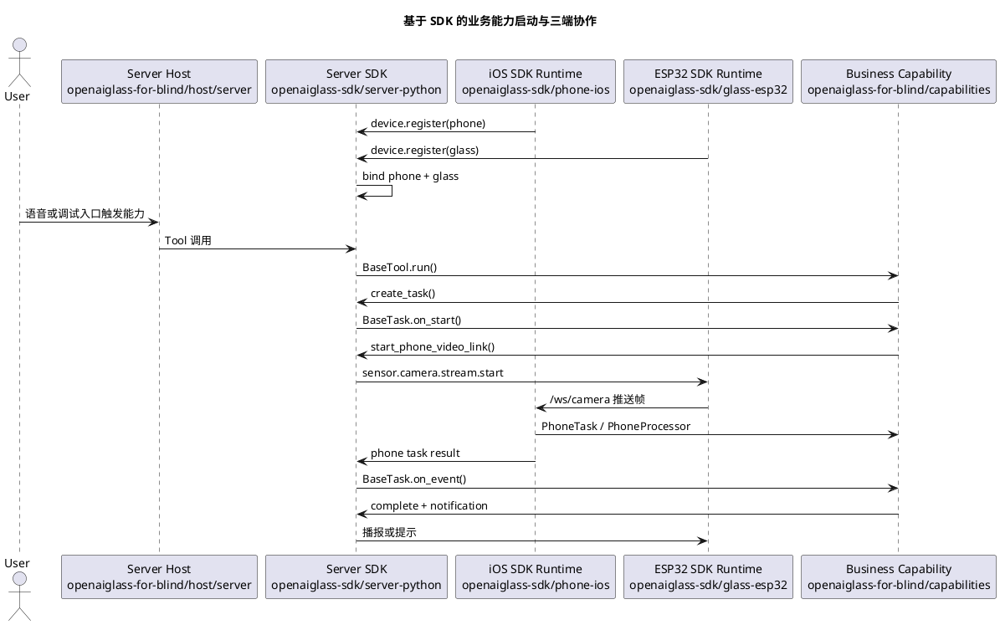

# SDK 安装与能力开发指南

本文面向将要基于 OpenAI Glasses SDK 开发真实业务能力的团队。

开发者不需要理解 SDK 内部的 WebSocket、设备绑定、任务状态机和媒体协议细节，但必须知道三端 SDK 各自负责什么、业务代码应该写在哪里，以及如何使用设备级数据回放完成高效自测，再进入真机联调。

当前指南对应 SDK 版本：`sdk-v5`。本版本新增 SDK 业务 Task 事件日志、超时、JSON 快照保存/恢复，以及手机侧多任务帧分发；上一版本已增强 `phone_video_link_task` 最小 peer-link 生命周期语义。实时语音打断、全双工语音和公网/NAT 穿透暂不覆盖。

## 1. 当前目录边界

当前仓库拆成两条主线：

| 目录 | 面向对象 | 职责 |
| --- | --- | --- |
| [../openaiglass-sdk/server-python](../openaiglass-sdk/server-python) | 服务端 SDK 开发者 | Python SDK、协议模型、服务端运行时、Tool/Task/Skill 扩展面、测试工具。 |
| [../openaiglass-sdk/phone-ios](../openaiglass-sdk/phone-ios) | iOS 手机端 SDK 开发者 | iOS 通用手机运行时，负责注册、心跳、视频接收、手机任务承载和结果回传。 |
| [../openaiglass-sdk/glass-esp32](../openaiglass-sdk/glass-esp32) | ESP32 眼镜端 SDK 开发者 | ESP32 通用眼镜运行时，负责 WiFi、控制连接、音频、摄像头和端侧命令处理。 |
| [host](./host) | 盲人产品装配团队 | 服务端、手机端、眼镜端宿主配置和启动说明。 |
| [capabilities](./capabilities) | 业务能力开发团队 | `find_object`、导航、识别等真实业务能力。 |
| [docs](./docs) | 产品和研发团队 | 需求、阶段计划、功能设计、验收和当前实现状态。 |
| [testdata](./testdata) | 测试和业务开发团队 | 设备级数据回放使用的音频、视频、图像、传感器和兼容性数据资产。 |

业务能力开发优先修改 `openaiglass-for-blind/capabilities` 和 `openaiglass-for-blind/host`。只有当 SDK 公开抽象无法表达新业务时，才向 `openaiglass-sdk` 提交 SDK 层改造。

## 2. 三端 SDK 职责

### 2.1 服务端 Python SDK

服务端 SDK 负责：

1. 设备注册、设备组绑定和心跳维护。
2. 统一控制消息、媒体消息和任务事件模型。
3. Agent、Tool、Task、Skill 和 MCP Adapter 装配。
4. 全局上下文、任务状态、通知和异常处理。
5. 设备级数据回放、契约测试和 SDK 包验证。

开发者主要使用：

```python
from openaiglasses import (
    BasePhoneProcessor,
    BasePhoneTask,
    BaseTask,
    BaseTool,
    CapabilityResult,
    OpenAIGlassesSDK,
    PhoneProcessorContext,
    PhoneTaskContext,
    ServerSettings,
    TaskContext,
    TaskEvent,
)
```

### 2.2 iOS 手机 SDK 运行时和业务入口

iOS SDK 运行时代码位于 [../openaiglass-sdk/phone-ios](../openaiglass-sdk/phone-ios)。业务开发者不要直接打开或修改 SDK 目录下的 Xcode 工程；盲人业务项目提供自己的手机端 Xcode 入口：

```text
openaiglass-for-blind/host/phone/ios/GlassesVideoReceiver.xcodeproj
```

这个业务侧 Xcode 工程引用 SDK 通用 iOS 运行时代码，并把业务目录下的配置文件打包进 App。

它负责：

1. 从业务工程的 `AppConfig.plist` 读取服务端地址、手机设备编号、配对令牌和目标眼镜编号。
2. 自动连接服务端 `/ws/control`，完成手机注册和心跳。
3. 在本机启动 `/ws/camera` 接收服务，接收眼镜推送的 JPEG 视频帧。
4. 承载手机侧任务，执行手机侧能力插件。
5. 将手机侧处理结果上报回服务端。
6. 提供调试页面，展示接收地址、注册状态、最近帧和最近事件。

`sdk-v2` 起，iOS 运行时已经支持多业务能力并存。业务插件应通过 `PhoneTaskCapabilityRegistry.register(taskType:runtimeBuilder:)` 按服务端下发的 `task_type` 注册；运行时收到 `sdk.phone.task.start` 后会按 `task_type` 选择对应业务插件。旧的 `PhoneCapabilityRuntimeFactory.register { ... }` 只作为单能力兼容入口保留，新能力不要再使用。

业务侧手机配置文件：

```text
openaiglass-for-blind/host/phone/config/AppConfig.plist
```

模板：

```text
openaiglass-for-blind/host/phone/config/AppConfig.plist.example
```

同步脚本只写业务侧配置文件。业务侧 Xcode 工程会把该文件作为 App 资源打包，不再写入 SDK 目录下的 iOS 配置文件。

关键配置项：

| 配置项 | 说明 |
| --- | --- |
| `serverBaseURLString` | 服务端 HTTP 地址，例如 `http://192.168.1.10:8765`。运行时会自动转换成控制 WebSocket 地址。 |
| `phoneDeviceID` | 手机设备编号，例如 `phone-001`。 |
| `pairToken` | 手机配对令牌，必须与服务端配置一致。 |
| `desiredGlassDeviceID` | 希望绑定的眼镜设备编号，例如 `glass-001`。 |

手机端配置同步和启动统一按第 3 节的流程执行。业务开发者只打开业务侧 Xcode 工程，不直接打开 `openaiglass-sdk/phone-ios` 下的 SDK 工程。

### 2.3 ESP32 眼镜 SDK 运行时

眼镜 SDK 运行时位于 [../openaiglass-sdk/glass-esp32](../openaiglass-sdk/glass-esp32)，当前以 ESP-IDF 工程形式交付。

它负责：

1. 读取 WiFi、服务端控制地址、眼镜设备编号和配对令牌。
2. 连接服务端 `/ws/control`，发送 `device.register` 和 `device.heartbeat`。
3. 连接服务端 `/ws_audio`，上传语音片段并接收播放控制。
4. 响应 `sensor.camera.capture`，完成单次抓拍并回传 `sensor.camera.captured`。
5. 响应 `sensor.camera.stream.start/stop`，把摄像头帧推送到手机 `/ws/camera`。
6. 处理通知、播报、唤醒和端侧运行状态。

本地私有配置：

```text
openaiglass-for-blind/host/glass/config/local_build.env
```

模板：

```text
openaiglass-for-blind/host/glass/config/local_build.env.example
```

关键配置项：

| 配置项 | 说明 |
| --- | --- |
| `GLASS_WIFI_PRIMARY_SSID` | 主 WiFi 名称。 |
| `GLASS_WIFI_PRIMARY_PASSWORD` | 主 WiFi 密码。 |
| `GLASS_SERVER_WS_URI` | 服务端控制 WebSocket 地址，例如 `ws://192.168.1.10:8765/ws/control`。 |
| `GLASS_DEVICE_ID` | 眼镜设备编号，例如 `glass-001`。 |
| `GLASS_PAIR_TOKEN` | 眼镜配对令牌，必须与服务端配置一致。 |
| `GLASS_HEARTBEAT_INTERVAL_MS` | 心跳间隔。 |

眼镜端配置同步、构建、烧录和串口监控统一按第 3 节的流程执行。

## 3. 安装、同步配置和启动

本节是功能开发人员日常使用 SDK 的标准流程。三端启动、配置同步、预检和联调检查都统一使用 `openaiglass` 命令。

### 3.1 安装 SDK 和统一命令

正式发布后，在业务项目中安装：

```bash
pip install openaiglasses-sdk
```

当前仓库本地开发或发布前验证，推荐安装为 editable 包：

```bash
uv sync --python 3.11
uv pip install -e openaiglass-sdk/server-python
```

安装后公开导入入口是：

```python
import openaiglasses
```

统一设备命令是：

```bash
uv run openaiglass --help
```

本文命令示例统一使用 `uv run openaiglass...`。这种形式会通过当前项目的 `.venv` 查找 SDK 命令，不要求开发者先手动激活虚拟环境。

SDK CLI 同时支持两种命令组织方式：

1. 点分命令：`uv run openaiglass.config.sync`、`uv run openaiglass.server.run`、`uv run openaiglass.phone.open`、`uv run openaiglass.glass.start`。
2. 根命令加子命令：`uv run openaiglass config sync`。

本文后续统一使用点分命令。只有在已经激活 `.venv`，或 SDK 已安装到当前 shell 的 Python 环境中时，才可以省略 `uv run`，例如直接执行 `openaiglass.config.sync`。

### 3.2 同步三端联调配置

如果直接基于 `openaiglass-for-blind` 目录继续开发，默认使用自动同步即可完成三端联调配置，不需要手动修改手机端和眼镜端的服务地址、设备编号和配对令牌。

同步命令必须在 server host 上执行，也就是实际运行服务端启动命令的那台机器上执行。命令会探测这台机器可被 iOS 手机和 ESP32 眼镜访问的局域网 IPv4；如果在手机、眼镜或另一台开发机上执行，写入的 `SERVER_PUBLIC_HOST` 很可能不是设备实际应该连接的服务端地址。

每次开发机网络变化、端口变化、设备令牌变化后，都执行一次同步：

```bash
uv run openaiglass.config.sync --app-root openaiglass-for-blind
```

同步命令会自动探测当前 Mac 可供手机和眼镜访问的局域网 IPv4，并写入：

1. `openaiglass-for-blind/config/local_server.env` 的 `SERVER_PUBLIC_HOST`。
2. `openaiglass-for-blind/host/phone/config/AppConfig.plist` 的 `serverBaseURLString`、`phoneDeviceID`、`pairToken`、`desiredGlassDeviceID`。
3. `openaiglass-for-blind/host/glass/config/local_build.env` 的 `GLASS_SERVER_WS_URI`、`GLASS_DEVICE_ID`、`GLASS_PAIR_TOKEN`。

如果自动探测失败，手动指定一次：

```bash
uv run openaiglass.config.sync --app-root openaiglass-for-blind \
  --public-host 192.168.1.23
```

同步后执行配置检查：

```bash
uv run openaiglass.sdk.live-check \
  --report logs/sdk-live-check-current.json
```

如果服务端已经启动，可以加 `--require-server`，让检查同时验证 `/api/health`：

```bash
uv run openaiglass.sdk.live-check \
  --require-server \
  --report logs/sdk-live-check-current.json
```

### 3.3 配置文件说明和手动准备

服务端、手机端、眼镜端的本地配置都归属业务工程：

| 配置文件 | 作用 |
| --- | --- |
| `openaiglass-for-blind/config/local_server.env` | 服务端监听地址、端口、设备令牌、模型和日志配置。 |
| `openaiglass-for-blind/host/phone/config/AppConfig.plist` | iOS 手机端服务端地址、设备编号、配对令牌和目标眼镜编号。 |
| `openaiglass-for-blind/host/glass/config/local_build.env` | ESP32 眼镜端 WiFi、控制 WebSocket、设备编号和配对令牌。 |

如果是首次搭建新目录，或自动同步提示本地配置文件不存在，先从模板复制：

```bash
cp openaiglass-for-blind/config/local_server.env.example \
  openaiglass-for-blind/config/local_server.env
cp openaiglass-for-blind/host/phone/config/AppConfig.plist.example \
  openaiglass-for-blind/host/phone/config/AppConfig.plist
cp openaiglass-for-blind/host/glass/config/local_build.env.example \
  openaiglass-for-blind/host/glass/config/local_build.env
```

然后至少检查这些值：

| 配置项 | 文件 | 说明 |
| --- | --- | --- |
| `PORT` | `config/local_server.env` | 服务端端口，默认 `8765`。 |
| `DEVICE_TOKEN_MAP` | `config/local_server.env` | 必须包含真实或 playback 设备的 `device_id=pair_token`。 |
| `GLASS_WIFI_PRIMARY_SSID` / `GLASS_WIFI_PRIMARY_PASSWORD` | `host/glass/config/local_build.env` | 真实 ESP32 眼镜联网所需 WiFi。 |

### 3.4 启动真实业务服务端

盲人业务服务端入口是：

```text
openaiglass-for-blind/host/server/main.py
```

它负责装配业务能力，SDK CLI 负责通用进程管理、PID、日志和健康检查。

日常联调优先使用前台运行：

```bash
uv run openaiglass.server.run \
  --app-module host.server.main \
  --app-root openaiglass-for-blind \
  --config openaiglass-for-blind/config/local_server.env
```

这个命令会先启动服务端，再直接进入日志跟随；大多数开发场景不需要再额外执行一次 `logs`。

如果确实需要后台守护方式，再拆成下面三条命令。

后台启动：

```bash
uv run openaiglass.server.start \
  --app-module host.server.main \
  --app-root openaiglass-for-blind \
  --config openaiglass-for-blind/config/local_server.env
```

跟随日志：

```bash
uv run openaiglass.server.logs
```

这里不需要再重复传 `--app-module`、`--app-root`、`--config`，因为 `logs` 只跟随当前仓库默认日志文件，`stop` 也只根据当前仓库默认 PID 文件停止唯一的本地服务端进程。

停止：

```bash
uv run openaiglass.server.stop
```

启动后检查：

```bash
curl http://127.0.0.1:8765/api/health
curl http://127.0.0.1:8765/api/runtime/devices
```

新能力开发统一使用 SDK CLI 的服务端点分命令。

### 3.5 启动真实 iOS 手机端

打开业务侧 Xcode 工程：

```bash
uv run openaiglass.phone.open --app-root openaiglass-for-blind
```

该命令会先执行业务配置同步，再打开：

```text
openaiglass-for-blind/host/phone/ios/GlassesVideoReceiver.xcodeproj
```

只验证模拟器构建：

```bash
uv run openaiglass.phone.build-sim --app-root openaiglass-for-blind
```

真机运行和签名配置仍在 Xcode 中完成，SDK 侧只保留统一的手机工程打开入口。

不要把 `openaiglass-sdk/phone-ios` 下的 SDK 工程作为业务开发入口。

### 3.6 构建、烧录和监看真实 ESP32 眼镜

`openaiglass.glass.start` 不要求业务项目一定放在 `OpenAIglassesDemo_2` 这种 monorepo 目录结构下。它涉及四类路径：

| 参数 | 含义 | 默认来源 |
| --- | --- | --- |
| `--repo-root` | 仓库根目录，只作为当前 monorepo 开发时的便捷路径锚点。 | 未传时为当前目录。 |
| `--app-root` | 业务工程根目录，用来查找 `host/glass/config/local_build.env`。 | 默认 `<repo-root>/openaiglass-for-blind`。 |
| `--sdk-root` | SDK 源码或 SDK 资产根目录，用来查找内置固件工程 `glass-esp32`。 | 默认 `<repo-root>/openaiglass-sdk`。 |
| `--project-dir` | ESP-IDF 眼镜固件工程目录，目录下必须有 `CMakeLists.txt`。 | 默认 `<sdk-root>/glass-esp32`。 |
| `--idf-root` | ESP-IDF 安装目录。 | 优先用环境变量 `IDF_PATH`，否则默认 `<repo-root>/.cache/esp-idf-v5.3.2`。 |
| `--config` | 眼镜本地配置文件，包含 WiFi、服务端地址、设备编号和配对令牌。 | 默认 `<app-root>/host/glass/config/local_build.env`。 |
| `--sdkconfig-defaults` | 固件默认配置文件。 | 默认 `<project-dir>/sdkconfig.defaults`。 |

如果直接在当前仓库根目录开发，可以使用最短命令：

```bash
uv run openaiglass.glass.start \
  --repo-root . \
  --port '/dev/tty.usbmodem*'
```

`--repo-root .` 只表示“按当前仓库默认布局推导其他路径”，不是 SDK 对业务项目目录结构的要求。新业务项目如果不采用当前仓库布局，优先使用下面的显式路径写法。

仅编译：

```bash
uv run openaiglass.glass.start \
  --app-root /path/to/my-app \
  --sdk-root /path/to/openaiglass-sdk \
  --idf-root /path/to/esp-idf \
  --build-only
```

构建、烧录并进入串口监看：

```bash
uv run openaiglass.glass.start \
  --app-root /path/to/my-app \
  --sdk-root /path/to/openaiglass-sdk \
  --idf-root /path/to/esp-idf \
  --port '/dev/tty.usbmodem*'
```

仅串口监看：

```bash
uv run openaiglass.glass.start \
  --monitor-only \
  --app-root /path/to/my-app \
  --sdk-root /path/to/openaiglass-sdk \
  --idf-root /path/to/esp-idf \
  --port '/dev/tty.usbmodem*'
```

如果业务工程和 SDK 源码分开放，也是同样显式指定业务工程和 SDK 根目录：

```bash
uv run openaiglass.glass.start \
  --app-root /path/to/my-app \
  --sdk-root /path/to/openaiglass-sdk \
  --idf-root /path/to/esp-idf \
  --port '/dev/tty.usbmodem*'
```

如果没有下载完整 `openaiglass-sdk` 源码，但已经有可编译的 ESP-IDF 眼镜固件工程，应直接指定固件工程和配置文件：

```bash
uv run openaiglass.glass.start \
  --app-root /path/to/my-app \
  --project-dir /path/to/glass-esp32 \
  --sdkconfig-defaults /path/to/glass-esp32/sdkconfig.defaults \
  --idf-root /path/to/esp-idf \
  --port '/dev/tty.usbmodem*'
```

这种情况下，当前目录下不需要存在 `openaiglass-sdk/glass-esp32`。但真实固件构建仍然必须能找到一个 ESP-IDF 工程目录，且该目录至少包含 `CMakeLists.txt` 和可用的 `sdkconfig.defaults`；业务工程也必须提供眼镜本地配置文件，或通过 `--config` 显式传入。

`--port` 支持精确路径和通配符。通配符请加引号，避免 shell 提前展开；如果匹配到多个串口，命令会打印候选列表并要求开发者明确选择其中一个。

新能力开发统一使用 SDK CLI 的眼镜端点分命令。

### 3.7 两层启动边界

1. SDK 层提供通用命令、配置读取、进程管理、健康检查和工具链调度。
2. 业务层只提供 profile、业务服务端装配入口、iOS 工程路径、ESP-IDF 本地配置和业务能力代码。
3. 业务工程不再保留启动脚本；如果需要新增通用启动或检查能力，优先进入 SDK CLI。

## 4. 推荐业务能力工程结构

外部团队开发新能力时，建议按能力聚合，而不是按设备散落业务代码：

```text
my-glasses-capability/
  pyproject.toml
  src/
    my_capability/
      __init__.py
      server/
        tool.py
        task.py
      phone/
        processor.py
        task.py
        ios/
          MyPhoneCapability.swift
      glass/
        README.md
        config/
          local_build.env.example
      main.py
  testdata/
    scenario/
      my_capability_basic.json
```

在本仓库内新增盲人业务能力时，建议使用：

```text
openaiglass-for-blind/capabilities/<capability_name>/
  README.md
  server/
    tool.py
    task.py
  phone/
    processor.py
    task.py
    ios/
```

业务能力目录不再需要 `scenario.py`。`glass-playback` 配置统一放在 `host/glass-playback/config`，音频、视频、图像和传感器资产放在 `testdata` 对应目录下；日常调试时由独立的 `glass-playback` 虚拟眼镜进程消费。

可以参考现有找物体能力：

1. [capabilities/find_object/server/tool.py](./capabilities/find_object/server/tool.py)
2. [capabilities/find_object/server/task.py](./capabilities/find_object/server/task.py)
3. [capabilities/find_object/phone/processor.py](./capabilities/find_object/phone/processor.py)
4. [capabilities/find_object/phone/task.py](./capabilities/find_object/phone/task.py)
5. [capabilities/find_object/phone/ios](./capabilities/find_object/phone/ios)

## 5. 开发服务端 Tool

Tool 是模型可以调用的短时业务入口。它应该表达“启动什么能力”或“查询什么业务结果”，不应该直接处理 WebSocket、设备绑定表或媒体帧。

```python
from typing import Any

from pydantic import BaseModel, Field

from openaiglasses import BaseTool, CapabilityResult


class StartDemoInput(BaseModel):
    target: str = Field(description="用户希望处理的目标")


class StartDemoTool(BaseTool):
    name = "start_demo"
    description = "启动一个演示能力"
    input_model = StartDemoInput

    def run(self, context, input_data: dict[str, Any]) -> CapabilityResult:
        target = str(input_data.get("target") or "").strip()
        if not target:
            return CapabilityResult.failed(code="invalid_input", message="target 不能为空")

        task = context.create_task(
            task_type="demo_task",
            input_data={"target": target},
        )
        return CapabilityResult.success(
            data={"task_id": task.task_id, "target": target},
            message=f"已启动演示任务：{target}",
        )
```

Tool 中常用的 `context` 高层能力：

| 方法 | 用途 |
| --- | --- |
| `require_glass()` | 获取当前设备组的在线眼镜。 |
| `require_phone()` | 获取当前设备组的在线手机。 |
| `query_devices()` | 查询当前设备组所有设备。 |
| `capture_photo(reason=...)` | 请求眼镜单次抓拍。 |
| `start_phone_video_link(reason=..., params=...)` | 启动眼镜到手机的视频链路。 |
| `stop_phone_video_link(reason=...)` | 停止眼镜到手机的视频链路。 |
| `create_task(task_type=..., input_data=...)` | 创建 SDK 托管任务。 |
| `query_task(task_id)` | 查询任务状态。 |
| `cancel_task(task_id)` | 取消任务。 |
| `start_phone_task(task_type=..., params=...)` | 启动手机侧持续任务。 |
| `stop_phone_task(task_type=..., reason=...)` | 停止手机侧持续任务。 |
| `submit_notification(text=..., priority=...)` | 向设备侧提交播报或提示。 |
| `mcp(method_name, arguments)` | 调用 SDK 统一注册的 MCP 方法，例如地图、搜索或导航规划。 |

### 5.1 在 Tool 中调用 MCP

`sdk-v3` 起，业务 Tool 可以直接通过 `context.mcp(...)` 调用 SDK 已注册的 MCP adapter。业务代码不要直接 import 具体 adapter，也不要自行构造 `McpRegistry`、`McpGateway` 或 `AgentToolContext`。

推荐写法：

```python
from typing import Any

from pydantic import BaseModel, Field

from openaiglasses import BaseTool, CapabilityResult


class PrepareNavigationInput(BaseModel):
    origin: str = Field(description="起点")
    destination: str = Field(description="终点")
    strategy: str = Field(default="walking", description="路线策略")


class PrepareNavigationTool(BaseTool):
    name = "prepare_navigation"
    description = "准备一条导航路线"
    input_model = PrepareNavigationInput

    def run(self, context, input_data: dict[str, Any]) -> CapabilityResult:
        route = context.mcp(
            "amap.route_plan",
            {
                "origin": input_data["origin"],
                "destination": input_data["destination"],
                "strategy": input_data.get("strategy", "walking"),
            },
        )
        if not route.ok:
            return route
        return CapabilityResult.success(data={"route": route.data})
```

MCP adapter 仍由宿主装配入口注册：

```python
def create_sdk() -> OpenAIGlassesSDK:
    sdk = OpenAIGlassesSDK()
    sdk.register_mcp_adapter(AmapMcpAdapter())
    sdk.register_tool(PrepareNavigationTool())
    return sdk
```

`context.mcp(...)` 的失败会返回 `CapabilityResult.failed(...)`，错误结果中包含 `method_name`、输入摘要和 SDK 统一错误码。真实服务端运行时会把 MCP 调用轨迹写入 agent session trace；本地调试中可以通过 `sdk.device_groups.list_mcp_traces()` 查看调用是否发生。

## 6. 开发服务端 Task

Task 用于长流程能力，例如找物、导航、持续观察、识别或状态追踪。

```python
from openaiglasses import BaseTask, TaskContext, TaskEvent


class DemoTask(BaseTask):
    task_type = "demo_task"
    description = "演示后台任务"

    def on_start(self, context: TaskContext) -> None:
        target = str(context.input.get("target") or "")
        context.update({"target": target})
        context.emit_state("running", {"phase": "started"})
        context.device_group.start_phone_video_link(
            reason="demo",
            params={"target": target, "processor_type": "demo_processor"},
        )
        context.device_group.start_phone_task(
            task_type="demo_phone_task",
            params={"target": target, "processor_type": "demo_processor"},
        )

    def on_event(self, context: TaskContext, event: TaskEvent) -> None:
        if event.name == "phone.demo.result":
            context.device_group.submit_notification(
                text=str(event.payload.get("summary") or "任务已完成"),
                priority="high",
            )
            context.device_group.stop_phone_task(
                task_type="demo_phone_task",
                reason="task.completed",
            )
            context.complete(dict(event.payload))

    def on_cancel(self, context: TaskContext) -> None:
        context.device_group.stop_phone_task(
            task_type="demo_phone_task",
            reason="task.cancelled",
        )
        context.device_group.stop_phone_video_link(reason="task.cancelled")
        super().on_cancel(context)
```

Task 中不要直接持有 WebSocket 连接，不要自己维护任务状态表。任务状态通过 `TaskContext` 更新，设备能力通过 `context.device_group` 获取。

### 6.1 视频直连系统任务

`sdk-v4` 起，`phone_video_link_task` 是 SDK 系统任务。业务能力仍然只通过公开入口启动、查询和取消，不需要自己实现 peer-link 状态机。

```python
link = context.device_group.start_phone_video_link(
    reason="need_live_frames",
    params={"frame_interval_ms": 350},
)

current = context.device_group.query_task(link["task_id"])
if current.context.get("phase") == "streaming":
    context.device_group.submit_notification(text="视频链路已就绪")

context.device_group.cancel_task(link["task_id"])
```

任务查询结果中的关键字段：

| 字段 | 含义 |
| --- | --- |
| `state` | 统一任务状态，可为 `running`、`completed`、`cancelled`、`failed`、`timeout`。 |
| `context.phase` | 视频链路阶段，可为 `peer_link_preparing`、`peer_link_ready`、`streaming`、`stopping`、`completed`、`cancelled`、`failed`、`timeout`。 |
| `context.stream_id` | 本次视频流编号，眼镜推流和手机上报事件都应携带。 |
| `context.phone_device_id` | 绑定的手机编号。手机上报事件时必须一致，否则服务端拒绝。 |
| `context.target_ws_uri` | 眼镜应推送视频帧的手机接收地址。 |
| `context.last_peer_link_event` | 最近一次 peer-link 事件。 |
| `context.last_camera_event` | 最近一次 camera stream 事件。 |
| `error` / `context.last_error` | 结构化失败信息。 |

端侧标准事件如下：

| 事件名 | 上报时机 | SDK 行为 |
| --- | --- | --- |
| `peer_link.ready` | 手机确认已准备好接收眼镜推流。 | 任务阶段进入 `peer_link_ready`。 |
| `camera.stream.started` | 手机已经收到或确认视频流开始。 | 任务阶段进入 `streaming`。 |
| `peer_link.failed` | 建链失败，例如地址不可达、鉴权失败。 | 任务进入 `failed`，保留结构化错误。 |
| `peer_link.broken` | 运行中链路断开。 | 任务进入 `failed`，保留结构化错误。 |
| `peer_link.closed` | 手机主动关闭链路。 | 任务进入 `completed`。 |
| `camera.stream.stopped` | 手机确认视频流已停止。 | 活动任务进入 `completed`；如果任务已取消，则保持 `cancelled` 终态。 |

手机或眼镜可以通过服务端 HTTP 上报事件：

```bash
curl -X POST http://127.0.0.1:8000/api/tasks/report-event \
  -H 'Content-Type: application/json' \
  -d '{
    "task_id": "task_xxx",
    "phone_device_id": "phone-001",
    "event_name": "peer_link.ready",
    "payload": {
      "stream_id": "stream_xxx",
      "transport": "lan"
    }
  }'
```

业务侧不要在 `openaiglass-for-blind/capabilities` 内自行维护视频任务状态表，也不要自行绕过 SDK 给眼镜发送 `sensor.camera.stream.start/stop`。真实公网/NAT 穿透、自动重试、链路健康检查仍由 SDK 后续版本统一补齐。

### 6.2 SDK 托管任务快照与恢复

`sdk-v5` 起，SDK 业务 Task 运行时会记录任务时间戳和事件日志。业务 Task 不需要改接口，仍然使用 `context.emit_state(...)`、`context.complete(...)`、`on_event(...)` 和 `on_cancel(...)`。

任务快照新增字段：

| 字段 | 含义 |
| --- | --- |
| `created_at_ms` / `updated_at_ms` | 任务创建和最近更新时间。 |
| `started_at_ms` / `completed_at_ms` | 任务开始和终态时间。 |
| `timeout_ms` / `deadline_at_ms` | 可选超时配置和截止时间。 |
| `events` | SDK 记录的 `task.created`、`task.started`、外部事件、`task.completed`、`task.failed`、`task.cancelled`、`task.timeout` 等事件。 |

创建任务时可传入 `timeout_ms`。如果任务在查询、取消或事件派发前已经超过截止时间，SDK 会自动推进到 `timeout` 并写入结构化错误：

```python
runtime = context.device_group.create_task(
    task_type="demo_task",
    input_data={"target": "demo", "timeout_ms": 30000},
)
latest = context.device_group.query_task(runtime.task_id)
```

宿主服务可以把任务快照保存到 JSON 文件，并在重启后恢复：

```python
sdk.task_runtime.save_snapshots("logs/sdk-task-snapshots.json")
sdk.task_runtime.load_snapshots("logs/sdk-task-snapshots.json")
```

恢复后的任务可继续查询；如果对应 `task_type` 仍已注册，也可以继续接收事件。生产环境如果要接数据库或对象存储，可以直接复用 `export_snapshots()` / `restore_snapshots(...)`，由宿主决定持久化介质。

## 7. 开发手机侧能力

手机侧能力分为两层：

1. `BasePhoneProcessor`：处理一帧图像、一段传感器数据或一次本地模型输出。
2. `BasePhoneTask`：组织一个持续任务，决定什么时候调用处理器、什么时候输出结果。

`sdk-v5` 起，手机侧运行时支持把同一帧分发给多个活跃任务。任务参数中如果声明 `stream_id`，SDK 会只把同一路视频流的帧交给该任务；调用方也可以用 `task_types` 限定分发范围。

```python
snapshots = sdk.phone_runtime.process_frame(
    frame={"seq": 12, "image": "..."},
    stream_id="stream_xxx",
    task_types=["find_object_phone_task", "traffic_light_phone_task"],
)
```

每个 `PhoneTaskSnapshot` 会包含 `frames_processed`，方便测试和联调判断某个手机任务是否实际收到帧。已经 `completed`、`cancelled`、`failed` 或 `stopped` 的任务不会再收到后续帧。

### 7.1 PhoneProcessor

```python
from typing import Any

from openaiglasses import BasePhoneProcessor, PhoneProcessorContext


class DemoProcessor(BasePhoneProcessor):
    processor_type = "demo_processor"
    description = "演示手机处理器"

    def on_frame(self, context: PhoneProcessorContext, frame: Any) -> None:
        text = str(frame)
        context.emit_result(
            {
                "event_name": "phone.demo.result",
                "found": "目标" in text,
                "summary": f"已处理帧：{text}",
            }
        )
```

### 7.2 PhoneTask

```python
from typing import Any

from openaiglasses import BasePhoneTask, PhoneTaskContext


class DemoPhoneTask(BasePhoneTask):
    task_type = "demo_phone_task"
    description = "演示手机任务"

    def on_start(self, context: PhoneTaskContext) -> None:
        context.emit_state("running", {"phase": "waiting_frame"})

    def on_frame(self, context: PhoneTaskContext, frame: Any) -> None:
        result = context.process_frame(
            processor_type=str(context.params.get("processor_type") or "demo_processor"),
            frame=frame,
        )
        if result:
            context.emit_result(result)

    def on_stop(self, context: PhoneTaskContext) -> None:
        context.emit_state("stopped", {"reason": "server_requested"})
```

### 7.3 iOS 插件代码放在哪里

Python `PhoneProcessor` 和 `PhoneTask` 用于 SDK 回放、服务端装配和能力契约。真正跑在 iPhone 上的业务插件应放在业务能力目录下，例如：

```text
openaiglass-for-blind/capabilities/find_object/phone/ios/
```

iOS 通用运行时仍然放在：

```text
openaiglass-sdk/phone-ios/
```

不要把具体业务识别逻辑直接写进 `openaiglass-sdk/phone-ios` 的通用运行时里。通用运行时只负责注册、接收、分发、状态展示和结果回传。

### 7.4 iOS 插件如何注册到通用运行时

本节是 `sdk-v2` 新增的 iOS 手机能力接入方式。

每个 iOS 业务插件只注册自己负责的 `taskType`。不要在业务侧手写组合 Runtime，也不要为了支持多个能力去修改 `CameraStreamStore` 或控制连接代码。

推荐写法：

```swift
enum DemoPhoneCapabilityInstaller {
    static func install() {
        PhoneCapabilityBootstrap.registerInstaller {
            PhoneTaskCapabilityRegistry.register(taskType: "demo_phone_task") {
                DemoPhoneCapabilityRuntime()
            }
        }
    }
}
```

宿主 App 启动时需要做两件事：

1. 确保每个业务插件的 `install()` 被调用一次。
2. 调用 `PhoneCapabilityBootstrap.applyRegisteredInstallers()`，让 SDK 执行所有已登记的安装函数。

当前仓库仍以业务侧 Xcode 工程承载手机端 App，工程入口为 `openaiglass-for-blind/host/phone/ios/GlassesVideoReceiver.xcodeproj`。它引用 SDK 通用运行时代码，业务插件接入 target 的推荐方式是：

1. 在 `openaiglass-for-blind/capabilities/<capability>/phone/ios/` 下维护业务 Swift 文件。
2. 在 Xcode 中把这些 Swift 文件加入手机宿主 App target 的 Compile Sources。
3. 在宿主 App 的启动入口集中调用各插件 `install()`。
4. 多个插件同时加入 target 时，只要 `taskType` 不重复，SDK 会自动按任务类型分发。

暂不建议业务团队自行封装 Swift Package 或 XCFramework。等 SDK 发布形态进一步稳定后，再由 SDK 团队统一提供包结构和版本兼容规则。

## 8. 眼镜端能力扩展方式

当前 ESP32 眼镜 SDK 运行时主要提供通用硬件能力，不建议业务团队直接在 `openaiglass-sdk/glass-esp32` 中写具体业务策略。

业务能力应该优先通过服务端 Task 调用这些系统能力：

| 眼镜能力 | 服务端调用方式 | 眼镜端处理 |
| --- | --- | --- |
| 单次抓拍 | `context.capture_photo(reason=...)` | 响应 `sensor.camera.capture`，回传 `sensor.camera.captured`。 |
| 视频流到手机 | `context.start_phone_video_link(...)` | 响应 `sensor.camera.stream.start`，向手机 `/ws/camera` 推送帧。 |
| 停止视频流 | `context.stop_phone_video_link(...)` | 响应 `sensor.camera.stream.stop`。 |
| 语音输入 | SDK 服务端 `/ws_audio` | 眼镜录音、上传音频段。 |
| 播报和通知 | `context.submit_notification(...)` | 眼镜接收通知并播放或提示。 |

如果新业务必须新增眼镜硬件能力，应按下面顺序处理：

1. 先在业务文档中说明新增硬件能力的输入、输出和失败情况。
2. 在 `openaiglass-sdk/docs/structure-design` 中补 SDK 协议或运行时设计。
3. 在服务端 SDK 中补公开上下文方法或标准控制消息。
4. 在 `openaiglass-sdk/glass-esp32` 中实现通用能力，不写业务策略。
5. 在 `openaiglass-for-blind/capabilities/<capability>` 中调用新能力。

## 9. 装配 SDK 并启动服务端

每个业务项目都应该有一个很薄的装配入口，只负责注册业务能力。

```python
from openaiglasses import OpenAIGlassesSDK, ServerSettings

from my_capability.phone.processor import DemoProcessor
from my_capability.phone.task import DemoPhoneTask
from my_capability.server.task import DemoTask
from my_capability.server.tool import StartDemoTool


def create_sdk() -> OpenAIGlassesSDK:
    sdk = OpenAIGlassesSDK()
    sdk.register_tool(StartDemoTool())
    sdk.register_task(DemoTask())
    sdk.register_phone_processor(DemoProcessor())
    sdk.register_phone_task(DemoPhoneTask())
    return sdk


def main() -> None:
    settings = ServerSettings.from_env()
    create_sdk().run_server(settings)


if __name__ == "__main__":
    main()
```

本仓库盲人业务服务端装配入口是：

```text
openaiglass-for-blind/host/server/main.py
```

它注册了 `find_object`、`traffic_light`、`navigation`、`timer` 等盲人业务能力的 Tool、Task、PhoneProcessor、PhoneTask 和 MCP adapter。测试时，`glass-playback` 会像真实眼镜一样连接这个服务端完成注册、心跳、音频流和执行器回执；业务能力不再需要提供单独测试 handler。

启动盲人业务服务端：

```bash
uv run openaiglass.server.run \
  --app-module host.server.main \
  --app-root openaiglass-for-blind \
  --config openaiglass-for-blind/config/local_server.env
```

安装、配置同步、日志跟随和停止命令统一见第 3 节。

## 10. 设备级数据回放验证

业务能力开发应先通过设备级数据回放，再进入真机联调。

这里的“回放”不是播放视频给人看，也不是绕过协议直接调用某个业务组件。当前支持的 playback 设备只有 `glass-playback`：它在开发者视角里就是一个独立的 Python 虚拟眼镜设备，像真实 ESP32 眼镜一样单独启动、连接真实服务端、发送 `device.register`、维持心跳、接收控制消息、发送音频流，并按配置执行或记录执行器命令。

`glass-playback` 的代码位于 `openaiglass-sdk/glass-playback`，与 `server-python`、`phone-ios`、`glass-esp32` 同级。`server-python` 只保留统一命令入口，不承载 `glass-playback` 主体实现。

区别只在于 `glass-playback` 的数据来源和执行器行为由配置文件决定：

1. 真实眼镜从麦克风、摄像头和硬件按钮读取输入；`glass-playback` 从预先准备好的触发音频、抓拍图片、视频帧和传感器时间线读取输入。
2. 真实眼镜会播放音频、震动或控制硬件；`glass-playback` 按配置记录、自动完成或保存执行器调用。
3. 服务端、业务 Tool、Task、设备绑定、任务事件和控制协议全部使用真实实现。

### 10.1 触发音频是必填项

每个 `glass-playback` 配置必须包含一段 `trigger_audio`。这段音频用于模拟“眼镜端唤醒词已成功识别，并开始录音”的过程。

运行时行为固定为：

1. `glass-playback` 启动后连接真实服务端 `/ws/control`。
2. 按配置发送 `device.register(device_type=glass)`。
3. 等待 `device.registered`。
4. 等待 `voice.session.open` 并回传 `voice.session.opened`。
5. 等待服务端完成必要的设备绑定。如果本次回放需要手机，绑定对象是真实 iOS phone；如果不需要手机，可只要求 glass 注册和 voice session 打开。
6. 在注册、voice session 和必要绑定都完成后，自动把 `trigger_audio.path` 指向的音频按流式 `MediaFrame(audio_chunk)` 发送到服务端 `/ws_audio`。
7. 服务端按真实语音链路处理这段音频，后续 Tool、Task、通知和执行器行为都走真实运行时。

`trigger_audio` 不是可选语音样例，而是启动一次设备级回放的触发源。它不测试 WakeNet 本身；它假设唤醒已经成功，只模拟唤醒后麦克风开始录音并持续向服务端推流。

### 10.2 开发者日常测试流程

新增或修改业务能力后，建议按下面顺序自测：

1. 准备 `glass-playback` 配置，分配稳定的 `device_id`、`pair_token` 和目标服务端地址。
2. 准备必填的 `trigger_audio`，放到 `testdata/audio`。
3. 如能力需要视觉或传感器输入，再准备 `camera_capture`、`camera_stream`、`heading` 等数据资产。
4. 准备执行器策略，例如音频播放请求是只记录、保存到文件，还是立即回传 started/finished。
5. 像真机联调一样启动真实业务 server。
6. 如果能力需要手机端，像真机联调一样启动真实 iOS 手机端，并确认它完成注册和绑定。
7. 单独启动 `glass-playback`，确认它在 `/api/runtime/devices` 中显示为在线 glass。
8. 等待它自动发送 `trigger_audio`，观察服务端任务、控制消息、执行器记录和最终通知。
9. 稳定后，根据 `actuators` 输出、服务端日志和真实手机端日志判断本次行为是否符合预期。

### 10.3 像真实设备一样启动 glass-playback

启动顺序与真机眼镜联调一致。

第一步，按第 3.4 节启动真实业务服务端：

```bash
uv run openaiglass.server.run \
  --app-module host.server.main \
  --app-root openaiglass-for-blind \
  --config openaiglass-for-blind/config/local_server.env
```

服务端配置方式与真机一致。唯一需要注意的是，`device_token_map` 中要包含虚拟眼镜的编号和配对令牌，例如 `glass-playback-001=pair_playback`。如果同时使用真实 iOS 手机，也要包含真实手机的编号和配对令牌。

第二步，如果能力需要手机端，按第 3.5 节启动真实 iOS 手机端：

```bash
uv run openaiglass.phone.open --app-root openaiglass-for-blind
```

第三步，启动虚拟眼镜设备：

```bash
uv run openaiglass.glass.start --runtime playback \
  --config openaiglass-for-blind/host/glass-playback/config/glass.water_cup.json \
  --sdk-root openaiglass-sdk
```

启动后，开发者检查方式与真机相同：

```bash
curl http://127.0.0.1:8765/api/runtime/devices
```

预期能看到：

1. `glass-playback-001` 已注册，`device_type=glass`。
2. 如果使用真实 iOS 手机，runtime snapshot 中存在 glass 与 phone 的绑定关系。
3. glass voice session 已打开。
4. `trigger_audio` 已开始或已经完成流式发送。

如果这些状态成立，后续调试方式与真实 ESP32 眼镜一致。

### 10.4 glass-playback 配置文件

playback 配置文件描述的是“这台虚拟眼镜有哪些传感器数据、执行器怎么处理”，不是业务组件测试脚本。配置文件属于 `glass-playback` 设备组件，统一放在 `openaiglass-for-blind/host/glass-playback/config`。

`glass.water_cup.json` 示例：

```json
{
  "device_type": "glass",
  "device_id": "glass-playback-001",
  "pair_token": "pair_playback",
  "control_ws_url": "ws://127.0.0.1:8765/ws/control",
  "desired_phone_device_id": "phone-001",
  "startup": {
    "wait_for_registration": true,
    "wait_for_binding": true,
    "wait_for_voice_session": true,
    "auto_stream_trigger_audio": true
  },
  "sensors": {
    "trigger_audio": {
      "path": "testdata/audio/find_water_cup_trigger.wav",
      "chunk_ms": 40,
      "sample_rate_hz": 16000,
      "format": "wav"
    },
    "camera_capture": {
      "path": "testdata/image/cup.jpg"
    },
    "camera_stream": {
      "path": "testdata/video/find_object_water_cup.mp4",
      "codec": "mp4",
      "frame_interval_ms": 100
    },
    "heading": {
      "path": "testdata/sensor/find_object_heading.json"
    }
  },
  "actuators": {
    "audio_play": {
      "mode": "record_and_auto_finish",
      "save_audio_to": "runs/playback/glass-playback-001/audio"
    },
    "vibrate": {
      "mode": "record"
    }
  }
}
```

配置原则：

1. `device_id` 和 `pair_token` 必须与服务端 `device_token_map` 匹配，和真机一致。
2. `trigger_audio` 必填，用于自动触发一次真实语音链路。
3. `desired_phone_device_id` 只在能力需要真实 iOS 手机时配置。
4. `startup.wait_for_binding=true` 表示等设备绑定完成后再发送触发音频；需要纯 glass-only 回放时可以关闭。
5. `sensors` 只描述虚拟眼镜能读到什么输入。
6. `actuators` 只描述虚拟眼镜收到命令后如何执行或记录。

### 10.5 数据资产格式

`trigger_audio` 推荐使用 WAV 文件。它应包含完整的一次用户请求，例如“帮我找一下水杯”，而不是只包含唤醒词。SDK 会把它当作唤醒成功后的麦克风录音流发送给服务端。

`camera_stream` 应模拟真实摄像头视频输入，优先使用 MP4：

```json
{
  "path": "testdata/video/find_object_water_cup.mp4",
  "codec": "mp4",
  "frame_interval_ms": 100
}
```

MP4 会由 `glass-playback` 在本机通过 `ffmpeg` 解成 JPEG 帧，再按真实 `MediaFrame(camera_frame)` 推送到服务端下发的 `target_ws_uri`，也就是真实 iOS phone 注册时提供的 camera sink。如果开发机没有安装 `ffmpeg`，请改用图片帧序列，或先安装 `ffmpeg`。

需要逐帧控制时，可以使用图片帧序列：

```json
{
  "frames": [
    {
      "path": "image/cup-001.jpg",
      "codec": "jpeg",
      "t_ms": 0
    },
    {
      "path": "image/cup-002.jpg",
      "codec": "jpeg",
      "t_ms": 100
    }
  ]
}
```

### 10.6 推荐覆盖用例

开发新能力时，建议至少准备以下 `glass-playback` 配置和数据资产组合：

| 用例 | 目标 |
| --- | --- |
| 成功路径 | 验证能力可以通过真实 server 和 `glass-playback` 从触发音频走到完成。 |
| 缺少 phone | 如果能力依赖手机，验证真实 iOS 手机未在线或未绑定时能给出结构化失败。 |
| 视频链路失败 | 如果能力依赖视频，验证真实 iOS 手机接收地址不可用时任务状态和错误信息正确。 |
| 取消路径 | 验证任务取消后能停止视频链路和眼镜端推流。 |
| 传感器组合输入 | 验证触发音频、视觉帧和方向、位置等传感器输入能一起驱动能力。 |
| 执行器输出 | 验证音频播放、震动等眼镜执行器命令符合预期。 |

### 10.7 如何判断回放结果

当前不支持断言检查，也不支持批量测试。开发者需要根据 `glass-playback` 的 `actuators` 输出、服务端日志、真实 iOS 手机端日志和运行态接口自行判断结果。

重点看这些内容：

| 字段 | 含义 |
| --- | --- |
| `actuators.audio_play` 输出 | 服务端是否向眼镜下发了期望的语音播放内容，以及播放流是否保存到指定目录。 |
| `actuators.vibrate` 输出 | 服务端是否下发了预期震动命令。 |
| `glass-playback` 控制日志 | 是否完成注册、心跳、voice session 打开和 `trigger_audio` 流式发送。 |
| 服务端任务日志 | Tool、Task、任务事件、通知和错误码是否符合预期。 |
| `/api/runtime/devices` | 虚拟眼镜是否在线；如果使用真实手机，glass 与 phone 是否已绑定。 |
| 真实 iOS 手机端日志 | 需要手机能力时，确认手机任务、视频接收和业务插件结果是否符合预期。 |

常见失败定位：

1. 虚拟眼镜未注册：检查 `device_token_map`、`pair_token` 和设备编号。
2. voice session 未打开：检查服务端是否允许该 glass 设备注册并创建语音会话。
3. 触发音频没有发送：检查 `trigger_audio.path`、音频格式和启动等待条件。
4. 没有业务任务：检查触发音频内容是否能被 ASR 和 agent 识别为目标能力请求。
5. 没有执行器调用：检查业务 Task 是否提交了通知或音频播放请求。

## 11. 三端真机联调流程

真机联调前，先按第 3.2 节在 server host 上同步配置；如果提示本地配置文件不存在，再按第 3.3 节从模板准备配置文件。开发机网络频繁变化时，不需要手动改手机或眼镜配置，重新执行 `uv run openaiglass.config.sync --app-root openaiglass-for-blind` 即可。

推荐启动顺序：

1. 启动服务端。
2. 启动 iOS 手机端 SDK 运行时。
3. 启动 ESP32 眼镜端 SDK 运行时。
4. 确认手机和眼镜都注册到服务端并绑定到同一设备组。
5. 触发语音、调试入口或 Tool。
6. 观察服务端任务事件、手机端检测结果、眼镜端抓拍或视频流日志。

服务端按第 3.4 节启动。iOS 手机端按第 3.5 节启动。ESP32 眼镜端按第 3.6 节构建、烧录和监看。

常用命令汇总：

```bash
uv run openaiglass.server.run \
  --app-module host.server.main \
  --app-root openaiglass-for-blind \
  --config openaiglass-for-blind/config/local_server.env
```

iOS 手机端：

```bash
uv run openaiglass.phone.open --app-root openaiglass-for-blind
```

ESP32 眼镜端：

```bash
uv run openaiglass.glass.start \
  --app-root openaiglass-for-blind \
  --sdk-root openaiglass-sdk \
  --port '/dev/tty.usbmodem*'
```

不要打开 `openaiglass-sdk/phone-ios` 下的工程作为业务开发入口。

联调时优先看：

| 端 | 观察点 |
| --- | --- |
| 服务端 | `/api/health`、`/api/runtime/devices`、设备注册、绑定、任务创建、任务事件、错误码。 |
| iOS 手机 | 页面中的服务端状态、当前接收地址、最近帧、最近任务结果、最近错误。 |
| ESP32 眼镜 | WiFi 连接、`device.registered`、心跳、`sensor.camera.capture`、`sensor.camera.stream.start/stop`、音频连接。 |

## 12. 三端链路时序



## 13. 功能文档与实现对齐

新团队开发能力前，建议先阅读：

1. [docs/当前实现状态.md](./docs/当前实现状态.md)
2. [docs/restriction/设想的功能与实现方案.md](./docs/restriction/设想的功能与实现方案.md)
3. [docs/restriction/软件架构设计.md](./docs/restriction/软件架构设计.md)
4. [docs/stage1/plan/第一期功能开发计划.md](./docs/stage1/plan/第一期功能开发计划.md)

如果要新增一个能力，至少补齐：

1. 能力目标和验收方式。
2. 服务端 Tool 和 Task。
3. 手机端 Processor 和 PhoneTask。
4. 如有必要，补 iOS 业务插件。
5. 如有必要，提出眼镜端通用硬件能力扩展。
6. 至少一份 `glass-playback` 配置和对应触发音频、传感器数据。
7. 三端联调启动顺序和日志观察点。

## 14. 预检和回归命令

SDK 契约和核心单元测试：

```bash
uv run python -m pytest \
  openaiglass-sdk/tests/contracts \
  openaiglass-sdk/tests/unit/test_sdk_phase_two.py \
  -q
```

综合预检：

```bash
uv run openaiglass.sdk.preflight \
  --report logs/sdk-preflight-current.json
```

真机配置检查：

```bash
uv run openaiglass.sdk.live-check \
  --report logs/sdk-live-check-current.json
```

## 15. 开发者不要做的事

为了让业务能力可以复用和迁移，开发者不要：

1. 在 `openaiglass-sdk/server-python` 中写具体业务能力。
2. 在 `openaiglass-sdk/phone-ios` 中直接写 `find_object`、导航、地图、计时器等业务策略。
3. 在 `openaiglass-sdk/glass-esp32` 中写具体业务流程判断。
4. 直接拼接控制 WebSocket 消息。
5. 直接读写设备绑定表。
6. 为单个业务能力新增专用系统接口。
7. 跳过设备级数据回放，直接进入真机联调。
8. 为了调用地图、导航或外部服务而直接 import SDK 内部 MCP adapter；应使用 `context.mcp(...)`。

如果业务能力需要新的系统级抽象，应先写清需求、输入输出、异常情况和验收方式，再把它沉淀为 SDK 的公开接口。

## 16. 常见问题

### 16.1 为什么业务项目还要写手机和眼镜目录？

SDK 提供通用运行时，业务项目提供业务插件、产品配置和启动说明。手机和眼镜宿主目录不应复制 SDK 主体代码，只保留业务装配和产品差异。

### 16.2 iOS SDK 当前是不是已经能作为 Swift Package 引入？

当前还没有收敛为 Swift Package 或 XCFramework。现在的推荐方式是：业务开发者打开 `openaiglass-for-blind/host/phone/ios/GlassesVideoReceiver.xcodeproj`，该工程引用 `openaiglass-sdk/phone-ios` 作为通用运行时；业务插件放在 `capabilities/<name>/phone/ios`，配置放在 `openaiglass-for-blind/host/phone/config`。

### 16.3 ESP32 SDK 当前是不是已经能作为 ESP-IDF component 引入？

当前仍是 ESP-IDF 工程，后续可以继续拆成 component。现在的推荐方式是通过 `uv run openaiglass.glass.start` 调度一个可编译的 ESP-IDF 固件工程。

在当前仓库内开发时，可以用 `--repo-root .` 让命令按默认 monorepo 布局推导 `openaiglass-sdk/glass-esp32`。在独立业务项目中，不要求当前目录存在 `openaiglass-sdk/glass-esp32`；应使用 `--project-dir /path/to/glass-esp32` 指向真实固件工程，并用 `--app-root` 或 `--config` 指向业务侧眼镜配置。

### 16.4 新能力什么时候应该改 SDK？

只有当多个业务都会用到同一种系统能力，或者现有 `DeviceGroupContext`、`TaskContext`、`PhoneTaskContext` 无法表达业务需求时，才应该改 SDK。

### 16.5 如何判断路径是否又混乱了？

执行：

```bash
rg -n "openaiglass-sdk/python|openaiglass-for-blind/host/phone/ios|openaiglass-for-blind/host/glass/src|openaiglass-for-blind/server|openaiglass-for-blind/phone|openaiglass-for-blind/glass|openaiglass-sdk/openaiglass-sdk|openaiglass-for-blind/openaiglass-for-blind" \
  openaiglass-sdk openaiglass-for-blind README.md 工作边界说明.md
```

正常情况下不应命中迁移前路径。
