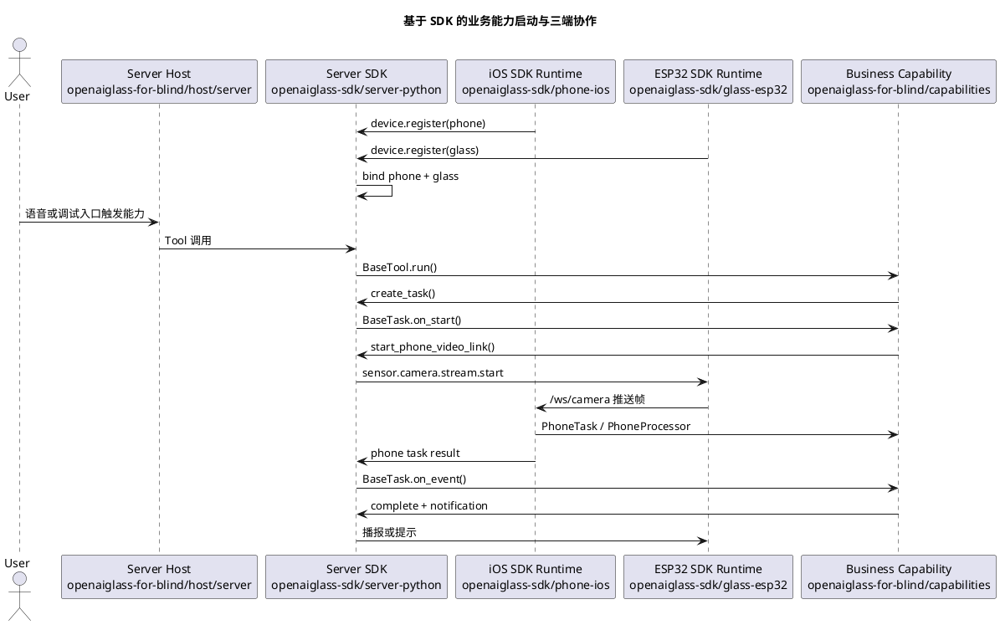

# SDK 安装与能力开发指南

本文面向将要基于 OpenAI Glasses SDK 开发真实业务能力的团队。

开发者不需要理解 SDK 内部的 WebSocket、设备绑定、任务状态机和媒体协议细节，但必须知道三端 SDK 各自负责什么、业务代码应该写在哪里，以及如何使用设备级数据回放完成高效自测，再进入真机联调。

当前指南对应 SDK 版本：`sdk-v106`。本版本在 `sdk-v105` 的轮次记录器拆分基础上，继续把会话消息构造、旁路 ASR 回填和连续对话关闭状态机迁入独立模块。业务侧使用方式不变，旧 `voice.reply_mode` / `VOICE_REPLY_MODE` 仍兼容映射。公网/NAT 穿透、跨机器分布式任务平台、iOS 二进制 XCFramework 和 ESP32 component registry 发布暂不覆盖。

默认语音会话模式为 `full_duplex_realtime`。如果当前设备或回放工具只支持半双工，请在 `config/local_server.yaml` 中设置 `voice.session_mode: half_duplex`。

当前 SDK 能力状态：

| 能力 | 当前状态 | 业务开发者应如何使用 |
| --- | --- | --- |
| 半双工语音问答 | 可用 | 继续按 `/ws_audio`、`voice.session.open` 和普通 Tool/Task 开发业务能力。 |
| 全双工实时语音 | `sdk-v19` 默认打开，`sdk-v20` 回放端已补齐打开握手，`sdk-v21` 回放端保存播放音频不会阻塞控制消息，`sdk-v22` 补齐首 token 和首段音频观测日志，`sdk-v43` 补齐服务端和回放端下行播放首包链路日志，`sdk-v44` 补齐 ESP32 真实眼镜首包播放日志，`sdk-v45` 补齐 TTS 接口级首包延迟日志，`sdk-v47` 在 Agent 请求等待期间后台预启动最终回复 TTS 流，`sdk-v49` 新增 Omni Realtime 语音直出分支，`sdk-v51` 补齐语音输入模式配置和下行音频日志口径，`sdk-v52` 默认启用 Omni 并在说话期间预连接和预推音频，`sdk-v54` 增加 Omni `semantic_vad` 连续对话配置和协议声明，`sdk-v55` 默认启用 `realtime_semantic_vad` 并补齐服务端自动响应等待与 ESP32 连续窗口，`sdk-v64` 回退 ESP32 播放中自然插话试验并保留首次唤醒轻提示，`sdk-v72` 收紧 ESP32 连续对话 VAD 追问门控，`sdk-v73` 增强 ESP32 播放任务创建失败诊断和回报，`sdk-v75` Realtime 音频直出链路支持 SDK Tool 调用和工具结果回填，`sdk-v85` 在服务端抑制连续 VAD 空语音段，`sdk-v86` 恢复受限连续对话、停止指令关闭窗口和播放中唤醒词打断，`sdk-v87` 增加语音轮次意图裁决，`sdk-v88` 补齐空段抑制后的端侧收口，`sdk-v89` 恢复 Omni `semantic_vad` 主裁决链路并新增模型工具关闭连续对话，`sdk-v90` 使用 `response.audio.done` 收口 Omni 下行播放流，`sdk-v91` 打印 Omni server event 摘要并后台关闭 Realtime 会话，`sdk-v92` 默认使用 Omni Realtime persistent 长连接承载连续多轮对话，`sdk-v93` 去掉模型工具默认 `reason` 参数，`sdk-v94` 修复 ESP32 WakeNet 唤醒路径 SR 任务栈溢出风险，`sdk-v95` 改为由 Omni 模型通过 `capture_photo` 自行决策视觉问答，`sdk-v96` 停止逐帧打印 Omni 音频 delta 事件，`sdk-v97` 新增 `voice.server_mode=omni_server|text_server` 边界配置，`sdk-v98` 新增 Omni/Text Server 适配器，`sdk-v99` 将 Omni Realtime 客户端迁入 `runtime.omni.realtime_client`，`sdk-v100` 将共享语音状态迁入 `runtime.voice_state`、PCM/WAV 工具迁入 `runtime.audio_utils`，`sdk-v101` 将播放流队列与 HTTP chunked WAV 输出基础逻辑迁入 `runtime.playback_streams`，`sdk-v102` 将工具前置播报静态音频缓存迁入 `runtime.progress_audio_cache`，`sdk-v103` 将通知与 Task 事件到语音播放的桥接逻辑迁入 `runtime.notification_voice_bridge`，`sdk-v104` 将 Omni Realtime 工具桥迁入 `runtime.omni.tool_bridge`，并将 Text 链路 Agent Turn 构造迁入 `runtime.text.text_agent_adapter`，`sdk-v105` 将语音轮次 transcript、输出音频和 assistant 音频资产挂载迁入 `runtime.turn_recorder`，`sdk-v106` 将会话消息构造、旁路 ASR 回填和连续对话关闭状态机分别迁入 `runtime.message_builder`、`runtime.sidecar_transcript` 和 `runtime.continuous_dialog` | 端侧或手机侧接入 `voice.realtime.*` 协议；旧设备通过 `voice.session_mode: half_duplex` 回退。ESP32-S3 当前因没有端侧 AEC，只开放播放结束后的受限连续追问和播放中的唤醒词打断，不开放无唤醒词自然插话。 |
| 模型拍照工具 | `sdk-v95` 默认暴露 `capture_photo` | 视觉问答不再依赖 SDK 关键词意图识别。模型判断需要当前画面时会调用 `capture_photo`；SDK 完成真实抓拍并把照片追加给 Omni Realtime 或普通图片解读主链路。业务 Skill 不要再自建“看图意图识别”。 |
| 实时 ASR | `sdk-v35` 默认启用，异常自动回退批量 ASR；`sdk-v39` 修正首文本和总耗时日志口径；`sdk-v40` 使用官方 `Recognition` 实时 ASR 接口；`sdk-v41` 增加分段耗时日志并降低 VAD 断句静音阈值；`sdk-v51` 通过 `VOICE_INPUT_MODE` 明确是否启用独立 ASR；`sdk-v74` 音频原生 Chat Completions 链路优先使用流式返回；`sdk-v89` 起 Omni 主链路中的旁路 ASR 默认不阻塞模型调用；`sdk-v97` 起输入模式按 `voice.server_mode` 推导；`sdk-v98` 起 Text Server 的文本控制规则收敛到 TextDialogStateMachine；`sdk-v99` 将 ASR/TTS/兼容语音模型客户端迁入 `runtime.text.speech_clients` | 默认 `VOICE_INPUT_MODE=auto`：`omni_server` 实际为 `raw_audio`，`text_server` 实际为 `asr_text`。文本模型或不支持语音输入的模型应使用 `voice.server_mode=text_server`。Omni Realtime 模式下旁路 ASR 主要用于日志、会话回填和已经就绪时的低风险控制，不作为误触发主判定。 |
| 工具调用前置播报 | `sdk-v69` 在 Tool 执行前支持 `ToolSpec.progress_message`；`sdk-v70` 增加静态音频缓存；`sdk-v71` 支持多句候选随机播报；`sdk-v80` 改为按模型首输出类型自动判定；`sdk-v81` 支持缓存或实时流式生成两种音频来源；`sdk-v83` 增加全局开关和启动缓存校验 | 业务 Tool 可声明一句简短等待提示，或声明 3 到 5 句候选。首输出是工具调用时 SDK 播预置提示；首输出是文本或音频时不额外插入等待提示。通过 `tools.progress_audio.enabled` 全局启停，通过 `tools.progress_audio.mode` 选择低延迟缓存或实时生成，业务代码不要自行调用播放器或 TTS。 |
| 外部 MCP Server client | `sdk-v84` 支持通过 `ExternalMcpServerConfig` 连接 stdio、SSE、Streamable HTTP MCP Server | 业务宿主可注册官方 AMap MCP Server 或第三方 MCP Server；业务 Tool/Task 继续使用 `context.mcp(...)`，不要自行创建 MCP 进程或 SDK 内部网关。 |
| SDK 自定义 Task 定时调度 | `sdk-v84` 支持 `TaskContext.schedule_event(...)` 和 `DeviceGroupContext.schedule_task_event(...)` | 计时器、超时检查、延迟确认等场景不要自建线程；在 Task 中安排延迟事件，到点后由 SDK 调用 `on_event(...)`。 |
| Task 终态事件回流策略 | `sdk-v84` 支持 `terminal_event_requires_agent_decision`、`terminal_event_allow_direct_notify` 和 `terminal_event_priority` | 如果终态必须先交给 Agent 决策再通知用户，Task 类上声明 `terminal_event_requires_agent_decision=True` 且 `terminal_event_allow_direct_notify=False`。 |
| 设备级 glass-playback | `sdk-v38` 已随 Python SDK 包安装，`sdk-v43` 起直接播放模式优先使用 `ffplay` stdin 流式播放，`sdk-v53` 起 `trigger_audio` 支持本机真实麦克风 | 业务只提供 `host/glass-playback/config/*.json` 和 `testdata` 资产；启动时不传 `--sdk-root`。 |
| 播放仲裁和用户打断 | `sdk-v84` 修复设备组通知到真实语音播报链路的绑定；`sdk-v86` 真实 ESP32 播放期间可用 WakeNet 上报 `user.voice.interrupt` | 业务只提交通知优先级和策略，不直接控制播放器。`context.submit_notification(...)` 会进入 `VoiceRuntime` 通知协调器，并下发 `assistant.reply` / `actuator.audio.play`。 |
| 账号、组织、权限和配置 | 可用 | 业务通过 `DeviceGroupContext` 读取配置和做权限检查，不自建绑定表。 |
| Agent 长期记忆 | `sdk-v50` 起支持两类注入策略，`sdk-v66` 收敛为 MemoryAgent 内部动作计划，`sdk-v67` 统一为基本信息和个性化信息，`sdk-v68` 补强主动记忆提示 | 业务能力不要自建记忆表；姓名、年龄等基本信息每轮完整注入，住址、爱好、习惯等个性化信息只注入主题，详情由模型按需调用 `memory_search`。 |
| SQLite 任务持久化 | 可用 | 单机多进程可用 SQLite；跨机器部署仍需后续外部数据库方案。 |
| iOS/ESP32 SDK 包形态 | 源码包可检查 | 业务工程引用 SDK 源码运行时；二进制发布仍是后续工作。 |

## 1. 当前目录边界

当前仓库拆成两条主线：

| 目录 | 面向对象 | 职责 |
| --- | --- | --- |
| [../openaiglass-sdk/server-python](../openaiglass-sdk/server-python) | 服务端 SDK 开发者 | Python SDK、协议模型、服务端运行时、Tool/Task/Skill 扩展面、测试工具。 |
| [../openaiglass-sdk/phone-ios](../openaiglass-sdk/phone-ios) | iOS 手机端 SDK 开发者 | iOS 通用手机运行时，负责注册、心跳、视频接收、手机任务承载和结果回传。 |
| [../openaiglass-sdk/glass-esp32](../openaiglass-sdk/glass-esp32) | ESP32 眼镜端 SDK 开发者 | ESP32 通用眼镜运行时，负责 WiFi、控制连接、音频、摄像头和端侧命令处理。 |
| [host](./host) | 盲人产品装配团队 | 服务端、手机端、眼镜端宿主配置和启动说明。 |
| [capabilities](./capabilities) | 业务能力开发团队 | `find_object`、导航、识别等真实业务能力。 |
| [docs](./docs) | 产品和研发团队 | 需求、阶段计划、功能设计、验收和当前实现状态。 |
| [testdata](./testdata) | 测试和业务开发团队 | 设备级数据回放使用的音频、视频、图像、传感器和兼容性数据资产。 |

业务能力开发优先修改 `openaiglass-for-blind/capabilities` 和 `openaiglass-for-blind/host`。只有当 SDK 公开抽象无法表达新业务时，才向 `openaiglass-sdk` 提交 SDK 层改造。

## 2. 三端 SDK 职责

### 2.1 服务端 Python SDK

服务端 SDK 负责：

1. 设备注册、设备组绑定和心跳维护。
2. 统一控制消息、媒体消息和任务事件模型。
3. Agent、Tool、Task、Skill、MCP Adapter 和外部 MCP Server 装配。
4. 全局上下文、任务状态、通知和异常处理。
5. 半双工语音、全双工实时语音、播放仲裁和用户打断。
6. 设备级数据回放、契约测试和 SDK 包验证。

开发者主要使用：

```python
from openaiglasses import (
    BaseTask,
    BaseTool,
    CapabilityResult,
    ExternalMcpServerConfig,
    OpenAIGlassesSDK,
    ServerSettings,
    TaskContext,
    TaskEvent,
)
```

### 2.2 iOS 手机 SDK 运行时和业务入口

iOS SDK 运行时代码位于 [../openaiglass-sdk/phone-ios](../openaiglass-sdk/phone-ios)。业务开发者不要直接打开或修改 SDK 目录下的 Xcode 工程；盲人业务项目提供自己的手机端 Xcode 入口：

```text
openaiglass-for-blind/host/phone/ios/GlassesVideoReceiver.xcodeproj
```

这个业务侧 Xcode 工程引用 SDK 通用 iOS 运行时代码，并把业务目录下的配置文件打包进 App。

它负责：

1. 从业务工程的 `AppConfig.plist` 读取服务端地址、手机设备编号、配对令牌和目标眼镜编号。
2. 自动连接服务端 `/ws/control`，完成手机注册和心跳。
3. 在本机启动 `/ws/camera` 接收服务，接收眼镜推送的 JPEG 视频帧。
4. 承载手机侧任务，执行手机侧能力插件。
5. 将手机侧处理结果上报回服务端。
6. 提供调试页面，展示接收地址、注册状态、最近帧和最近事件。

`sdk-v2` 起，iOS 运行时已经支持多业务能力并存。业务插件应通过 `PhoneTaskCapabilityRegistry.register(taskType:runtimeBuilder:)` 按服务端下发的 `task_type` 注册；运行时收到 `sdk.phone.task.start` 后会按 `task_type` 选择对应业务插件。旧的 `PhoneCapabilityRuntimeFactory.register { ... }` 只作为单能力兼容入口保留，新能力不要再使用。

业务侧手机配置文件：

```text
openaiglass-for-blind/host/phone/config/AppConfig.plist
```

模板：

```text
openaiglass-for-blind/host/phone/config/AppConfig.plist.example
```

同步脚本只写业务侧配置文件。业务侧 Xcode 工程会把该文件作为 App 资源打包，不再写入 SDK 目录下的 iOS 配置文件。

关键配置项：

| 配置项 | 说明 |
| --- | --- |
| `serverBaseURLString` | 服务端 HTTP 地址，例如 `http://192.168.1.10:8765`。运行时会自动转换成控制 WebSocket 地址。 |
| `phoneDeviceID` | 手机设备编号，例如 `phone-001`。 |
| `pairToken` | 手机配对令牌，必须与服务端配置一致。 |
| `desiredGlassDeviceID` | 希望绑定的眼镜设备编号，例如 `glass-001`。 |

手机端配置同步和启动统一按第 3 节的流程执行。业务开发者只打开业务侧 Xcode 工程，不直接打开 `openaiglass-sdk/phone-ios` 下的 SDK 工程。

### 2.3 ESP32 眼镜 SDK 运行时

眼镜 SDK 运行时位于 [../openaiglass-sdk/glass-esp32](../openaiglass-sdk/glass-esp32)，当前以 ESP-IDF 工程形式交付。

它负责：

1. 读取 WiFi、服务端控制地址、眼镜设备编号和配对令牌。
2. 连接服务端 `/ws/control`，发送 `device.register` 和 `device.heartbeat`。
3. 连接服务端 `/ws_audio`，上传半双工语音片段并接收播放控制；支持全双工的固件可改连 `/ws_realtime_audio` 上传实时媒体帧。
4. 响应 `sensor.camera.capture`，完成单次抓拍并回传 `sensor.camera.captured`。
5. 响应 `sensor.camera.stream.start/stop`，把摄像头帧推送到手机 `/ws/camera`。
6. 处理通知、播报、唤醒和端侧运行状态。

全双工实时语音对眼镜端有额外要求：端侧需要持续采集麦克风并尽量提供 AEC/VAD 结果，通过 `voice.realtime.input.delta` 媒体帧和 `voice.realtime.user_interrupt` 控制事件告诉服务端“这是用户插话”还是“这是喇叭回声”。如果端侧无法提供 AEC，服务端会把实时会话降级到半双工，业务功能不需要自己做兜底。

本地私有配置：

```text
openaiglass-for-blind/host/glass/config/local_build.env
```

模板：

```text
openaiglass-for-blind/host/glass/config/local_build.env.example
```

关键配置项：

| 配置项 | 说明 |
| --- | --- |
| `GLASS_WIFI_PRIMARY_SSID` | 主 WiFi 名称。 |
| `GLASS_WIFI_PRIMARY_PASSWORD` | 主 WiFi 密码。 |
| `GLASS_SERVER_WS_URI` | 服务端控制 WebSocket 地址，例如 `ws://192.168.1.10:8765/ws/control`。 |
| `GLASS_DEVICE_ID` | 眼镜设备编号，例如 `glass-001`。 |
| `GLASS_PAIR_TOKEN` | 眼镜配对令牌，必须与服务端配置一致。 |
| `GLASS_HEARTBEAT_INTERVAL_MS` | 心跳间隔。 |

ESP32-S3 当前采用受限半双工连续对话方案：播放期间不启动普通本地语音段，也不做无唤醒词自然插话；`sdk-v86` 起，服务端请求 `realtime_semantic_vad` 时眼镜仍降级为半双工，但会打开播放结束后的受限连续对话窗口。首次 WakeNet 唤醒提示音由 `CONFIG_GLASS_WAKE_PROMPT_TONE_ENABLE=y` 控制，可通过 `CONFIG_GLASS_WAKE_PROMPT_TONE_DURATION_MS`、`CONFIG_GLASS_WAKE_PROMPT_TONE_FREQ_HZ`、`CONFIG_GLASS_WAKE_PROMPT_TONE_GAIN_PERMILLE` 调整时长、频率和音量。已有旧 `sdkconfig` 时，重新烧录前要执行 `idf.py reconfigure` 或删除旧 `sdkconfig` 后重新配置，确保这些默认项进入实际构建。

`sdk-v72` 起，真实 ESP32 的连续对话追问不会在播放结束后立刻被单帧 `VAD_SPEECH` 触发。固件会先等待短冷却，再要求连续多帧 VAD 语音才启动免唤醒新语音段；日志中出现 `连续对话 VAD 触发新语音段` 时会带上 `speech_frames`，用于判断是否由稳定语音触发。

`sdk-v86` 起，真实 ESP32 半双工降级模式会启用受限连续对话。正常日志应显示 `semantic_continuous_requested=1 semantic_continuous_enabled=1`。播放结束后固件会等待更长冷却，并要求连续 10 帧 VAD 语音才启动免唤醒新段。`sdk-v89` 起，Omni Realtime 主链路不再等待旁路 ASR 判断空转写或背景音，而是把已接入的音频流交给 Omni `semantic_vad` 判断是否需要自动响应；SDK 只保留空音频、没有音频帧、极短异常段这类本地确定事实的硬保护。

用户说“结束对话”“停止对话”“安静”“别说了”等控制指令时，`sdk-v89` 起优先由大模型调用 SDK 内置系统工具 `close_continuous_dialog`。SDK 会允许模型播报一句很短的确认语，并在当前回复播放完成后下发 `voice.dialog.close`。`sdk-v93` 起，该工具不再要求或返回 `reason` 字段；日志中的关闭原因由 SDK 使用 `model_requested` 等系统默认值生成。如果旁路 ASR 在模型调用前已经完成且明确识别到停止指令，SDK 仍会做一次低风险快速拦截；但不会为了等待 ASR 额外增加正常问答首响延迟。

播放期间如果用户需要打断当前播报，应再次说“嗨乐鑫”。端侧会在播放中继续运行 WakeNet，命中后上报 `user.voice.interrupt`，服务端进入统一播放仲裁器并下发中断播放。由于当前 ESP32 端侧仍没有可用 AEC，`barge_in_mode` 为 `wake_word`；普通无唤醒词插话不会作为默认能力开放。

`sdk-v95` 起，Omni Realtime 连续对话的系统层裁决边界调整为：

1. Omni `semantic_vad` 是误触发、附和声、无意义背景音的主判定者；SDK 不再等待完整旁路 ASR 后才调用 Omni。
2. 旁路 ASR 默认只做日志和转写回填；如果它在进入 Omni 前已经完成，SDK 只顺手处理“结束对话”和明显助手回声这两类低风险控制。
3. SDK 不再通过关键词判断视觉意图，也不再前置自动照片。用户是否在问当前画面，统一由 Omni 模型理解；模型需要当前照片时调用 `capture_photo`。
4. 空音频、没有音频帧、极短异常段会被 SDK 直接丢弃并下发 `voice.dialog.close`。如果 Omni `semantic_vad` 判定本轮没有自动响应，SDK 也会关闭本轮窗口并恢复待命。
5. `sdk-v88` 的端侧收口修复仍然保留：任何服务端抑制路径都会同步下发 `voice.dialog.close`，眼镜端收到后调用 `clear_reply_wait_state()`，不再等待 45 秒回复超时。

`sdk-v73` 起，真实 ESP32 播放任务栈优先分配到 PSRAM。若仍然出现 `创建 playback_stream_task 失败`，日志会同时打印 `free_internal`、`largest_internal`、`free_spiram` 和 `largest_spiram`，并向服务端回报 `playback_task_create_failed`，便于判断是堆内存不足还是连续块碎片化。

服务端控制默认语音会话模式：

| 配置项 | 文件 | 说明 |
| --- | --- | --- |
| `voice.session_mode` | `config/local_server.yaml` | 服务端注册眼镜后默认打开的语音会话模式。默认 `full_duplex_realtime`；旧固件或半双工回放可设为 `half_duplex`。 |

眼镜端配置同步、构建、烧录和串口监控统一按第 3 节的流程执行。

## 3. 安装、同步配置和启动

本节是功能开发人员日常使用 SDK 的标准流程。三端启动、配置同步、预检和联调检查都统一使用 `openaiglass` 命令。

### 3.1 安装 SDK 和统一命令

正式发布后，在业务项目中安装：

```bash
pip install openaiglasses-sdk
```

当前仓库本地开发或发布前验证，推荐安装为 editable 包：

```bash
uv sync --python 3.11
uv pip install -e openaiglass-sdk
```

`openaiglass-sdk/server-python` 仍然是 Python 包源码目录；顶层 `openaiglass-sdk/pyproject.toml` 只是把安装入口聚合到三端 SDK 根目录，便于统一安装和后续发布。

安装后公开导入入口是：

```python
import openaiglasses
```

统一设备命令是：

```bash
uv run openaiglass --help
```

本文命令示例统一使用 `uv run openaiglass...`。这种形式会通过当前项目的 `.venv` 查找 SDK 命令，不要求开发者先手动激活虚拟环境。

SDK CLI 同时支持两种命令组织方式：

1. 点分命令：`uv run openaiglass.config.sync`、`uv run openaiglass.server.run`、`uv run openaiglass.phone.open`、`uv run openaiglass.phone.mock`、`uv run openaiglass.glass.start`。
2. 根命令加子命令：`uv run openaiglass config sync`。

本文后续统一使用点分命令。只有在已经激活 `.venv`，或 SDK 已安装到当前 shell 的 Python 环境中时，才可以省略 `uv run`，例如直接执行 `openaiglass.config.sync`。

如果新增 CLI 后提示 `Failed to spawn` 或 `No such file or directory`，说明当前虚拟环境里的 SDK entry points 还没有刷新，重新执行一次本节的 editable 安装命令即可。

### 3.2 同步三端联调配置

如果直接基于 `openaiglass-for-blind` 目录继续开发，默认使用自动同步即可完成三端联调配置，不需要手动修改手机端和眼镜端的服务地址、设备编号和配对令牌。

同步命令必须在 server host 上执行，也就是实际运行服务端启动命令的那台机器上执行。命令会探测这台机器可被 iOS 手机和 ESP32 眼镜访问的局域网 IPv4；如果在手机、眼镜或另一台开发机上执行，写入的 `SERVER_PUBLIC_HOST` 很可能不是设备实际应该连接的服务端地址。

每次开发机网络变化、端口变化、设备令牌变化后，都执行一次同步：

```bash
uv run openaiglass.config.sync --app-root openaiglass-for-blind
```

同步命令会自动探测当前 Mac 可供手机和眼镜访问的局域网 IPv4，并写入：

1. `openaiglass-for-blind/config/local_server.yaml` 的 `server.public_host`。
2. `openaiglass-for-blind/host/phone/config/AppConfig.plist` 的 `serverBaseURLString`、`phoneDeviceID`、`pairToken`、`desiredGlassDeviceID`。
3. `openaiglass-for-blind/host/phone-mock/config/phone.mock.json` 的 `control_ws_url`、`device_id`、`pair_token` 和 `camera_sink.public_host`。
3. `openaiglass-for-blind/host/glass/config/local_build.env` 的 `GLASS_SERVER_WS_URI`、`GLASS_DEVICE_ID`、`GLASS_PAIR_TOKEN`。

如果自动探测失败，手动指定一次：

```bash
uv run openaiglass.config.sync --app-root openaiglass-for-blind \
  --public-host 192.168.1.23
```

同步后执行配置检查：

```bash
uv run openaiglass.sdk.live-check \
  --report logs/sdk-live-check-current.json
```

如果服务端已经启动，可以加 `--require-server`，让检查同时验证 `/api/health`：

```bash
uv run openaiglass.sdk.live-check \
  --require-server \
  --report logs/sdk-live-check-current.json
```

### 3.3 配置文件说明和手动准备

服务端、手机端、眼镜端的本地配置都归属业务工程：

| 配置文件 | 作用 |
| --- | --- |
| `openaiglass-for-blind/config/local_server.yaml` | 服务端监听地址、端口、设备令牌、模型、语音链路、工具前置播报、记忆和日志配置。 |
| `openaiglass-for-blind/config/.env` | 服务端敏感信息，例如 `DASHSCOPE_API_KEY`。该文件不提交 Git。 |
| `openaiglass-for-blind/host/phone/config/AppConfig.plist` | iOS 手机端服务端地址、设备编号、配对令牌和目标眼镜编号。 |
| `openaiglass-for-blind/host/phone-mock/config/phone.mock.json` | Python 虚拟手机设备编号、配对令牌、服务端控制地址和 mock 任务事件。 |
| `openaiglass-for-blind/host/glass/config/local_build.env` | ESP32 眼镜端 WiFi、控制 WebSocket、设备编号和配对令牌。 |

如果是首次搭建新目录，或自动同步提示本地配置文件不存在，先从模板复制：

```bash
cp openaiglass-for-blind/config/local_server.yaml.example \
  openaiglass-for-blind/config/local_server.yaml
cp openaiglass-for-blind/config/.env.example \
  openaiglass-for-blind/config/.env
cp openaiglass-for-blind/host/phone/config/AppConfig.plist.example \
  openaiglass-for-blind/host/phone/config/AppConfig.plist
cp openaiglass-for-blind/host/glass/config/local_build.env.example \
  openaiglass-for-blind/host/glass/config/local_build.env
```

然后至少检查这些值：

| 配置项 | 文件 | 说明 |
| --- | --- | --- |
| `server.port` | `config/local_server.yaml` | 服务端端口，默认 `8765`。 |
| `devices.tokens` | `config/local_server.yaml` | 必须包含真实设备、`glass-playback` 或 `phone-mock` 的 `device_id: pair_token`。 |
| `voice.session_mode` | `config/local_server.yaml` | 默认 `full_duplex_realtime`。旧设备不支持全双工时改为 `half_duplex`。 |
| `models.*` / `voice.*` / `tools.progress_audio.*` | `config/local_server.yaml` | 服务端模型、语音输入模式、语音服务模式、连续对话、ASR、TTS 和工具前置播报配置。`sdk-v97` 起推荐使用 `voice.server_mode=omni_server|text_server`；默认 `omni_server` 使用 qwen3.5-omni realtime 长连接直出语音并允许 SDK Tool 调用。旧 `voice.reply_mode=omni_realtime|agent_tts` 仍兼容，但如果新旧字段同时存在必须一致。默认 `voice.conversation_mode=realtime_semantic_vad`，默认 `voice.omni_session_lifecycle=persistent`。需要回到旧稳定分段提交时设为 `segment_turn`；只回退 Omni 逐轮建连时设为 `per_turn`。`tools.progress_audio.enabled=false` 会全局关闭工具前置播报。`tools.progress_audio.mode=realtime` 会跟随主回复音频来源：Omni 主链路调用同一个 Omni Realtime 模型生成提示音，TTS 主链路调用同一个 TTS 服务。`cached` 仅对 TTS 主链路预生成缓存。 |
| `agent.memory.*` | `config/local_server.yaml` | 控制 Agent 长期记忆。默认启用，记忆文件默认写入 `runs/memory/agent_memories.json`，每轮最多注入 6 条相关记忆。 |
| `business.navigation.amap.*` | `config/local_server.yaml` | 导航业务的高德 Web 服务非敏感配置，例如默认城市、临时起点坐标、超时和 mock fallback 策略。 |
| `business.search.*` | `config/local_server.yaml` | 搜索业务 provider、博查 API 地址、freshness 和请求超时配置。正式环境建议 `business.search.web.provider=bocha`。 |
| `DASHSCOPE_API_KEY` | `config/.env` 或 shell export | 百炼 API Key，不能写入 YAML，也不要提交 Git。 |
| `AMAP_API_KEY` | `config/.env` 或 shell export | 高德 Web 服务 Key，真实导航地址搜索和路线规划需要。 |
| `BOCHA_SEARCH_API_KEY` | `config/.env` 或 shell export | 博查 AI Search API Key，正式搜索 provider 需要。 |
| `GLASS_WIFI_PRIMARY_SSID` / `GLASS_WIFI_PRIMARY_PASSWORD` | `host/glass/config/local_build.env` | 真实 ESP32 眼镜联网所需 WiFi。 |

旧的 `local_server.env` 仍可作为兼容格式传给 `--config`，但新的本地配置应优先使用 `local_server.yaml + .env`。如果 shell 已经 export 非空 `DASHSCOPE_API_KEY`、`AMAP_API_KEY` 或 `BOCHA_SEARCH_API_KEY`，启动器会优先使用外部真实 key。

### 3.4 启动真实业务服务端

盲人业务服务端入口是：

```text
openaiglass-for-blind/host/server/main.py
```

它负责装配业务能力，SDK CLI 负责通用进程管理、PID、日志和健康检查。

日常联调优先使用前台运行：

```bash
uv run openaiglass.server.run \
  --app-module host.server.main \
  --app-root openaiglass-for-blind \
  --config openaiglass-for-blind/config/local_server.yaml
```

`sdk-v31` 起，这个命令会把服务端保持在当前前台进程中。按 Ctrl+C 或关闭当前终端时，服务端会一起退出，不需要再额外执行 `openaiglass.server.stop`。

如果确实需要后台守护方式，再拆成下面三条命令。

后台启动：

```bash
uv run openaiglass.server.start \
  --app-module host.server.main \
  --app-root openaiglass-for-blind \
  --config openaiglass-for-blind/config/local_server.yaml
```

跟随日志：

```bash
uv run openaiglass.server.logs
```

这里不需要再重复传 `--app-module`、`--app-root`、`--config`，因为 `logs` 只跟随当前仓库默认日志文件，`stop` 也只根据当前仓库默认 PID 文件停止唯一的本地服务端进程。

停止：

```bash
uv run openaiglass.server.stop
```

启动后检查：

```bash
curl http://127.0.0.1:8765/api/health
curl http://127.0.0.1:8765/api/runtime/devices
```

新能力开发统一使用 SDK CLI 的服务端点分命令。

### 3.5 启动真实 iOS 手机端

打开业务侧 Xcode 工程：

```bash
uv run openaiglass.phone.open --app-root openaiglass-for-blind
```

该命令会先执行业务配置同步，再打开：

```text
openaiglass-for-blind/host/phone/ios/GlassesVideoReceiver.xcodeproj
```

只验证模拟器构建：

```bash
uv run openaiglass.phone.build-sim --app-root openaiglass-for-blind
```

真机运行和签名配置仍在 Xcode 中完成，SDK 侧只保留统一的手机工程打开入口。

不要把 `openaiglass-sdk/phone-ios` 下的 SDK 工程作为业务开发入口。

如果本次只需要验证服务端下发手机任务和接收手机结果事件，可以不启动 iPhone，改为启动 `phone-mock`：

```bash
uv run openaiglass.phone.mock \
  --config openaiglass-for-blind/host/phone-mock/config/phone.mock.json
```

`phone-mock` 会像真实 phone 一样连接服务端、注册、心跳、接收 `sdk.phone.task.start/stop`，再按配置把 mock 事件上报到 `/api/tasks/report-event`。它不是 iOS 模拟器，也不模拟 Swift UI、系统权限或真实相机。

### 3.6 构建、烧录和监看真实 ESP32 眼镜

`openaiglass.glass.start` 不要求业务项目一定放在 `OpenAIglassesDemo_2` 这种 monorepo 目录结构下。它涉及四类路径：

| 参数 | 含义 | 默认来源 |
| --- | --- | --- |
| `--repo-root` | 仓库根目录，只作为当前 monorepo 开发时的便捷路径锚点。 | 未传时为当前目录。 |
| `--app-root` | 业务工程根目录，用来查找 `host/glass/config/local_build.env`。 | 默认 `<repo-root>/openaiglass-for-blind`。 |
| `--sdk-root` | SDK 源码或 SDK 资产根目录，用来查找内置固件工程 `glass-esp32`。 | 默认 `<repo-root>/openaiglass-sdk`。 |
| `--project-dir` | ESP-IDF 眼镜固件工程目录，目录下必须有 `CMakeLists.txt`。 | 默认 `<sdk-root>/glass-esp32`。 |
| `--idf-root` | ESP-IDF 安装目录。 | 优先用环境变量 `IDF_PATH`，否则默认 `<repo-root>/.cache/esp-idf-v5.3.2`。 |
| `--config` | 眼镜本地配置文件，包含 WiFi、服务端地址、设备编号和配对令牌。 | 默认 `<app-root>/host/glass/config/local_build.env`。 |
| `--sdkconfig-defaults` | 固件默认配置文件。 | 默认 `<project-dir>/sdkconfig.defaults`。 |

如果直接在当前仓库根目录开发，可以使用最短命令：

```bash
uv run openaiglass.glass.start \
  --repo-root . \
  --port '/dev/tty.usbmodem*'
```

`--repo-root .` 只表示“按当前仓库默认布局推导其他路径”，不是 SDK 对业务项目目录结构的要求。新业务项目如果不采用当前仓库布局，优先使用下面的显式路径写法。

仅编译：

```bash
uv run openaiglass.glass.start \
  --app-root /path/to/my-app \
  --sdk-root /path/to/openaiglass-sdk \
  --idf-root /path/to/esp-idf \
  --build-only
```

构建、烧录并进入串口监看：

```bash
uv run openaiglass.glass.start \
  --app-root /path/to/my-app \
  --sdk-root /path/to/openaiglass-sdk \
  --idf-root /path/to/esp-idf \
  --port '/dev/tty.usbmodem*'
```

仅串口监看：

```bash
uv run openaiglass.glass.start \
  --monitor-only \
  --app-root /path/to/my-app \
  --sdk-root /path/to/openaiglass-sdk \
  --idf-root /path/to/esp-idf \
  --port '/dev/tty.usbmodem*'
```

如果业务工程和 SDK 源码分开放，也是同样显式指定业务工程和 SDK 根目录：

```bash
uv run openaiglass.glass.start \
  --app-root /path/to/my-app \
  --sdk-root /path/to/openaiglass-sdk \
  --idf-root /path/to/esp-idf \
  --port '/dev/tty.usbmodem*'
```

如果没有下载完整 `openaiglass-sdk` 源码，但已经有可编译的 ESP-IDF 眼镜固件工程，应直接指定固件工程和配置文件：

```bash
uv run openaiglass.glass.start \
  --app-root /path/to/my-app \
  --project-dir /path/to/glass-esp32 \
  --sdkconfig-defaults /path/to/glass-esp32/sdkconfig.defaults \
  --idf-root /path/to/esp-idf \
  --port '/dev/tty.usbmodem*'
```

这种情况下，当前目录下不需要存在 `openaiglass-sdk/glass-esp32`。但真实固件构建仍然必须能找到一个 ESP-IDF 工程目录，且该目录至少包含 `CMakeLists.txt` 和可用的 `sdkconfig.defaults`；业务工程也必须提供眼镜本地配置文件，或通过 `--config` 显式传入。

`--port` 支持精确路径和通配符。通配符请加引号，避免 shell 提前展开；如果匹配到多个串口，命令会打印候选列表并要求开发者明确选择其中一个。

新能力开发统一使用 SDK CLI 的眼镜端点分命令。

### 3.7 两层启动边界

1. SDK 层提供通用命令、配置读取、进程管理、健康检查和工具链调度。
2. 业务层只提供 profile、业务服务端装配入口、iOS 工程路径、ESP-IDF 本地配置和业务能力代码。
3. 业务工程不再保留启动脚本；如果需要新增通用启动或检查能力，优先进入 SDK CLI。

### 3.8 普通语音回复流式和首包观测

`sdk-v7` 起，普通文本回复会从 AgentCore 的流式事件中提取文本增量，并通过 `reply_text_delta_callback` 直接进入 `VoiceRuntime` 的流式 TTS 会话。普通问答不再必须等到完整 `final_output` 后才开始向 TTS 推送文本。

当前运行态快照会记录首包相关字段：

| 字段 | 说明 |
| --- | --- |
| `reply_first_text_delta_at_ms` | 当前回复首个文本增量到达服务端播放流的时间。 |
| `reply_first_audio_chunk_at_ms` | 当前回复首个 TTS 音频分片进入播放队列的时间。 |
| `reply_first_play_request_at_ms` | 当前回复首次下发 `actuator.audio.play` 的时间。 |
| `reply_text_to_first_audio_ms` | 首文本到首音频的耗时。 |
| `reply_audio_to_play_request_ms` | 首音频到播放请求的耗时。 |

这些字段可以通过运行态接口和联调日志观察，用于判断当前链路是否真的在流式推进。如果 `reply_text_to_first_audio_ms` 很大，优先检查当前 TTS 是否回退到了全文合成；这不应该由业务 Tool 或 Task 自行处理。

`sdk-v22` 起，服务端在 `VoiceRuntime` 首次收到模型文本增量时会打印 `大模型返回首个 token`，并携带 `first_token_latency_ms`、`segment_id`、`input_stream_id` 和 `token_preview`。该日志用于判断 ASR 后到模型首 token 的耗时，不要求业务 Tool 自行打点。

`sdk-v24` 起，服务端还会在音频段进入 ASR 前、ASR 完成准备进入 agent-core 前、agent-core 即将调用模型前打印 INFO 日志。`sdk-v25` 起，SDK 不再内置 `qwen-turbo` 等模型黑名单；如果某个模型在当前 `stream=True + tools` 链路中超时或报错，应以服务端 ERROR 日志、`VOICE_MODEL_TIMEOUT_MS` 和 `/api/agent/session` 中的 `model_request` 为准定位，而不是由业务代码绕过 SDK。

`sdk-v28` 起，基于 `build_server_handle_from_sdk(...)` 或 `build_agent_facade_from_sdk(...)` 构建真实服务端时，SDK 会在装配阶段调用 `OpenAIAgentLoopRunner.preload_resources()`，提前加载 OpenAI Agents SDK 模块并创建可复用 provider。业务请求路径仍然会按当前会话动态装配 `AgentToolContext`、active Skill、工具白名单和原始历史消息，但不会在热路径里重复散落导入和 provider 创建逻辑。

`first_token_latency_ms` 的起点仍然是 ASR 完成并准备进入 `AgentFacade.handle_turn(...)` 前，不包含设备注册、语音会话打开、音频上传和 ASR。它包含 agent-core 会话读写、单轮上下文装配、Agents SDK 调用和首个文本增量到达的耗时；`sdk-v28` 的预热只减少依赖加载和 provider 创建对这个指标的干扰，不改变该指标口径。

`sdk-v33` 起，视觉拍照链路只保留模型流式文本和图片解读主链路文本两类播报。SDK 不再在 `capture_photo` 工具调用事件上额外注入固定中间播报，避免出现先听到图片解读、随后又听到“好的，你保持别动，我拍一张帮你看”的倒序或重复播报。

`sdk-v34` 到 `sdk-v94` 期间，SDK 曾使用语音结束自动照片和系统层视觉关键词裁决来减少模型无关看图。`sdk-v95` 起这条策略废弃：视觉判断统一交给模型自身完成，避免 SDK 规则和模型理解互相冲突。

`sdk-v95` 起，`capture_photo` 是默认模型可见系统工具。当用户问“看一下我眼前有什么”“前面是不是有障碍物”“帮我识别一下这张纸上的字”等需要当前视觉信息的问题时，模型应调用 `capture_photo`。SDK 会向眼镜下发 `sensor.camera.capture`，保存 `sensor.camera.captured` 返回的图片；Omni Realtime 链路会把该图片追加到同一条 Realtime 会话后继续生成语音回答，普通 Agent/TTS 链路会切换到图片解读主链路。普通天气、时间、闲聊、记忆、导航规划等不需要当前画面的请求，模型不应调用 `capture_photo`。

`sdk-v35` 起，默认 `VOICE_ASR_MODE=realtime`。服务端收到 `sensor.audio.segment.started` 后创建实时 ASR 会话，随后每个 `/ws_audio` 的 `audio_chunk` 都会在进入本地 `SegmentBuffer` 的同时送入实时 ASR。收到 `sensor.audio.segment.finished` 后，服务端优先等待实时 ASR 最终文本；如果实时 ASR 不可用、超时或返回空文本，再回退到旧的 `VOICE_ASR_MODEL_NAME` 整段 WAV 转写。这个改动的目标是把 ASR 耗时从“用户说完后才开始”前移到“用户说话过程中持续进行”。

`sdk-v39` 起，实时 ASR 日志中的 `first_asr_partial_latency_ms` 不再从 `sensor.audio.segment.started` 或实时 ASR 会话创建时间开始计算，而是从服务端收到眼镜首个音频 chunk 并送入实时 ASR session 的时刻开始，到 ASR 服务返回第一段文本为止。`实时 ASR 完成` 日志新增 `asr_total_latency_ms`，同样从首个音频 chunk 起算，到 ASR 最终文本完成为止。排查 4 秒级 ASR 耗时时，应优先看这两个字段；如果它们仍接近整段语音时长，说明 ASR 服务首文本确实晚于用户说话结束附近返回，而不是 SDK 打点把语音开始前的等待算进去了。

`sdk-v40` 起，实时 ASR 实现不再使用 `dashscope.audio.qwen_omni.OmniRealtimeConversation` 的转写能力，而是使用阿里云百炼实时语音识别文档对应的 `dashscope.audio.asr.Recognition`。SDK 在创建会话后调用 `Recognition.start()`，每个眼镜上行 PCM chunk 到达后立即调用 `send_audio_frame(...)`，语音结束时调用 `Recognition.stop()`；中间结果和最终结果通过 `RecognitionCallback.on_event(...)` 读取 `get_sentence()`，并用 `end_time` 判断句尾。业务本地配置建议使用 `VOICE_ASR_REALTIME_MODEL_NAME=fun-asr-realtime`。

`sdk-v41` 起，`实时 ASR 返回首个文本` 和 `实时 ASR 完成` 日志会额外携带 `recognition_open_latency_ms`、`session_start_to_first_audio_ms`、`first_audio_send_cost_ms`、`audio_ms_before_first_partial`、`dashscope_first_package_delay_ms`、`dashscope_last_package_delay_ms`、`stop_to_complete_ms`、`audio_frame_count` 和 `audio_bytes_sent`。这些字段用于判断 1 秒级 ASR 延迟到底发生在连接、发帧、ASR 服务首包、句尾 VAD 还是收尾阶段。`VOICE_ASR_REALTIME_MAX_SENTENCE_SILENCE_MS` 默认值为 `300`，取值范围 `200` 到 `6000`；如果误切句明显，可适当调大。

`sdk-v51` 起，语音输入模式由 `VOICE_INPUT_MODE=auto|asr_text|raw_audio` 控制。默认 `auto` 会根据 `VOICE_REPLY_MODE` 自动选择：`agent_tts` 分支实际为 `asr_text`，会启动独立 ASR 并把文本交给 Agent；`omni_realtime` 分支实际为 `raw_audio`，不会启动独立 ASR，而是把原始 PCM 直接交给 Omni Realtime。若当前模型不支持语音输入，应使用 `VOICE_REPLY_MODE=agent_tts`，并保持 `VOICE_INPUT_MODE=auto` 或显式设为 `asr_text`。

`sdk-v44` 起，真实 ESP32 眼镜会在收到 `actuator.audio.play` 后打印下行播放流关键时间点：`准备启动播放流`、`播放流 HTTP 已打开`、`播放流 WAV 头已读取`、`播放流收到首段 PCM`、`播放流首段音频已写入扬声器`。当前 ESP32 固件不会先完整下载 `/stream.wav` 再播放；它读取 44 字节 WAV 头后按约 20ms 的 PCM 分片写入 I2S，`actuator.audio.started` 也在首段音频写入扬声器后才上报。如果真机仍然听感延迟高，应把这些日志和服务端 `下行音频源返回首段音频`、`下行播放请求已发送`、`播放流写出首段音频` 对齐，判断延迟发生在服务端音频源、HTTP 首包、网络读取、I2S 写入或功放实际出声阶段。

`sdk-v45` 起，CosyVoice 流式 TTS 会打印接口级首包日志：`TTS WebSocket 已打开`、`TTS 首次文本已推送`、`TTS 服务返回首段音频`。其中 `tts_first_audio_latency_ms` 从 SDK 首次调用 `streaming_call(text_delta)` 开始，到百炼 TTS 回调首段音频 `on_data(...)` 为止；`tts_first_audio_after_call_return_ms` 排除了首次 `streaming_call(...)` 本地阻塞耗时；`text_chars_before_first_audio` 和 `text_push_count_before_first_audio` 用于判断 TTS 服务是否等到足够文本后才吐首包。`sdk-v51` 后，共用播放层日志改为 `下行音频源返回首段音频`，表示音频回调进入 SDK 后完成重采样并放入播放队列的时间。

`sdk-v46` 起，最终回复的 TTS 会话会在调用 `AgentFacade.handle_turn(...)` 前创建，日志为 `TTS 预热已启动`。这样大模型首 token 产生前，CosyVoice WebSocket 可以并行建连；首个文本增量到达后直接复用已预热 session 推送文本。如果模型首 token 或工具链路耗时过长导致预热 session 推送失败，SDK 会记录 `TTS 预热会话推送失败，重建后重试` 并重建一次 TTS session。

`sdk-v69` 起，TTS 预热只预热 TTS 会话，不再提前注册最终回复播放流。最终回复播放流会延迟到首个最终回复文本到达时创建，避免一个尚未产生音频的预热流占住播放仲裁器，导致工具前置播报排到最终回复后面。

`sdk-v47` 起，SDK 不再只创建 `SpeechSynthesizer` 对象，而是在后台预启动 CosyVoice 流式任务。正常情况下，服务端会在 `TTS 预热已启动` 后、模型首 token 前看到 `TTS WebSocket 已打开` 和 `TTS 预热流已启动`；首个模型文本增量到达后，`TTS 首次文本已推送` 的 `first_streaming_call_cost_ms` 应显著低于 `sdk-v46` 中首次文本触发建连的耗时。如果预热流失败或过期，SDK 仍会退化为首次文本触发并保留重建重试。

`sdk-v49` 起，语音回复链路新增 `VOICE_REPLY_MODE=omni_realtime`。`sdk-v97` 起，推荐使用 `VOICE_SERVER_MODE=omni_server` 表达这条 Omni Realtime 模型服务链路，旧 `VOICE_REPLY_MODE=omni_realtime` 会自动映射。`sdk-v75` 起，该模式不再和 SDK Tool 调用互斥：服务端会把当前语音段的 16k PCM 提交给 `VOICE_OMNI_REALTIME_MODEL_NAME`，收到 `response.audio.delta` 后立即复用现有播放流下发给眼镜；如果模型触发 Realtime function calling，SDK 会执行对应 Tool，把结果作为 `function_call_output` 回填给 Omni，再继续接收最终音频。`sdk-v95` 起，视觉问答通过模型调用 `capture_photo` 获取照片，SDK 会把工具返回的图片追加到同一条 Omni Realtime 会话。该模式适合低延迟视觉问答、普通语音问答，以及可以通过 SDK Tool 表达的业务动作；仍需复杂文本 Agent/Skill 策略或需要不支持音频输入的模型时，可显式使用 `VOICE_SERVER_MODE=text_server`。

Omni Realtime 模式下可观察这些日志：`Omni Realtime 预连接已建立`、`Omni Realtime 首段上行音频已推送`、`Omni Realtime 请求已提交`、`Omni semantic_vad 等待自动响应`、`Omni Realtime 工具调用请求 tool_name=capture_photo`、`Omni Realtime 已追加 capture_photo 工具图片`、`Omni Realtime 返回首个文本`、`Omni Realtime 返回首段音频`、`Omni Realtime 音频输出完成`、`Omni Realtime 最终回复`。`sdk-v90` 起，SDK 以 `response.audio.done` 作为下行音频流完成信号，并继续兼容 `response.done` / `response.cancelled` 作为响应对象终态；`response.audio_transcript.done` 只用于助手文本完成记录，不再被当作播放流完成依据。`sdk-v91` 起，`LOG_LEVEL=DEBUG` 时还会打印 `Omni Realtime server event type=... payload=...`；`sdk-v96` 起不再逐帧打印 `response.audio.delta`，只保留 `response.audio.done`、`response.done`、工具调用、输入语音事件和错误事件等关键 server event。`sdk-v92` 起，默认 `VOICE_OMNI_SESSION_LIFECYCLE=persistent`，同一个端侧连续对话窗口内多轮语音复用同一条 Omni Realtime WebSocket；收到 `response.audio.done` 后只收口当前播放流，不关闭模型连接。只有用户主动结束、模型调用 `close_continuous_dialog`、端侧窗口关闭、控制连接断开或不可恢复异常时才后台关闭长连接。需要回退旧逐轮建连行为时，可设置 `VOICE_OMNI_SESSION_LIFECYCLE=per_turn`。`VOICE_OMNI_PHOTO_WAIT_MS` 仅保留为旧自动照片兼容配置；`sdk-v95` 默认视觉链路不再依赖该等待窗口。

`sdk-v51` 起，共用下行播放流日志统一使用 `下行音频源返回首段音频`，并携带 `audio_source=tts|omni_realtime`。`agent_tts` 分支仍会看到 CosyVoice 专属日志，例如 `TTS WebSocket 已打开`、`TTS 首次文本已推送`、`TTS 服务返回首段音频`；`omni_realtime` 分支不应再出现独立 TTS 服务日志。

`sdk-v52` 起，`omni_realtime` 成为默认语音回复分支。服务端在 `sensor.audio.segment.started` 时预连接 Omni Realtime，并在 `/ws_audio` 每个音频 chunk 到达时同步追加到 Omni 会话；`sensor.audio.segment.finished` 后由 Omni `semantic_vad` 或分段提交触发响应。`sdk-v95` 起，图片只在模型调用 `capture_photo` 后追加到 Realtime 会话，不再在每个语音段结束时前置自动追加。新增日志包括 `Omni Realtime 预连接已建立`、`Omni Realtime 首段上行音频已推送` 和 `Omni Realtime 请求已提交`。`sdk-v75` 起，这个分支会把当前模型可见 SDK Tool 一并写入 Realtime session，工具结果回填后继续音频直出，不会因为工具调用默认取消已经播放的模型音频。

`sdk-v54` 起，SDK 增加方案二的连续对话配置：`VOICE_CONVERSATION_MODE=segment_turn|realtime_semantic_vad`。`sdk-v97` 起，`realtime_semantic_vad` 只能与 `VOICE_SERVER_MODE=omni_server` 一起使用；服务端会在 Omni 会话中启用 turn detection，并把 `VOICE_REALTIME_TURN_DETECTION`、`VOICE_REALTIME_SEMANTIC_VAD_THRESHOLD`、`VOICE_REALTIME_SILENCE_DURATION_MS`、`VOICE_REALTIME_PREFIX_PADDING_MS` 传入官方 SDK，同时在 `voice.realtime.session.open` 里向真实眼镜声明 `input.turn_detection.owner=omni_realtime`。这项能力面向真实 `glass-esp32` 连续对话，不要求业务能力代码修改；`glass-playback` 只能用于协议回放和验收，不代表真实唤醒、AEC 或旁人说话过滤效果。

`sdk-v55` 起，默认 `VOICE_CONVERSATION_MODE=realtime_semantic_vad`。服务端在 `sensor.audio.segment.started` 时前置自动抓拍，并在 Omni 会话已有上行音频后尽快追加图片，避免 VAD 自动提交后再追加图片导致图片错过当前 turn；`OmniRealtimeStreamingSession.finish(...)` 在该模式下只等待 `semantic_vad` 自动响应，不再手动调用 `commit()` 和 `create_response(...)`。`sdk-v89` 恢复这条主链路，旁路 ASR 不再默认挡在 Omni 前面；如果 Omni 返回 `semantic_vad_no_auto_response`，SDK 会把本轮视为没有有效用户请求并关闭连续窗口。`sdk-v92` 起，`semantic_vad` 自动响应等待会给端侧 `segment.finished` 和 Omni `speech_stopped/committed/response.created` 之间的事件延迟留出短缓冲，避免用户真实追问被过早判定为无响应。真实 `glass-esp32` 因缺少端侧 AEC，仍只开放播放结束后的受限连续追问和播放中的唤醒词打断。如果需要回到旧的分段稳定模式，可设置 `VOICE_CONVERSATION_MODE=segment_turn`；如果只想回退 Omni 连接生命周期，可设置 `VOICE_OMNI_SESSION_LIFECYCLE=per_turn`。

`sdk-v80` 起，工具前置提示由模型首输出类型自动判定。首输出是工具调用时，SDK 使用 `ToolSpec.progress_message` 播报；首输出是文本或音频时，SDK 不会再额外插入等待提示。`sdk-v81` 起，播报音频来源由 `tools.progress_audio.mode` 控制：`cached` 在 TTS 主链路中使用启动阶段静态音频缓存，`realtime` 在工具调用前按当前主回复音频来源实时生成提示音。主回复是 Omni Realtime 音频直出时，提示音也由同一个 Omni Realtime 模型和 voice 生成；主回复是 Agent 文本加 TTS 时，提示音也由同一个 TTS 服务生成。`sdk-v83` 起，`tools.progress_audio.enabled=false` 会全局关闭工具前置播报；`cached` 模式会在 Server 启动时校验当前工具提示词，删除已移除文案的旧缓存，并在文案变化后重新生成离线提示音。工具调用失败会以结构化错误回填给模型或由 SDK 失败链路播报，不需要业务 Tool 自行播放错误语音。

当前仍不是完整的端到端最低延迟链路：`agent_tts` 模式下 Agent 首 token 前仍要经过 agent-core 工具装配和模型首 token，TTS 仍使用 CosyVoice 流式 WebSocket，会边收模型文本边推 TTS。`omni_realtime + realtime_semantic_vad` 模式已经把建连、音频上行、照片追加和 turn detection 前移到用户说话期间，由 Omni 自动提交并直出语音；但真实 ESP32 端仍因缺少 AEC 保持播放期间半双工，播放中自然插话和更激进的 full-duplex 体验需要端侧 AEC/VAD 能力继续配合。

#### 3.8.1 工具调用前置播报

`sdk-v69` 起，`agent_tts` 链路支持 SDK 级工具调用前置播报。调研 OpenAI Realtime/Responses 工具调用事件后，当前不应依赖模型在返回工具调用前稳定先生成一段等待语：工具调用本身是模型响应里的决策事件，前置提示更适合由 SDK 在工具即将执行时统一插入。

`sdk-v70` 补充了前置播报静态音频缓存：服务端启动后，SDK 会读取当前工具注册表里的 `progress_message`，按当前 `TTS_MODEL_NAME`、`TTS_VOICE` 和采样率生成或复用本地 WAV 文件。默认缓存目录为 `VOICE_RUNS_ROOT/progress-audio-cache`，默认即 `runs/session/progress-audio-cache`。后续工具调用命中缓存时，SDK 会直接读取本地 PCM，并从同一套下行播放框架写出；缓存未生成、生成失败或服务刚启动尚未完成预加载时，会自动回退到实时 TTS。

`sdk-v81` 起，`tools.progress_audio.mode` 可以控制前置播报音频来源：

| 取值 | 行为 | 适用场景 |
| --- | --- | --- |
| `cached` | TTS 主链路启动时预生成或复用本地 WAV，工具调用时直接读取 PCM，并通过统一播放流发送。Omni 主链路不会使用 TTS 缓存，会改为实时调用 Omni 生成。 | 更关注 Agent+TTS 链路的首包延迟和 TTS 调用成本。 |
| `realtime` | 工具调用前把选中的固定提示文本发送给当前主回复音频提供方。Omni 主链路发送给 Omni Realtime；TTS 主链路发送给当前 TTS 服务。 | 更关注提示音与实时回复的模型、音色和情感一致性，能接受每次工具调用多一次模型请求。 |

无论使用哪种模式，眼镜端都只接收同一种 `actuator.audio.play` 和 `/stream.wav` 下行播放流，业务代码不需要区分音频来源。

如果需要彻底关闭工具调用前的提示音，可以在 `config/local_server.yaml` 中设置：

```yaml
tools:
  progress_audio:
    enabled: false
```

关闭后，`progress_message` 仍可保留在 Tool 规格里作为业务说明，但运行时不会播放提示音。重新开启并使用 `cached` 模式时，Server 会按当前工具提示词重新检查本地缓存。

`sdk-v71` 起，`progress_message` 可以继续写成单句，也可以写成字符串列表。建议业务 Tool 配置 3 到 5 条短句，SDK 会在每次工具调用前随机选择一条；静态音频缓存会在启动阶段为所有候选句预生成或预加载。

业务 Tool 可以在公开 `BaseTool` 上声明 `progress_message`：

```python
from openaiglasses import BaseTool, CapabilityResult


class StartDemoTool(BaseTool):
    """启动一个可能耗时的业务能力。"""

    name = "start_demo"
    description = "当用户要求启动 demo 能力时调用。"
    input_model = StartDemoInput
    progress_message = [
        "我先处理一下，请稍等。",
        "稍等，我看一下。",
        "好，我来处理。",
    ]

    def run(self, context, input_data):
        """执行 demo 能力并返回结果。"""

        return CapabilityResult.success(data={"ok": True})
```

使用边界：

1. `progress_message` 应该短、口语化，不要包含最终结论，例如“我先连接手机摄像头看一下”。
2. 同一轮同一工具只会播报一次，避免工具循环中重复提示。
3. SDK 内置的设备状态查询、任务状态查询、取消任务、抓拍和手机视频链路工具已经带有默认前置播报。
4. 这项能力只解决“模型已决定调用工具后，工具执行期间的静默等待”。如果模型首轮决策本身很慢，仍需通过 ASR 前移、模型/工具面收敛、TTS 预热和 Realtime 直出链路继续优化。
5. `VOICE_REPLY_MODE=omni_realtime` 语音直出链路会把模型可见 SDK Tool 写入 Realtime session；模型触发工具调用时，SDK 执行工具并把结果回填给 Omni 继续播报。只有在需要强依赖 Agent 文本模型策略时，才显式切回 `VOICE_REPLY_MODE=agent_tts`。
6. 如果修改了 `progress_message`、TTS 模型、音色或采样率，SDK 会生成新的缓存文件；旧缓存可手动清理，不影响运行。

注意：`sdk-v18` 已新增全双工实时语音第一版。普通半双工链路仍然保留，播放期间暂停麦克风；全双工链路需要端侧或手机侧提供 AEC/VAD 能力，并通过实时语音协议上报用户插话、回声候选和输入提交事件。

### 3.9 Agent 长期记忆

`sdk-v48` 起，SDK 在 agent-core 中提供长期记忆能力。`sdk-v67` 起，长期记忆统一描述为基本信息和个性化信息两类。它的定位是 SDK 系统能力，不是业务能力；业务团队不要在 `capabilities` 中自建记忆 Tool、记忆表或提示词拼接逻辑。

当前记忆能力包括：

1. 本地 JSON 文件持久化，默认路径为 `runs/memory/agent_memories.json`。
2. 基本信息：姓名、年龄、性别等短小稳定信息，每轮完整注入 system prompt，对应 `memory_type=basic`。
3. 个性化信息：住址、电话、爱好、习惯、任务设置等较长或可能变化的信息，每轮只注入主题，对应 `memory_type=personalized`。
4. 模型可见工具 `memory_search`，按记忆主题读取详细内容。
5. 模型可见工具 `manage_memory(query, memory_context)`，只接收用户原始请求和主 Agent 摘取的相关聊天上下文。
6. 用户通过自然语言说“记住我喜欢简短提示”“更新我的住址”“忘掉刚才那条记忆”时，模型应调用 `manage_memory`，由 MemoryAgent 自行决定内部动作。
7. 用户自然说出值得长期保存的信息时，即使没有说“记住”，主 Agent 也应调用 `manage_memory`。例如“我叫小明”“以后导航提示短一点”“我常去人民医院”。
8. `sdk-v66` 起，主 Agent 不应传入 `operation/topic/content/memory_id/category/reason` 等结构化字段；这些字段由 MemoryAgent 基于已有记忆自行判断。
9. `memory_id` 是记忆维护内部变量，只用于搜索、更新、删除和新增时定位具体记录，不会返回给主 Agent。

相关服务端配置：

| 配置项 | 默认值 | 说明 |
| --- | --- | --- |
| `AGENT_MEMORY_ENABLED` | `true` | 是否启用长期记忆。关闭后 `manage_memory` 不暴露给模型。 |
| `AGENT_MEMORY_STORE_PATH` | `runs/memory/agent_memories.json` | 记忆持久化文件。不要提交真实用户记忆文件。 |
| `AGENT_MEMORY_MAX_PROMPT_ITEMS` | `6` | 每轮最多注入多少条基本信息和个性化信息主题；设为 `0` 表示保留工具但不自动注入。 |

业务开发者需要注意：

1. 稳定且短小的信息应保存为基本信息，例如姓名、年龄、性别、称呼、语言偏好、沟通偏好。
2. 可能变化或内容较长的信息应保存为个性化信息，例如住址、电话、常去地点、联系人称呼、喜欢的食物列表、导航习惯、出行习惯、无障碍偏好、提醒或任务设置。
3. 一次性任务状态、当前路口临时观测、找物过程中的短时上下文仍应放在 Task 上下文或当前会话里，不应写入长期记忆。
4. API Key、设备 token、WiFi 密码、真实用户音频图片视频等敏感数据不应写入长期记忆。
5. 如果业务 Skill 激活了工具白名单，`memory_search` 和 `manage_memory` 仍会保持可见，确保用户随时可以查询或删除错误记忆。
6. 当前版本按 `user_id` 隔离记忆；在账号体系产品化前，`user_id=device_id`。账号级和用户级记忆合并、向量检索、图记忆和云端同步属于后续 SDK 迭代范围。

### 3.10 通知仲裁、抢播和打断边界

`sdk-v15` 起，所有播放型输出都会先进入统一播放仲裁器：

| 来源 | `source` | 说明 |
| --- | --- | --- |
| 普通 Agent 回复 | `agent_reply` | 语音问答、工具调用后最终回复和中间提示。 |
| 任务通知 | `task_notification` | `TaskEventBridge` 或业务 Task 提交的结构化通知。 |
| 视觉告警 | `vision_alert` | 手机视觉运行时产生的高优先级安全提示。 |
| 用户主动打断 | `user_interrupt` | 眼镜端用户语音、按键或端侧打断事件。 |

`sdk-v8` 的 `NotificationCoordinator` 仍然保留为通知去重、通知队列和兼容层；通过协调器批准的通知会继续转换成 `PlaybackIntent`，不再绕过统一播放策略。

通知请求支持以下策略字段：

| 字段 | 说明 |
| --- | --- |
| `interrupt_policy` | 抢播策略。可选 `never`、`higher_priority`、`critical_only`、`always`。 |
| `resume_policy` | 被抢播内容后续处理策略。当前默认 `drop_interrupted`。 |

当前兼容旧字段：如果没有显式传 `interrupt_policy`，`allow_interrupt=true` 会按 `higher_priority` 处理，否则按 `never` 处理。

运行态快照中会出现：

| 字段 | 说明 |
| --- | --- |
| `active_playback_intent` | 当前设备占用播报通道的统一播放意图。 |
| `pending_playback_intents` | 当前设备待播意图队列，按优先级和创建时间排序。 |
| `recent_playback_decisions` | 最近播放仲裁决策，包含 `play_now`、`queue`、`interrupt`、`user_interrupt` 等动作和原因。 |
| `active_notification` | 当前设备正在播报或等待完成的活动通知。 |
| `pending_notifications` | 当前设备待播通知队列。 |
| `recent_notification_decisions` | 最近通知仲裁决策，包含直发、排队、抢播和去重原因。 |

眼镜端可通过控制消息上报用户主动打断：

```json
{
  "name": "user.voice.interrupt",
  "semantic": "notify",
  "session_id": "sess_xxx",
  "payload": {
    "reason": "user_voice_interrupt",
    "clear_queue": true
  }
}
```

SDK 收到该消息后会：

1. 停止当前播报并下发 `actuator.audio.interrupt`。
2. 按 `clear_queue` 决定是否丢弃待播队列。
3. 在 `last_playback_state`、`last_playback_reason` 和 `recent_playback_decisions` 中记录打断原因。

业务开发者需要注意：

1. 普通任务进度建议使用 `priority=normal` 或 `low`，不要抢播。
2. 视觉风险、导航安全类事件可以使用 `priority=critical` 和 `interrupt_policy=critical_only`。
3. 业务 Task 不要直接发送 `actuator.audio.interrupt`。
4. 半双工打断继续使用 `user.voice.interrupt`；全双工插话使用 `voice.realtime.user_interrupt`，两者最终都进入 SDK 播放仲裁器。

### 3.10 全双工实时语音对话

`sdk-v18` 起，SDK 服务端新增全双工实时语音第一版。它不是业务能力，而是系统运行时能力：端侧可以在播放期间持续上传实时音频，SDK 根据端侧 VAD/AEC 结果处理用户插话，并复用统一播放仲裁器取消当前实时输出。

启动时通过 `voice.session_mode` 选择默认会话模式：

```yaml
voice:
  session_mode: full_duplex_realtime
# 或
voice:
  session_mode: half_duplex
```

| 配置值 | 注册后服务端行为 | 适合场景 |
| --- | --- | --- |
| `full_duplex_realtime` | 下发 `voice.realtime.session.open`，端侧连接 `/ws_realtime_audio`。 | 新版眼镜固件、手机音频中继、全双工真机验收。 |
| `half_duplex` | 下发旧的 `voice.session.open`，端侧连接 `/ws_audio`。 | 旧眼镜固件、`glass-playback` 半双工触发音频、只验证普通语音问答。 |

`sdk-v29` 起，当前 ESP32 真实眼镜固件已能接住服务端默认的 `voice.realtime.session.open`，但会在 `voice.realtime.session.opened` 中声明 `accepted_mode=half_duplex` 和 `capabilities.aec=false`。服务端会把实时会话降级为半双工，眼镜端随后建立 `/ws_audio`，打开 WakeNet 门控并按旧链路发送 `sensor.audio.segment.started/finished`。这解决“控制连接已注册，但默认全双工模式下真实眼镜唤醒词无效果”的问题。

运行态快照顶层字段 `configured_voice_session_mode` 会显示当前服务端配置；设备实际接受的模式看 `active_realtime_session.accepted_mode` 或半双工 `voice_sessions[device_id].state`。

服务端公开的新增入口：

| 入口 | 说明 |
| --- | --- |
| `VoiceRuntime.build_realtime_open_payload()` | 生成 `voice.realtime.session.open` 打开请求。 |
| `VoiceRuntime.open_realtime_session(...)` | 在服务端创建实时语音会话。 |
| `/ws_realtime_audio?device_id=...` | 全双工实时媒体帧入口；帧格式仍使用 SDK `MediaFrame`。 |
| `VoiceRuntime.build_runtime_snapshot()` | 新增实时会话状态、输入流、输出流、打断、回声和延迟字段。 |

端侧或手机侧需要支持以下控制事件：

| 事件 | 方向 | 说明 |
| --- | --- | --- |
| `voice.realtime.session.open` | 服务端或端侧发起 | 打开全双工实时语音会话。端侧主动发起时，服务端会回 `voice.realtime.session.opened`。 |
| `voice.realtime.session.opened` | 端侧到服务端 | 上报已接受模式和 AEC/VAD 能力。端侧缺少 AEC 时，SDK 会结构化降级为 `half_duplex`。 |
| `voice.realtime.input.started` | 端侧到服务端 | 端侧 VAD 判断用户开始说话。 |
| `voice.realtime.input.delta` | 端侧到服务端 | 实时上行媒体帧的 `frame_type`，通过 `MediaFrame` 二进制发送。 |
| `voice.realtime.input.committed` | 端侧到服务端 | 当前用户输入可提交给模型或降级链路。 |
| `voice.realtime.user_interrupt` | 端侧到服务端 | 用户在播放期间插话，携带 `barge_in_confidence`。 |
| `voice.realtime.output.delta` | 服务端到端侧 | SDK 下发实时模型输出分片。 |
| `voice.realtime.output.cancelled` | 服务端到端侧 | 用户插话后，当前输出流已取消。 |

实时媒体帧头建议至少包含：

```json
{
  "version": "v1",
  "session_id": "sess_rt_001",
  "stream_id": "rt_in_001",
  "input_stream_id": "rt_in_001",
  "frame_type": "voice.realtime.input.delta",
  "seq": 0,
  "chunk_index": 0,
  "ts_ms": 1730000000000,
  "codec": "pcm16",
  "payload_size": 320,
  "final": false,
  "voice_activity": "speech",
  "barge_in_confidence": 0.86,
  "echo_suppressed": true
}
```

运行态快照新增字段：

| 字段 | 说明 |
| --- | --- |
| `active_realtime_session` | 当前设备实时语音会话完整摘要。 |
| `realtime_state` | `opening`、`listening`、`user_speaking`、`model_streaming`、`playback_streaming`、`degraded`、`closed`。 |
| `active_realtime_input_stream_id` | 当前实时用户输入流编号。 |
| `active_realtime_output_stream_id` | 当前实时模型输出流编号。 |
| `recent_realtime_events` | 最近实时语音协议事件。 |
| `recent_realtime_interrupts` | 最近用户插话事件和仲裁结果。 |
| `realtime_latency_metrics` | 首音频、模型首分片、输出首包、打断决策等延迟指标。 |
| `realtime_echo_rejected_count` | 被 SDK 记录为回声候选且未触发打断的次数。 |

最小联调流程：

1. 设备完成 `/ws/control` 注册，拿到普通 SDK `session_id`。
2. 端侧发送或响应 `voice.realtime.session.open`。
3. 端侧回 `voice.realtime.session.opened`，payload 中声明 `capabilities.aec`、`capabilities.vad`、`barge_in` 和 `output_cancel`。
4. 端侧连接 `/ws_realtime_audio?device_id=<glass_device_id>`。
5. 用户开始说话时发 `voice.realtime.input.started`，随后持续发送 `MediaFrame(frame_type=voice.realtime.input.delta)`。
6. 用户本轮输入可提交时发 `voice.realtime.input.committed`。
7. 服务端通过 `voice.realtime.output.delta` 下发实时输出；如果用户播放中插话，端侧发 `voice.realtime.user_interrupt`。
8. SDK 下发 `actuator.audio.interrupt` 和 `voice.realtime.output.cancelled`，并在快照中记录打断决策。

端侧 `voice.realtime.user_interrupt` 示例：

```json
{
  "name": "voice.realtime.user_interrupt",
  "semantic": "notify",
  "session_id": "sess_rt_001",
  "payload": {
    "input_stream_id": "rt_in_002",
    "reason": "barge_in",
    "barge_in_confidence": 0.86,
    "clear_current_output": true,
    "clear_pending_playback": false
  }
}
```

调试时优先看 `/api/runtime/devices` 中这些字段：

| 现象 | 重点字段 |
| --- | --- |
| 实时会话没有打开 | `active_realtime_session`、`realtime_state`、`recent_realtime_events`。 |
| 用户插话没有打断播放 | `recent_realtime_interrupts`、`recent_playback_decisions`、`active_playback_intent`。 |
| 回声被误判为插话 | `realtime_echo_rejected_count`、`recent_realtime_events` 中的 `voice.realtime.echo.rejected`。 |
| 模型或 TTS 首包慢 | `realtime_latency_metrics`。 |
| 插话后旧音频继续播 | `active_realtime_session.cancelled_output_stream_ids`、`voice.realtime.output.cancelled` 控制消息。 |

业务开发者边界：

1. 业务 Tool/Task 不直接处理 `voice.realtime.*` 协议。
2. 业务代码不直接取消播放器，也不自行判断回声或插话。
3. 端侧 AEC/VAD 是硬件和端侧 SDK 职责；服务端只消费结构化字段和做仲裁。
4. 当前第一版提供 loopback/fallback Adapter 和回放级验证，真实实时模型供应商接入仍通过 `RealtimeModelAdapter` 扩展。
5. 如果设备无法提供 AEC，SDK 会把实时会话降级到 `half_duplex`，业务能力不需要自行兜底。

### 3.11 账号级设备组织和多设备绑定

`sdk-v9` 起，控制面注册和 `DeviceGroupRuntime` 支持账号级设备索引。`sdk-v16` 起，SDK 在账号索引之上增加账号治理运行时，覆盖组织节点、角色绑定、权限决策、审计事件和远程配置 Provider。

业务侧仍然只表达设备和账号关系，不自行维护绑定表、在线表或跨设备路由。

注册消息可选字段：

| 字段 | 说明 |
| --- | --- |
| `account_id` | 账号编号。同一个账号下可有多副眼镜、多台手机和多个设备组。 |
| `user_id` | 外部用户编号。SDK 只记录和透传，不做业务授权判断。 |
| `desired_glass_device_id` | 手机希望绑定的眼镜编号。 |
| `desired_phone_device_id` | 眼镜希望绑定的手机编号。 |

运行态快照新增：

```text
runtime.device_groups.accounts[]
```

其中每个账号条目包含：

| 字段 | 说明 |
| --- | --- |
| `account_id/user_id` | 账号和用户编号。 |
| `device_ids` | 账号下设备编号列表。 |
| `group_ids` | 账号下设备组编号列表。 |
| `online_device_count` | 当前在线设备数量。 |
| `bindings` | 当前账号下已形成的 glass-phone 绑定关系。 |

边界：

1. SDK 会拒绝两个不同 `account_id` 的眼镜和手机绑定。
2. 只有一方声明账号时，为兼容旧设备，绑定后 SDK 会把同组设备归入该账号。
3. `sdk-v16` 是 SDK 内部账号治理骨架，不包含商业后台 UI、外部用户中心和云端配置服务。
4. 功能代码需要多设备信息时，优先从 `DeviceGroupContext` 或运行态快照读取，不要在业务 Task 中自行维护全局设备表。
5. 功能代码不要绕过 SDK 自建权限系统；如果某个权限点 SDK 还不能覆盖，应记录为 SDK 阻塞点。

`sdk-v16` 运行态快照新增：

| 字段 | 说明 |
| --- | --- |
| `device_groups.governance.organization_nodes` | SDK 维护的组织树节点。 |
| `device_groups.governance.role_bindings` | 用户、设备或服务账号的角色绑定。 |
| `device_groups.governance.recent_audit_events` | 最近权限、注册、绑定等审计事件。 |
| `device_groups.governance.config` | 当前配置 Provider、版本和各作用域配置摘要。 |

业务代码可以通过 `DeviceGroupContext` 读取 SDK 策略配置：

```python
priority = context.get_config(
    "sdk.playback.default_priority",
    default="normal",
)
```

也可以在需要明确授权的业务入口做权限检查：

```python
context.require_permission(
    actor_id="user-demo",
    action="task.create",
    resource_type="device_group",
    resource_id=context.group_id,
)
```

当前内置角色：

| 角色 | 适合场景 | 典型权限 |
| --- | --- | --- |
| `owner` | 账号所有者 | 全部 SDK 动作。 |
| `admin` | 管理员 | 设备注册、绑定、任务、工具、配置和审计读取。 |
| `developer` | 功能开发者 | 创建/取消任务、调用工具、读取配置。 |
| `viewer` | 观察者 | 读取配置和审计。 |
| `device` | 设备身份 | 注册、创建任务、读取配置。 |

Provider 边界：

1. `MemoryConfigProvider` 用于单元测试、本地开发和默认单机模式。
2. `FileConfigProvider` 用于单机部署、回放和可版本化配置文件。
3. 真实云端配置服务后续应实现同一个 Provider 接口，业务代码不应直接依赖具体配置来源。

### 3.12 Skill Runtime

`sdk-v10` 起，Skill Runtime 成为正式 SDK 扩展面。Skill 用于描述一类复合任务的工作流程、工具边界和注意事项；真正执行仍然通过 Tool、Task、MCP 和设备组上下文完成。

最小注册方式：

```python
from openaiglasses import OpenAIGlassesSDK, SkillDocument, SkillManifest

sdk = OpenAIGlassesSDK()
sdk.register_skill(
    SkillDocument(
        manifest=SkillManifest(
            name="navigation_guide",
            version="1.0.0",
            description="导航引导 Skill",
            allowed_tools=["start_navigation"],
            allowed_mcp_methods=["amap.route_plan"],
        ),
        content="根据当前路线、定位和视觉事件，给用户一句短导航提示。",
    )
)
```

运行机制：

1. 未激活 Skill 时，模型会在 system prompt 中看到可用 Skill 摘要。
2. 模型需要具体说明时，调用内置工具 `read_skill(skill_name=...)`。
3. `read_skill` 会读取 Skill 正文，并把该 Skill 加入当前会话 active 状态。
4. 会话存在 active Skill 后，模型可见工具会收敛到 `read_skill` 加 Skill 声明的 `allowed_tools/allowed_mcp_methods`。
5. `ToolGateway` 在执行前也会校验当前会话工具白名单，避免模型或代码绕过策略。

边界：

1. Skill 不直接操作 WebSocket、摄像头、音频或任务线程。
2. Skill 不替代 `BaseTask`，长流程状态仍应放在 Task 中。
3. Skill 不内置具体业务算法；找物、导航、读文档等能力仍由业务目录实现。
4. 当前 Skill 来源为业务代码显式注册，暂不支持远程动态下发、审批和权限后台。

## 4. 推荐业务能力工程结构

外部团队开发新能力时，建议按能力聚合，而不是按设备散落业务代码：

```text
my-glasses-capability/
  pyproject.toml
  src/
    my_capability/
      __init__.py
      server/
        tool.py
        task.py
      phone/
        processor.py
        task.py
        ios/
          MyPhoneCapability.swift
      glass/
        README.md
        config/
          local_build.env.example
      main.py
  testdata/
    scenario/
      my_capability_basic.json
```

在本仓库内新增盲人业务能力时，建议使用：

```text
openaiglass-for-blind/capabilities/<capability_name>/
  README.md
  server/
    tool.py
    task.py
  phone/
    processor.py
    task.py
    ios/
```

业务能力目录不再需要 `scenario.py`。`glass-playback` 配置统一放在 `host/glass-playback/config`，音频、视频、图像和传感器资产放在 `testdata` 对应目录下；日常调试时由独立的 `glass-playback` 虚拟眼镜进程消费。

`sdk-v22` 起，`glass-playback` 会在命令行打印启动状态、收到的控制消息、绑定就绪状态和收到第一段下行音频的时间。`sdk-v26` 起，`glass-playback` 还会打印等待绑定、触发音频开始发送、发送完成和运行失败原因。`sdk-v37` 起，这些命令行状态日志统一为 `时间-级别-glass.playback---消息 key=value` 格式，不再带 `[glass-playback]` 方括号前缀。设备侧仍不打印自身发送的控制消息正文；这些状态日志用于判断命令卡在绑定、音频上传还是执行器播放阶段。

可以参考现有找物体能力：

1. [capabilities/find_object/server/tool.py](./capabilities/find_object/server/tool.py)
2. [capabilities/find_object/server/task.py](./capabilities/find_object/server/task.py)
3. [capabilities/find_object/phone/processor.py](./capabilities/find_object/phone/processor.py)
4. [capabilities/find_object/phone/task.py](./capabilities/find_object/phone/task.py)
5. [capabilities/find_object/phone/ios](./capabilities/find_object/phone/ios)

## 5. 开发服务端 Tool

Tool 是模型可以调用的短时业务入口。它应该表达“启动什么能力”或“查询什么业务结果”，不应该直接处理 WebSocket、设备绑定表或媒体帧。

```python
from typing import Any

from pydantic import BaseModel, Field

from openaiglasses import BaseTool, CapabilityResult


class StartDemoInput(BaseModel):
    target: str = Field(description="用户希望处理的目标")


class StartDemoTool(BaseTool):
    name = "start_demo"
    description = "启动一个演示能力"
    input_model = StartDemoInput

    def run(self, context, input_data: dict[str, Any]) -> CapabilityResult:
        target = str(input_data.get("target") or "").strip()
        if not target:
            return CapabilityResult.failed(code="invalid_input", message="target 不能为空")

        task = context.create_task(
            task_type="demo_task",
            input_data={"target": target},
        )
        return CapabilityResult.success(
            data={"task_id": task.task_id, "target": target},
            message=f"已启动演示任务：{target}",
        )
```

Tool 中常用的 `context` 高层能力：

| 方法 | 用途 |
| --- | --- |
| `require_glass()` | 获取当前设备组的在线眼镜。 |
| `require_phone()` | 获取当前设备组的在线手机。 |
| `query_devices()` | 查询当前设备组所有设备。 |
| `capture_photo()` | 请求眼镜单次抓拍。 |
| `start_phone_video_link(params=...)` | 启动眼镜到手机的视频链路。 |
| `stop_phone_video_link()` | 停止眼镜到手机的视频链路。 |
| `create_task(task_type=..., input_data=...)` | 创建 SDK 托管任务。 |
| `query_task(task_id)` | 查询任务状态。 |
| `cancel_task(task_id)` | 取消任务。 |
| `schedule_task_event(task_id=..., delay_ms=..., event_name=...)` | 安排一次延迟任务事件。 |
| `start_phone_task(task_type=..., params=...)` | 启动手机侧持续任务。 |
| `stop_phone_task(task_type=...)` | 停止手机侧持续任务。 |
| `submit_notification(text=..., priority=...)` | 向设备侧提交播报或提示。 |
| `mcp(method_name, arguments)` | 调用 SDK 统一注册的 MCP 方法，例如地图、搜索或导航规划。 |

注意：上表中的设备控制方法是业务 Tool/Task 通过 `DeviceGroupContext` 主动控制设备时使用的 SDK 能力。`sdk-v95` 起，SDK 同时默认向模型暴露内置 `capture_photo` 工具，供 Omni 判断视觉问答时主动抓拍；业务侧不要再自行实现额外的看图意图识别或重复声明同名工具。`sdk-v93` 起，SDK 内置模型工具默认不需要业务侧提示词提供 `reason`；如果底层运行时日志或协议事件需要原因，SDK 会使用系统默认值。

### 5.1 在 Tool 中调用 MCP

`sdk-v3` 起，业务 Tool 可以直接通过 `context.mcp(...)` 调用 SDK 已注册的 MCP adapter。业务代码不要直接 import 具体 adapter，也不要自行构造 `McpRegistry`、`McpGateway` 或 `AgentToolContext`。

推荐写法：

```python
from typing import Any

from pydantic import BaseModel, Field

from openaiglasses import BaseTool, CapabilityResult


class PrepareNavigationInput(BaseModel):
    origin: str = Field(description="起点")
    destination: str = Field(description="终点")
    strategy: str = Field(default="walking", description="路线策略")


class PrepareNavigationTool(BaseTool):
    name = "prepare_navigation"
    description = "准备一条导航路线"
    input_model = PrepareNavigationInput

    def run(self, context, input_data: dict[str, Any]) -> CapabilityResult:
        route = context.mcp(
            "amap.route_plan",
            {
                "origin": input_data["origin"],
                "destination": input_data["destination"],
                "strategy": input_data.get("strategy", "walking"),
            },
        )
        if not route.ok:
            return route
        return CapabilityResult.success(data={"route": route.data})
```

MCP adapter 仍由宿主装配入口注册：

```python
from typing import Any

from pydantic import BaseModel

from openaiglasses import BaseMcpAdapter, CapabilityResult, McpMethodSpec, OpenAIGlassesSDK


class RoutePlanInput(BaseModel):
    origin: str
    destination: str


class AmapMcpAdapter(BaseMcpAdapter):
    adapter_name = "amap"

    def list_methods(self) -> list[McpMethodSpec]:
        return [
            McpMethodSpec(
                name="amap.route_plan",
                description="规划步行路线",
                input_model=RoutePlanInput,
            )
        ]

    def invoke(self, *, method_name: str, context, input_data: Any) -> CapabilityResult:
        return CapabilityResult.success(data={"summary": "mock route"})


def create_sdk() -> OpenAIGlassesSDK:
    sdk = OpenAIGlassesSDK()
    sdk.register_mcp_adapter(AmapMcpAdapter())
    sdk.register_tool(PrepareNavigationTool())
    return sdk
```

`context.mcp(...)` 的失败会返回 `CapabilityResult.failed(...)`，错误结果中包含 `method_name`、输入摘要和 SDK 统一错误码。真实服务端运行时会把 MCP 调用轨迹写入 agent session trace；本地调试中可以通过 `sdk.device_groups.list_mcp_traces()` 查看调用是否发生。

`sdk-v84` 起，如果要连接官方或第三方 MCP Server，优先使用 SDK 外部 MCP client，而不是在业务 adapter 里重写 Web API 调用。stdio 示例：

```python
from openaiglasses import ExternalMcpServerConfig, OpenAIGlassesSDK


def create_sdk() -> OpenAIGlassesSDK:
    sdk = OpenAIGlassesSDK()
    sdk.register_external_mcp_server(
        ExternalMcpServerConfig(
            name="amap",
            transport="stdio",
            command="npx",
            args=["-y", "@amap/amap-maps-mcp-server"],
            env={"AMAP_MAPS_API_KEY": "..."},
            method_prefix="amap",
        )
    )
    return sdk
```

SSE 或 Streamable HTTP 示例：

```python
sdk.register_external_mcp_server(
    ExternalMcpServerConfig(
        name="amap_http",
        transport="sse",
        url="http://127.0.0.1:3000/sse",
        method_prefix="amap",
    )
)
```

外部 MCP 依赖官方 MCP Python SDK。独立项目安装时使用：

```bash
pip install "openaiglasses-sdk[mcp]"
```

注册后，业务 Tool/Task 仍然只调用 `context.mcp("amap.xxx", {...})`。如果外部 MCP Server 的工具名和现有方法冲突，使用 `method_prefix` 分组；业务代码不要直接创建 `ClientSession`、stdio 进程、SSE 连接或 SDK 内部 `McpGateway`。

`sdk-v20` 起，业务侧 MCP Adapter 示例应只从 `openaiglasses` 导入 `BaseMcpAdapter`、`McpMethodSpec` 和 `CapabilityResult`。业务代码仍然不要构造 `McpGateway`、`McpRegistry` 或 `AgentToolContext`。

## 6. 开发服务端 Task

Task 用于长流程能力，例如找物、导航、持续观察、识别或状态追踪。

```python
from openaiglasses import BaseTask, TaskContext, TaskEvent


class DemoTask(BaseTask):
    task_type = "demo_task"
    description = "演示后台任务"
    terminal_event_requires_agent_decision = True
    terminal_event_allow_direct_notify = False

    def on_start(self, context: TaskContext) -> None:
        target = str(context.input.get("target") or "")
        context.update({"target": target})
        context.emit_state("running", {"phase": "started"})
        context.device_group.start_phone_video_link(
            reason="demo",
            params={"target": target, "processor_type": "demo_processor"},
        )
        context.device_group.start_phone_task(
            task_type="demo_phone_task",
            params={"target": target, "processor_type": "demo_processor"},
        )

    def on_event(self, context: TaskContext, event: TaskEvent) -> None:
        if event.name == "phone.demo.result":
            context.device_group.submit_notification(
                text=str(event.payload.get("summary") or "任务已完成"),
                priority="high",
            )
            context.device_group.stop_phone_task(
                task_type="demo_phone_task",
            )
            context.complete(dict(event.payload))

    def on_cancel(self, context: TaskContext) -> None:
        context.device_group.stop_phone_task(
            task_type="demo_phone_task",
        )
        context.device_group.stop_phone_video_link()
        super().on_cancel(context)
```

Task 中不要直接持有 WebSocket 连接，不要自己维护任务状态表。任务状态通过 `TaskContext` 更新，设备能力通过 `context.device_group` 获取。

`sdk-v84` 起，Task 可以使用 SDK 通用调度器，不要为计时、超时检查或延迟确认自建线程：

```python
class TimerTask(BaseTask):
    task_type = "timer_task"
    description = "计时器任务"
    terminal_event_requires_agent_decision = True
    terminal_event_allow_direct_notify = False

    def on_start(self, context: TaskContext) -> None:
        delay_ms = int(context.input["delay_ms"])
        context.emit_state("running", {"phase": "counting", "delay_ms": delay_ms})
        context.schedule_event(
            delay_ms=delay_ms,
            event_name="timer.fired",
            payload={"message": "计时结束"},
        )

    def on_event(self, context: TaskContext, event: TaskEvent) -> None:
        if event.name == "timer.fired":
            context.complete({"message": event.payload.get("message", "计时结束")})
```

其中 `terminal_event_requires_agent_decision=True` 表示任务完成、失败、取消或超时时，终态事件需要先回流给 Agent，由 Agent 结合当前会话决定是否通知用户；`terminal_event_allow_direct_notify=False` 表示 SDK 不直接用任务 payload 播报，避免任务直发和 Agent 回复重复。若业务确实需要安全告警类直发，再把 `terminal_event_allow_direct_notify=True` 并设置更高 `terminal_event_priority`。

真实运行态中，`context.device_group.submit_notification(...)` 已在 `sdk-v84` 接入 `VoiceRuntime` 通知协调器。它不只是增加 `notification_count`，还会触发 `assistant.reply` 和下行 `actuator.audio.play`。业务仍只提交文本和优先级，不直接调用 TTS、播放器或控制消息。

### 6.1 视频直连系统任务

`sdk-v4` 起，`phone_video_link_task` 是 SDK 系统任务。业务能力仍然只通过公开入口启动、查询和取消，不需要自己实现 peer-link 状态机。

```python
link = context.device_group.start_phone_video_link(
    reason="need_live_frames",
    params={"frame_interval_ms": 350},
)

current = context.device_group.query_task(link["task_id"])
if current.context.get("phase") == "streaming":
    context.device_group.submit_notification(text="视频链路已就绪")

context.device_group.cancel_task(link["task_id"])
```

任务查询结果中的关键字段：

| 字段 | 含义 |
| --- | --- |
| `state` | 统一任务状态，可为 `running`、`completed`、`cancelled`、`failed`、`timeout`。 |
| `context.phase` | 视频链路阶段，可为 `peer_link_preparing`、`peer_link_ready`、`streaming`、`stopping`、`completed`、`cancelled`、`failed`、`timeout`。 |
| `context.stream_id` | 本次视频流编号，眼镜推流和手机上报事件都应携带。 |
| `context.phone_device_id` | 绑定的手机编号。手机上报事件时必须一致，否则服务端拒绝。 |
| `context.target_ws_uri` | 眼镜应推送视频帧的手机接收地址。 |
| `context.last_peer_link_event` | 最近一次 peer-link 事件。 |
| `context.last_camera_event` | 最近一次 camera stream 事件。 |
| `error` / `context.last_error` | 结构化失败信息。 |

`sdk-v20` 起，真实服务端会在 SDK 运行时初始化时自动为 `DeviceGroupRuntime` 绑定视频链路启动和停止适配器。业务 Task 只调用：

```python
link = context.device_group.start_phone_video_link(
    reason="need_live_frames",
    params={"frame_interval_ms": 350},
)
latest = context.device_group.query_task(link["task_id"])
```

`link` 本身会包含以下稳定字段：`task_id`、`task_type`、`state`、`phase`、`session_id`、`stream_id`、`target_ws_uri`、`glass_device_id`、`phone_device_id`、`context`、`result`、`error`。业务代码不要读取或写入 `DeviceGroupRuntime.video_link_start_adapter`、`DeviceGroupRuntime.video_link_stop_adapter`，也不要调用服务端 debug 方法。

端侧标准事件如下：

| 事件名 | 上报时机 | SDK 行为 |
| --- | --- | --- |
| `peer_link.ready` | 手机确认已准备好接收眼镜推流。 | 任务阶段进入 `peer_link_ready`。 |
| `camera.stream.started` | 手机已经收到或确认视频流开始。 | 任务阶段进入 `streaming`。 |
| `peer_link.failed` | 建链失败，例如地址不可达、鉴权失败。 | 任务进入 `failed`，保留结构化错误。 |
| `peer_link.broken` | 运行中链路断开。 | 任务进入 `failed`，保留结构化错误。 |
| `peer_link.closed` | 手机主动关闭链路。 | 任务进入 `completed`。 |
| `camera.stream.stopped` | 手机确认视频流已停止。 | 活动任务进入 `completed`；如果任务已取消，则保持 `cancelled` 终态。 |

手机或眼镜可以通过服务端 HTTP 上报事件：

```bash
curl -X POST http://127.0.0.1:8000/api/tasks/report-event \
  -H 'Content-Type: application/json' \
  -d '{
    "task_id": "task_xxx",
    "phone_device_id": "phone-001",
    "event_name": "peer_link.ready",
    "payload": {
      "stream_id": "stream_xxx",
      "transport": "lan"
    }
  }'
```

业务侧不要在 `openaiglass-for-blind/capabilities` 内自行维护视频任务状态表，也不要自行绕过 SDK 给眼镜发送 `sensor.camera.stream.start/stop`。真实公网/NAT 穿透、自动重试、链路健康检查仍由 SDK 后续版本统一补齐。

### 6.2 SDK 托管任务持久化与恢复

`sdk-v11` 起，SDK 业务 Task 运行时在原有快照恢复基础上增加文件型自动持久化、原子写入、事件幂等和终态清理。业务 Task 不需要改接口，仍然使用 `context.emit_state(...)`、`context.complete(...)`、`on_event(...)` 和 `on_cancel(...)`。

任务快照新增字段：

| 字段 | 含义 |
| --- | --- |
| `created_at_ms` / `updated_at_ms` | 任务创建和最近更新时间。 |
| `started_at_ms` / `completed_at_ms` | 任务开始和终态时间。 |
| `timeout_ms` / `deadline_at_ms` | 可选超时配置和截止时间。 |
| `events` | SDK 记录的 `task.created`、`task.started`、外部事件、`task.completed`、`task.failed`、`task.cancelled`、`task.timeout` 等事件。 |

创建任务时可传入 `timeout_ms`。如果任务在查询、取消或事件派发前已经超过截止时间，SDK 会自动推进到 `timeout` 并写入结构化错误：

```python
runtime = context.device_group.create_task(
    task_type="demo_task",
    input_data={"target": "demo", "timeout_ms": 30000},
)
latest = context.device_group.query_task(runtime.task_id)
```

宿主服务可以手动保存任务快照：

```python
sdk.task_runtime.save_snapshots("logs/sdk-task-snapshots.json")
sdk.task_runtime.load_snapshots("logs/sdk-task-snapshots.json")
```

也可以启用自动文件持久化：

```python
sdk.task_runtime.enable_persistence(
    "logs/sdk-task-store.json",
    restore=True,
)
```

启用后，创建任务、取消任务、派发事件、恢复快照和清理终态任务都会自动写入文件。SDK 使用临时文件加原子替换，避免写入中断留下半截 JSON。

端侧或手机侧上报任务事件时，可以在 payload 中放入 `event_id` 或 `idempotency_key`。同一个任务下相同事件编号只会处理一次：

```python
context.runtime.dispatch_event(
    task_id="task_xxx",
    event_name="phone.demo.done",
    payload={"event_id": "phone_evt_001", "ok": True},
    source="phone",
)
```

终态任务可按保留期清理：

```python
sdk.task_runtime.prune_tasks(retain_terminal_ms=24 * 60 * 60 * 1000)
```

`sdk-v17` 起，也可以启用 SQLite 持久化：

```python
sdk.task_runtime.enable_sqlite_persistence(
    "logs/sdk-task-store.sqlite3",
    restore=True,
    owner_id="server-worker-001",
)
```

SQLite 存储会创建以下表：

| 表 | 说明 |
| --- | --- |
| `schema_migrations` | SQLite schema 版本。 |
| `tasks` | 当前任务快照和状态索引。 |
| `task_events` | 任务事件日志，`(task_id, event_id)` 做幂等。 |
| `task_leases` | 单机多进程任务恢复和执行归属租约。 |

如果宿主需要做恢复协调，可以直接使用 store 的租约能力：

```python
from openaiglasses import SQLiteTaskPersistenceStore

store = SQLiteTaskPersistenceStore(
    "logs/sdk-task-store.sqlite3",
    owner_id="server-worker-001",
)
acquired = store.acquire_lease(
    "task_xxx",
    ttl_ms=30000,
)
```

边界：`sdk-v17` 的 SQLite 存储只保证单机 SQLite 文件内的多进程协调，不是跨机器分布式数据库任务平台。多台服务器部署、跨主机锁、远程任务审计后台和事件消费服务仍需要后续接入 PostgreSQL、MySQL 或专用任务平台。

## 7. 开发手机侧能力

手机侧能力必须先区分三个对象：

| 对象 | 语言 | 是否运行在真实 iPhone 上 | 定位 |
| --- | --- | --- | --- |
| iOS 真实手机运行时 | Swift | 是 | 承载真实 App、接收眼镜视频帧、执行手机本地能力、上报任务事件。 |
| `phone-mock` 设备 | Python | 否 | 像一台独立的 Python 虚拟手机设备，用于 mock 测试服务端与手机任务协议。 |
| Python `PhoneRuntime` | Python | 否 | `phone-mock` 内部可复用的本地任务执行模型，不作为业务开发者直接面对的手机开发入口。 |

真实手机端能力开发应优先写 Swift。Python `BasePhoneProcessor` / `BasePhoneTask` 不能运行在 iPhone 上，后续统一封装到 `phone-mock` 设备内部。业务开发者不应该把它们理解为手机 App 插件，也不应该在 SDK 指南中把它们当成真机手机开发主路径。

`phone-mock` 的定位和 `glass-playback` 类似，都是独立启动的虚拟设备；区别是当前 `phone-mock` 只用于 mock 测试，不支持回放数据编排，也不模拟真实 iOS UI。它后续应像真实 phone 一样连接真实服务端、注册、心跳、接收 `sdk.phone.task.start/stop`，并按配置或内置 Python handler 产出任务事件。

### 7.0 手机视觉资源策略

`sdk-v6` 起，Python `PhoneRuntime` 支持手机视觉任务资源策略。`sdk-v14` 起，真 iOS SDK 运行时也接入同名 `vision_policy`，由 SDK 通用运行时统一处理帧率限制、最大帧数、独占模型资源租约、高优先级抢占、功耗降级和资源事件回流。

创建手机任务时可以在参数中传入 `vision_policy`：

```python
snapshot = sdk.phone_runtime.start_task(
    task_type="demo_phone_task",
    params={
        "stream_id": "stream_cam_001",
        "vision_policy": {
            "min_frame_interval_ms": 1000,
            "max_frames": 30,
            "priority": 10,
            "emit_overload_events": True,
        },
    },
)
```

字段说明：

| 字段 | 说明 |
| --- | --- |
| `min_frame_interval_ms` | 同一个手机任务两次实际处理帧之间的最小间隔。 |
| `max_frames` | 单个任务最多处理的帧数，未设置或为 0 表示不限制。 |
| `priority` | 任务优先级，当前先进入快照，后续用于多任务资源仲裁。 |
| `emit_overload_events` | 是否在 SDK 丢帧时记录 `vision.task.overloaded`。 |

当帧被 SDK 资源策略丢弃时，业务任务的 `on_frame(...)` 不会被调用，`PhoneTaskSnapshot` 会记录：

1. `frames_dropped`
2. `resource_events`
3. `vision_policy`

资源事件示例：

```json
{
  "event_name": "vision.task.overloaded",
  "reason": "frame_rate_limited",
  "task_type": "demo_phone_task",
  "stream_id": "stream_cam_001",
  "frames_processed": 1,
  "frames_dropped": 1
}
```

当前 `reason` 包括：

| reason | 含义 |
| --- | --- |
| `frame_rate_limited` | 当前帧与上一帧实际处理时间间隔不足。 |
| `max_frames_reached` | 当前任务已经达到最大处理帧数。 |

真 iOS 运行时还会产生以下资源事件：

| 事件名 | 含义 |
| --- | --- |
| `vision.resource.lease_granted` | 任务获得 SDK 视觉资源租约。 |
| `vision.resource.denied` | 任务因独占模型槽位不足等原因被拒绝。 |
| `vision.task.preempted` | 低优先级任务被更高优先级任务抢占。 |
| `vision.task.degraded` | 任务因低电量、后台或过热策略被降频。 |

注意：

1. 业务能力不要自行维护全局帧队列或跨任务资源优先级。
2. 回放测试和 `phone-mock` 可以断言 `frames_dropped` 与 `resource_events`。
3. 真 iPhone 插件应声明 `vision_policy`，不要自行实现全局帧率、抢占、功耗和模型资源池。
4. 具体 YOLO、盲道、红绿灯、找物等算法仍属于业务层，不进入 SDK。

### 7.1 真机 iOS 手机能力怎么接入

SDK 当前提供的是 iOS 通用运行时代码。业务手机 App 通过业务侧 Xcode 工程引用 SDK iOS 运行时代码：

```text
openaiglass-for-blind/host/phone/ios/GlassesVideoReceiver.xcodeproj
```

iOS 通用运行时位于：

```text
openaiglass-sdk/phone-ios/
```

业务 Swift 插件放在业务能力目录下，例如：

```text
openaiglass-for-blind/capabilities/find_object/phone/ios/
openaiglass-for-blind/capabilities/traffic_light/phone/ios/
```

不要把具体业务识别逻辑直接写进 `openaiglass-sdk/phone-ios`。SDK iOS 运行时只负责：

1. 读取 App 配置。
2. 连接服务端控制 WebSocket。
3. 完成手机注册、心跳和设备绑定。
4. 启动 `/ws/camera` 接收服务。
5. 根据服务端下发的 `sdk.phone.task.start` 创建对应 `taskType` 的业务插件运行时。
6. 把眼镜推来的视频帧分发给当前活跃手机任务。
7. 通过 `PhoneTaskEventReportAPI` 把业务结果上报回服务端。

### 7.2 Swift 插件接口

业务插件通过 `PhoneTaskCapabilityRuntime` 接入通用运行时。最小结构如下：

```swift
@MainActor
final class DemoPhoneCapabilityRuntime: PhoneTaskCapabilityRuntime {
    private var activeTask: PhoneTaskState?

    var activeTaskDescription: String? {
        activeTask?.taskType
    }

    var latestSummary: String?
    var latestSuccess: Bool?

    func startTask(
        store: CameraStreamStore,
        taskID: String,
        taskType: String,
        streamID: String,
        glassDeviceID: String,
        phoneDeviceID: String,
        params: [String: Any]
    ) {
        activeTask = PhoneTaskState(
            taskID: taskID,
            taskType: taskType,
            streamID: streamID,
            glassDeviceID: glassDeviceID,
            phoneDeviceID: phoneDeviceID
        )
    }

    func stopTask(
        store: CameraStreamStore,
        taskID: String,
        taskType: String,
        reason: String
    ) {
        activeTask = nil
    }

    func processFrame(
        store: CameraStreamStore,
        image: UIImage,
        sequence: Int
    ) {
        guard let activeTask else {
            return
        }
        latestSummary = "已处理第 \(sequence) 帧"
        latestSuccess = true

        Task {
            try? await PhoneTaskEventReportAPI.report(
                taskID: activeTask.taskID,
                phoneDeviceID: activeTask.phoneDeviceID,
                eventName: "phone.demo.result",
                payload: [
                    "frame_seq": sequence,
                    "summary": latestSummary ?? "",
                ]
            )
        }
    }
}
```

真实业务可以参考：

1. [capabilities/find_object/phone/ios/FindObjectPhoneCapability.swift](./capabilities/find_object/phone/ios/FindObjectPhoneCapability.swift)
2. [capabilities/traffic_light/phone/ios/TrafficLightPhoneCapability.swift](./capabilities/traffic_light/phone/ios/TrafficLightPhoneCapability.swift)

### 7.3 Swift 插件如何注册到通用运行时

每个 iOS 业务插件只注册自己负责的 `taskType`。这个 `taskType` 必须与服务端业务 Task 调用 `start_phone_task(task_type=...)` 时传入的值一致。

推荐写法：

```swift
enum DemoPhoneCapabilityInstaller {
    static func install() {
        PhoneTaskCapabilityRegistry.register(taskType: "demo_phone_task") {
            DemoPhoneCapabilityRuntime()
        }
    }
}
```

宿主 App 启动时集中调用各业务插件的 `install()`：

```swift
@main
struct BusinessGlassesVideoReceiverApp: App {
    init() {
        FindObjectPhoneCapabilityInstaller.install()
        TrafficLightPhoneCapabilityInstaller.install()
    }

    var body: some Scene {
        WindowGroup {
            ContentView()
        }
    }
}
```

当前仓库的业务手机入口是：

```text
openaiglass-for-blind/host/phone/ios/BusinessGlassesVideoReceiverApp.swift
```

业务插件接入 target 的推荐方式：

1. 在 `openaiglass-for-blind/capabilities/<capability>/phone/ios/` 下维护业务 Swift 文件。
2. 在 Xcode 中把这些 Swift 文件加入手机宿主 App target 的 Compile Sources。
3. 在宿主 App 启动入口调用每个插件的 `install()`。
4. 多个插件同时加入 target 时，只要 `taskType` 不重复，SDK 会自动按任务类型分发。

`PhoneCapabilityRuntimeFactory.register { ... }` 只保留为旧式单能力接入兼容入口。新业务能力不要使用该入口，因为它不能表达多个 `taskType` 的并行注册关系。

### 7.4 phone-mock 设备和 Python 测试代码

Python 手机侧测试代码不再作为“手机侧能力开发方式”散落在业务指南里，而应封装到 `phone-mock` 设备中。

当前 `phone-mock` 已经落在：

```text
openaiglass-sdk/phone-mock
```

业务侧默认配置位于：

```text
openaiglass-for-blind/host/phone-mock/config/phone.mock.json
```

`phone-mock` 的运行行为：

1. 像真实 iOS phone 一样独立启动。
2. 连接真实服务端 `/ws/control`。
3. 发送 `device.register(device_type=phone)` 并维持心跳。
4. 接收服务端下发的 `sdk.phone.task.start` 和 `sdk.phone.task.stop`。
5. 启动一个最小相机帧接收 WebSocket，并在注册时上报 `camera_sink_ws_uri`，让服务端视频链路指向真实存在的 phone 地址。
6. 根据 `task_type` 读取配置中的 mock 事件。
7. 通过真实服务端 HTTP 任务事件接口上报 `phone.*` 结果事件。
8. 把注册、任务启动、任务停止、相机帧接收和事件上报记录到 `outputs.event_log` 或 `camera_sink.save_dir`。
9. 只用于 mock 测试，不承诺与 iOS 本地模型、相机、系统权限或 UI 行为一致。
10. `sdk-v20` 起，可按配置加载 Python `BasePhoneTask` / `BasePhoneProcessor` 子类作为 mock 插件。该机制只服务于本地 mock 和协议契约测试，不代表真实 iOS App 插件形态。

`phone-mock` 和 `glass-playback` 的区别：

| 设备 | 当前定位 | 数据来源 | 典型用途 |
| --- | --- | --- | --- |
| `glass-playback` | 设备级数据回放眼镜 | 触发音频、图片、视频帧、传感器时间线和执行器配置 | 用真实服务端验证眼镜侧输入触发完整业务链路。 |
| `phone-mock` | mock 测试手机 | Python mock handler 和固定响应策略 | 不启动 iPhone 时，验证服务端下发手机任务和接收手机结果事件的协议闭环。 |

Python `BasePhoneProcessor` / `BasePhoneTask` 后续应作为 `phone-mock` 的内部实现接口或测试辅助接口。它们和真实 iOS 运行时的关系是“契约对应”，不是“代码复用”：

| 概念 | `phone-mock` / Python 本地模型 | iOS 真机运行时 |
| --- | --- | --- |
| 手机任务类型 | `BasePhoneTask.task_type` | `PhoneTaskCapabilityRegistry.register(taskType:)` |
| 单帧处理 | `BasePhoneProcessor.on_frame(...)` | `PhoneTaskCapabilityRuntime.processFrame(...)` |
| 任务启动 | `phone-mock` 收到 `sdk.phone.task.start` 后触发 | 服务端下发 `sdk.phone.task.start` 后由 iOS 控制连接触发 |
| 结果输出 | mock handler 上报 `phone.*` 事件 | `PhoneTaskEventReportAPI.report(...)` |

因此，业务进入真机手机端实现阶段时，应优先补 Swift 插件；只有在补 `phone-mock` mock 行为、SDK 契约测试或设备级联调辅助时，才补 Python 手机侧测试代码。

启动方式：

```bash
uv run openaiglass.phone.mock \
  --config openaiglass-for-blind/host/phone-mock/config/phone.mock.json
```

配置示例：

```json
{
  "device_type": "phone",
  "device_id": "phone-001",
  "pair_token": "pair-phone-token",
  "control_ws_url": "ws://127.0.0.1:8765/ws/control",
  "camera_sink": {
    "enabled": true,
    "bind_host": "0.0.0.0",
    "public_host": "127.0.0.1",
    "port": 0,
    "path": "/ws/camera",
    "save_dir": "openaiglass-for-blind/runs/phone-mock/phone-001/camera"
  },
  "task_handlers": {
    "find_object_phone_task": {
      "task_class": "capabilities.find_object.phone.task:FindObjectPhoneTask",
      "params": {
        "processor_type": "yolo_find_object"
      },
      "events": [
        {
          "delay_ms": 500,
          "event_name": "phone.vision.find_object.result",
          "payload": {
            "target_object": "水杯",
            "found": true,
            "confidence": 0.9,
            "position": "center",
            "summary": "找到水杯了"
          }
        }
      ]
    }
  },
  "processor_plugins": {
    "yolo_find_object": {
      "processor_class": "capabilities.find_object.phone.processor:YoloFindObjectProcessor"
    }
  },
  "outputs": {
    "event_log": "openaiglass-for-blind/runs/phone-mock/phone-001/events.jsonl"
  }
}
```

`task_handlers.<task_type>.events` 仍适合固定 mock 结果；`task_class` / `processor_plugins` 适合验证 Python phone mock 插件能否按 SDK 契约加载。真实 iPhone 能力仍应通过 Swift 插件和 `PhoneTaskCapabilityRegistry.register(taskType:)` 接入，不要把 Python phone mock 当成真机插件。

当前版本已能记录设备级事件日志和相机帧接收日志，但尚未内建批量断言 DSL。开发者需要根据服务端日志、SDK 任务状态、`outputs.event_log` 和 `camera_sink.save_dir/frames.jsonl` 判断行为是否符合预期；更复杂的自动断言能力由 SDK 后续版本继续补齐。

### 7.5 iOS 源码包清单、Swift Package 和 XCFramework 发布形态

`sdk-v13` 起，iOS SDK 运行时提供源码包清单：

```text
openaiglass-sdk/phone-ios/package-manifest.json
```

该清单声明当前 SDK 可发布输入，包括 Xcode 工程、运行时代码、测试代码、资源文件、最低 iOS/Swift 版本和公开能力。SDK 包检查会校验清单字段和文件完整性：

```bash
PYTHONPATH=openaiglass-sdk/server-python uv run openaiglass.sdk.package-check --repo-root .
```

这代表 iOS SDK 已经具备可检查的源码包形态，适合内部源码集成、真机调试和版本边界确认。业务开发者仍不应直接修改 `openaiglass-sdk/phone-ios`，而应在业务侧 Xcode 工程引用 SDK 运行时代码并注册自己的业务插件。

可以尝试把 iOS SDK 发布成 Swift Package 或 XCFramework，但两者目标不同：

| 形态 | 是否需要业务方下载 SDK 源码 | 适合场景 | 主要限制 |
| --- | --- | --- | --- |
| Swift Package 源码包 | 需要拉取源码或源码包 | 开发期调试、源码透明、接口变化频繁 | 业务方仍会拿到 SDK 源码，不满足“不要下载源码”的目标。 |
| Swift Package `binaryTarget` | 不需要下载源码，只下载二进制 artifact | 通过 SPM 管理版本，同时隐藏源码 | 需要稳定产出 `.xcframework` 和 checksum。 |
| 直接发布 XCFramework | 不需要下载源码 | 企业内部分发、手动或脚本集成 | 业务工程需要手动管理 framework、资源和版本。 |

如果目标是“不需要下载源码”，优先路线应是：

1. 先把 `openaiglass-sdk/phone-ios/GlassesVideoReceiver` 中的通用运行时代码拆成独立 framework target。
2. 把业务 App 入口、`AppConfig.plist`、找物体/红绿灯等业务插件从 SDK framework 中移出。
3. 明确 SDK framework 的公开 Swift API，例如 `PhoneTaskCapabilityRuntime`、`PhoneTaskCapabilityRegistry`、`PhoneTaskEventReportAPI`、`CameraStreamStore`。
4. 用 `xcodebuild archive` 分别构建 `iphoneos` 和 `iphonesimulator`。
5. 用 `xcodebuild -create-xcframework` 生成 `OpenAIGlassesPhoneSDK.xcframework`。
6. 再选择直接分发 `.xcframework`，或用 Swift Package 的 `binaryTarget` 包一层版本化发布。

当前代码结构已经具备可检查的源码包清单，也具备尝试拆分的基础，但还不能直接发布成干净的二进制 SDK，主要原因是：

1. 当前 `phone-ios` 仍是 App 工程，不是 framework/package-first 结构。
2. `ContentView`、`AppConfig.plist`、业务宿主入口和 SDK runtime 还没有完全分离。
3. 部分类型的访问级别需要整理成稳定的 `public` API。
4. 资源文件、Info.plist、网络权限说明和宿主 App 职责需要重新切边界。

建议下一步先做一个最小 XCFramework 试点：只导出通用控制连接、视频接收、任务分发和事件上报能力，不包含任何业务插件。业务 App 通过 `OpenAIGlassesPhoneSDK.xcframework` 引入 SDK，再在自己的 target 中实现并注册 Swift 业务插件。

## 8. 眼镜端能力扩展方式

当前 ESP32 眼镜 SDK 运行时主要提供通用硬件能力，不建议业务团队直接在 `openaiglass-sdk/glass-esp32` 中写具体业务策略。

业务能力应该优先通过服务端 Task 调用这些系统能力：

| 眼镜能力 | 服务端调用方式 | 眼镜端处理 |
| --- | --- | --- |
| 单次抓拍 | `context.capture_photo()` | 响应 `sensor.camera.capture`，回传 `sensor.camera.captured`。 |
| 视频流到手机 | `context.start_phone_video_link(...)` | 响应 `sensor.camera.stream.start`，向手机 `/ws/camera` 推送帧。 |
| 停止视频流 | `context.stop_phone_video_link(...)` | 响应 `sensor.camera.stream.stop`。 |
| 语音输入 | SDK 服务端 `/ws_audio` | 眼镜录音、上传音频段。 |
| 全双工实时语音 | SDK 服务端 `/ws_realtime_audio` + `voice.realtime.*` | 眼镜持续上行实时媒体帧，端侧上报 AEC/VAD 和用户插话。 |
| 播报和通知 | `context.submit_notification(...)` | 眼镜接收通知并播放或提示。 |

如果新业务必须新增眼镜硬件能力，应按下面顺序处理：

1. 先在业务文档中说明新增硬件能力的输入、输出和失败情况。
2. 在 `openaiglass-sdk/docs/structure-design` 中补 SDK 协议或运行时设计。
3. 在服务端 SDK 中补公开上下文方法或标准控制消息。
4. 在 `openaiglass-sdk/glass-esp32` 中实现通用能力，不写业务策略。
5. 在 `openaiglass-for-blind/capabilities/<capability>` 中调用新能力。

## 9. 装配 SDK 并启动服务端

每个业务项目都应该有一个很薄的装配入口，只负责注册业务能力。

```python
from openaiglasses import OpenAIGlassesSDK, ServerSettings

from my_capability.phone.processor import DemoProcessor
from my_capability.phone.task import DemoPhoneTask
from my_capability.server.task import DemoTask
from my_capability.server.tool import StartDemoTool


def create_sdk() -> OpenAIGlassesSDK:
    sdk = OpenAIGlassesSDK()
    sdk.register_tool(StartDemoTool())
    sdk.register_task(DemoTask())
    sdk.register_phone_processor(DemoProcessor())
    sdk.register_phone_task(DemoPhoneTask())
    return sdk


def main() -> None:
    settings = ServerSettings.from_env()
    create_sdk().run_server(settings)


if __name__ == "__main__":
    main()
```

本仓库盲人业务服务端装配入口是：

```text
openaiglass-for-blind/host/server/main.py
```

它注册了 `find_object`、`traffic_light`、`navigation`、`timer` 等盲人业务能力的 Tool、Task、PhoneProcessor、PhoneTask 和 MCP adapter。测试时，`glass-playback` 会像真实眼镜一样连接这个服务端完成注册、心跳、音频流和执行器回执；业务能力不再需要提供单独测试 handler。

启动盲人业务服务端：

```bash
uv run openaiglass.server.run \
  --app-module host.server.main \
  --app-root openaiglass-for-blind \
  --config openaiglass-for-blind/config/local_server.yaml
```

安装、配置同步、日志跟随和停止命令统一见第 3 节。

## 10. 设备级数据回放验证

业务能力开发应先通过设备级数据回放，再进入真机联调。

这里的“回放”不是播放视频给人看，也不是绕过协议直接调用某个业务组件。当前支持的 playback 设备只有 `glass-playback`：它在开发者视角里就是一个独立的 Python 虚拟眼镜设备，像真实 ESP32 眼镜一样单独启动、连接真实服务端、发送 `device.register`、维持心跳、接收控制消息、发送音频流，并按配置执行或记录执行器命令。

`glass-playback` 的代码位于 `openaiglass-sdk/glass-playback`，与 `server-python`、`phone-ios`、`glass-esp32` 同级。`server-python` 只保留统一命令入口，不承载 `glass-playback` 主体实现。

区别只在于 `glass-playback` 的数据来源和执行器行为由配置文件决定：

1. 真实眼镜从麦克风、摄像头和硬件按钮读取输入；`glass-playback` 从预先准备好的触发音频、抓拍图片、视频帧和传感器时间线读取输入。
2. 真实眼镜会播放音频、震动或控制硬件；`glass-playback` 按配置记录、自动完成或保存执行器调用。
3. 服务端、业务 Tool、Task、设备绑定、任务事件和控制协议全部使用真实实现。

### 10.1 触发音频是必填项

每个 `glass-playback` 配置必须包含一段 `trigger_audio`。这段音频用于模拟“眼镜端唤醒词已成功识别，并开始录音”的过程。

运行时行为固定为：

1. `glass-playback` 启动后连接真实服务端 `/ws/control`。
2. 按配置发送 `device.register(device_type=glass)`。
3. 等待 `device.registered`。
4. 等待服务端语音会话打开请求。半双工时响应 `voice.session.opened`；全双工时响应 `voice.realtime.session.opened`，并保存服务端下发的 `session_id`。
5. 等待服务端完成必要的设备绑定。如果本次回放需要手机，绑定对象是真实 iOS phone；如果不需要手机，可只要求 glass 注册和 voice session 打开。
6. 在注册、voice session 和必要绑定都完成后，自动把 `trigger_audio.path` 指向的音频按流式 `MediaFrame(audio_chunk)` 发送到服务端 `/ws_audio`。
7. 服务端按真实语音链路处理这段音频，后续 Tool、Task、通知和执行器行为都走真实运行时。

`trigger_audio` 不是可选语音样例，而是启动一次设备级回放的触发源。它不测试 WakeNet 本身；它假设唤醒已经成功，只模拟唤醒后麦克风开始录音并持续向服务端推流。

注意：`sdk-v20` 起，`glass-playback` 已支持 `voice.session_mode: full_duplex_realtime` 下的打开握手，并会把服务端下发的 `session_id` 带入后续 `sensor.audio.segment.started/finished`。当前触发音频仍复用 `/ws_audio` 半双工音频上传路径；需要验收真正全双工媒体帧时，仍应按第 3.10 节使用端侧或手机中继发送 `voice.realtime.*` 事件和 `/ws_realtime_audio` 媒体帧。

### 10.2 开发者日常测试流程

新增或修改业务能力后，建议按下面顺序自测：

1. 准备 `glass-playback` 配置，分配稳定的 `device_id`、`pair_token` 和目标服务端地址。
2. 准备必填的 `trigger_audio`，放到 `testdata/audio`。
3. 如能力需要视觉或传感器输入，再准备 `camera_capture`、`camera_stream`、`heading` 等数据资产。
4. 准备执行器策略，例如音频播放请求是只记录、保存到文件，还是立即回传 started/finished。
5. 像真机联调一样启动真实业务 server。
6. 如果能力需要手机端，像真机联调一样启动真实 iOS 手机端；如果只需要 mock 手机结果，可以启动 `phone-mock`，并确认它完成注册和绑定。
7. 单独启动 `glass-playback`，确认它在 `/api/runtime/devices` 中显示为在线 glass。
8. 等待它自动发送 `trigger_audio`，观察服务端任务、控制消息、执行器记录和最终通知。
9. 稳定后，根据 `actuators` 输出、服务端日志和真实手机端日志判断本次行为是否符合预期。

### 10.3 像真实设备一样启动 glass-playback

启动顺序与真机眼镜联调一致。

第一步，按第 3.4 节启动真实业务服务端：

```bash
uv run openaiglass.server.run \
  --app-module host.server.main \
  --app-root openaiglass-for-blind \
  --config openaiglass-for-blind/config/local_server.yaml
```

服务端配置方式与真机一致。唯一需要注意的是，`device_token_map` 中要包含虚拟眼镜的编号和配对令牌，例如 `glass-playback-001=pair_playback`。如果同时使用真实 iOS 手机，也要包含真实手机的编号和配对令牌。

第二步，如果能力需要手机端，按第 3.5 节启动真实 iOS 手机端：

```bash
uv run openaiglass.phone.open --app-root openaiglass-for-blind
```

第三步，启动虚拟眼镜设备：

```bash
uv run openaiglass.glass.start --runtime playback \
  --config openaiglass-for-blind/host/glass-playback/config/glass.water_cup.json
```

`sdk-v36` 起，`glass-playback` 已随 Python SDK 包安装。功能开发者不需要下载 SDK 源码，也不需要传 `--sdk-root`。`--sdk-root` 只保留给 SDK 开发者在本仓库源码布局下调试 ESP32 固件、`glass-playback` 源码或其他 SDK 资产时使用。

启动后，开发者检查方式与真机相同：

```bash
curl http://127.0.0.1:8765/api/runtime/devices
```

预期能看到：

1. `glass-playback-001` 已注册，`device_type=glass`。
2. 如果使用真实 iOS 手机，runtime snapshot 中存在 glass 与 phone 的绑定关系。
3. glass voice session 已打开。
4. `trigger_audio` 已开始或已经完成流式发送。

如果这些状态成立，后续调试方式与真实 ESP32 眼镜一致。

### 10.4 glass-playback 配置文件

playback 配置文件描述的是“这台虚拟眼镜有哪些传感器数据、执行器怎么处理”，不是业务组件测试脚本。配置文件属于 `glass-playback` 设备组件，统一放在 `openaiglass-for-blind/host/glass-playback/config`。

`glass.water_cup.json` 示例：

```json
{
  "device_type": "glass",
  "device_id": "glass-playback-001",
  "pair_token": "pair_playback",
  "control_ws_url": "ws://127.0.0.1:8765/ws/control",
  "desired_phone_device_id": "phone-001",
  "startup": {
    "wait_for_registration": true,
    "wait_for_binding": true,
    "wait_for_voice_session": true,
    "auto_stream_trigger_audio": true
  },
  "sensors": {
    "trigger_audio": {
      "path": "testdata/audio/find_water_cup_trigger.wav",
      "chunk_ms": 40,
      "sample_rate_hz": 16000,
      "format": "wav"
    },
    "camera_capture": {
      "path": "testdata/image/cup.jpg"
    },
    "camera_stream": {
      "path": "testdata/video/find_object_water_cup.mp4",
      "codec": "mp4",
      "frame_interval_ms": 100
    },
    "heading": {
      "path": "testdata/sensor/find_object_heading.json"
    }
  },
  "actuators": {
    "audio_play": {
      "mode": "record_and_auto_finish",
      "save_audio_to": "runs/playback/glass-playback-001/audio"
    },
    "vibrate": {
      "mode": "record"
    }
  },
  "assertions": {
    "server_artifacts": [
      {
        "label": "业务结果",
        "path": "runs/server/{session_id}/result.json",
        "min_size_bytes": 2
      }
    ]
  }
}
```

配置原则：

1. `device_id` 和 `pair_token` 必须与服务端 `device_token_map` 匹配，和真机一致。
2. `trigger_audio` 必填，用于自动触发一次真实语音链路；默认 `source=file`，也可以用 `source=microphone` 采集开发机真实麦克风。
3. `desired_phone_device_id` 只在能力需要真实 iOS 手机时配置。
4. `startup.wait_for_binding=true` 表示等设备绑定完成后再发送触发音频；需要纯 glass-only 回放时可以关闭。
5. `sensors` 只描述虚拟眼镜能读到什么输入。
6. `actuators` 只描述虚拟眼镜收到命令后如何执行或记录。
7. `sdk-v21` 起，`audio_play.save_audio_to` 会在后台线程下载 `/stream.wav` 并保存，不会阻塞 `sensor.camera.capture` 等后续控制消息。
8. `sdk-v38` 起，`audio_play.mode=play_and_auto_finish` 支持直接调用本机播放器播出下行语音；`sdk-v43` 起，如果未配置播放器且本机存在 `ffplay`，或 `player_command` 明确配置为 `ffplay ...`，SDK 会把 `/stream.wav` 直接写入播放器 stdin，并自动补齐 `-fflags nobuffer -flags low_delay -probesize 32 -analyzeduration 0 -f wav -i -`，实现边下载边播放。找不到支持 stdin 的播放器时会回退到整段下载到系统临时文件后播放，播放结束后删除临时文件并自动上报 `actuator.audio.finished`。
9. `assertions.server_artifacts` 用于断言真实服务端业务产物是否生成；路径支持 `{session_id}` 和 `{device_id}` 占位符。相对路径中 `runs/` 开头时按业务工程根目录解析。

如果希望直接听到服务端下行语音，可以把上面的 `audio_play` 改为：

```json
"audio_play": {
  "mode": "play_and_auto_finish",
  "player_command": "ffplay -nodisp -autoexit -loglevel error"
}
```

如果希望直接用开发机真实麦克风作为眼镜输入，可以把 `trigger_audio` 改为：

```json
"trigger_audio": {
  "source": "microphone",
  "sample_rate_hz": 16000,
  "channels": 1,
  "chunk_ms": 40,
  "duration_ms": 5000
}
```

麦克风模式只用于本地手动调试，不适合作为稳定自动化回归资产。它需要可选依赖 `sounddevice`；如果启动时报缺少依赖，请执行 `uv pip install sounddevice`，macOS 如遇 PortAudio 问题可先执行 `brew install portaudio`。`duration_ms` 是固定录音时长，当前不会做本机 VAD 或唤醒词检测；SDK 会假设唤醒已经成功，并把这段麦克风输入作为一次完整用户语音段发送给服务端。

`actuator.audio.started` 在 `play_and_auto_finish` 模式下表示回放设备已经把首段音频写入本机播放器，不能再理解为“刚收到播放请求”。`本机播放器已启动，等待下行音频` 只表示 `ffplay` 进程已经启动；实际首包以 `收到第一段下行音频` 和 `下行音频已写入播放器` 为准。排查下行语音延迟时重点看服务端 `下行音频源返回首段音频`、`下行播放请求已发送`、`播放流写出首段音频`，以及 glass-playback 端 `收到第一段下行音频`、`下行音频已写入播放器`、`下行音频流写入完成`、`本机播放器播放结束` 的时间差。

### 10.5 数据资产格式

`trigger_audio` 推荐使用 WAV 文件。它应包含完整的一次用户请求，例如“帮我找一下水杯”，而不是只包含唤醒词。SDK 会把它当作唤醒成功后的麦克风录音流发送给服务端。`sdk-v53` 起，`trigger_audio.source=microphone` 可用于临时采集开发机真实麦克风；这条路径不产生可复现测试资产，正式验收仍应落回 WAV 样例。

`camera_stream` 应模拟真实摄像头视频输入，优先使用 MP4：

```json
{
  "path": "testdata/video/find_object_water_cup.mp4",
  "codec": "mp4",
  "frame_interval_ms": 100
}
```

MP4 会由 `glass-playback` 在本机通过 `ffmpeg` 解成 JPEG 帧，再按真实 `MediaFrame(camera_frame)` 推送到服务端下发的 `target_ws_uri`，也就是真实 iOS phone 注册时提供的 camera sink。如果开发机没有安装 `ffmpeg`，请改用图片帧序列，或先安装 `ffmpeg`。

需要逐帧控制时，可以使用图片帧序列：

```json
{
  "frames": [
    {
      "path": "image/cup-001.jpg",
      "codec": "jpeg",
      "t_ms": 0
    },
    {
      "path": "image/cup-002.jpg",
      "codec": "jpeg",
      "t_ms": 100
    }
  ]
}
```

### 10.6 推荐覆盖用例

开发新能力时，建议至少准备以下 `glass-playback` 配置和数据资产组合：

| 用例 | 目标 |
| --- | --- |
| 成功路径 | 验证能力可以通过真实 server 和 `glass-playback` 从触发音频走到完成。 |
| 缺少 phone | 如果能力依赖手机，验证真实 iOS 手机未在线或未绑定时能给出结构化失败。 |
| 视频链路失败 | 如果能力依赖视频，验证真实 iOS 手机接收地址不可用时任务状态和错误信息正确。 |
| 取消路径 | 验证任务取消后能停止视频链路和眼镜端推流。 |
| 传感器组合输入 | 验证触发音频、视觉帧和方向、位置等传感器输入能一起驱动能力。 |
| 执行器输出 | 验证音频播放、震动等眼镜执行器命令符合预期。 |
| 全双工插话 | 端侧或测试中继播放中上报 `voice.realtime.user_interrupt`，验证当前输出被取消。 |
| 全双工回声候选 | 注入 `voice_activity=echo` 或低置信度帧，验证只记录回声拒绝，不触发用户打断。 |

### 10.7 如何判断回放结果

`sdk-v12` 起，真实音频样例批量回归支持声明式断言。开发者可以用 JSON 文件描述每条样例的期望回复片段、能力调用轨迹和模型请求片段。

示例：

```json
{
  "defaults": {
    "model_request_contains": ["qwen3.5-omni-plus"]
  },
  "cases": {
    "看一下我眼前有什么": {
      "reply_text_contains": ["看到", "看不清"],
      "reply_text_not_contains": ["抱歉"],
      "model_request_contains": ["image_url"]
    }
  }
}
```

运行：

```bash
PYTHONPATH=openaiglass-sdk/server-python:openaiglass-for-blind \
uv run python -m devtools.audio_sample_batch_runner \
  --host 127.0.0.1 \
  --port 8765 \
  --expectations openaiglass-for-blind/testdata/audio-sample/expectations.json
```

每条样例的 `result.json` 会新增：

| 字段 | 说明 |
| --- | --- |
| `assertions_ok` | 当前样例断言是否全部通过。 |
| `assertion_failures` | 失败断言列表。 |
| `expectations` | 当前样例实际使用的断言配置。 |

`sdk-v21` 起，`glass-playback` 支持在设备配置中声明最小设备级断言：

```json
{
  "assertions": {
    "server_artifacts": [
      {
        "label": "业务结果",
        "path": "runs/server/{session_id}/result.json",
        "min_size_bytes": 2
      }
    ]
  }
}
```

这类断言只检查真实服务端已经生成的业务产物文件，不调用业务组件、不伪造 Tool 或 Task 状态。CLI 输出会包含 `assertions_ok` 和 `assertion_failures`；存在失败断言时退出码为 `1`。这能覆盖“回放端事件日志正常，但服务端业务结果没有真正生成”的验收缺口。

重点看这些内容：

| 字段 | 含义 |
| --- | --- |
| `actuators.audio_play` 输出 | 服务端是否向眼镜下发了期望的语音播放内容，以及播放流是否保存到指定目录。 |
| `actuators.vibrate` 输出 | 服务端是否下发了预期震动命令。 |
| `glass-playback` 控制日志 | 是否完成注册、心跳、voice session 打开和 `trigger_audio` 流式发送。 |
| 服务端任务日志 | Tool、Task、任务事件、通知和错误码是否符合预期。 |
| `/api/runtime/devices` | 虚拟眼镜是否在线；如果使用真实手机，glass 与 phone 是否已绑定。 |
| `active_realtime_session` | 全双工会话是否打开、是否降级、当前输入输出流和最近事件是否符合预期。 |
| `recent_realtime_interrupts` | 用户插话是否进入播放仲裁，是否取消了当前输出流。 |
| `realtime_echo_rejected_count` | 回声候选是否被识别为非用户插话。 |
| 真实 iOS 手机端日志 | 需要手机能力时，确认手机任务、视频接收和业务插件结果是否符合预期。 |

常见失败定位：

1. 虚拟眼镜未注册：检查 `device_token_map`、`pair_token` 和设备编号。
2. voice session 未打开：检查服务端是否允许该 glass 设备注册并创建语音会话。
3. 触发音频没有发送：检查 `trigger_audio.path`、音频格式和启动等待条件。
4. 没有业务任务：检查触发音频内容是否能被 ASR 和 agent 识别为目标能力请求。
5. 没有执行器调用：检查业务 Task 是否提交了通知或音频播放请求。
6. 全双工插话没有生效：检查端侧是否已打开实时会话、是否连接 `/ws_realtime_audio`、是否上报 `voice.realtime.user_interrupt`，并查看 `recent_playback_decisions`。

## 11. 三端真机联调流程

真机联调前，先按第 3.2 节在 server host 上同步配置；如果提示本地配置文件不存在，再按第 3.3 节从模板准备配置文件。开发机网络频繁变化时，不需要手动改手机或眼镜配置，重新执行 `uv run openaiglass.config.sync --app-root openaiglass-for-blind` 即可。

推荐启动顺序：

1. 启动服务端。
2. 启动 iOS 手机端 SDK 运行时。
3. 启动 ESP32 眼镜端 SDK 运行时。
4. 确认手机和眼镜都注册到服务端并绑定到同一设备组。
5. 触发语音、调试入口或 Tool。
6. 观察服务端任务事件、手机端检测结果、眼镜端抓拍或视频流日志。

服务端按第 3.4 节启动。iOS 手机端按第 3.5 节启动。ESP32 眼镜端按第 3.6 节构建、烧录和监看。

常用命令汇总：

```bash
uv run openaiglass.server.run \
  --app-module host.server.main \
  --app-root openaiglass-for-blind \
  --config openaiglass-for-blind/config/local_server.yaml
```

iOS 手机端：

```bash
uv run openaiglass.phone.open --app-root openaiglass-for-blind
```

ESP32 眼镜端：

```bash
uv run openaiglass.glass.start \
  --app-root openaiglass-for-blind \
  --sdk-root openaiglass-sdk \
  --port '/dev/tty.usbmodem*'
```

不要打开 `openaiglass-sdk/phone-ios` 下的工程作为业务开发入口。

联调时优先看：

| 端 | 观察点 |
| --- | --- |
| 服务端 | `/api/health`、`/api/runtime/devices`、设备注册、绑定、任务创建、任务事件、错误码。 |
| iOS 手机 | 页面中的服务端状态、当前接收地址、最近帧、最近任务结果、最近错误。 |
| ESP32 眼镜 | WiFi 连接、`device.registered`、心跳、`sensor.camera.capture`、`sensor.camera.stream.start/stop`、音频连接。 |

全双工实时语音真机验收追加步骤：

1. 服务端 `LOG_LEVEL=DEBUG` 启动，确认 `/api/runtime/devices` 中能看到 `realtime_state` 字段。
2. 眼镜端或手机中继端打开 `voice.realtime.session.open/opened`，并声明 `capabilities.aec` 与 `capabilities.vad`。
3. 连接 `/ws_realtime_audio` 并发送 `frame_type=voice.realtime.input.delta` 的 `MediaFrame`。
4. 在服务端正在下发播报时，上报 `voice.realtime.user_interrupt`。
5. 确认服务端下发 `actuator.audio.interrupt` 和 `voice.realtime.output.cancelled`。
6. 注入喇叭回采或低置信度帧，确认 `realtime_echo_rejected_count` 增加，`recent_playback_decisions` 不出现新的 `user_interrupt`。
7. 关闭会话后确认没有残留 `active_realtime_output_stream_id`。

全双工验收时的关键观察点：

| 端 | 观察点 |
| --- | --- |
| 服务端 | `realtime_state`、`recent_realtime_events`、`recent_realtime_interrupts`、`recent_playback_decisions`、`realtime_latency_metrics`。 |
| 眼镜端 | AEC/VAD 状态、`barge_in_confidence`、上行帧序号、喇叭播放中是否还能继续采集。 |
| 手机中继端 | 如果由手机承载音频中继，观察音频路由、蓝牙/扬声器模式、上行延迟和重连。 |

## 12. 启动后状态验证

三端或虚拟设备启动后，开发者不应该只看进程是否还在运行，还需要确认服务端健康、设备注册、设备绑定、语音会话、简单对话、Tool 触发、手机任务和视频链路是否处于可用状态。

为避免本指南堆叠过长的接口说明，详细检查步骤统一放在独立文档中：

[docs/三端启动后状态验证指南.md](./docs/三端启动后状态验证指南.md)

该文档覆盖：

1. `/api/health`、`/api/config-summary`、`/api/runtime/devices` 状态查询。
2. 如何通过真实 glass 或 `glass-playback` 开启一次简单对话。
3. 如何查看 `/api/agent/session?session_id=...` 判断模型请求、消息、Tool trace 和任务状态。
4. 如何通过对话触发 Tool，例如“帮我找水杯”。
5. 如何通过对话和业务 Task 建立 glass 到 phone 的连接。
6. 如何用 `/api/debug/find-object/start`、`/api/debug/phone-video-link/start|stop` 缩小联调问题范围。
7. 如何用 `/api/tasks/report-event` 排查手机任务事件处理。
8. 如何查看全双工实时语音快照字段，判断插话、回声和输出取消是否生效。

## 13. 三端链路时序



## 14. 功能文档与实现对齐

新团队开发能力前，建议先阅读：

1. [docs/当前实现状态.md](./docs/当前实现状态.md)
2. [../SDK对功能开发支持情况的说明.md](../SDK对功能开发支持情况的说明.md)
3. [docs/restriction/设想的功能与实现方案.md](./docs/restriction/设想的功能与实现方案.md)
4. [docs/stage1/develop/架构阻塞点说明与改进建议.md](./docs/stage1/develop/架构阻塞点说明与改进建议.md)

如果要新增一个能力，至少补齐：

1. 能力目标和验收方式。
2. 服务端 Tool 和 Task。
3. 手机端 Processor 和 PhoneTask。
4. 如有必要，补 iOS 业务插件。
5. 如有必要，提出眼镜端通用硬件能力扩展。
6. 至少一份 `glass-playback` 配置和对应触发音频、传感器数据。
7. 三端联调启动顺序和日志观察点。

## 15. 预检和回归命令

SDK 契约和核心单元测试：

```bash
PYTHONPATH=openaiglass-sdk/server-python:openaiglass-for-blind \
uv run --with pytest python -m pytest \
  openaiglass-sdk/testdata/contracts \
  openaiglass-sdk/tests/unit \
  -q
```

全双工实时语音专项测试：

```bash
PYTHONPATH=openaiglass-sdk/server-python:openaiglass-for-blind \
uv run --with pytest python -m pytest openaiglass-sdk/tests/unit/test_realtime_voice_runtime.py -q
```

编译和 SDK 包检查：

```bash
python -m compileall -q openaiglass-sdk/server-python
PYTHONPATH=openaiglass-sdk/server-python \
uv run --with setuptools --with wheel openaiglass.sdk.package-check --repo-root .
git diff --check
```

综合预检：

```bash
uv run openaiglass.sdk.preflight \
  --report logs/sdk-preflight-current.json
```

真机配置检查：

```bash
uv run openaiglass.sdk.live-check \
  --report logs/sdk-live-check-current.json
```

## 16. 开发者不要做的事

为了让业务能力可以复用和迁移，开发者不要：

1. 在 `openaiglass-sdk/server-python` 中写具体业务能力。
2. 在 `openaiglass-sdk/phone-ios` 中直接写 `find_object`、导航、地图、计时器等业务策略。
3. 在 `openaiglass-sdk/glass-esp32` 中写具体业务流程判断。
4. 直接拼接控制 WebSocket 消息。
5. 在业务 Tool/Task 中直接处理 `voice.realtime.*` 或自行取消播放器。
6. 直接读写设备绑定表。
7. 为单个业务能力新增专用系统接口。
8. 跳过设备级数据回放，直接进入真机联调。
9. 为了调用地图、导航或外部服务而直接 import SDK 内部 MCP adapter；应使用 `context.mcp(...)`。

如果业务能力需要新的系统级抽象，应先写清需求、输入输出、异常情况和验收方式，再把它沉淀为 SDK 的公开接口。

## 17. 常见问题

### 17.1 为什么业务项目还要写手机和眼镜目录？

SDK 提供通用运行时，业务项目提供业务插件、产品配置和启动说明。手机和眼镜宿主目录不应复制 SDK 主体代码，只保留业务装配和产品差异。

### 17.2 iOS SDK 是否可以发布成 Swift Package 或 XCFramework？

可以尝试，但如果目标是业务方“不下载 SDK 源码”，优先应做 XCFramework 或 Swift Package `binaryTarget`，而不是源码型 Swift Package。

`sdk-v13` 已经提供 `openaiglass-sdk/phone-ios/package-manifest.json`，可以通过 `openaiglass.sdk.package-check` 校验源码包输入是否齐全。当前代码还没有达到可直接二进制发布的状态，因为 `phone-ios` 仍是 App 工程，通用运行时、宿主页面、配置资源和业务工程引用边界还需要拆开。推荐先做最小 XCFramework 试点：只导出控制连接、视频接收、任务分发和事件上报能力；业务 App 在自己的 target 中实现并注册 Swift 插件。详细路线见第 7.5 节。

### 17.3 ESP32 SDK 当前是不是已经能作为 ESP-IDF component 引入？

`sdk-v13` 已经提供 `openaiglass-sdk/glass-esp32/component-manifest.json`，可以通过 `openaiglass.sdk.package-check` 校验 ESP-IDF 源码工程输入是否齐全。当前仍是 ESP-IDF 工程，不是发布到 ESP-IDF component registry 的独立组件；后续可以继续拆成 component。现在的推荐方式是通过 `uv run openaiglass.glass.start` 调度一个可编译的 ESP-IDF 固件工程。

在当前仓库内开发时，可以用 `--repo-root .` 让命令按默认 monorepo 布局推导 `openaiglass-sdk/glass-esp32`。在独立业务项目中，不要求当前目录存在 `openaiglass-sdk/glass-esp32`；应使用 `--project-dir /path/to/glass-esp32` 指向真实固件工程，并用 `--app-root` 或 `--config` 指向业务侧眼镜配置。

### 17.4 新能力什么时候应该改 SDK？

只有当多个业务都会用到同一种系统能力，或者现有 `DeviceGroupContext`、`TaskContext`、iOS `PhoneTaskCapabilityRuntime` 等公开接口无法表达业务需求时，才应该改 SDK。

全双工实时语音相关问题优先按 SDK 问题处理，例如协议事件缺失、打断仲裁不完整、回声观测字段不足、实时模型 Adapter 无法表达供应商能力。业务能力只声明自己需要语音输入或通知输出，不在业务目录里补播放器、VAD、队列或全局会话状态。

### 17.5 如何判断路径是否又混乱了？

执行：

```bash
rg -n "openaiglass-sdk/python|openaiglass-for-blind/host/phone/ios|openaiglass-for-blind/host/glass/src|openaiglass-for-blind/server|openaiglass-for-blind/phone|openaiglass-for-blind/glass|openaiglass-sdk/openaiglass-sdk|openaiglass-for-blind/openaiglass-for-blind" \
  openaiglass-sdk openaiglass-for-blind README.md 工作边界说明.md
```

正常情况下不应命中迁移前路径。
