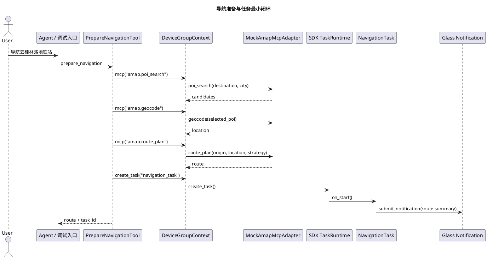

# Navigation 导航准备与任务最小闭环实施文档

## 1. 需求理解

导航能力对应第一期第二阶段 Phase H 的最小闭环：用户提出目的地后，业务 Tool 通过 SDK 统一 MCP 入口调用地图能力，得到结构化路线，并把路线沉淀为 SDK 托管 `navigation_task`。本轮在原有路线准备基础上补齐 POI 候选、地理编码和路线确认输入，并为 Phase L 导航执行期接入最小视觉事件策略。

## 2. 实现边界

当前实现只做业务能力层：

1. 业务代码放在 `capabilities/navigation`。
2. AMap mock adapter 通过 `sdk.register_mcp_adapter(...)` 注册。
3. `PrepareNavigationTool` 只通过 `context.mcp(...)` 调用 `amap.poi_search`、`amap.geocode` 和 `amap.route_plan`，不直接 import SDK 内部 gateway 或 adapter。
4. `NavigationTask` 只使用 `TaskContext` 和 `context.device_group.submit_notification(...)`。
5. 宿主入口 `host/server/main.py` 只做装配注册。

本轮不做：

1. 不修改 `openaiglass-sdk`。
2. 不直接处理 WebSocket、设备绑定表、MCP gateway 构造和 agent trace 细节。
3. 不接真实 AMap key，不实现复杂最后 10 米策略。

## 3. 实现方案

### 3.1 MCP Adapter

`MockAmapMcpAdapter` 提供三个 mock MCP 方法：

1. `amap.poi_search`：根据关键词返回候选 POI。
2. `amap.geocode`：把选中的 POI 或地址解析为经纬度。
3. `amap.route_plan`：返回路线摘要、距离、耗时和步骤。

用途：为离线回放和 SDK MCP 入口验证提供稳定替身。真实 AMap key/config 当前未接入，后续真实联调应以业务侧 adapter 替换 mock adapter。

### 3.2 Tool

`PrepareNavigationTool`：

1. 工具名：`prepare_navigation`。
2. 校验 `destination`。
3. 调用 `context.mcp("amap.poi_search", ...)` 获取候选。
4. 如 `require_confirmation=true` 且没有 `selected_poi_id`，返回候选列表并等待用户确认。
5. 选定 POI 后调用 `amap.geocode` 和 `amap.route_plan`。
6. MCP 成功后按需创建 `navigation_task`。
7. 返回候选、路线和任务编号。

### 3.3 Task

`NavigationTask`：

1. `on_start` 保存路线，进入 `prepared` 状态并提交通知。
2. `on_event` 支持 `navigation.progress`、`navigation.arrived` 和 `phone.vision.traffic_light.result`。
3. `on_cancel` 进入 `cancelled` 并提交通知。
4. 视觉事件只做最小策略：红灯、黄灯高优先级提醒，绿灯恢复导航提示，同一信号重复事件会去重。

## 4. 流程图



## 5. 自动化测试方案

新增场景：

1. `testdata/scenario/navigation_prepare_basic.json`
2. `testdata/scenario/navigation_progress_arrived.json`
3. `testdata/scenario/navigation_missing_destination.json`
4. `testdata/scenario/navigation_poi_confirmation_required.json`
5. `testdata/scenario/navigation_selected_poi.json`
6. `testdata/scenario/navigation_visual_traffic_light.json`

测试目标：

1. Tool 通过 SDK MCP 入口得到路线。
2. MCP trace 中能看到 `amap.poi_search`、`amap.geocode`、`amap.route_plan`。
3. 路线成功时创建 `navigation_task` 并进入 `prepared`。
4. 进展和到达事件能推进任务并提交通知。
5. 缺少目的地时返回结构化 Tool 错误，且不创建任务。
6. 需要用户确认时返回候选 POI，不创建任务。
7. 红绿灯视觉事件能驱动导航任务提交去重后的过街提醒。

回归命令：

```bash
python -m compileall capabilities host/server/main.py
uv run openaiglass.sdk.preflight --report logs/sdk-preflight-current.json
```

## 6. 跨设备联调方案

当前导航准备链路不依赖手机视觉；导航执行期最小策略会接收红绿灯视觉事件。真机联调时按以下顺序：

1. 启动服务端：`uv run openaiglass.server.run --app-module host.server.main --app-root openaiglass-for-blind`
2. 启动 iOS 手机端 SDK 运行时，确认手机注册和绑定状态。
3. 启动 ESP32 眼镜端 SDK 运行时，确认眼镜注册和心跳。
4. 通过语音或调试入口触发 `prepare_navigation`。
5. 如需验证执行期策略，触发红绿灯识别或通过调试入口发送 `phone.vision.traffic_light.result`。
6. 服务端观察 MCP trace、任务创建、`navigation_task` 状态、视觉事件和通知记录。
7. 眼镜端观察路线准备通知和红绿灯提示播报。

## 7. 当前实现进展

已完成：

1. 导航业务目录和 README。
2. `MockAmapMcpAdapter`。
3. `PrepareNavigationTool`。
4. `NavigationTask`。
5. 宿主装配。
6. 设备级回放和 SDK 预检说明。
7. POI 候选、路线确认输入和视觉事件最小策略。

未完成：

1. 真实 AMap adapter 和真实 key/config。
2. 真实多轮 Agent 澄清话术。
3. 真实 iOS 红绿灯插件与导航任务的端到端联合验证。
4. 复杂最后 10 米策略。
5. 真机端到端联调。

## 8. 开发后测试结果

已执行：

```bash
python -m compileall capabilities host/server/main.py
uv run openaiglass.sdk.preflight --report logs/sdk-preflight-current.json
```

结果：

1. 编译检查通过。
2. 组件级场景回放入口已删除；当前统一使用 `glass-playback`、`phone-mock` 和 SDK 预检做设备级验证。
3. 当前视频链路公开装配能力仍是 SDK 阻塞点，详见 [架构阻塞点说明与改进建议.md](./架构阻塞点说明与改进建议.md)。
