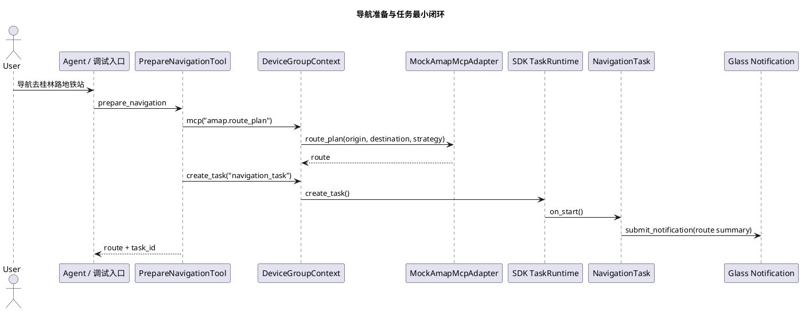

# Navigation 导航准备与任务最小闭环实施文档

## 1. 需求理解

导航能力对应第一期第二阶段 Phase H 的最小闭环：用户提出目的地后，业务 Tool 通过 SDK 统一 MCP 入口调用地图能力，得到结构化路线，并把路线沉淀为 SDK 托管 `navigation_task`。本轮目标是验证 `sdk-v3` 对业务 MCP 调用入口的支持，不进入真实地图 API、手机视觉协同和最后 10 米引导。

## 2. 实现边界

当前实现只做业务能力层：

1. 业务代码放在 `capabilities/navigation`。
2. AMap mock adapter 通过 `sdk.register_mcp_adapter(...)` 注册。
3. `PrepareNavigationTool` 只调用 `context.mcp("amap.route_plan", ...)`，不直接 import SDK 内部 gateway 或 adapter。
4. `NavigationTask` 只使用 `TaskContext` 和 `context.device_group.submit_notification(...)`。
5. 宿主入口 `host/server/main.py` 只做装配注册。

本轮不做：

1. 不修改 `openaiglass-sdk`。
2. 不直接处理 WebSocket、设备绑定表、MCP gateway 构造和 agent trace 细节。
3. 不接真实 AMap key，不实现导航执行期视觉策略。

## 3. 实现方案

### 3.1 MCP Adapter

`MockAmapMcpAdapter` 提供 `amap.route_plan`：

1. 输入：`origin`、`destination`、`strategy`。
2. 输出：路线摘要、距离、耗时和步骤。
3. 用途：为离线回放和 SDK MCP 入口验证提供稳定替身。

### 3.2 Tool

`PrepareNavigationTool`：

1. 工具名：`prepare_navigation`。
2. 校验 `destination`。
3. 调用 `context.mcp("amap.route_plan", ...)`。
4. MCP 成功后按需创建 `navigation_task`。
5. 返回路线和任务编号。

### 3.3 Task

`NavigationTask`：

1. `on_start` 保存路线，进入 `prepared` 状态并提交通知。
2. `on_event` 支持 `navigation.progress` 和 `navigation.arrived`。
3. `on_cancel` 进入 `cancelled` 并提交通知。

## 4. 流程图



## 5. 自动化测试方案

新增场景：

1. `testdata/scenario/navigation_prepare_basic.json`
2. `testdata/scenario/navigation_progress_arrived.json`
3. `testdata/scenario/navigation_missing_destination.json`

测试目标：

1. Tool 通过 SDK MCP 入口得到路线。
2. MCP trace 中能看到 `amap.route_plan`。
3. 路线成功时创建 `navigation_task` 并进入 `prepared`。
4. 进展和到达事件能推进任务并提交通知。
5. 缺少目的地时返回结构化 Tool 错误，且不创建任务。

回归命令：

```bash
python -m compileall capabilities host/server/main.py
uv run python scripts/run_sdk_scenario.py --validate-scenarios testdata/scenario --pretty
uv run python scripts/run_sdk_scenario.py --scenario-dir testdata/scenario --pretty
```

## 6. 跨设备联调方案

当前导航最小闭环不依赖手机视觉和眼镜新增硬件能力。真机联调时按以下顺序：

1. 启动服务端：`LOG_LEVEL=DEBUG bash openaiglass-for-blind/scripts/run_server.sh`
2. 启动 iOS 手机端 SDK 运行时，确认手机注册和绑定状态。
3. 启动 ESP32 眼镜端 SDK 运行时，确认眼镜注册和心跳。
4. 通过语音或调试入口触发 `prepare_navigation`。
5. 服务端观察 MCP trace、任务创建、`navigation_task` 状态和通知记录。
6. 眼镜端观察路线准备通知播报。

## 7. 当前实现进展

已完成：

1. 导航业务目录和 README。
2. `MockAmapMcpAdapter`。
3. `PrepareNavigationTool`。
4. `NavigationTask`。
5. 宿主装配和场景回放处理器。
6. 三个离线回放场景。

未完成：

1. 真实 AMap adapter。
2. 路线候选澄清和用户确认多轮对话策略。
3. 手机视觉协同接入导航执行期。
4. 真机端到端联调。

## 8. 开发后测试结果

已执行：

```bash
python -m compileall capabilities host/server/main.py
uv run python scripts/run_sdk_scenario.py --validate-scenarios testdata/scenario --pretty
uv run python scripts/run_sdk_scenario.py --scenario-dir testdata/scenario --pretty
uv run python scripts/run_sdk_preflight.py --report logs/sdk-preflight-current.json
```

结果：

1. 编译检查通过。
2. 场景校验通过：12 / 12。
3. 场景回放通过：12 / 12。
4. SDK 预检通过：9 / 9。
