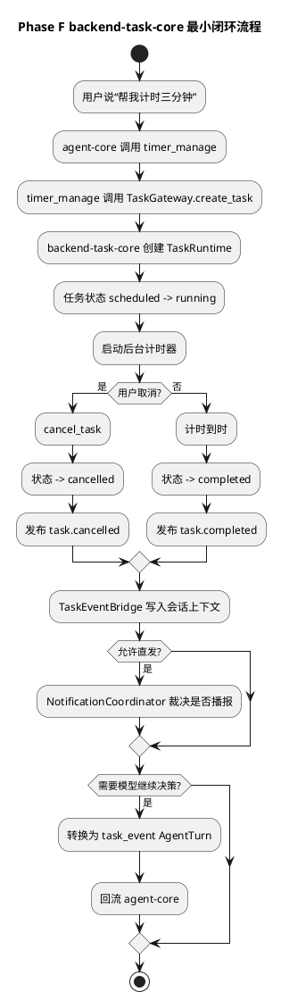
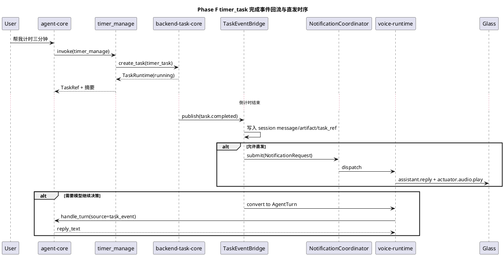

# Phase F backend-task-core 最小闭环实施文档

## 1. 需求理解

本阶段目标对应 [第二阶段第4-8项开发落地计划.md](/Users/elio/dev/llm-project/OpenAIglassesDemo_2/doc/stage1/plan/第二阶段第4-8项开发落地计划.md) 的 Phase F，核心是把 Phase E 中仅用于占位的最小 `TaskGateway` 升级为可运行、可查询、可取消、可回流对话链路的 `backend-task-core` 最小闭环。

本阶段必须交付：

1. 落地 `TaskRegistry / TaskContextStore / TaskStateMachine / TaskEventBus / TaskGateway` 的最小真实实现。
2. 落地 `timer_task`，支持创建、查询、取消、完成事件。
3. 把 `TaskEvent` 同步到会话上下文，并在需要时回流 `agent-core`。
4. 建立统一通知协调最小闭环，支持：
   - 去重
   - 排队
   - 高优先级抢占
   - 任务事件直发与回流并存
5. 补齐自动化测试与联调说明。

补充说明：

1. 当前主链路完全基于 `Tool + backend-task-core + MCP` 的现有架构推进。
2. Phase F 只要求达到“最小闭环验收”，不要求一次性补齐持久化、暂停恢复、多任务模板和跨端任务调度。

## 2. 现状分析

Phase E 完成后，仓库已有如下基础：

1. `agent-core` 已经具备统一 Tool 调用面，`timer_manage` 已能通过 `TaskGateway` 发起创建、查询和取消。
2. `TaskGateway` northbound 接口已经稳定，`agent-core` 不需要再感知内部状态机细节。
3. `voice-runtime -> agent-core -> voice-runtime` 的对话主链路已能承接普通工具调用结果。

但进入 Phase F 前，主要缺口是：

1. `backend-task-core` 仍然缺少真实生命周期管理，无法把后台任务从“同步函数调用”升级为“持续运行对象”。
2. 任务完成后还没有统一的事件总线与桥接链路，结果容易停留在后台线程里。
3. 没有统一通知裁决器时，`backend-task-core` 与 `agent-core` 容易重复播报。
4. 眼镜端播报一旦被高优先级事件打断，旧流和新流之间缺少显式停止协议。
5. 当前架构里已经明确 `agent-core` 与 `backend-task-core` 平级，但代码层还需要把这条边界真正落下来。

## 3. 实现方案描述

### 3.1 总体策略

本次实现遵循以下策略：

1. 保持 `agent-core` 与 `backend-task-core` 平级，模型只通过高层任务管理工具调用任务运行时。
2. 先做“内存态但真实运行”的最小闭环，不提前引入数据库持久化和分布式调度。
3. 所有任务结果先固定为结构化 `TaskEvent`，再决定是否回流 `agent-core` 或直发设备。
4. 通知协调逻辑放在运行时共享层，不让 `backend-task-core` 和 `agent-core` 各自维护一套播报策略。
5. 高优先级抢占必须走显式协议，不只停留在服务端本地状态切换。

### 3.2 本阶段新增与补齐模块

本阶段新增或补齐：

1. `openaiglass-sdk/server-python/backend_task_core/models.py`
2. `openaiglass-sdk/server-python/backend_task_core/event_bus.py`
3. `openaiglass-sdk/server-python/backend_task_core/store.py`
4. `openaiglass-sdk/server-python/backend_task_core/state_machine.py`
5. `openaiglass-sdk/server-python/backend_task_core/registry.py`
6. `openaiglass-sdk/server-python/backend_task_core/gateway.py`
7. `openaiglass-sdk/server-python/runtime/task_event_bridge.py`
8. `openaiglass-sdk/server-python/runtime/notifications.py`
9. `openaiglass-sdk/server-python/runtime/voice_runtime.py`
10. `openaiglass-sdk/server-python/api/ws/control_runtime.py`
11. `openaiglass-sdk/glass-esp32/main/glass_main.c`

关键职责如下：

1. `TaskSpec / TaskRuntime / TaskEvent`
   - 固定任务模板、任务实例、任务事件三类对象。
2. `TaskRegistry`
   - 管理已注册任务模板。
   - 当前最小模板为 `timer_task`。
3. `TaskContextStore`
   - 保存任务实例运行态。
   - 承接查询与状态更新。
4. `TaskStateMachine`
   - 统一校验状态迁移。
5. `TaskEventBus`
   - 发布和订阅结构化任务事件。
6. `InMemoryTaskGateway`
   - 对上提供创建、查询、取消。
   - 对下驱动定时器线程与事件发布。
7. `TaskEventBridge`
   - 把 `TaskEvent` 写入会话上下文。
   - 生成 `NotificationRequest`。
   - 在需要时转换为 `AgentTurn`。
8. `NotificationCoordinator`
   - 统一处理去重、排队、抢占和完成后放行下一条通知。
9. `VoiceRuntime`
   - 连接任务事件、通知协调、播放编排和 `agent-core` 回流主路径。
10. 眼镜端 `actuator.audio.interrupt / actuator.audio.state`
   - 承接显式打断播报。
   - 回传 `completed / interrupted / failed` 三类终态。

### 3.3 Task Runtime 最小闭环

当前 `backend-task-core` 最小闭环如下：

1. `create_task(task_type="timer_task")`
   - 校验参数
   - 创建 `TaskRuntime(state="scheduled")`
   - 立即推进到 `running`
   - 启动后台 `threading.Timer`
2. `query_task(task_id)`
   - 返回当前任务实例快照
3. `cancel_task(task_id)`
   - 取消活动计时器
   - 推进到 `cancelled`
   - 发布 `task.cancelled`
4. 定时器到时
   - 推进到 `completed`
   - 发布 `task.completed`

当前已落地状态：

1. `scheduled`
2. `running`
3. `completed`
4. `cancelled`

补充说明：

1. `waiting_external / failed / timeout / paused / resumed` 仍保留在架构和对象模型层面，但当前最小模板 `timer_task` 尚未完整覆盖。
2. 这不影响第 8 项的一期最小闭环验收，但会成为后续 `navigation_task` 的前置补强项。

### 3.4 任务事件回流与通知协调

当前任务事件处理链路如下：

1. `InMemoryTaskGateway` 发布 `TaskEvent`
2. `AgentFacade` 绑定到 `VoiceRuntime.on_task_event`
3. `TaskEventBridge.handle_event`
   - 写入 `AgentSessionStore`
   - 生成 `task_notification` 消息
   - 生成 `task_event` 派生结果
4. 若允许直发：
   - 生成 `NotificationRequest`
   - 交给 `NotificationCoordinator`
5. 若要求模型继续决策：
   - `TaskEventBridge.convert_event_to_agent_turn`
   - 转成 `source="task_event"` 的 `AgentTurn`
   - 异步交给 `agent-core`

通知协调策略当前已实现：

1. 重复通知去重
2. 同设备串行排队
3. 完成后放行下一条
4. 高优先级通知抢占当前低优先级通知
5. 直发旁路与 `agent-core` 回流共存

### 3.5 显式播放打断与终态回传

为了让抢占不是单纯的服务端本地语义，本阶段继续补齐了显式播报中断协议：

1. 服务端高优先级抢占时会下发 `actuator.audio.interrupt`
2. 眼镜端收到后会打断当前 HTTP 播放任务
3. 眼镜端播放任务结束时会统一回传：
   - `actuator.audio.state(state=completed|interrupted|failed, reason=...)`
   - `actuator.audio.finished`
4. 服务端运行态会记录：
   - `last_playback_stream_id`
   - `last_playback_state`
   - `last_playback_reason`

这一步虽然是通知链路的补强，但它直接服务于 Phase F 的任务完成通知闭环，因此纳入本阶段实施文档。

### 3.6 与当前架构边界的关系

本阶段实现后，边界已经明确为：

1. `agent-core`
   - 负责理解用户意图
   - 负责调用 `timer_manage`
   - 负责在 `task_event` 回流后继续自然语言决策
2. `backend-task-core`
   - 负责任务生命周期
   - 负责事件发布
   - 不直接做自然语言决策
3. `voice-runtime`
   - 负责把任务事件桥接到会话、通知和设备播报编排
   - 不直接承担任务生命周期管理

## 4. 流程图（PlantUML）



## 5. 时序图（PlantUML）



## 6. 自动化测试方案

### 6.1 单元测试

当前已覆盖：

1. `server/test/unit/test_backend_task_core.py`
   - `timer_task` 创建、完成事件
   - 取消后不再收到完成事件
2. `server/test/unit/test_task_event_runtime.py`
   - `TaskEventBridge` 会话同步
   - 通知去重
   - 排队放行
   - 抢占当前通知
   - `TaskEvent -> AgentTurn`
   - 抢占时发送 `actuator.audio.interrupt`
3. `server/test/unit/test_voice_runtime.py`
   - 迟到的被打断旧流收尾会被忽略
   - `actuator.audio.state` 会写入运行态快照
   - `finished` 不会覆盖已收到的结构化终态

### 6.2 集成测试

当前已覆盖：

1. `server/test/integration/test_control_register_flow.py`
   - 结构化播放终态 `actuator.audio.state` 可见于运行态快照
   - 控制链路、抓拍链路保持正常
2. `server/test/integration/test_agent_phase_e_flow.py`
   - 验证 Phase E/F 共用的 `agent-core` 主链路未被破坏

### 6.3 执行命令

```bash
PYTHONPATH=openaiglass-sdk/server-python uv run python -m unittest \
  server.test.unit.test_voice_runtime \
  server.test.unit.test_task_event_runtime \
  server.test.unit.test_backend_task_core \
  server.test.unit.test_agent_core \
  server.test.integration.test_control_register_flow \
  server.test.integration.test_agent_phase_e_flow -v
```

## 7. 当前方案与架构设计的契合程度

当前方案与 [软件架构设计.md](/Users/elio/dev/llm-project/OpenAIglassesDemo_2/doc/restriction/软件架构设计.md)、[backend-task-core设计.md](/Users/elio/dev/llm-project/OpenAIglassesDemo_2/doc/structure-design/backend-task-core设计.md)、[agent-core与backend-task-core通知协调设计.md](/Users/elio/dev/llm-project/OpenAIglassesDemo_2/doc/structure-design/agent-core与backend-task-core通知协调设计.md) 的契合情况如下：

1. 已严格保持 `agent-core` 与 `backend-task-core` 平级，模型不直接感知任务模板。
2. 已按架构要求形成 `TaskEvent` 结构化回流链路，而不是让后台线程直接拼自然语言。
3. 已引入统一通知协调器，避免 `agent-core` 与 `backend-task-core` 各自维护一套通知逻辑。
4. 已补上显式播报打断协议 `actuator.audio.interrupt` 和结构化播报终态 `actuator.audio.state`，符合第一批核心消息设计。

仍与详细架构设计存在的差距：

1. 当前仍是内存态实现，未接持久化存储。
2. `TaskManager / TaskScheduler / TaskExecutor` 还没有完全拆成独立模块，当前最小闭环仍主要收敛在 `InMemoryTaskGateway`。
3. 仅 `timer_task` 真正落地，`navigation_task` 等复杂模板仍待后续阶段推进。
4. `waiting_external / timeout / pause / resume` 还没有在真实模板中完整覆盖。

架构改进建议：

1. 进入导航任务前，应先把 `TaskManager / TaskScheduler / TaskExecutor` 从 `InMemoryTaskGateway` 中拆出，避免复杂模板继续堆进同一网关类。
2. 应在后续阶段把 `actuator.audio.state` 进一步纳入任务事件上下文，避免端侧播报失败只停留在运行态快照中。

## 8. 开发后测试结果

本阶段文档补齐时，已执行如下自动化测试命令：

```bash
PYTHONPATH=openaiglass-sdk/server-python uv run python -m unittest \
  server.test.unit.test_voice_runtime \
  server.test.unit.test_task_event_runtime \
  server.test.unit.test_backend_task_core \
  server.test.unit.test_agent_core \
  server.test.integration.test_control_register_flow \
  server.test.integration.test_agent_phase_e_flow -v
```

结果：

1. 共运行 `50` 个测试。
2. 全部通过。
3. 当前环境缺少 `idf.py`，因此未在本机完成眼镜端固件编译校验。

## 9. 当前实现进展

当前实现状态：

1. Phase F 的最小闭环已经完成，并且已超出原计划中的“仅计时器创建/查询/取消”范围。
2. 已完成：
   - `timer_task` 最小闭环
   - 任务事件回流会话
   - 任务事件回流 `agent-core`
   - 通知去重、排队、抢占
   - 显式播报打断协议
   - 结构化播报终态回传
3. 尚未完成：
   - 任务持久化
   - 多任务模板
   - 复杂调度器
   - `waiting_external / timeout / pause / resume` 的真实闭环
4. 当前已可以把第 8 项视为“一期最小验收已通过，后续仍需继续工程化加强”。
