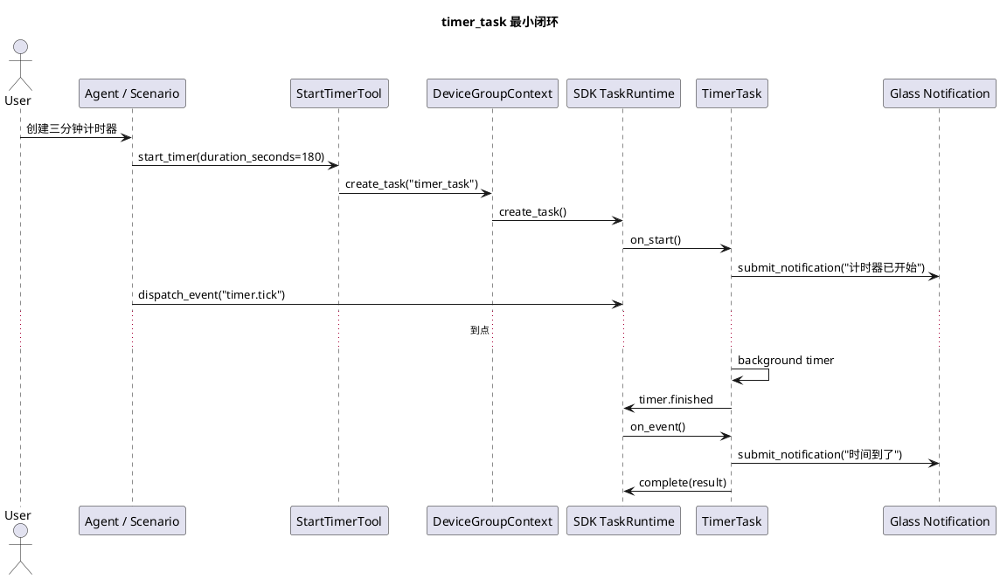

# Phase F timer_task 最小闭环实施文档

## 1. 目标

Phase F 的目标是用真实业务能力验证 SDK `backend-task-core`：业务侧只实现 `start_timer` Tool 和 `timer_task`，计时器创建、状态查询、取消、事件分发和完成通知都走 SDK 托管任务运行时。

当前实现为了验证自然到点效果，在业务侧 `timer_task` 内使用轻量 `threading.Timer` 触发完成事件；任务仍由 SDK 创建、查询、取消和保存状态。严格的生产级定时调度、进程重启恢复、多实例租约，以及“到点事件必须先回流 Agent 决策”仍需要 SDK 提供公共能力。

## 2. 实现范围

代码目录：

1. `capabilities/timer/server/tool.py`
2. `capabilities/timer/server/task.py`
3. `capabilities/timer/README.md`
4. `host/server/main.py`

能力注册：

1. `StartTimerTool` 注册为 `start_timer`。
2. `TimerTask` 注册为 `timer_task`。
3. 不再注册组件级场景处理器；设备级回放统一由 `glass-playback` 和 SDK 测试工具承载。

## 3. 业务行为

`start_timer`：

1. 输入 `duration_seconds`、`label`、`notify_text`。
2. 校验 `duration_seconds > 0`。
3. 通过 `context.create_task("timer_task", ...)` 创建 SDK 托管任务。
4. 返回 `task_id`、任务状态和任务数据。

`timer_task`：

1. `on_start` 进入 `running`，记录总时长和剩余时长，并提交启动通知。
2. `timer.tick` 更新 `remaining_seconds`。
3. `enable_background_timer=true` 时，业务侧轻量倒计时会在到点后触发 `timer.finished`。
4. `timer.finished` 提交完成通知并 `complete`。
5. `on_cancel` 进入 `cancelled`、取消后台倒计时并提交取消通知。

## 4. 流程图



## 5. 场景覆盖

新增场景：

1. `testdata/scenario/timer_finished.json`：成功创建并通过 `timer.finished` 完成。
2. `testdata/scenario/timer_cancelled.json`：创建后通过 `task.cancel` 取消。
3. `testdata/scenario/timer_invalid_duration.json`：非法时长返回结构化 Tool 错误。
4. `testdata/scenario/timer_running_tick.json`：通过 `timer.tick` 推进剩余时间，任务保持运行态。

测试目标：

1. 成功路径能创建 SDK 托管任务并完成通知。
2. 失败路径不创建任务，返回 `invalid_input`。
3. 取消路径能进入 `cancelled` 并通知用户。
4. 事件推进路径能更新任务数据，便于后续查询。
5. 后台倒计时到点后任务能进入 `completed` 并提交通知。

## 6. 联调说明

真机联调时，计时器不依赖手机视觉插件。推荐流程：

1. 启动业务服务端并打开 DEBUG 日志。
2. 启动眼镜端，确认控制连接、心跳和通知播放链路可用。
3. 通过语音或调试入口触发 `start_timer`。
4. 服务端观察 `timer_task` 创建、状态变化和通知记录。
5. 眼镜端观察启动通知、取消通知或完成通知。

当前业务侧倒计时只服务最小验证，不具备进程重启恢复和多实例防重能力。真实时间推进如果需要由 SDK 统一调度，应由 SDK 团队提供通用定时事件能力后再接入。

## 7. 当前测试结果

建议执行：

```bash
python -m compileall capabilities host/server/main.py
uv run openaiglass.sdk.preflight --report logs/sdk-preflight-current.json
```

当前组件级场景回放入口已删除；后续统一使用 `glass-playback`、`phone-mock` 和 SDK 预检做设备级验证。

本轮已执行：

```bash
PYTHONPATH=openaiglass-sdk/server-python:openaiglass-for-blind:. uv run python -m pytest openaiglass-for-blind/tests/test_capabilities_unit.py -q
```

结果：通过，覆盖后台倒计时自然完成路径。
