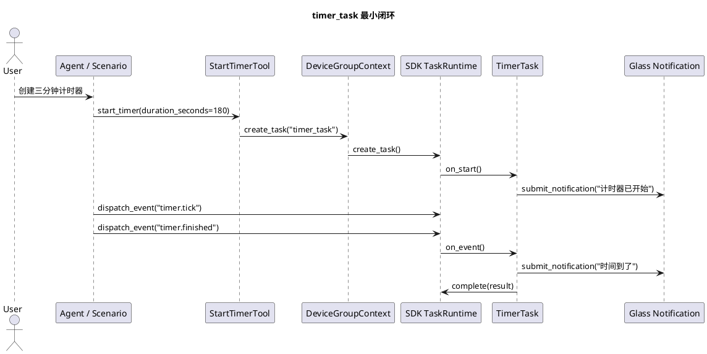

# Phase F timer_task 最小闭环实施文档

## 1. 目标

Phase F 的目标是用真实业务能力验证 SDK `backend-task-core`：业务侧只实现 `start_timer` Tool、`timer_task` 和离线回放处理器，计时器创建、状态查询、取消、事件分发和完成通知都走 SDK 托管任务运行时。

本实现不在业务侧创建线程，不绕过 SDK 任务运行时。计时结束由离线回放时间轴或未来真实运行时事件触发。

## 2. 实现范围

代码目录：

1. `capabilities/timer/server/tool.py`
2. `capabilities/timer/server/task.py`
3. `capabilities/timer/scenario.py`
4. `capabilities/timer/README.md`
5. `host/server/main.py`

能力注册：

1. `StartTimerTool` 注册为 `start_timer`。
2. `TimerTask` 注册为 `timer_task`。
3. `build_timer_scenario_handler()` 注册为 `timer` 场景处理器。

## 3. 业务行为

`start_timer`：

1. 输入 `duration_seconds`、`label`、`notify_text`。
2. 校验 `duration_seconds > 0`。
3. 通过 `context.create_task("timer_task", ...)` 创建 SDK 托管任务。
4. 返回 `task_id`、任务状态和任务数据。

`timer_task`：

1. `on_start` 进入 `running`，记录总时长和剩余时长，并提交启动通知。
2. `timer.tick` 更新 `remaining_seconds`。
3. `timer.finished` 提交完成通知并 `complete`。
4. `on_cancel` 进入 `cancelled` 并提交取消通知。

## 4. 流程图



## 5. 场景覆盖

新增场景：

1. `testdata/scenario/timer_finished.json`：成功创建并通过 `timer.finished` 完成。
2. `testdata/scenario/timer_cancelled.json`：创建后通过 `task.cancel` 取消。
3. `testdata/scenario/timer_invalid_duration.json`：非法时长返回结构化 Tool 错误。
4. `testdata/scenario/timer_running_tick.json`：通过 `timer.tick` 推进剩余时间，任务保持运行态。

测试目标：

1. 成功路径能创建 SDK 托管任务并完成通知。
2. 失败路径不创建任务，返回 `invalid_input`。
3. 取消路径能进入 `cancelled` 并通知用户。
4. 事件推进路径能更新任务数据，便于后续查询。

## 6. 联调说明

真机联调时，计时器不依赖手机视觉插件。推荐流程：

1. 启动业务服务端并打开 DEBUG 日志。
2. 启动眼镜端，确认控制连接、心跳和通知播放链路可用。
3. 通过语音或调试入口触发 `start_timer`。
4. 服务端观察 `timer_task` 创建、状态变化和通知记录。
5. 眼镜端观察启动通知、取消通知或完成通知。

当前业务侧没有私建计时线程。真实时间推进如果需要由 SDK 统一调度，应由 SDK 团队提供通用定时事件能力后再接入。

## 7. 当前测试结果

已通过新增场景定向回放：

```bash
PYTHONPATH=../openaiglass-sdk/server-python:. ../.venv/bin/python scripts/run_sdk_scenario.py --scenario testdata/scenario/timer_finished.json --pretty
PYTHONPATH=../openaiglass-sdk/server-python:. ../.venv/bin/python scripts/run_sdk_scenario.py --scenario testdata/scenario/timer_cancelled.json --pretty
PYTHONPATH=../openaiglass-sdk/server-python:. ../.venv/bin/python scripts/run_sdk_scenario.py --scenario testdata/scenario/timer_invalid_duration.json --pretty
PYTHONPATH=../openaiglass-sdk/server-python:. ../.venv/bin/python scripts/run_sdk_scenario.py --scenario testdata/scenario/timer_running_tick.json --pretty
```
