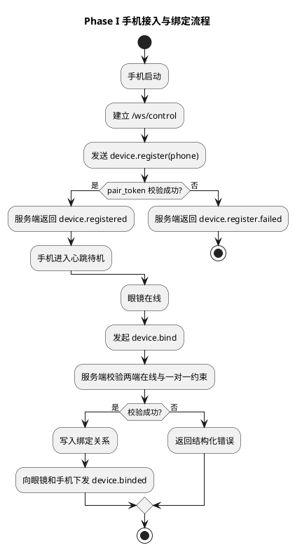
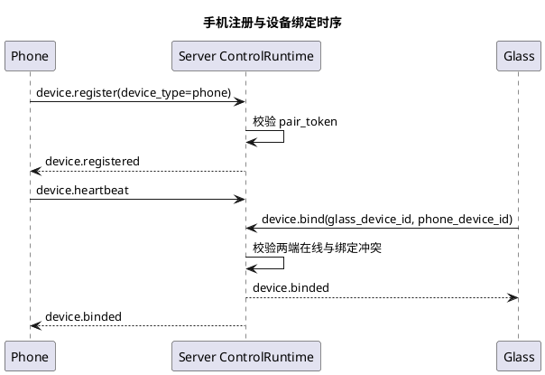

# Phase I 手机接入与绑定实施文档

## 1. 需求理解

本阶段目标对应第三阶段计划中的 Phase I，核心是把手机从“占位入口”升级为可接入当前系统的真实设备，并完成眼镜与手机一对一绑定的最小闭环。

本阶段必须交付：

1. 手机端可通过控制连接向服务端注册。
2. 服务端运行态可同时维护 `glass` 与 `phone` 两类设备。
3. 服务端支持建立眼镜与手机的一对一绑定关系。
4. 服务端可对绑定关系做查询，并在运行态接口中体现。
5. 自动化测试覆盖手机注册、绑定建立、重复绑定与离线解绑等关键路径。

本阶段不要求：

1. 手机端接入视频流或视觉算法。
2. 手机端本地任务中心完整实现。
3. 眼镜与手机直连视频链路。
4. Agent 直接通过 Tool 创建绑定关系。

当前目标是先把“手机成为系统内正式设备”这件事做对。

## 2. 现状分析

当前仓库在本次实现前已有如下基础：

1. 服务端 `ControlRuntime` 已支持设备通过 `/ws/control` 建立控制连接并发送 `device.register`。
2. 注册成功后，服务端会记录 `device_id -> ControlConnection`，并自动为设备打开语音会话。
3. `device_type` 字段已经存在于协议模型中，但服务端行为仍默认围绕眼镜设备设计。
4. 眼镜端已实现真实注册链路。
5. 手机端当前只有 [openaiglass-for-blind/host/phone/src/main.py](/Users/elio/dev/llm-project/OpenAIglassesDemo_2/openaiglass-for-blind/host/phone/src/main.py) 这个待机入口，还没有真实接入逻辑。

主要缺口如下：

1. 服务端当前对所有注册成功设备都自动下发 `voice.session.open`，这不适用于手机设备。
2. 服务端 `_device_endpoint()` 当前固定返回 `glass-api` 模块名，不适用于 `phone-api`。
3. 运行态快照里没有设备类型，也没有绑定关系信息。
4. 当前没有 `device.bind` 的消息处理逻辑，也没有绑定状态存储。
5. 当时手机端没有最小 WebSocket 控制连接实现，因此无法参与三端联调。

结论：

1. 当前协议基础足够支撑本阶段最小改造。
2. 本阶段重点不是重写架构，而是把现有控制面从“只支持眼镜”推广到“支持多设备类型”。

## 3. 实现方案描述

### 3.1 总体策略

本次实现遵循以下策略：

1. 继续沿用现有 `/ws/control + ControlMessage` 控制面，不新增临时接入协议。
2. 手机设备仍使用 `device.register / device.heartbeat`，不为手机单独发明注册模型。
3. 绑定能力通过新的控制消息 `device.bind` 实现，先由测试或脚本触发，不强依赖 Agent。
4. 绑定关系采用内存态最小存储，先满足运行态查询和后续任务依赖。
5. 眼镜设备注册后仍自动开语音会话；手机设备注册后只进入待机在线态，不自动开语音会话。

### 3.2 服务端改造

本阶段服务端主要改造 [openaiglass-sdk/server-python/api/ws/control_runtime.py](/Users/elio/dev/llm-project/OpenAIglassesDemo_2/openaiglass-sdk/server-python/api/ws/control_runtime.py)。

关键变更如下：

1. 注册链路按 `device_type` 分支处理：
   - `glass`：保持现有行为，注册成功后自动下发 `voice.session.open`
   - `phone`：注册成功后只返回 `device.registered`
2. `_device_endpoint()` 根据设备类型返回正确模块名：
   - `glass -> glass-api`
   - `phone -> phone-api`
3. 新增绑定状态存储：
   - `glass_to_phone`
   - `phone_to_glass`
4. 新增 `device.bind` 控制消息处理：
   - 校验发起方必须为服务端或已注册设备
   - 校验目标眼镜和手机都在线
   - 校验一对一绑定约束
   - 成功后向相关设备下发 `device.binded` 通知
5. 控制连接关闭时自动清理绑定关系，避免运行态残留脏数据。
6. 运行态接口 `/api/runtime/devices` 增加：
   - 设备类型
   - 绑定关系快照

### 3.3 手机端改造

本阶段最初使用 [openaiglass-for-blind/host/phone/src/main.py](/Users/elio/dev/llm-project/OpenAIglassesDemo_2/openaiglass-for-blind/host/phone/src/main.py) 作为最小控制面客户端完成服务端联调；在后续阶段中，正式手机实现已切换为 iOS 原生应用 [GlassesVideoReceiver.xcodeproj](/Users/elio/dev/llm-project/OpenAIglassesDemo_2/openaiglass-sdk/phone-ios/GlassesVideoReceiver.xcodeproj)。

当前手机端关键变更如下：

1. iOS 应用启动后自动读取 [AppConfig.plist](/Users/elio/dev/llm-project/OpenAIglassesDemo_2/openaiglass-sdk/phone-ios/GlassesVideoReceiver/AppConfig.plist) 中的服务端控制地址、手机设备编号、配对令牌和目标眼镜编号。
2. iOS 应用前台运行时自动建立控制 WebSocket，并发送 `device.register(device_type=phone)`。
3. 手机注册成功后自动进入心跳循环，并在页面上实时显示注册状态。
4. 手机会通过 `desired_glass_device_id` 告诉服务端自己要绑定的眼镜，支持“手机先启动、眼镜后启动”和“眼镜先启动、手机后启动”两种自动绑定路径。
5. 如果服务端短暂不可用或注册失败，iOS 应用会每隔数秒自动重试，并在页面上显示重试状态和下一次重试时间。
6. [openaiglass-for-blind/host/phone/src/main.py](/Users/elio/dev/llm-project/OpenAIglassesDemo_2/openaiglass-for-blind/host/phone/src/main.py) 当前只保留为桌面协议调试工具，不再作为手机端正式交付物。

### 3.4 绑定消息模型

本阶段新增最小控制消息：

1. `device.bind`
   - 方向：客户端或服务端 -> 服务端
   - 用途：创建一条眼镜与手机的一对一绑定关系
2. `device.binded`
   - 方向：服务端 -> 眼镜 / 手机
   - 用途：通知绑定已生效

建议最小 payload：

```json
{
  "glass_device_id": "glass-001",
  "phone_device_id": "phone-001"
}
```

首版不实现：

1. 绑定确认双向握手
2. 持久化绑定
3. 多用户、多手机候选选择
4. 基于二维码或配对码的动态绑定

### 3.5 运行态与可观测性

为了便于后续三端联调，本阶段运行态快照需新增：

1. `connections[*].device_type`
2. `device_bindings`
   - `glass_to_phone`
   - `phone_to_glass`

这样后续 `phone_video_link_task`、视觉任务和导航任务都可以直接复用当前运行态信息。

## 4. 流程图（PlantUML）



## 5. 时序图（PlantUML）



## 6. 自动化测试方案

### 6.1 单元测试

1. 测试目标：验证设备类型到模块名映射正确  
测试方法：分别构造 `glass / phone`，检查 `_device_endpoint()` 返回的 `module`。  
预期结果：`glass -> glass-api`，`phone -> phone-api`。

2. 测试目标：验证绑定关系建立与冲突校验  
测试方法：创建模拟在线眼镜和手机，发起绑定与重复绑定。  
预期结果：首次绑定成功，重复冲突返回结构化错误。

3. 测试目标：验证连接关闭后绑定关系自动清理  
测试方法：先建立绑定，再关闭一端连接。  
预期结果：运行态中绑定关系被移除。

### 6.2 功能测试

1. 测试目标：验证手机设备可完成注册  
测试方法：启动服务端，使用测试客户端以 `device_type=phone` 注册。  
预期结果：收到 `device.registered`，且不会收到 `voice.session.open`。

2. 测试目标：验证眼镜与手机可建立绑定关系  
测试方法：同时注册眼镜和手机，发送 `device.bind`。  
预期结果：服务端运行态出现绑定关系，眼镜和手机都收到 `device.binded`。

3. 测试目标：验证手机离线后绑定关系自动失效  
测试方法：建立绑定后关闭手机连接。  
预期结果：运行态中的 `phone_to_glass / glass_to_phone` 同步清理。

## 7. 跨设备联调方案

本阶段联调建议如下：

1. 启动服务端
   - `PYTHONPATH=openaiglass-sdk/server-python uv run --python 3.11 python -m app.main`
2. 启动眼镜端
   - 继续沿用当前 `script/run_glass.sh`
3. 启动手机端
   - `uv run --python 3.11 python openaiglass-for-blind/host/phone/src/main.py --host 127.0.0.1 --port 8765 --device-id phone-001 --pair-token pair-phone-token`
4. 在当前真实主流程中，优先使用 iOS 应用完成自动注册与自动绑定；保留 `device.bind` 作为调试兜底入口

联调观察点：

1. 服务端运行态中设备类型是否正确。
2. 手机端是否只进入在线待机，而不进入语音会话。
3. 绑定成功后，眼镜端和手机端是否都收到 `device.binded`。
4. 手机先启动、眼镜后启动时，是否能够自动完成绑定。
5. 任一端断开后，绑定关系是否被及时清理。

## 8. 当前方案与架构设计的契合程度

契合度评估：高。

理由如下：

1. 本方案完全沿用现有 `ControlMessage` 作为统一控制语义承载。
2. 本方案没有破坏 `server-api / glass-api / phone-api` 的边界，而是在现有控制面上补齐手机设备这一缺失角色。
3. 本方案把绑定关系收敛到服务端维护，符合当前架构中“服务器统一协调设备关系”的方向。
4. 本方案没有提前引入视频流或视觉算法细节，保持了阶段边界清晰。

可改进点：

1. 当前绑定关系仍是内存态实现，后续如果需要跨重启保持关系，可能要升级到持久化存储。
2. 当前自动绑定依赖固定设备编号和预设配对关系，后续正式产品形态仍需要升级为用户可配置的配对入口。

## 9. 开发后测试结果

最近一次补充更新时间：2026-04-23。

已执行命令：

```bash
PYTHONPATH=openaiglass-sdk/server-python uv run --python 3.11 python -m unittest \
  server.test.integration.test_control_register_flow -v
```

结果汇总：

1. 历史 Phase I 集成测试共执行 9 个，全部通过。
2. 后续补充测试后，`server.test.integration.test_control_register_flow` 已扩展到 15 个，全部通过。
3. 本阶段及后续补充验证点已覆盖：
   - 手机注册成功且不自动打开语音会话
   - 眼镜与手机绑定关系建立
   - 手机离线后绑定关系自动清理
   - 手机先注册、眼镜后注册时自动绑定
   - 停止视频任务后保持手机在线与绑定关系
   - 调试停止接口在任务缺失时保持幂等

补充说明：

1. 当前本地局域网主流程已切换为“本地服务端 + iPhone 原生应用 + ESP32 眼镜真机”。
2. iOS 端自动化测试已通过，眼镜端已完成编译、烧录和串口联调。
3. 当前尚未补单独的 Phase I 联调说明文档，但第三阶段主流程已可支撑真机注册与自动绑定验证。

## 10. 当前实现进展

当前已完成：

1. 服务端支持 `phone` 设备通过 `device.register` 接入。
2. 服务端注册成功后可按设备类型区分行为：
   - `glass` 自动打开语音会话
   - `phone` 仅进入在线待机态
3. 服务端已支持最小 `device.bind / device.binded` 控制语义。
4. 服务端运行态快照已增加设备类型与绑定关系。
5. iOS 应用 [GlassesVideoReceiver.xcodeproj](/Users/elio/dev/llm-project/OpenAIglassesDemo_2/openaiglass-sdk/phone-ios/GlassesVideoReceiver.xcodeproj) 已承接手机正式接入能力，可完成注册、心跳、自动绑定和状态展示。
6. 手机端前台运行时已支持注册失败自动重试与状态可视化。
7. 当前本地服务端地址、手机端地址和眼镜端地址均已抽到独立配置文件，便于局域网切换。

当前未完成：

1. 绑定关系仍为内存态，服务重启后不会保留。
2. 手机侧正式交互式配对页面尚未落地，当前仍通过配置文件预置设备编号。
3. 手机端本地任务中心与视觉算法迁移不属于本阶段，仍待后续实现。
4. 尚未补充 Phase I 专门的联调说明文档。
