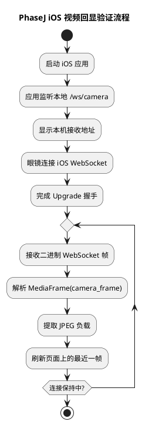
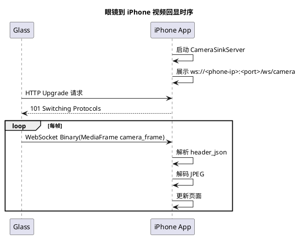

# PhaseJ iOS 视频回显验证实施文档

## 1. 需求理解

本次功能目标是在第三阶段现有“眼镜到手机真实视频数据面”基础上，将手机端正式实现从 Python 调整为 iOS 应用，并优先交付一条可真机验证的最小能力链路。

本次要完成的核心能力如下：

1. 手机端使用 iOS 原生应用启动本地视频接收服务。
2. iOS 应用监听 `/ws/camera`，接收眼镜推送的 WebSocket 二进制媒体帧。
3. iOS 应用解析 `MediaFrame(camera_frame)`，提取 JPEG 负载。
4. iOS 应用实时显示最近一帧图像，并展示接收状态、接收地址、帧序号等信息。
5. 当前阶段以“验证眼镜到手机连接建立成功”为主，不在本阶段引入手机端视觉算法。
6. 在近期实现中，iOS 应用还继续承担了手机最小控制面角色：注册、心跳、自动绑定、状态展示和停流请求。

本阶段必须交付：

1. 一个可编译、可安装到 iPhone 真机的最小 iOS 应用工程。
2. 一个原生视频回显页面，用于展示最近一帧 JPEG。
3. 对 `MediaFrame(camera_frame)` 的最小解析能力。
4. 自动化测试，覆盖媒体帧解析与 WebSocket 基础协议处理。

本阶段暂不要求：

1. 完整后台任务联动界面。
2. 手机端视觉检测算法迁移。
3. 长时间稳定性与性能优化。

## 2. 现状分析

当前仓库在本次实现前具备如下基础：

1. 眼镜端已经支持 `sensor.camera.stream.start / stop`。
2. 眼镜端已经支持通过 WebSocket 二进制发送 `MediaFrame(camera_frame)`。
3. 服务端已经支持 `phone_video_link_task`，并在任务启动时向眼镜下发开始推流控制消息。
4. 协议层已经定义统一 `MediaFrame` 格式。
5. 手机目录目前只有 [openaiglass-for-blind/host/phone/src/main.py](/Users/elio/dev/llm-project/OpenAIglassesDemo_2/openaiglass-for-blind/host/phone/src/main.py) 这类 Python 调试实现，不适合作为 iOS 真机交付物。

当前主要问题如下：

1. 手机正式交付形态与目标平台不一致。用户设备为 iPhone，Python 程序不能视为手机端正式实现。
2. 目前缺少一个可以直接安装到 iPhone 上的最小原生验证应用。
3. 当前真机联调缺少可视化反馈，无法快速确认眼镜到手机的视频链路是否真的打通。

结论：

1. 当前最合理的收敛方式是先补一个“iOS 视频回显验证 app”。
2. 这个 app 在近期实现中已经从“纯回显工具”扩展为“最小手机运行时入口”。
3. [openaiglass-for-blind/host/phone/src/main.py](/Users/elio/dev/llm-project/OpenAIglassesDemo_2/openaiglass-for-blind/host/phone/src/main.py) 当前只保留为桌面环境协议调试工具。

## 3. 实现方案描述

### 3.1 总体策略

本次实现采用“最小原生验证”策略：

1. 新增独立 iOS SwiftUI 工程。
2. iOS 应用内置一个最小 WebSocket 服务端，监听固定端口。
3. 眼镜端继续按现有协议主动连接手机端，并发送 `MediaFrame(camera_frame)`。
4. iOS 端收到帧后立即解码为 JPEG，并刷新界面。
5. 页面同时展示本机可连接地址，便于三端联调时填写或核对。
6. 在此基础上继续补控制面能力，使 iOS 应用前台运行时自动保持与服务端的注册和绑定。

### 3.2 iOS 应用结构

建议目录结构如下：

1. `openaiglass-sdk/phone-ios/GlassesVideoReceiver/`
2. `openaiglass-sdk/phone-ios/GlassesVideoReceiver/GlassesVideoReceiverApp.swift`
3. `openaiglass-sdk/phone-ios/GlassesVideoReceiver/ContentView.swift`
4. `openaiglass-sdk/phone-ios/GlassesVideoReceiver/Core/`
5. `openaiglass-sdk/phone-ios/GlassesVideoReceiver/Networking/`
6. `openaiglass-sdk/phone-ios/GlassesVideoReceiverTests/`

应用主要模块职责如下：

1. `CameraStreamStore`
   - 保存接收状态、最近一帧图像、帧序号、时间戳、错误信息。
2. `CameraSinkServer`
   - 监听 TCP 端口。
   - 完成 WebSocket 升级握手。
   - 持续读取后续 WebSocket 二进制帧。
3. `WebSocketFrameParser`
   - 解析掩码帧。
   - 输出二进制消息负载。
4. `MediaFrameDecoder`
   - 按统一协议解析 `4字节 header_len + header_json + payload`。
5. `ContentView`
   - 展示监听地址、连接状态、最近一帧图像和调试信息。
6. `PhoneControlClient`
   - 连接服务端控制面
   - 自动注册手机
   - 上报 `camera_sink_ws_uri`
   - 维持心跳
   - 自动重试注册

### 3.3 协议处理方案

#### 3.3.1 WebSocket 握手

iOS 端作为服务端，最小支持：

1. 读取 HTTP Upgrade 请求。
2. 提取 `Sec-WebSocket-Key`。
3. 返回 `101 Switching Protocols`。

当前阶段只支持：

1. 单连接输入。
2. 文本控制帧忽略。
3. 二进制帧作为媒体帧处理。
4. ping 帧快速回 pong。

#### 3.3.2 媒体帧解析

`MediaFrame` 解析规则与现有服务端协议保持一致：

1. 前 4 字节为大端 `header_len`。
2. 之后读取 `header_json`。
3. 剩余字节作为 `payload`。
4. 校验 `frame_type == camera_frame`。
5. 校验 `payload_size` 与 JPEG 字节长度一致。

### 3.4 页面方案

页面仅保留当前阶段必须信息：

1. 当前监听状态。
2. 当前监听地址。
3. 服务端注册状态。
4. 当前绑定眼镜编号。
5. 最近收到的帧序号。
6. 最近收到时间。
7. 最近一帧 JPEG 画面。
8. 错误信息。

页面不引入复杂导航结构，采用单屏布局：

1. 顶部展示状态卡片。
2. 中部展示视频预览。
3. 底部展示最近事件日志。

### 3.5 与现有架构的关系

本次实现不修改既定架构，只补足当前阶段缺失的手机原生验证能力。

关系说明如下：

1. 眼镜端仍是相机数据生产者。
2. 手机端仍是轻量算力与数据接收端。
3. 服务端仍负责控制面和任务面。
4. 当前 iOS app 已承担“接收并可视化验证 + 最小手机控制面”的职责，后续可继续演化为完整手机运行时。

## 4. 流程图（PlantUML）



## 5. 时序图（PlantUML）



## 6. 自动化测试方案

### 6.1 单元测试

1. 测试目标：验证 `MediaFrameDecoder` 可正确解析合法 `camera_frame`。  
测试方法：构造合法媒体帧原始字节并执行解码。  
预期结果：成功得到帧头与 JPEG 负载，且关键字段值正确。

2. 测试目标：验证 `MediaFrameDecoder` 在 `payload_size` 不一致时拒绝非法数据。  
测试方法：构造头部与负载长度不一致的字节流。  
预期结果：抛出结构化错误，避免错误画面进入 UI。

3. 测试目标：验证 `WebSocketFrameParser` 可解析掩码二进制帧。  
测试方法：构造一帧符合协议的掩码 WebSocket 二进制消息。  
预期结果：成功得到未掩码的原始二进制消息。

4. 测试目标：验证 WebSocket 握手应答中的 `Sec-WebSocket-Accept` 正确。  
测试方法：输入固定 `Sec-WebSocket-Key`，计算应答结果。  
预期结果：输出值符合 RFC 要求。

### 6.2 功能测试

1. 测试目标：验证 iOS 应用可成功启动监听并自动尝试注册。  
测试方法：在模拟构建或真机运行后查看页面状态。  
预期结果：页面显示监听中、完整 `ws://` 地址以及服务端连接状态。

2. 测试目标：验证应用可显示收到的最新 JPEG 画面。  
测试方法：让眼镜连接 iPhone 并持续发送 `camera_frame`。  
预期结果：页面实时刷新图像，帧序号持续增加。

3. 测试目标：验证服务端注册失败或连接中断时，页面能提示错误与重试状态。  
测试方法：主动关闭服务端或让服务端返回注册失败。  
预期结果：页面显示“连接断开/注册失败，稍后重试”，并展示下一次重试时间。

## 7. 跨设备联调方案

联调建议顺序如下：

1. 在 iPhone 上安装并启动 `GlassesVideoReceiver`。
2. 确认页面已显示手机设备编号、服务端状态和当前接收地址。
3. 等待手机和眼镜在服务端完成自动绑定。
4. 通过服务端脚本启动眼镜视频流任务。
5. 观察 iPhone 页面是否持续刷新。

联调重点观察点如下：

1. iPhone 页面状态是否从“等待连接”变为“正在接收”。
2. 帧序号是否持续增长。
3. 最近接收时间是否持续更新。
4. 眼镜串口日志是否出现“camera_frame 已发送”。

## 8. 当前方案与架构设计的契合程度

当前方案与既定架构总体上是契合的，理由如下：

1. 没有改变“眼镜负责感知数据采集，手机负责接收和后续处理，服务端负责控制编排”的总体职责划分。
2. 本次只是在手机端补齐原生验证载体，没有改变协议边界和链路方向。
3. 当前实现刻意不把视频字节回流到服务端，仍然符合“服务器只做控制面”的原则。

需要说明的限制如下：

1. 当前 iOS app 仍偏验证与联调工具，不是完整手机运行时。
2. 当前自动绑定仍依赖配置文件中的固定设备编号，后续需要升级为用户可配置的正式配对入口。

## 9. 开发后测试结果

最近一次补充更新时间：2026-04-23。

本次开发完成后，已执行以下自动化验证：

1. 执行命令：

```bash
xcodebuild test \
  -project openaiglass-sdk/phone-ios/GlassesVideoReceiver.xcodeproj \
  -scheme GlassesVideoReceiver \
  -destination 'platform=iOS Simulator,name=iPhone 17' \
  -derivedDataPath openaiglass-sdk/phone-ios/build
```

2. 测试结果：
   - `GlassesVideoReceiverTests/testDecodeCameraFrameSuccess` 通过
   - `GlassesVideoReceiverTests/testDecodeCameraFrameRejectsInvalidPayloadSize` 通过
   - `GlassesVideoReceiverTests/testWebSocketFrameParserParsesMaskedBinaryMessage` 通过
   - `GlassesVideoReceiverTests/testWebSocketAcceptValueMatchesRFCExample` 通过
   - `GlassesVideoReceiverTests/testWebSocketResponseDataUsesCRLF` 通过
   - `GlassesVideoReceiverTests/testWebSocketFrameParserReassemblesFragmentedBinaryMessage` 通过

3. 构建结果：
   - iOS 工程可被 `xcodebuild` 正常识别
   - `GlassesVideoReceiver` 与 `GlassesVideoReceiverTests` 两个 target 均可成功编译
   - 测试在 iOS Simulator `iPhone 17` 环境下执行通过
   - 真机曾经历开发者磁盘镜像、签名与证书信任问题，当前均已处理，应用可安装并启动到 iPhone 真机
4. 跨设备真实联调已完成到以下程度：
   - 眼镜可连接 iPhone 本地 `/ws/camera`
   - iPhone 页面可实时回显眼镜视频帧
   - 点击“完成”后会请求服务端停流，并保持手机继续在线待命

## 10. 当前实现进展

当前实现状态如下：

1. 已新增原生 iOS 工程 [GlassesVideoReceiver.xcodeproj](/Users/elio/dev/llm-project/OpenAIglassesDemo_2/openaiglass-sdk/phone-ios/GlassesVideoReceiver.xcodeproj)。
2. 已完成最小视频回显页面，可展示监听状态、接收地址、最近帧序号、最近接收时间、服务端状态、绑定状态和最近事件。
3. 已完成最小 WebSocket 服务端实现，支持：
   - Upgrade 握手
   - 掩码二进制帧解析
   - 分片二进制帧重组
   - ping / pong
   - close 关闭
4. 已完成 `MediaFrame(camera_frame)` 原生解析，并在收到合法 JPEG 后实时刷新页面。
5. iOS 应用已接入服务端控制面，支持：
   - 自动注册
   - 自动心跳
   - 自动绑定
   - 注册失败自动重试
   - 前台恢复后自动保活
6. 页面已增加“完成”按钮，用于结束当前视频接收，并通知服务端停止视频任务。
7. [openaiglass-for-blind/host/phone/src/main.py](/Users/elio/dev/llm-project/OpenAIglassesDemo_2/openaiglass-for-blind/host/phone/src/main.py) 已明确降级为桌面环境协议调试工具，不再作为手机端正式实现。

当前仍未完成的部分如下：

1. 尚未把当前 iOS 应用演进为完整手机本地任务中心。
2. 尚未接入手机侧视觉算法与正式后台任务执行能力。
3. 更复杂网络环境下的连通性和长时稳定性仍待继续验证。
