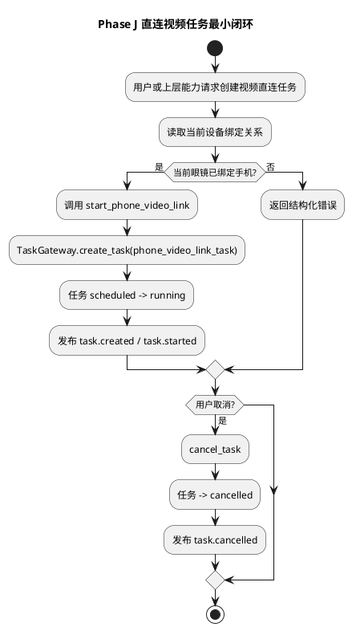
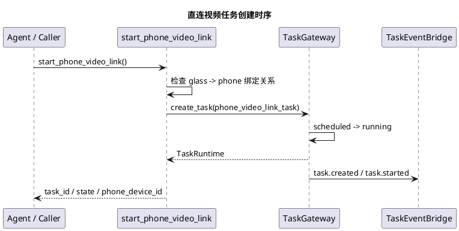

# Phase J 眼镜手机直连视频任务实施文档

## 1. 需求理解

本阶段目标对应第三阶段计划中的 Phase J，最初核心是把“眼镜与手机直连视频能力”先收敛为一个可创建、可查询、可取消的后台任务，而不是在同一轮里一次性补齐视频数据面、手机页面和视觉算法。

本阶段必须交付：

1. 服务端新增 `phone_video_link_task` 最小任务模板。
2. 可基于当前绑定关系创建一条眼镜到手机的视频直连任务。
3. 任务具备创建、查询、取消能力。
4. 任务事件可进入当前 `backend-task-core -> TaskEvent` 主路径，并为后续控制编排提供统一入口。
5. 自动化测试覆盖任务创建、绑定校验和取消。

本阶段不要求：

1. 眼镜端真实推送持续视频帧。
2. 手机端真实接收并显示视频流。
3. `peer_link` 全量网络协商。
4. 视频任务接入真实视觉检测。

当前目标是先把“视频直连任务”这个运行时承载体做出来，为后续数据面和视觉能力接入提供稳定骨架。

## 2. 现状分析

当前仓库在本次实现前已有如下基础：

1. `backend-task-core` 已支持 `timer_task` 的创建、查询、取消与事件发布。
2. `TaskEventBridge`、`NotificationCoordinator` 与 `voice-runtime` 已能承接任务事件。
3. 服务端运行态已补齐手机设备接入与眼镜-手机绑定关系。
4. 当前 `ToolRegistry` 已支持高层 Tool 与任务网关协作。

主要缺口如下：

1. 任务注册表中还没有 `phone_video_link_task`。
2. 任务网关目前只支持 `timer_task`，还不支持“长期运行但不依赖定时器”的任务模板。
3. 没有高层 Tool 负责基于绑定关系发起视频直连任务。
4. 当前没有针对“设备绑定缺失时禁止创建跨端任务”的统一校验。

结论：

1. 当前运行时足以支持先落一个“内存态、真实状态机”的视频直连任务样板。
2. 视频数据面可以留给下一轮，不会阻塞当前任务骨架落地。
3. 后续真实实现已经在本阶段之后继续补齐，因此本文件需要补充当前状态说明，避免与后续实现文档脱节。

## 3. 实现方案描述

### 3.1 总体策略

本次实现遵循以下策略：

1. 先把视频直连能力落成标准后台任务，不走临时线程或局部变量。
2. 任务创建前先检查运行态里的设备绑定关系。
3. 首版任务不直接驱动视频帧传输，只维护“准备开始直连视频”的运行态。
4. 任务状态先使用当前已有统一状态语义，不新增特殊生命周期。

### 3.2 `phone_video_link_task` 最小模型

首版任务输入建议包含：

1. `phone_device_id`
2. `link_mode`
3. `reason`

首版任务上下文建议包含：

1. `glass_device_id`
2. `phone_device_id`
3. `link_mode`
4. `phase=link_prepared`

首版状态流转如下：

1. `scheduled`
2. `running`
3. `cancelled`

首版任务不实现：

1. `completed`
2. `waiting_external`
3. 任务超时自动回收

原因：

1. 当前还没有真实视频数据面，任务天然更接近“长期运行连接态”。
2. 本阶段先把任务入口、运行态和取消链路做稳，再接后续视频流和视觉任务。

### 3.3 高层 Tool 设计

本阶段新增高层 Tool：

1. `start_phone_video_link`

主要逻辑：

1. 读取运行态中的 `device_bindings`。
2. 检查当前眼镜是否已绑定手机。
3. 调用 `TaskGateway.create_task(task_type="phone_video_link_task")`。
4. 返回任务编号、当前状态和绑定手机编号。

本阶段不新增模型可见工具暴露策略变更，先把该 Tool 作为内部可调用能力保留。

### 3.4 绑定关系校验

本阶段绑定校验放在 Tool 层完成，而不是放在 `TaskGateway` 内部。

原因：

1. 当前 `TaskGateway` 主要持有任务运行态，不直接感知控制面设备绑定关系。
2. 运行态绑定关系已经可通过 `device_state_reader()` 提供，适合作为高层 Tool 的输入前置校验。
3. 这样后续若要把绑定信息抽到正式 `DeviceDirectory` 服务，也不需要重写任务网关。

### 3.5 任务事件设计

建议首版事件如下：

1. `task.created`
2. `task.started`
3. `task.cancelled`

其中：

1. `task.started` 表示“视频直连任务已建立运行态，等待下一阶段接入真实数据面”。
2. 首版不直发端侧通知，避免在还没有真实链路时产生误导性播报。
3. 后续实现中，`task.cancelled` 已进一步收敛为静默控制动作，不再触发多余的 Agent/TTS 播报。

## 4. 流程图（PlantUML）



## 5. 时序图（PlantUML）



## 6. 自动化测试方案

### 6.1 单元测试

1. 测试目标：验证 `phone_video_link_task` 可创建并进入 `running`  
测试方法：直接调用 `TaskGateway.create_task(task_type="phone_video_link_task")`。  
预期结果：任务状态为 `running`，并发布 `task.created / task.started`。

2. 测试目标：验证 `phone_video_link_task` 可取消  
测试方法：创建任务后调用 `cancel_task()`。  
预期结果：任务状态进入 `cancelled`，并发布 `task.cancelled`。

3. 测试目标：验证无绑定关系时不能创建视频直连任务  
测试方法：构造没有绑定快照的 `device_state_reader`，调用 `start_phone_video_link`。  
预期结果：返回结构化错误。

### 6.2 功能测试

1. 测试目标：验证高层 Tool 可基于绑定关系创建视频直连任务  
测试方法：构造包含 `glass_to_phone` 绑定快照的 Tool 上下文，调用 `start_phone_video_link`。  
预期结果：成功返回 `task_id / phone_device_id / state`。

2. 测试目标：验证任务引用可写入当前会话上下文  
测试方法：通过 `ToolGateway` 调用该 Tool。  
预期结果：结果中包含 `TaskRef`，后续可进入会话上下文。

## 7. 当前方案与架构设计的契合程度

契合度评估：高。

理由如下：

1. 本方案把跨端视频能力先落入 `backend-task-core`，符合“长期运行任务不放在 agent loop 中”的架构约束。
2. 本方案没有把设备绑定关系直接塞进模型提示词，而是由框架在 Tool 层完成前置校验。
3. 本方案沿用了统一任务状态机、事件总线和事件回流路径，没有绕过现有骨架。

可改进点：

1. 当前绑定关系仍来自运行态快照，后续更适合抽成独立设备目录服务。
2. 当前任务只到“运行态建立”，后续需要继续补 `peer_link` 协议和真实视频数据面。

## 8. 开发后测试结果

最近一次补充更新时间：2026-04-23。

已执行命令：

```bash
PYTHONPATH=openaiglass-sdk/server-python uv run --python 3.11 python -m unittest \
  server.test.unit.test_backend_task_core \
  server.test.unit.test_agent_core -v
```

结果汇总：

1. `server.test.unit.test_backend_task_core` 共 3 个测试，全部通过。
2. `server.test.unit.test_agent_core` 共 22 个测试，全部通过。
3. 本次新增验证点已覆盖：
   - `phone_video_link_task` 创建后进入 `running`
   - `phone_video_link_task` 可取消并发布 `task.cancelled`
   - `start_phone_video_link` 会基于当前绑定关系创建任务
   - 未绑定手机时会返回结构化错误

补充说明：

1. 本轮最初只执行了任务层与工具层自动化测试。
2. 后续实现已继续完成真实视频数据面、iOS 视频回显和真机联调，但这些内容分别记录在后续文档中。

## 9. 当前实现进展

当前已完成：

1. `TaskRegistry` 已新增 `phone_video_link_task` 模板。
2. `InMemoryTaskGateway` 已支持创建和取消 `phone_video_link_task`。
3. 已新增高层 Tool [start_phone_video_link.py](/Users/elio/dev/llm-project/OpenAIglassesDemo_2/openaiglass-sdk/server-python/agent_core/tools/builtins/start_phone_video_link.py)。
4. Tool 会基于当前运行态绑定关系校验是否允许创建视频直连任务。
5. 任务创建后会通过当前标准 `TaskEvent` 主路径发布 `task.created / task.started` 事件。
6. 后续实现中，`phone_video_link_task` 已继续承接真实视频流控制参数：
   - `target_ws_uri`
   - `stream_id`
   - `frame_interval_ms`

当前未完成：

1. 尚未落地正式 `peer_link.prepare / ready / failed / close` 控制语义。
2. `start_phone_video_link` 目前仍以内置能力为主，尚未直接暴露为模型可见工具。
3. 更完整的手机侧本地后台任务中心和视觉算法迁移仍未落地。

当前判断：

1. 本轮最初目标“直连视频任务最小闭环”已经完成。
2. 后续阶段已在此基础上继续补齐真实视频数据面、iOS 视频回显、自动注册绑定和开始/停止视频联调。
3. 当前这份文档应视为 Phase J 的骨架实现记录，而不是第三阶段最新完整状态总览。
