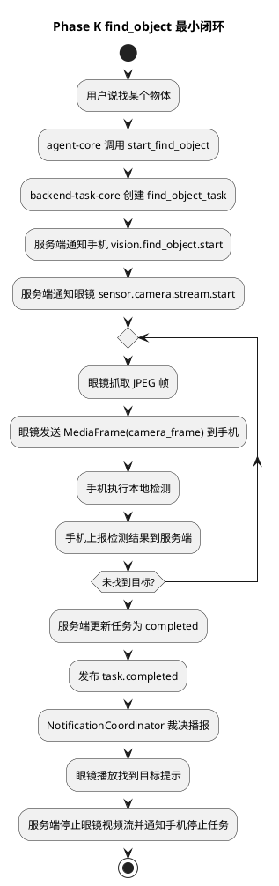
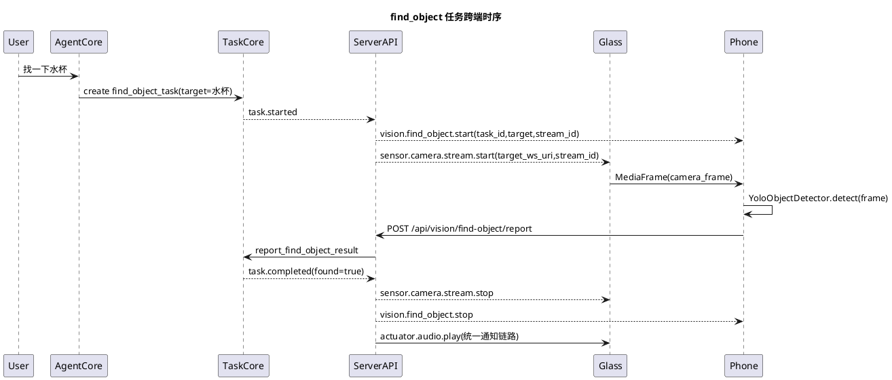

# Phase K find_object 手机端视觉能力最小闭环实施文档

## 1. 需求理解

本阶段目标是在已经跑通的眼镜到手机视频流基础上，把旧项目中的 `find_object` 能力迁移为新架构下的首个手机端视觉任务样板。

本阶段必须完成：

1. 服务端新增标准后台任务 `find_object_task`。
2. 大模型可通过高层 Tool 创建 `find_object_task`。
3. 服务端协调眼镜继续把视频帧直推手机。
4. 手机端对接收到的视频帧执行本地检测，并输出结构化结果。
5. 手机端把检测结果上报服务端。
6. 服务端把检测结果写入任务状态，并在找到目标时通过统一任务事件和通知链路提示眼镜。

本阶段暂不完成：

1. 第一期第 3 项实时语音打断。
2. 导航相关能力。
3. 正式多模型管理、模型下载、模型热更新。
4. 复杂寻物引导，例如手部接触判断、光流追踪和多步拿取引导。

## 2. 现状分析

当前仓库已经具备以下基础：

1. 服务端支持眼镜与手机注册、绑定和运行态查询。
2. 服务端已有 `phone_video_link_task`，可在任务启动后向眼镜下发 `sensor.camera.stream.start`。
3. 眼镜端已经支持 `sensor.camera.stream.start / stop`，并可向手机推送 `MediaFrame(camera_frame)`。
4. iOS 手机端已经可以启动本地 WebSocket 服务，接收并回显 JPEG 帧。
5. `backend-task-core -> TaskEvent -> NotificationCoordinator -> voice-runtime` 已可承接任务完成通知。

主要缺口：

1. 服务端还没有 `find_object_task`。
2. 大模型还没有模型可见的 `find_object` 高层工具。
3. 手机端还没有本地视觉任务中心与检测结果模型。
4. 手机端检测结果还没有回到服务端任务状态。
5. 当前没有围绕 `find_object` 的联调说明和测试。

## 3. 实现方案描述

### 3.1 总体策略

本阶段采用最小闭环方案：

1. 服务端创建 `find_object_task` 后，同时通知手机开始本地找物任务，并通知眼镜开始视频推流。
2. 手机端收到 `vision.find_object.start` 后，记录当前任务编号、目标物体和视频流编号。
3. 手机端每收到一帧 JPEG，就调用本地 `YoloObjectDetector` 接口执行检测。
4. 检测结果通过 HTTP 上报到服务端 `/api/vision/find-object/report`。
5. 服务端把最近检测结果保存到任务上下文。
6. 当 `found=true` 时，服务端将任务推进到 `completed`，发布 `task.completed` 事件，并允许统一通知链路播报。
7. 任务取消或完成后，服务端向眼镜下发 `sensor.camera.stream.stop`，向手机下发 `vision.find_object.stop`。

### 3.2 手机端检测接口

手机端新增最小视觉能力抽象：

1. `VisionDetection`
   - 表示一次结构化检测结果。
2. `YoloObjectDetector`
   - 手机端 YOLO 检测接口。
3. `HeuristicYoloObjectDetector`
   - 当前仓库没有模型资产时的最小本地实现。

`HeuristicYoloObjectDetector` 的作用不是替代最终 YOLO，而是先让数据面、控制面、任务状态和通知链路真实闭环。后续接入 CoreML YOLO 时，只替换 `YoloObjectDetector` 的实现，不改跨端协议。

### 3.3 服务端任务模型

`find_object_task` 输入包括：

1. `target_object`
2. `phone_device_id`
3. `target_ws_uri`
4. `stream_id`
5. `frame_interval_ms`

任务上下文保存：

1. 目标物体。
2. 当前绑定手机。
3. 视频流编号。
4. 最近检测结果。
5. 最近检测时间。

任务事件：

1. `task.created`
2. `task.started`
3. `task.updated`
4. `task.completed`
5. `task.cancelled`

其中 `task.completed` 允许直发通知，`task.updated` 只写入状态，不直接播报。

### 3.4 通知策略

1. 未找到目标时，只更新任务状态，不播报。
2. 找到目标时，发布高优先级 `task.completed`。
3. 播报文案由服务端任务事件提供，例如“找到水杯了，它在画面左侧。”
4. 手机端不直接给眼镜播报，避免绕过通知协调器。

## 4. 流程图（PlantUML）

## 5. 时序图（PlantUML）

## 6. 自动化测试方案

### 6.1 单元测试

1. 测试目标：验证 `find_object_task` 可创建并进入 `running`测试方法：直接调用 `TaskGateway.create_task(task_type="find_object_task")`。预期结果：任务状态为 `running`，上下文包含目标物体、手机编号和流编号。
2. 测试目标：验证未找到目标时只更新任务状态测试方法：调用 `report_find_object_result(found=false)`。预期结果：任务仍为 `running`，上下文记录最近检测结果，并发布 `task.updated`。
3. 测试目标：验证找到目标时任务完成并允许通知测试方法：调用 `report_find_object_result(found=true)`。预期结果：任务进入 `completed`，发布 `task.completed`，事件允许直发通知。
4. 测试目标：验证手机端检测结果可结构化输出
   测试方法：用构造图像调用手机端检测器。
   预期结果：检测器返回目标名称、置信度和方位摘要。

### 6.2 功能测试

1. 测试目标：验证服务端可通过 Tool 创建 `find_object_task`测试方法：构造包含眼镜手机绑定关系和手机接收地址的运行态，调用 `start_find_object`。预期结果：返回 `task_id / target_object / state`。
2. 测试目标：验证任务启动会分别通知眼镜和手机测试方法：注册眼镜与手机，创建 `find_object_task`。预期结果：眼镜收到 `sensor.camera.stream.start`，手机收到 `vision.find_object.start`。
3. 测试目标：验证手机上报找到目标后服务端停止视频流
   测试方法：调用 `/api/vision/find-object/report` 上报 `found=true`。
   预期结果：眼镜收到 `sensor.camera.stream.stop`，手机收到 `vision.find_object.stop`。
4. 测试目标：验证手机完成按钮可停止找物体任务
   测试方法：在 `find_object_task` 运行时调用 `/api/debug/phone-video-link/stop`。
   预期结果：服务端取消找物体任务，眼镜收到 `sensor.camera.stream.stop`，手机收到 `vision.find_object.stop`。

## 7. 当前方案与架构设计的契合程度

契合度评估：高。

理由：

1. `find_object` 被建模为标准 `backend-task-core` 后台任务，没有塞进 `agent loop`。
2. 大模型只看到高层工具 `start_find_object`，不感知手机、视频流和检测模型细节。
3. 手机端只输出结构化检测结果，不直接播报。
4. 服务端仍通过 `TaskEvent` 和 `NotificationCoordinator` 统一处理通知。
5. 眼镜端继续只承担感知采集和执行播报，不运行视觉检测算法。

改进建议：

1. 后续接入真实 YOLO CoreML 模型后，应把模型文件和类别表纳入手机端配置。
2. 若后续需要连续引导拿取物体，应把旧项目里的手部检测、光流追踪和距离引导拆成新的手机端视觉任务组件。

## 8. 开发后测试结果

本次实现后已完成以下自动化测试：

1. 服务端 Python 测试：
   - 命令：`.venv/bin/python -m pytest`
   - 结果：`86 passed, 2 warnings`
   - 说明：两个 warning 为测试辅助类 `TestWebSocketClient` 带 `__init__`，pytest 不将其作为测试类收集，不影响测试结果。
2. iOS 模拟器测试：
   - 命令：通过 XcodeBuildMCP 执行 `test_sim`
   - 工程：`openaiglass-sdk/phone-ios/GlassesVideoReceiver.xcodeproj`
   - Scheme：`GlassesVideoReceiver`
   - 设备：`iPhone 17 (iOS Simulator 26.3.1)`
   - 结果：`8 passed`

新增测试覆盖：

1. `find_object_task` 创建、未命中更新、命中完成和事件通知策略。
2. `start_find_object` Tool 基于眼镜手机绑定关系创建任务。
3. `find_object_task` 启动后，服务端向手机下发 `vision.find_object.start`，向眼镜下发 `sensor.camera.stream.start`。
4. 手机上报 `found=true` 后，服务端推进任务完成，并向眼镜和手机下发停止消息。
5. 手机端最小 `YoloObjectDetector` 接口可输出结构化检测结果。
6. 手机完成按钮使用的停止接口可取消运行中的 `find_object_task`，并结束眼镜视频流和手机本地检测任务。
7. 单眼镜单手机在线且未显式传入期望绑定编号时，服务端可自动建立兜底绑定。
8. 工具运行态读取函数可在控制面就绪后重新绑定到完整控制面快照。

真机问题修复记录：

1. 问题：眼镜启动后说出唤醒词无反应。
   原因：唤醒门控依赖音频上行 WebSocket 就绪状态，断线或启动失败后没有周期重连，导致本地唤醒链路一直不进入工作状态。
   修复：眼镜端在语音会话已打开、未播放、音频上行未就绪时，每 3 秒尝试重新建立音频上行连接。
2. 问题：启动视频传输后，点击手机上的完成按钮没有结束视频传输。
   原因：完成按钮复用了 `/api/debug/phone-video-link/stop`，该接口只取消旧的视频直连任务，未处理 PhaseK 新增的 `find_object_task`。
   修复：服务端停止接口优先取消当前眼镜关联的 `find_object_task`，由任务取消事件统一下发眼镜停流和手机停止检测消息。
3. 问题：部分联调场景下，手机点击完成后仍可能没有明显页面变化。
   原因：手机停止请求原先只依赖绑定态里的 `glass_device_id`，当绑定态丢失但找物体任务仍在运行时，会导致停止请求缺少目标眼镜编号。
   修复：手机停止请求优先使用当前 `find_object_task` 自带的眼镜编号；同时手机收到 `vision.find_object.stop` 时立即结束当前视频会话。
4. 问题：眼镜音频上行连接在异常断开后可能卡在未完全重启状态。
   原因：仅重复调用 `start` 不能覆盖所有底层连接状态，可能导致音频上行仍未真正恢复。
   修复：眼镜端在检测到音频上行未就绪时，先停止旧连接，再重新启动音频上行客户端。
5. 问题：用户说“帮我找一下手机”后，`start_find_object` 失败，手机任务没有启动。
   原因：默认 `AgentFacade` 初始化时绑定的是语音运行态快照，工具读不到控制面的 `device_bindings` 和手机 `camera_sink_ws_uri`。
   修复：`ControlRuntime` 初始化完成后把工具运行态读取函数重新绑定到控制面快照，并在单眼镜单手机在线时自动建立兜底绑定。
6. 问题：工具失败后的大模型回复被重复语音播报。
   原因：流式 `message_output_created` 被当成中间播报发送，随后最终回复路径又对同一文本合成并下发一次。
   修复：普通消息输出不再触发中间播报；保留拍照工具调用前的明确中间提示。

## 9. 当前实现进展

当前已经完成：

1. 服务端新增 `find_object_task`，并接入 `backend-task-core` 生命周期。
2. 服务端新增模型可见高层 Tool `start_find_object`。
3. 服务端新增 `/api/vision/find-object/report`，用于接收手机端检测结果。
4. 服务端在 `find_object_task.task.started` 时下发：
   - `vision.find_object.start` 给手机
   - `sensor.camera.stream.start` 给眼镜
5. 服务端在任务完成或取消时下发：
   - `sensor.camera.stream.stop` 给眼镜
   - `vision.find_object.stop` 给手机
6. iOS 手机端新增找物体任务状态、检测结果模型和 `YoloObjectDetector` 抽象接口。
7. iOS 手机端视频帧接收后会执行本地检测，并按节流策略上报服务端。
8. iOS 页面展示当前找物体目标和最近检测摘要。

当前保留事项：

1. 手机端当前使用 `HeuristicYoloObjectDetector` 完成最小闭环，尚未接入正式 CoreML YOLO 模型资产。
2. 当前只实现“找到目标后播报并结束任务”的最小闭环，尚未迁移旧项目中的手部接触、光流追踪、距离引导和连续方向提示。
3. 真机联调文档仍需单独补充，覆盖服务端、眼镜、iOS 三端启动和日志观察点。
