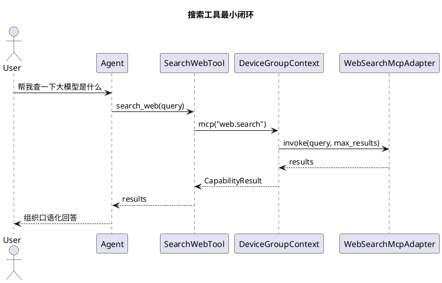

# Search 搜索工具实施文档

## 1. 需求理解

搜索工具用于处理用户明确要求“查一下”“搜索一下”或问题需要外部公开资料的场景。业务层只实现搜索能力本身，搜索入口必须通过 SDK Tool 和 MCP adapter 暴露给 Agent。

## 2. 现状分析

当前 SDK 已提供：

1. `BaseTool`：把业务搜索暴露给 Agent。
2. `BaseMcpAdapter`、`McpMethodSpec`：注册业务 MCP 方法。
3. `context.mcp(...)`：Tool 调用 MCP 的统一入口。

当前 SDK 未提供通用搜索服务，因此业务侧新增 `web.search` adapter。

## 3. 实现方案

1. `SearchWebTool` 注册为 `search_web`。
2. Tool 校验 `query` 后调用 `context.mcp("web.search", ...)`。
3. `WebSearchMcpAdapter` 通过 DuckDuckGo HTML 页面获取公开搜索结果。
4. 返回标题、摘要、链接和结果数量。

## 4. 流程图



## 5. 自动化测试方案

单元测试覆盖：

1. `search_web` 会通过 SDK MCP 入口调用 `web.search`。
2. 搜索 adapter 能把 HTML 搜索结果解析成标题、摘要和链接。

回归命令：

```bash
PYTHONPATH=openaiglass-sdk/server-python:openaiglass-for-blind:. uv run python -m pytest openaiglass-for-blind/tests/test_capabilities_unit.py -q
```

## 6. 当前方案与架构设计的契合程度

当前方案只使用 SDK 公开的 Tool、MCP adapter 和 `context.mcp(...)`，没有绕过设备组上下文，也没有修改 SDK 框架代码。

## 7. 开发后测试结果

已执行：

```bash
PYTHONPATH=openaiglass-sdk/server-python:openaiglass-for-blind:. uv run python -m pytest openaiglass-for-blind/tests/test_capabilities_unit.py -q
```

结果：通过。

## 8. 当前实现进展

已完成：

1. `search_web` Tool。
2. `web.search` MCP adapter。
3. 宿主装配。
4. 单元测试。

未完成：

1. 真实搜索服务 API Key 型接入。
2. 网页全文抓取和引用质量评估。
