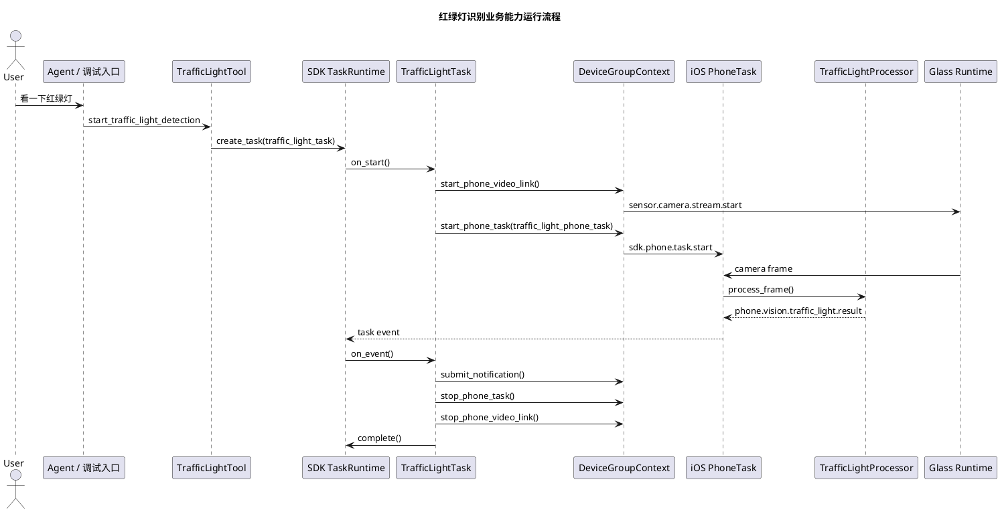
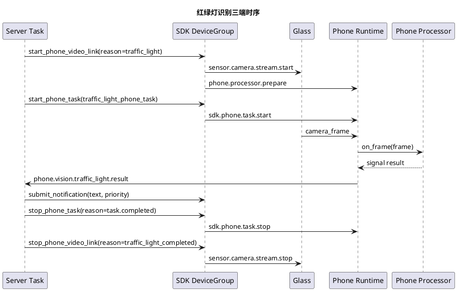

# TrafficLight 红绿灯识别能力实施文档

## 1. 需求理解

红绿灯识别属于第一阶段第三阶段计划中的手机端视觉能力迁移样板。目标是让用户通过语音或 Agent Tool 启动红绿灯识别任务，由眼镜提供视频流，手机侧执行本地视觉识别，服务端后台任务接收结构化结果并向眼镜提交过街提示。

当前实现只做业务能力层，不修改 SDK 框架层。所有设备连接、设备绑定、视频链路、手机任务下发、任务状态和通知都通过 SDK 公开上下文完成。

## 2. 现状分析

当前业务工程已有 `find_object` 能力，已经验证了以下 SDK 扩展面：

1. `BaseTool` 可创建 SDK 托管任务。
2. `BaseTask` 可通过 `context.device_group.start_phone_video_link()` 启动眼镜到手机的视频链路。
3. `BaseTask` 可通过 `context.device_group.start_phone_task()` 启动手机侧任务。
4. Python `BasePhoneTask` 和 `BasePhoneProcessor` 只用于 `phone-mock` 或契约验证，不作为真实 iPhone 插件主路径。
5. 组件级 `ScenarioRunner` 已退出当前业务主路径，功能验证应优先使用 `glass-playback`、`phone-mock` 和 SDK 预检。

本次新增的红绿灯能力沿用同一套 SDK 扩展方式，没有直接拼接 WebSocket 消息，也没有读写设备绑定表。

同时修复了 `find_object` 的一个业务问题：找到目标后原任务只停止手机任务，没有停止视频链路，可能导致相机流继续占用。现在完成路径会调用 `stop_phone_video_link(reason="find_object_completed")`。

## 3. 实现方案描述

### 3.1 服务端 Tool

新增 `StartTrafficLightTool`：

1. 工具名：`start_traffic_light_detection`。
2. 输入：`crossing_name`、`stop_after_first_signal`。
3. 行为：通过 `context.create_task(task_type="traffic_light_task")` 创建后台任务。

### 3.2 服务端 Task

新增 `TrafficLightTask`：

1. `on_start` 启动视频链路和手机侧 `traffic_light_phone_task`。
2. `on_event` 接收 `phone.vision.traffic_light.result`。
3. 识别到 `red/yellow/green` 后提交通知。
4. 默认识别到第一个有效信号后停止手机任务和视频链路并完成任务。
5. `on_cancel` 释放视频链路和手机任务。

### 3.3 手机侧 Processor 和 PhoneTask

新增 `TrafficLightProcessor` 和 `TrafficLightPhoneTask`：

1. `TrafficLightPhoneTask` 维护手机任务状态，并把帧交给处理器。
2. `TrafficLightProcessor` 从离线回放文本中识别 `red/yellow/green/unknown`。
3. 输出结构化事件 `phone.vision.traffic_light.result`。

当前 Python 处理器是 `phone-mock` 和契约验证用的最小实现，不代表真实视觉模型。真实 iOS 端插件样例已放在 `capabilities/traffic_light/phone/ios/TrafficLightPhoneCapability.swift`，并已按 `PhoneTaskCapabilityRegistry.register(taskType:runtimeBuilder:)` 方式注册。

### 3.4 宿主装配

`host/server/main.py` 注册：

1. `StartTrafficLightTool`
2. `TrafficLightTask`
3. `TrafficLightProcessor`
4. `TrafficLightPhoneTask`
5. iOS 业务插件样例

真实服务端通过 `create_full_sdk()` 装配当前业务工程全部能力；组件级场景处理器不再作为业务主路径。

## 4. 运行流程图



## 5. 时序图



## 6. 自动化测试方案

### 6.1 单元测试

测试目标：

1. `TrafficLightProcessor` 能从帧内容中识别红、黄、绿和未知状态。
2. `TrafficLightTask` 只在收到有效红绿灯事件后完成任务。
3. `find_object` 完成路径会释放视频链路。

测试方法：

1. 使用 `phone-mock` 或 SDK 契约测试构造手机结果事件。
2. 校验任务状态、任务结果、通知内容、眼镜命令和手机命令。

预期结果：

1. 红灯和绿灯场景均完成任务并提交通知。
2. 手机离线场景在启动阶段失败并返回结构化错误。
3. 找物体完成场景包含 `sensor.camera.stream.stop`。

### 6.2 功能测试

已新增场景：

1. `testdata/scenario/traffic_light_red.json`
2. `testdata/scenario/traffic_light_green.json`
3. `testdata/scenario/traffic_light_missing_phone.json`

回归命令：

```bash
python -m compileall capabilities host/server/main.py
uv run openaiglass.sdk.preflight --report logs/sdk-preflight-current.json
```

## 7. 跨设备联调方案

真机联调顺序：

1. 启动服务端：`uv run openaiglass.server.run --app-module host.server.main --app-root openaiglass-for-blind`
2. 启动 iOS 手机端 SDK 运行时，确认手机注册和绑定状态。
3. 启动 ESP32 眼镜端 SDK 运行时，确认眼镜注册和心跳。
4. 触发 `start_traffic_light_detection`。
5. 服务端观察任务创建、`sensor.camera.stream.start`、手机任务结果和通知。
6. 手机端观察最近任务状态、最近帧和最近任务结果。
7. 眼镜端观察视频流启动、停止和播报提示。

## 8. 当前方案与架构设计的契合程度

当前方案与架构设计契合：

1. 服务端业务只通过 SDK Tool/Task 扩展，不直接处理底层连接。
2. 手机侧业务以 PhoneTask/Processor 插件形式存在，不写入 SDK 通用运行时。
3. 眼镜端只使用 SDK 已有视频流和通知能力，不新增业务策略。
4. 任务状态、通知和结果都通过 SDK 任务运行时和设备组上下文流转。

## 9. 开发后测试结果

已执行：

```bash
python -m compileall capabilities host/server/main.py
```

结果：

1. 编译检查通过。
2. 组件级场景回放入口已删除；当前统一使用 `glass-playback`、`phone-mock` 和 SDK 预检做设备级验证。
3. 完整视频链路实测等待 SDK 标准装配 `DeviceGroupContext.start_phone_video_link(...)`。

## 10. 当前实现进展

已完成：

1. 红绿灯识别服务端 Tool。
2. 红绿灯识别服务端 Task。
3. 红绿灯识别手机侧 Processor 和 PhoneTask。
4. 红灯、绿灯、手机离线三个回放场景。
5. 服务端宿主装配。
6. iOS 业务插件样例文件。
7. `find_object` 完成路径释放视频链路。

未完成：

1. 真实 iOS 工程自动集成多个业务插件。
2. 真实 YOLO / CoreML 红绿灯模型接入。
3. 真机端到端联调。
