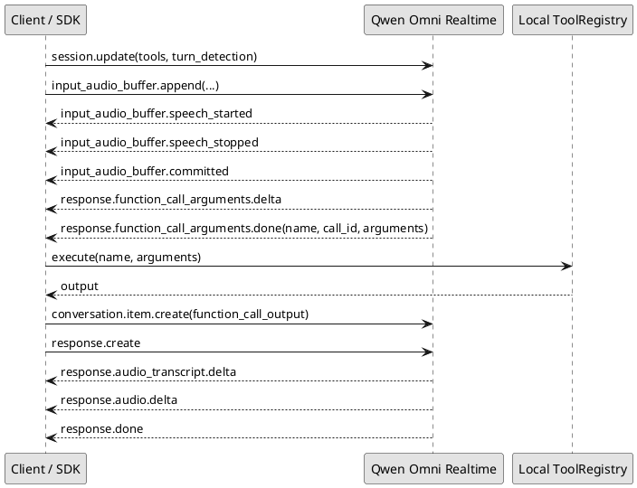

# Qwen-Omni-Realtime 功能调研报告

调研日期：2026-04-30

调研对象：`qwen3.5-omni-plus-realtime` / `qwen3.5-omni-flash-realtime`，重点关注工具调用、语义打断、VAD 与 Manual 模式，以及与本项目现有 SDK 链路的结合方式。

## 1. 结论摘要

1. Qwen-Omni-Realtime 已经具备实时音频/图片输入、文本/音频流式输出、Function Calling、联网搜索、`server_vad` / `semantic_vad` turn detection 等能力。当前官方推荐在 `qwen3.5-omni-realtime` 模型上使用 `semantic_vad`。
2. 工具调用可用，但接入方式是 Realtime WebSocket 事件流，不是 OpenAI Chat Completions 的 `tool_calls` 一次性回包。核心闭环是：`session.update(tools)` -> 收 `response.function_call_arguments.done` -> 本地执行工具 -> 发 `conversation.item.create(function_call_output)` -> 发 `response.create`。
3. 工具调用与本项目现有 `agent_tts + agent-core ToolRegistry` 的概念匹配，但当前 `omni_realtime` 路径会绕过 agent-core；若要在 Omni Realtime 中真正调用 SDK Tool/Task/Skill，需要补一层 Realtime Tool Bridge。
4. `semantic_vad` 可以减少“嗯”“好”“背景音”这类无意义声音触发响应或打断，但它不能替代眼镜端唤醒、近场 VAD、AEC/回声抑制、按键退出和播放仲裁。真实硬件场景仍然需要 WakeNet / 本地 VAD / AEC 配合。
5. VAD 模式适合连续对话和电话式交互；Manual 模式适合按住说话、松手发送、弱硬件或必须由端侧精确控制提交时机的场景。

## 2. 资料来源

- 阿里云百炼官方文档：[Qwen-Omni-Realtime](https://help.aliyun.com/zh/model-studio/realtime)
- 阿里云百炼官方文档：[Realtime 客户端事件](https://help.aliyun.com/zh/model-studio/client-events)
- 阿里云百炼官方文档：[Realtime 服务端事件](https://help.aliyun.com/zh/model-studio/server-events)
- 阿里云百炼官方文档：[Qwen Function Calling](https://help.aliyun.com/zh/model-studio/qwen-function-calling#rt02realtime01)
- 阿里云公开示例：[alibabacloud-bailian-speech-demo / samples/conversation/omni](https://github.com/aliyun/alibabacloud-bailian-speech-demo/tree/master/samples/conversation/omni)
- 本项目现有设计：[Omni语义实时连续对话设计](../structure-design/Omni语义实时连续对话设计.md)

## 3. 模型与基础能力

官方文档给出的基础接入方式是 WebSocket：

- 北京地域：`wss://dashscope.aliyuncs.com/api-ws/v1/realtime`
- 新加坡地域：`wss://dashscope-intl.aliyuncs.com/api-ws/v1/realtime`
- 模型名通过查询参数或 SDK 参数指定，例如 `qwen3.5-omni-plus-realtime`
- 鉴权使用 `Authorization: Bearer DASHSCOPE_API_KEY`
- Python DashScope SDK 要求不低于 `1.23.9`；本仓库当前 `uv run` 环境安装到 `dashscope 1.25.17`

官方能力约束：

| 能力 | 调研结论 |
| --- | --- |
| 输入 | 音频必须有；图片可选。音频事件是 `input_audio_buffer.append`，图片事件是 `input_image_buffer.append`。 |
| 输出 | 支持 `["text"]` 或 `["text", "audio"]`。音频输出通过 `response.audio.delta` 返回 Base64 PCM。 |
| 图片输入 | JPG/JPEG，Base64 前单张不大于 500KB；建议 480p/720p，最高 1080p；建议视频抽帧 1 张/秒；发送图片前至少发送过一次音频。 |
| 会话长度 | 单个 WebSocket 会话最长 120 分钟。 |
| 上下文 | `qwen3.5-omni-plus-realtime`：音频 100 轮、视频 50 轮、音频 600 秒、视频 240 秒；`qwen3.5-omni-flash-realtime`：音频 80 轮、视频 50 轮、音频 480 秒、视频 120 秒。 |
| 联网搜索 | `enable_search=true` 可启用，但与 `tools` 不兼容，不能同时开启。 |

## 4. 工具调用能力如何使用

### 4.1 官方事件流程

Realtime 工具调用流程如下：



关键点：

1. 工具定义放在 `session.update.session.tools`，格式是 OpenAI Chat Completions 风格：

```json
{
  "type": "function",
  "function": {
    "name": "get_current_weather",
    "description": "查询指定城市天气",
    "parameters": {
      "type": "object",
      "properties": {
        "location": {"type": "string", "description": "城市或区县"}
      },
      "required": ["location"]
    }
  }
}
```

2. 服务端可能先返回 `response.function_call_arguments.delta`，但官方明确最终应以 `response.function_call_arguments.done.arguments` 为准。
3. 工具执行结果回传必须使用 `conversation.item.create`，`item.type=function_call_output`，并携带原始 `call_id`。
4. 回传工具结果后必须再发 `response.create`，模型才会基于工具结果继续生成最终文本/语音。
5. Qwen-Omni-Realtime 系列不支持 `tool_choice` 和 `parallel_tool_calls` 参数。

### 4.2 DashScope SDK 写法

本地核对 `dashscope 1.25.17` 后确认：

- `OmniRealtimeConversation.update_session(..., **kwargs)` 会把额外字段并入 `session`，因此可以传入 `tools=...`。
- `OmniRealtimeConversation.create_item(item)` 会发送 `conversation.item.create`。
- `OmniRealtimeConversation.create_response(...)` 会发送 `response.create`。

最小接线形态：

```python
conversation.update_session(
    output_modalities=[MultiModality.TEXT, MultiModality.AUDIO],
    voice="Tina",
    input_audio_format=AudioFormat.PCM_16000HZ_MONO_16BIT,
    output_audio_format=AudioFormat.PCM_24000HZ_MONO_16BIT,
    enable_turn_detection=True,
    turn_detection_type="semantic_vad",
    instructions="你是盲人眼镜助手。",
    tools=tools,
)

# 回调中收到 response.function_call_arguments.done 后：
arguments = json.loads(event["arguments"])
tool_output = run_local_tool(event["name"], arguments)
conversation.create_item(
    {
        "type": "function_call_output",
        "call_id": event["call_id"],
        "output": tool_output,
    }
)
conversation.create_response()
```

### 4.3 与 OpenAI / DashScope / 本项目框架的契合程度

| 维度 | 结论 |
| --- | --- |
| OpenAI 兼容接口 | 非实时 Qwen-Omni 可走 OpenAI 兼容 Chat Completions；Realtime 不是 Chat Completions，需要 WebSocket 事件流。OpenAI SDK 对本能力不是直接适配层。 |
| DashScope SDK | 契合度较高，已有 `update_session`、`append_audio`、`append_video`、`commit`、`create_item`、`create_response`、`cancel_response`。 |
| 本项目 `omni_realtime` | 当前可发送音频、图片并接收文本/音频，但回调只处理 `response.audio.delta`、文本转写、`response.done/error` 等；还没有处理 `response.function_call_arguments.*`。 |
| 本项目 agent-core | 现有 ToolRegistry/Task/Skill 能力成熟，但 `VOICE_REPLY_MODE=omni_realtime` 当前绕过 agent-core，因此不会执行 SDK Tool、Task、Skill 或长期记忆。 |

接入难度判断：中等。

难点不是官方协议复杂，而是要把现有 Tool/Task/Skill 的执行边界接回 Realtime 会话：

1. 从现有 ToolRegistry 导出 Realtime `tools` JSON Schema。
2. 在 Omni 回调桥里新增 `response.function_call_arguments.delta/done` 分支。
3. 收到工具调用后暂停或标记当前响应，执行本地工具。
4. 用 `conversation.create_item(...)` 回传工具结果，再 `create_response(...)`。
5. 处理工具超时、工具错误、同一轮多次串行工具调用、用户中途打断和 `response.cancel`。
6. 明确 `omni_realtime` 与 `agent_tts` 的职责：低延迟通用问答/视觉问答走 Realtime；复杂任务编排仍优先走 agent-core，或者后续实现 Realtime Tool Bridge。

## 5. 语义打断、唤醒与 VAD

### 5.1 语义打断到底是什么

官方文档把 Qwen3.5-Omni-Realtime 的“语义打断”描述为自动识别对话意图，避免附和声和无意义背景音触发打断。结合 Realtime 事件模型，这里应拆成两层理解：

1. Turn detection：判断用户是否开始说话、是否说完，从而自动提交音频并创建响应。
2. Barge-in / interrupt：助手正在输出时，用户新语音是否应该中断当前响应。

`semantic_vad` 比 `server_vad` 多了语义有效性判断，适合减少“嗯嗯”“好”“旁边有人说话”“无意义背景音”这类误触发。但它仍然是在模型服务侧处理已经上传的音频，不负责端侧唤醒、声源判断或回声消除。

### 5.2 是否还需要唤醒、VAD、AEC

需要。

真实眼镜硬件建议分层如下：

| 层级 | 是否仍需要 | 原因 |
| --- | --- | --- |
| WakeNet / 按键唤醒 | 需要 | 决定设备何时从隐私/省电状态进入连续会话窗口；云端 `semantic_vad` 不应长期监听所有环境音。 |
| 端侧 VAD | 需要 | 用于近场语音门控、降低上传带宽、控制连续窗口内何时开始推流。 |
| AEC / 回声抑制 | 播放中插话时必须 | 没有 AEC 时，喇叭里的助手声音会被麦克风重新采集，可能被误判为用户插话。 |
| 云端 `semantic_vad` | 建议用于连续对话 | 用于判断语义上是否真的该提交/打断，比纯声学阈值更适合自然对话。 |
| 播放仲裁 | 需要 | 即使模型取消响应，设备侧还要清空已经下发或排队的音频。 |

因此，本项目当前文档中“播放结束后的自然追问可用，播放中自然插话依赖 AEC 后再开启”的判断是合理的。`semantic_vad` 不是硬件级 full-duplex 的替代品。

### 5.3 VAD 模式与 Manual 模式

| 模式 | 配置 | 客户端行为 | 适合场景 | 不适合场景 |
| --- | --- | --- | --- | --- |
| VAD 模式 | `turn_detection={"type":"server_vad" 或 "semantic_vad"}` | 客户端持续 append 音频；服务端检测语音结束后自动 commit 并创建响应。 | 连续对话、电话式交互、眼镜一次唤醒后的自然追问。 | 强控制的按键语音；必须等图片/传感器全部就绪后才提交的任务。 |
| Manual 模式 | `turn_detection=null` | 客户端 append 音频/图片后，显式发送 `input_audio_buffer.commit` 和 `response.create`。 | 按住说话松手发送、旧设备、离线回放、需要端侧自己决定提交时机的业务。 | 免手操作和自然连续对话。 |

`server_vad` 和 `semantic_vad` 的取舍：

- `server_vad`：偏声学检测，通用、简单、响应行为更可预期，但对无意义回应、旁人声音和背景噪声的语义过滤弱。
- `semantic_vad`：官方推荐给 `qwen3.5-omni-realtime`；更适合真实对话里的语义停顿和无意义声音过滤，但要接受服务端判断带来的不确定性，并保留回退策略。

## 6. 本项目现状与建议改造

当前代码证据：

- `openaiglass-sdk/server-python/runtime/voice_runtime.py` 中 `DashscopeOmniRealtimeReplyClient.open_streaming_session(...)` 已经建立 `OmniRealtimeConversation`，并调用 `update_session(...)` 配置 `semantic_vad`。
- `OmniRealtimeStreamingSession.finish(...)` 在 `realtime_semantic_vad` 下等待官方自动提交和自动响应，不手动 `commit()` / `create_response(...)`。
- 当前回调没有处理 `response.function_call_arguments.delta/done`，因此 Omni Realtime 直出分支暂不能执行 SDK 工具。
- 当前文档也已说明 `omni_realtime` 适合低延迟普通问答和视觉问答，但不会执行 SDK Tool、Task、Skill 或长期记忆。

建议分三步接入：

1. Spike：只接一个只读工具，例如 `get_runtime_status` 或天气 mock。目标是跑通 `tools` -> function call event -> local tool -> `create_item` -> `create_response`。
2. Tool Bridge：把现有 ToolRegistry 里可用于 Realtime 的安全工具导出为 JSON Schema，建立工具白名单，避免导航/计时器等复杂任务被 Realtime 绕过任务中心直接执行。
3. 设备级验证：用真实 ESP32 或 phone audio relay 验证 `semantic_vad` 的自然追问、播放结束后追问、播放中插话误触发、工具调用首包延迟和取消响应。

推荐默认策略：

- `VOICE_REPLY_MODE=omni_realtime`：普通问答、视觉问答、低延迟播报。
- `VOICE_REPLY_MODE=agent_tts`：需要 Task/Skill/MCP 编排、强可控工具执行、长期记忆和可观测调试的业务。
- 未来如果要合并两条链路，应新增 `RealtimeToolBridge`，不要让 Realtime 回调直接绕过 ToolRegistry 和 TaskManager。

## 7. 离线样例验证

新增调研代码：

- [README](./qwen-omni-realtime-research/README.md)
- [realtime_tool_probe.py](./qwen-omni-realtime-research/realtime_tool_probe.py)
- 运行产物：`openaiglass-sdk/docs/experimental/qwen-omni-realtime-research/artifacts/probe_result.json`

执行命令：

```bash
uv run python openaiglass-sdk/docs/experimental/qwen-omni-realtime-research/realtime_tool_probe.py
```

实际使用的真实样例数据：

```text
openaiglass-sdk/testdata/audio-sample/wav/帮我查一下今天的天气.wav
```

验证结果：

| 项 | 结果 |
| --- | --- |
| 采样率 | 16000 Hz |
| 声道 | 1 |
| 位宽 | 2 bytes |
| 时长 | 3349 ms |
| 3200 bytes 分片数 | 34 |
| 工具调用事件 | 成功从 `response.function_call_arguments.done` 解析 `get_current_weather` |
| 工具结果回传 | 成功生成 `conversation.item.create(function_call_output)` |
| 最终响应触发 | 成功生成 `response.create` |

这次没有连接真实 DashScope 服务，也没有执行设备级回放。原因是本轮目标是模型能力调研和代码级闭环验证；真实 Realtime 联调需要有效 `DASHSCOPE_API_KEY`、麦克风/扬声器或端侧音频中继，并会产生云服务调用成本。

## 8. 后续真实联调方案

如果要继续做真链路验证，建议按以下顺序：

1. 同步配置：`uv run openaiglass.config.sync --app-root openaiglass-for-blind`
2. 配置 `DASHSCOPE_API_KEY`、`VOICE_REPLY_MODE=omni_realtime`、`VOICE_CONVERSATION_MODE=realtime_semantic_vad`。
3. 启动服务端并打开 DEBUG 日志。
4. 启动 iOS App 或 `phone-mock`，确认设备注册和绑定。
5. 启动 ESP32 眼镜或支持实时音频的中继端；如果是旧回放，只能验证协议，不能代表真实唤醒、AEC 或语义打断。
6. 触发天气/状态类只读工具问题，观察：
   - `session.updated.tools`
   - `input_audio_buffer.speech_started/stopped/committed`
   - `response.function_call_arguments.done`
   - 本地工具执行日志
   - `conversation.item.create`
   - `response.audio.delta`
   - 设备侧播放和打断日志
7. 播放中插话测试必须在端侧 AEC 可用后再作为验收项；否则先只验收“播放结束后的自然追问”。

## 9. 风险与阻塞点

1. 官方 Realtime 工具调用不支持 `tool_choice` 和 `parallel_tool_calls`，复杂任务需要 SDK 自己做白名单、串行调度和超时控制。
2. `enable_search` 与 `tools` 不兼容，联网搜索和自定义工具需要在会话配置层做互斥。
3. 当前 SDK 的 `omni_realtime` 会绕过 agent-core，直接接工具会削弱现有 Task/Skill/MCP 的边界，必须先做 Bridge。
4. `semantic_vad` 的效果需要真实硬件环境验证；离线回放不能代表麦克风阵列、扬声器回声、旁人说话和户外噪声。
5. 图片必须在 `speech_stopped` 前尽量送达；VAD 自动提交后再追加图片可能错过当前 turn。
