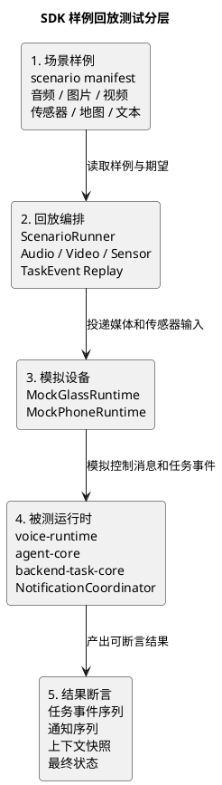

# SDK 测试架构与样例回放设计

## 1. 文档定位

本文档用于补齐 SDK 产品化阶段的测试设计。

当前项目涉及眼镜、手机、服务器三端协同，同时服务器内部还有 `agent-core`、`backend-task-core`、`voice-runtime`、通知协调、Tool、MCP 等多个运行时模块。只依赖普通单元测试无法覆盖完整功能，只依赖真机联调又会让开发者自测成本过高。

本文档的目标是定义一套面向 SDK 开发者的分层测试体系，使开发者可以在不启动真实三端设备的情况下，基于提前准备好的样例数据完成较完整的功能自测。

本文档回答以下问题：

1. 哪些功能必须支持离线自测。
2. `agent-core`、`backend-task-core`、手机侧处理器等模块如何被单独测试。
3. 音频、图片、视频、文本、传感器数据如何组织成可回放样例。
4. Mock Glass、Mock Phone、Scenario Runner 应该承担什么职责。
5. 哪些测试必须真机执行，哪些应尽量用离线回放覆盖。

---

## 2. 核心结论

SDK 必须把“可测试性”作为系统能力的一部分，而不是开发过程中的临时脚本。

建议测试体系分为四层：

1. 纯单元测试
2. 组件级样例回放测试
3. 跨端模拟集成测试
4. 真机验收测试

其中第二层和第三层是当前最缺失、也最应该产品化的能力。

如果未来开发者新增一个 `Tool`、`Task`、`PhoneProcessor` 或 `PhoneTask`，却只能通过真实眼镜、真实手机、真实语音和真实视频来验证效果，那么 SDK 的开发体验是不合格的。

---

## 3. 为什么现有测试不足

当前已有测试覆盖了不少基础能力，例如：

1. 协议编解码
2. 注册链路
3. 语音主链路模拟
4. `agent-core` 最小运行时
5. `backend-task-core` 计时器任务
6. 真实音频样例批量回归

这些测试是必要的，但还不够。

当前缺口主要有四类：

1. 单元测试粒度太小，无法验证复杂任务的完整状态推进。
2. 真机测试依赖眼镜、手机、服务器同时在线，不适合高频开发回归。
3. 视频、图片、传感器、地图、任务事件还没有统一样例回放格式。
4. 手机侧处理器和跨端任务缺少独立测试入口。

因此需要在单元测试和真机测试之间补一套正式的“样例驱动回放测试”。

---

## 4. 四层测试体系

## 4.1 第一层：纯单元测试

纯单元测试用于验证没有外部依赖的确定性逻辑。

适合覆盖：

1. `ControlMessage` 编解码
2. `MediaFrame` 编解码
3. 状态机迁移
4. Tool 参数校验
5. Task 输入校验
6. 通知优先级、去重、排队
7. 上下文组装
8. 模型请求构造

这一层测试应满足：

1. 不启动 HTTP 服务
2. 不启动 WebSocket
3. 不依赖真实模型 API
4. 不依赖真实设备
5. 不依赖真实时间流逝

## 4.2 第二层：组件级样例回放测试

组件级回放测试用于验证一个核心模块在固定输入样例下的行为。

适合覆盖：

1. `agent-core`
2. `backend-task-core`
3. `voice-runtime`
4. `NotificationCoordinator`
5. `NavigationTask`
6. `FindObjectTask`
7. `PhoneProcessor`
8. `PhoneTask`

这一层的关键是：用样例数据替代真实设备和真实外部服务。

例如：

1. 用一段真实音频样例替代眼镜麦克风。
2. 用一组图片或视频帧替代眼镜摄像头。
3. 用一段 GPS、陀螺仪、ToF 时间序列替代手机传感器。
4. 用固定地图返回替代真实高德 API。
5. 用固定 Tool 调用结果替代真实模型决策。

## 4.3 第三层：跨端模拟集成测试

跨端模拟集成测试用于验证服务器、Mock Glass、Mock Phone 之间的协议和任务协作。

这一层不使用真实硬件，但运行真实服务器运行时。

建议包含：

1. `MockGlassRuntime`
2. `MockPhoneRuntime`
3. `ScenarioRunner`
4. 真实 `server-api`
5. 真实 `agent-core`
6. 真实 `backend-task-core`

适合覆盖：

1. 设备注册与绑定
2. 语音输入回放
3. 图片抓拍回放
4. 视频流回放
5. 手机处理结果回传
6. 后台任务创建与取消
7. 通知直达眼镜与回流服务器
8. 复合导航状态推进

## 4.4 第四层：真机验收测试

真机测试只覆盖离线模拟无法可靠验证的内容。

适合覆盖：

1. WakeNet 唤醒效果
2. 麦克风采集质量
3. 扬声器播放质量
4. 眼镜与手机直连稳定性
5. 手机本地模型真实性能
6. 端到端延迟
7. 功耗和发热
8. 弱网、断连、重连
9. 传感器硬件误差

真机测试不应承担日常开发回归的主要职责。

---

## 5. 样例数据目录规范

建议在 SDK 阶段建立统一样例目录。

推荐目录结构：

```text
testdata/
  audio/
  image/
  video/
  sensor/
  map/
  text/
  task_event/
  scenario/
```

说明：

1. `audio`
   - 用户语音、打断语音、噪声样例、TTS 回复样例
2. `image`
   - 抓拍图片、药品说明书、室内物体、路口场景
3. `video`
   - 寻物视频、人行道视频、红绿灯视频、障碍物视频
4. `sensor`
   - GPS、陀螺仪、方向角、ToF、IMU 时间序列
5. `map`
   - 地图搜索、地理编码、路线规划的固定返回
6. `text`
   - ASR 转写文本、用户输入文本、模型回复文本
7. `task_event`
   - 手机检测结果、导航状态、通知事件
8. `scenario`
   - 把多种样例组合成完整测试场景的 manifest

当前仓库已经落地的最小版本为：

1. `testdata/text/find_object_frames_water_cup.json`
2. `testdata/scenario/find_object_with_testdata.json`
3. `testdata/scenario/find_object_basic.json`
4. `testdata/task_event/find_object_cancel_timeline.json`
5. `testdata/scenario/find_object_cancelled.json`
6. `testdata/scenario/find_object_missing_phone.json`
7. `testdata/scenario/find_object_video_link_start_failed.json`
8. `testdata/sensor/find_object_heading.json`
9. `testdata/scenario/find_object_with_heading_sensor.json`

其中：

1. `testdata/scenario/find_object_basic.json` 适合演示最小闭环。
2. `testdata/scenario/find_object_with_testdata.json` 适合演示“场景 manifest 引用可复用资产”的推荐形态。
3. `testdata/scenario/find_object_cancelled.json` 适合演示任务取消、链路停止和回放断言。
4. `testdata/scenario/find_object_missing_phone.json` 适合演示设备缺失类失败场景。
5. `testdata/scenario/find_object_video_link_start_failed.json` 适合演示系统适配层异常场景。
6. `testdata/scenario/find_object_with_heading_sensor.json` 适合演示手机任务在处理视觉帧时读取传感器，并把传感器结果写入结构化输出。

---

## 6. Scenario Manifest 设计

每个复杂场景应有一个 `manifest.json`。

示例：

```json
{
  "scenario_id": "nav_crosswalk_wait_green",
  "title": "导航途中遇到红灯并等待绿灯通过",
  "description": "用户步行导航过程中到达斑马线，手机视觉先识别红灯，随后识别绿灯并提示通行。",
  "device_group": {
    "glass": "mock_glass_001",
    "phone": "mock_phone_001"
  },
  "inputs": {
    "user_text": "导航去桂林路地铁站",
    "route": "map/route_guilin_road_station.json",
    "video": "video/crosswalk_red_to_green.mp4",
    "sensor": "sensor/walk_heading_crosswalk.json",
    "tof": "sensor/tof_flat_road.json"
  },
  "mocks": {
    "asr": "text/asr_nav_to_guilin_road_station.json",
    "map": "map/amap_route_mock.json",
    "model": "text/model_tool_calls_nav_confirmed.json"
  },
  "expected": {
    "task_events": [
      "navigation.started",
      "crosswalk.detected",
      "traffic_light.red",
      "traffic_light.green",
      "navigation.crosswalk.entered"
    ],
    "notifications": [
      "请在斑马线前等待",
      "绿灯，可以通过"
    ],
    "final_task_state": "running"
  }
}
```

设计原则：

1. `manifest.json` 只描述场景，不写测试代码。
2. 样例文件可以被多个场景复用。
3. 期望输出以结构化事件为主，少依赖完整自然语言文本。
4. 对大模型输出应优先断言 Tool 调用、事件和状态，而不是逐字匹配回复。

---

## 7. 回放时间轴模型

视频、音频、传感器样例都需要时间轴。

建议统一采用 `ReplayTimeline`：

```json
{
  "timeline_id": "walk_heading_crosswalk",
  "time_unit": "ms",
  "events": [
    {
      "at": 0,
      "type": "sensor.gps",
      "payload": {
        "lat": 31.1742,
        "lon": 121.4218,
        "accuracy_m": 8.5
      }
    },
    {
      "at": 200,
      "type": "sensor.heading",
      "payload": {
        "heading_deg": 92.0
      }
    },
    {
      "at": 1000,
      "type": "vision.result",
      "payload": {
        "kind": "traffic_light",
        "state": "red"
      }
    }
  ]
}
```

回放器应支持两种模式：

1. 实时回放
   - 按原始时间间隔发送事件
   - 适合测试通知节流、超时、播放抢占
2. 快速回放
   - 忽略真实等待，尽快推进事件
   - 适合日常回归

---

## 8. 核心测试工具

## 8.1 ReplayRunner

`ReplayRunner` 负责读取样例数据并按时间轴投递输入。

建议拆分为：

1. `AudioReplayRunner`
2. `ImageReplayRunner`
3. `VideoReplayRunner`
4. `SensorReplayRunner`
5. `TaskEventReplayRunner`

## 8.2 MockGlassRuntime

`MockGlassRuntime` 模拟眼镜端。

职责：

1. 完成设备注册
2. 回放麦克风音频
3. 回放抓拍图片
4. 回放摄像头视频流
5. 接收播放或震动通知
6. 记录收到的通知与控制消息

不负责：

1. 不调用真实麦克风
2. 不调用真实摄像头
3. 不执行真实播放

## 8.3 MockPhoneRuntime

`MockPhoneRuntime` 模拟手机端。

职责：

1. 完成手机注册
2. 与 Mock Glass 建立模拟直连
3. 回放 GPS、陀螺仪、ToF 数据
4. 运行真实或假的 `PhoneProcessor`
5. 回传结构化任务事件
6. 测试手机本地通知直达眼镜的策略

## 8.4 ScenarioRunner

`ScenarioRunner` 负责把一个场景 manifest 编排成完整测试。

职责：

1. 启动或连接测试服务器
2. 启动 Mock Glass
3. 启动 Mock Phone
4. 注入模型、地图、ASR、TTS mock
5. 回放输入时间轴
6. 收集任务事件、通知、上下文快照
7. 与 expected 断言对比

当前最小实现已经支持：

1. `fast` 与 `realtime` 两种回放模式。
2. `frame`、`task.cancel`、`task.event`、`sensor.<type>` 等事件类型。
3. 通过 `script/run_sdk_scenario.py` 执行场景并输出 JSON 报告。
4. 通过 `script/run_sdk_preflight.py` 把回放、pytest、编译检查和服务健康检查收敛成一条预检链路。
5. 通过 `script/run_sdk_scenario.py --describe-scenario` 输出单个场景的资产与断言摘要。
6. 通过 `script/run_sdk_scenario.py --list-scenarios` 输出目录级场景清单，便于维护回放资产。
7. 手机侧运行时可通过 `PhoneRuntime.query_task()`、`PhoneRuntime.list_tasks()` 和 `PhoneTaskContext.query_self()` 在回放期间读取任务快照，便于断言手机任务状态和 SDK运行时 接入行为。
8. 通过 `script/run_sdk_scenario.py --validate-scenarios` 可在不执行回放的情况下校验场景字段、资产引用和最小断言约束。

---

## 9. agent-core 的可测试边界

`agent-core` 必须支持脱离真实设备测试。

## 9.1 输入

建议测试输入包括：

1. 历史消息
2. 当前用户文本
3. 当前图片资产
4. 可用 Tool 列表
5. Tool mock 返回
6. MCP mock 返回
7. TaskEvent 样例

## 9.2 输出

建议断言：

1. 最终回复是否存在
2. Tool 调用序列是否符合预期
3. Tool 参数是否符合预期
4. `CapabilityTrace` 是否完整
5. 会话上下文是否正确写入
6. 是否产生预期任务创建请求

## 9.3 关键要求

`agent-core` 测试不应依赖：

1. 真实眼镜
2. 真实手机
3. 真实地图服务
4. 真实大模型

真实大模型可用于少量人工评估，但不能作为自动化回归的硬依赖。

---

## 10. backend-task-core 的可测试边界

`backend-task-core` 必须支持脱离真实设备测试。

## 10.1 输入

建议测试输入包括：

1. `task.create`
2. `task.cancel`
3. 模拟时间推进
4. 模拟手机处理结果
5. 模拟眼镜执行状态
6. 模拟地图结果
7. 模拟用户确认事件

## 10.2 输出

建议断言：

1. 状态迁移序列
2. `TaskEvent` 序列
3. `NotificationRequest` 序列
4. 是否请求设备能力
5. 是否正确完成、取消或失败
6. 是否正确回流 `agent-core`

## 10.3 导航任务离线测试示例

导航任务应能在离线回放中完成如下测试：

1. 输入一条固定路线。
2. 回放 GPS 和陀螺仪方向偏差。
3. 回放人行道识别结果。
4. 回放红绿灯和斑马线识别结果。
5. 回放 ToF 安全事件。
6. 检查任务是否发出正确通知和状态事件。

示例断言：

1. 红灯时通知等待。
2. 绿灯时通知通行。
3. 方向偏移时通知微调。
4. ToF 检测到坑洞时触发 critical 通知。
5. 偏离路线时回流 agent 请求重规划。

---

## 11. 手机侧能力的可测试边界

手机侧 SDK 必须让开发者可以脱离真实手机做处理器测试。

## 11.1 PhoneProcessor 测试

输入：

1. 图片帧
2. 视频帧序列
3. 处理器配置

输出：

1. 识别结果
2. 结构化事件
3. 置信度
4. 方向建议
5. 完成条件

示例：

1. `SidewalkYoloProcessor` 输入一帧人行道图片，输出可行进区域。
2. `TrafficLightProcessor` 输入红绿灯视频，输出红灯、绿灯状态变化。
3. `TofSafetyProcessor` 输入 ToF 时间序列，输出安全事件。

## 11.2 PhoneTask 测试

输入：

1. 路线数据
2. GPS 时间序列
3. 陀螺仪时间序列
4. PhoneProcessor 事件

输出：

1. 手机本地导航事件
2. 低延迟通知请求
3. 回流服务器的任务事件

关键要求：

1. 手机侧业务逻辑可以在普通开发机上用样例数据运行。
2. 手机端平台 API 必须通过 `BaseSensorProvider` 和 `LocalSdkAdapter` 注入。
3. 开发者不应为了测试处理器而启动真实 Android App。

---

## 12. 通知测试

通知协调是复合任务里最容易出问题的部分。

必须覆盖：

1. 去重
2. 节流
3. 排队
4. 高优先级抢占
5. 手机直达眼镜后回流服务器
6. 任务通知与 agent 回复冲突

导航场景尤其需要测试：

1. 普通引导提示不应过于频繁。
2. 安全提示必须能抢占普通播报。
3. 手机直达眼镜的提示不能在服务器侧再次重复播报。
4. 播报失败后任务状态必须可观察。

---

## 13. 测试数据生成与维护

样例数据应被当成 SDK 资产维护。

建议规则：

1. 每个样例必须有来源说明。
2. 每个样例必须脱敏。
3. 每个样例必须有最小描述。
4. 每个复杂样例必须有 manifest。
5. 样例数据应尽量小，避免仓库膨胀。
6. 大体积视频可放外部存储，但 manifest 中必须记录版本和校验值。

建议每个样例目录包含：

```text
sample/
  manifest.json
  input.*
  expected.json
  README.md
```

---

## 14. 与现有仓库的衔接

当前仓库已经有部分基础：

1. `server/test/unit`
2. `server/test/integration`
3. `server/test/data/audio-sample`
4. 真实音频样例批量回归脚本
5. 可注入假 `AgentLoopRunner`
6. 可注入假 ASR、TTS、模型客户端

后续建议逐步演进为：

```text
server/test/
  unit/
  component/
  integration/
  scenario/
testdata/
  audio/
  image/
  video/
  sensor/
  map/
  scenario/
sdk/
  testing/
    replay/
    mock_device/
    scenario_runner/
```

其中：

1. `component` 用于组件级样例回放。
2. `scenario` 用于跨端模拟集成测试。
3. `sdk/testing` 最终成为 SDK 对外提供的测试工具包。

---

## 15. 推荐优先级

下一阶段建议按以下顺序补齐测试能力：

1. 定义 `testdata` 目录和 `scenario manifest` 格式。
2. 为 `agent-core` 增加 `AgentReplayHarness`。
3. 为 `backend-task-core` 增加 `TaskReplayHarness`。
4. 为手机侧处理器定义 `PhoneProcessorHarness`。
5. 实现 `MockGlassRuntime` 的最小版本。
6. 实现 `MockPhoneRuntime` 的最小版本。
7. 用 `find_object_task` 做第一个三端模拟场景。
8. 用 `navigation_task` 做第一个复合导航模拟场景。

---

## 16. 流程图（PlantUML）



---

## 17. 最终结论

SDK 的测试架构应当服务于一个目标：

**开发者在没有真实眼镜、真实手机、真实语音输入和真实视频输入的情况下，也能高频验证绝大多数业务能力。**

因此：

1. 单元测试只负责纯逻辑正确性。
2. 样例回放测试负责验证核心运行时行为。
3. 跨端模拟测试负责验证设备组协作。
4. 真机测试只负责验证硬件和真实环境差异。

可回放、可注入、可断言，是 SDK 设计必须满足的测试性要求。

如果 `agent-core`、`backend-task-core`、`PhoneTask`、`PhoneProcessor` 不能独立接受样例数据测试，那么这些模块还没有真正达到 SDK 级别的可扩展性。
