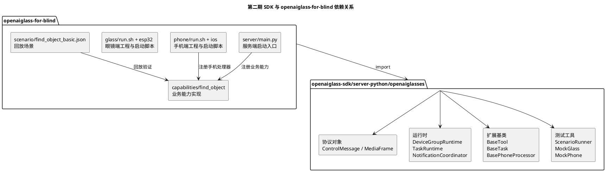
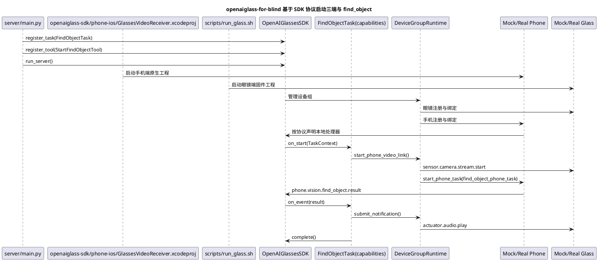

# 第二期 SDK 核心运行时与开发者扩展面产品化开发计划

## 1. 需求理解

第二期目标不是继续增加某一个具体业务功能，而是把当前已经完成的设备注册、设备绑定、语音运行时、任务运行时、手机视频链路和 `find_object` 最小闭环，收敛成面向开源开发者可使用的 SDK 形态。

第二期必须完成：

1. 明确 SDK 框架代码与业务样例代码的目录边界。
2. 固化 `DeviceGroupRuntime`，承接设备组、设备绑定、组内路由和能力查询。
3. 固化 `DeviceGroupContext`，作为 Tool、Task 和后续 PhoneProcessor 的统一开发者上下文。
4. 收敛服务器侧扩展面，形成稳定的 `BaseTool / BaseTask / TaskContext`。
5. 定义手机侧扩展面最小骨架，形成 `BasePhoneProcessor / BasePhoneTask / BaseSensorProvider`。
6. 将 `find_object_task` 迁移为 SDK 官方样例能力，而不是继续作为框架内部特殊逻辑。
7. 建立最小样例回放测试结构，支持后续开发者不依赖真机完成能力自测。

第二期暂不完成：

1. 完整导航业务实现。
2. 完整 Android / iOS 原生 SDK 发布形态。
3. 手机侧真实模型热更新、模型下载和多模型管理。
4. 完整插件市场、能力包发布和版本兼容机制。
5. 生产级鉴权、租户隔离和远程 OTA。

## 2. 现状分析

第二期启动时，仓库已经具备以下基础：

1. 原 `openaiglass-sdk/server-python/agent_core` 中已经有 `BaseTool` 和工具注册表，最终已迁入 `openaiglass-sdk/server-python/agent_core`。
2. 原 `openaiglass-sdk/server-python/backend_task_core` 中已经有 `TaskSpec / TaskRuntime / TaskEvent / TaskGateway`，最终已迁入 `openaiglass-sdk/server-python/backend_task_core`。
3. 原 `openaiglass-sdk/server-python/api/ws/control_runtime.py` 中已经支持眼镜和手机注册、绑定、运行态查询、视频链路启动和停止，最终已由 `openaiglass-sdk/server-python/api/ws/control_runtime.py` 承载。
4. 原 `openaiglass-sdk/server-python/runtime/voice_runtime.py` 已经承担语音会话、模型调用、回复播报和通知播放，最终已由 `openaiglass-sdk/server-python/runtime/voice_runtime.py` 承载。
5. `openaiglass-sdk/phone-ios` 已经有手机视频接收、回显、注册和通用手机任务承载能力；找物体业务闭环已迁入官方 `openaiglass-for-blind`。
6. `PhaseK` 已经证明 `find_object_task` 可以作为首个三端视觉样板能力。

当前主要缺口：

1. 设备组逻辑仍散在 `ControlRuntime` 中，没有独立的 `DeviceGroupRuntime`。
2. Tool 仍通过 `AgentToolContext.device_state_reader()` 读取运行态快照，开发者可能接触到底层绑定表。
3. 当前 `AgentToolContext` 更像系统内部上下文，不是面向 SDK 开发者的高层 `DeviceGroupContext`。
4. `BaseTask` 还没有作为开发者可继承的稳定抽象。
5. 手机侧扩展面还没有产品化，当前手机代码仍偏具体 App 实现。
6. 当前业务能力和 SDK 框架边界不够清楚，后续若继续把能力写进 `openaiglass-sdk/server-python`，会导致 SDK 难以开源复用。

结论：

1. 第二期最重要的不是补更多业务功能，而是完成 SDK 框架层和业务扩展层的隔离。
2. `find_object_task` 应从“项目内置能力”调整为唯一官方 `openaiglass-for-blind` 中的业务实现，用于反向验证 SDK 是否足够高层。
3. 只有当 `openaiglass-for-blind` 中的业务代码不再处理设备绑定、WebSocket、媒体链路和任务回流，SDK 形态才算初步成立。

## 3. 第二期阶段划分

第二期可以按四个阶段推进。每个阶段都应该有独立验收结果，避免把 SDK 产品化改造成一次高风险大重构。

### 3.0 历史阶段判断（2026-04-24，已被 3.0.4 覆盖）

结合当时仓库实现、样例目录和自动化测试结果，当时开发阶段判断为：

| 阶段 | 当前状态 | 说明 |
| --- | --- | --- |
| Phase A：目录边界与 SDK 包骨架 | 已完成 | `openaiglass-sdk/server-python/openaiglasses` 包骨架、`openaiglass-for-blind/` 官方案例目录、`server/main.py` 启动入口均已落地，依赖方向保持为 `openaiglass-for-blind -> sdk`。 |
| Phase B：DeviceGroupRuntime 与 DeviceGroupContext | 已完成 | `DeviceGroupRuntime` 与 `DeviceGroupContext` 已实现，抓拍、查询设备、启动手机视频链路、通知提交、任务创建等高层接口已经具备。 |
| Phase C：服务器侧与手机侧扩展面 | 主体完成，进入收口 | `BaseTool / BaseTask / TaskContext`、`BasePhoneProcessor / BasePhoneTask / BaseSensorProvider`、能力注册表、`OpenAIGlassesSDK` 主入口、真实服务端装配能力均已落地，当时根目录系统编排与 SDK 集成层的边界仍需继续收紧。 |
| Phase D：find_object 官方 openaiglass-for-blind 与回放测试最小闭环 | 最小闭环完成，等待最终 SDK 化验收 | `capabilities/find_object` 的服务端 Tool/Task、手机端 Processor/PhoneTask 已落地，`ScenarioRunner` 与相关单元测试已可以验证最小闭环；当时已从写死首个样板能力改为能力处理器分发机制，但整体开发者体验仍需要继续收口。 |

当时整体判断：

1. 第二期已经从“方案设计阶段”进入“收口与产品化补完阶段”。
2. 当时工作重点不是再加业务能力，而是把系统细节继续收进 SDK，并把根目录 SDK运行时 与官方样例彻底切开。
3. 从阶段位置上看，当时处于第二期后半段，距离“开发者只围绕基类写业务”的最终验收状态仍有差距。

### 3.0.1 收口验证状态（2026-04-25）

当前已经完成一次 SDK 联调前预检收口：

```bash
uv run python script/run_sdk_preflight.py --report logs/sdk-preflight-current.json
```

预检结果：

1. `compileall` 通过。
2. 官方三端入口检查通过。
3. `testdata/scenario` 下 4 个场景回放全部通过。
4. 第二期核心 pytest 通过。
5. 服务端 `/api/health` 健康检查通过。

本轮修复了运行态快照中 `diagnostics` 字段不可达的问题，使音频旁路设备诊断可以稳定出现在 `/api/runtime/devices` 响应中。需要注意：这些预检结果只说明“最小样例闭环可运行”，不等于第二期已经达到 SDK 化验收标准。

### 3.0.2 根目录收口进展（2026-04-25）

围绕“根目录只保留 SDK运行时 与系统运行时代码”这一目标，当前已经完成：

1. `openaiglass-sdk/server-python` 已移除 `start_find_object` 内建 Tool、`find_object_task` 内建任务模板，以及 `/api/debug/find-object/start`、`/api/vision/find-object/report` 这类找物体专用服务端入口。
2. 手机端示例能力已改为通过 SDK 高层接口 `start_phone_task()` / `stop_phone_task()` 和通用事件上报接口 `/api/tasks/report-event` 与服务端协作，不再依赖根目录中的找物体专用协议分支。
3. `openaiglass-sdk/phone-ios` 根目录运行时代码已经抽成通用 `PhoneTaskCapabilityRuntime` SDK运行时；`find_object` 的业务检测与上报逻辑位于 `capabilities/find_object/phone/ios/FindObjectPhoneCapability.swift`。
4. `openaiglass-sdk/phone-ios` 中与 `find_object` 直接耦合的业务测试已迁到 `capabilities/find_object/phone/ios/FindObjectPhoneCapabilityTests.swift`，根目录测试只保留 SDK运行时 通用行为验证。
5. `openaiglass-sdk/server-python` 已移除 `timer_manage / create_timer / map_manage` 这类历史高层业务能力；根服务端默认只保留系统级硬件原语 `capture_photo` 和后台任务管理内部支撑。
6. 根服务端默认 MCP 注册表不再内置 `AmapMcpAdapter`，外部业务项目需要通过 SDK 装配入口注册自己的 MCP adapter。
7. 根 `openaiglass-sdk/phone-ios` 已不再直接调用 `makePhoneCapabilityRuntime()` 这类官方样板函数，改为通过 `PhoneCapabilityRuntimeFactory` 与 `PhoneCapabilityBootstrap` 做通用装配。

按 2026-04-25 重新校准后的边界判断：

1. 根目录 `openaiglass-sdk/server-python` 已基本不再承载 `find_object` 这类业务能力，但系统编排仍有一部分没有完全收进 SDK 集成层。
2. 根目录 `openaiglass-sdk/phone-ios` 已以 SDK运行时 为主，`find_object` 业务实现已迁到 `capabilities/find_object/phone/ios`，但 SDK运行时 无关化仍需继续验证。
   - 当前已经去掉根页面对官方样板运行时工厂的直接调用，改为通用工厂装配。
3. 根目录 `glass` 未发现 `find_object / timer / map / navigation` 等明确业务实现，但仍存在少量带业务假设的注释和默认行为描述，需要继续清理。
4. 官方业务样例已集中在 `capabilities/find_object` 和 `capabilities/find_object/phone/ios/FindObjectPhoneCapability.swift`，这一方向正确。

### 3.0.2.2 `openaiglass-sdk/server-python` 迁移进展（2026-04-25）

按“`server/` 只保留薄 SDK运行时，开发者不需要关心的系统实现全部进入 SDK”这一要求，当前已执行以下迁移动作：

1. 先对原 `openaiglass-sdk/server-python` 完整实现做了目录级备份：
   - [backup/server_src_20260425_195102](/Users/elio/dev/llm-project/OpenAIglassesDemo_2/backup/server_src_20260425_195102)
2. 已将以下顶层系统包整体迁入 `openaiglass-sdk/server-python`：
   - `agent_core`
   - `api`
   - `app`
   - `backend_task_core`
   - `devtools`
   - `infra`
   - `protocol`
   - `runtime`
3. 当前根目录 [openaiglass-sdk/server-python](/Users/elio/dev/llm-project/OpenAIglassesDemo_2/openaiglass-sdk/server-python) 仅保留薄壳桥接层：
   - [openaiglass-sdk/server-python/_sdk_bridge.py](/Users/elio/dev/llm-project/OpenAIglassesDemo_2/openaiglass-sdk/server-python/_sdk_bridge.py:1)
   - 各顶层包的 `__init__.py` 兼容导入壳
4. 旧导入路径仍然可用，但真实实现已经从 `openaiglass-sdk/server-python` 目录加载。
5. `ScenarioRunner` 已从直接写死 `find_object` 执行分支，调整为能力处理器分发机制；当前 `find_object` 的场景处理器已注册到 `openaiglass-for-blind/`，SDK 回放层只保留通用框架。
6. 根 `openaiglass-sdk/phone-ios` SDK运行时已从直接依赖官方样板能力工厂，调整为通用工厂与启动器模式，减少 SDK运行时 对 `find_object` 的默认认知。

这一步的意义是：

1. 先从目录物理形态上打破“SDK 包一层、真实实现还在 `openaiglass-sdk/server-python`”的过渡状态。
2. 让后续继续清理系统边界时，不必再一边改逻辑、一边和旧目录事实冲突。
3. 把 `openaiglass-sdk/server-python` 明确降级为兼容壳，而不再视为主要实现目录。

### 3.0.2.1 按当前验收要求的过渡状态（2026-04-25，已被 3.0.4 覆盖）

本期重新按以下三条硬要求判断：

1. 所有系统细节都隐藏在 SDK 中。
2. `openaiglass-for-blind` 中只保留开发者需要关注的基类业务实现。
3. 根目录 `server / glass / phone` 下不再含有业务代码，全部迁移到 `openaiglass-for-blind` 或 `sdk` 中。

当时结论：

1. **第 1 条待完成**
   - `openaiglass-sdk/server-python` 主体实现已经迁入 SDK，服务端方向前进明显。
   - 但 `phone / glass` 的 SDK运行时 与部分兼容壳仍需继续收薄，所以“所有系统细节都隐藏在 SDK 中”当时还处于收口中。
2. **第 2 条部分达到**
   - `find_object` 样例已经基本按 `Tool / Task / PhoneTask / PhoneProcessor` 组织。
   - 当前测试回放层已经改成能力处理器分发机制，且 `find_object` 场景处理器已迁入 `openaiglass-for-blind/`；手机 SDK运行时 也已改成通用工厂装配，不再把首个官方样板直接写死在总流程分发或页面创建里；但开发者体验还需要更多样板能力和 SDK运行时 文档来验证。
3. **第 3 条大体接近，进入最后收口**
   - 明显业务能力大多已经迁出根目录。
   - 但根目录 `phone / glass` 的 SDK运行时 与 SDK 的系统边界当时还没有最终收紧，因此仍需继续推进到“根目录只剩 SDK运行时、业务都在 openaiglass-for-blind/sdk”的验收状态。

### 3.0.3 第二期剩余收口项判断（2026-04-25）

结合当前实现状态，以下事项虽然一度看起来像“下一期工作”，但本质上仍属于第二期收口范围，而不应独立定义为新一期：

1. 公共契约收口
   - 当前 `DeviceGroup`、控制消息、任务事件、手机任务事件上报等能力已经可用，但还没有形成稳定的 SDK 对外承诺面。
   - 这仍属于“稳定 `BaseTool / BaseTask / DeviceGroupContext / PhoneTask` 开发者使用面”的工作，而不是新功能期。
2. phone / glass 的 SDK运行时 继续去业务化
   - 当前根目录已经完成了大部分 `find_object` 业务剥离，但手机端和眼镜端的 SDK运行时 仍需要继续收口成真正能力无关的 SDK运行时。
   - 这仍属于第二期“目录边界与开发者扩展面产品化”的延伸。
3. 回放测试继续提升为 SDK 级验证
   - 当前 `ScenarioRunner` 已具备能力处理器分发机制和最小样板回放能力，但契约金样、兼容性回归、预检整合仍需继续扩展。
   - 这仍属于第二期“建立最小样例回放测试结构”的后续补完，而不是新的业务期目标。

因此，后续与“公共契约、SDK运行时产品化、契约级测试”有关的工作，应统一视为 **第二期下半程收口计划**，而不是独立的新一期。

### 3.0.4 第二期最终收口状态（2026-04-26）

按本期最新验收要求，当前第二期收口状态更新为：

| 验收要求 | 当前状态 | 代码与测试证据 |
| --- | --- | --- |
| 所有系统细节隐藏在 SDK 中 | 已达到第二期验收口径 | 服务端主体实现已迁入 `openaiglass-sdk/server-python`；`openaiglass-sdk/server-python` 只保留兼容桥接；`DeviceGroupContext`、`TaskContext`、`PhoneRuntime` 承担开发者扩展面。 |
| `openaiglass-for-blind` 中只有开发者关注的基类业务实现 | 已达到第二期验收口径 | 官方业务能力集中在 `capabilities/find_object` 和 `capabilities/find_object/phone/ios`；`ScenarioRunner` 通过能力处理器注册，不再内建样板能力。 |
| 根目录 `server / glass / phone` 不再含业务代码 | 已达到第二期验收口径 | `script/run_sdk_preflight.py` 新增 `sdk_boundary` 检查，扫描根运行时和 Xcode 工程文件，拦截 `find_object / timer_manage / map_manage / Amap / navigation_task` 等业务词汇以及对 `openaiglass-for-blind` 的反向依赖。 |
| 公共契约有测试保护 | 已达到第二期验收口径 | `server/test/contracts` 与 `testdata/contracts` 已纳入 `run_sdk_preflight`。 |
| 官方样例可离线验收 | 已达到第二期验收口径 | `testdata/scenario` 的 5 个场景回放和 `testdata/compat/find_object_scenarios.json` 兼容性回归已纳入预检。 |

本轮关键收口动作：

1. 根 iOS 工程不再默认编译 `capabilities/find_object/phone/ios/FindObjectPhoneCapability.swift` 与对应业务测试，根目录手机工程回到通用 SDK运行时。
2. 根 iOS 运行时仍保留 `PhoneCapabilityRuntimeFactory / PhoneCapabilityBootstrap` 通用装配入口，外部开发者或示例宿主可以显式接入自己的手机能力。
3. 预检脚本新增 `sdk_boundary` 检查，把“根目录不能重新长业务代码”从文档要求变成自动化验收项。
4. 手机 SDK运行时、眼镜 SDK运行时、SDK 公共契约文档已同步更新边界与验收口径。

因此，从第二期目标看，当前已经达到“开发者主要围绕 `BaseTool / BaseTask / BasePhoneTask / BasePhoneProcessor` 写业务，系统层细节由 SDK 托管”的验收状态。

### 3.1 第二期 Phase A：目录边界与 SDK 包骨架

目标：

1. 建立 `openaiglass-sdk/server-python/openaiglasses` 包骨架。
2. 建立唯一官方 `openaiglass-for-blind` 目录。
3. 在 `openaiglass-for-blind` 中同时放置三端可运行入口和业务能力实现。
4. 明确 SDK 与 `openaiglass-for-blind` 的依赖方向。
5. 保留现有 `server/phone/glass` 目录可运行。

验收标准：

1. `openaiglass-for-blind` 中的业务代码可以通过 import 使用 SDK。
2. `openaiglass-for-blind` 中的服务端可以通过 Python SDK 启动对应运行时。
3. `openaiglass-for-blind` 中的手机端和眼镜端可以通过脚本或对应平台开发工具启动，并接入 SDK 定义的协议与设备组运行时。
4. SDK 包不反向 import `openaiglass-for-blind`。
5. 现有自动化测试不因目录调整失效。

### 3.2 第二期 Phase B：DeviceGroupRuntime 与 DeviceGroupContext

目标：

1. 从现有 `ControlRuntime` 中抽出设备组运行时职责。
2. 固化 `DeviceGroupRuntime`。
3. 固化 `DeviceGroupContext`。
4. 让 Tool / Task 通过 `DeviceGroupContext` 使用设备组能力。

验收标准：

1. Tool 不再直接解析 `glass_to_phone` 绑定表。
2. Tool 不再直接读取底层 WebSocket 连接对象。
3. `DeviceGroupContext` 可以完成抓拍、查询设备、启动手机视频链路和提交通知。

### 3.3 第二期 Phase C：服务器侧与手机侧扩展面

目标：

1. 稳定 `BaseTool / BaseTask / TaskContext`。
2. 定义 `BasePhoneProcessor / BasePhoneTask / BaseSensorProvider`。
3. 增加能力注册表和 SDK 主入口。
4. 让外部业务能力以注册方式进入运行时。

验收标准：

1. 开发者可以实现并注册一个自定义 `BaseTask`。
2. 开发者可以实现并注册一个自定义 `BasePhoneProcessor`。
3. 注册能力后，运行时可以查询并调度该能力。

### 3.4 第二期 Phase D：find_object 官方 openaiglass-for-blind 与回放测试最小闭环

目标：

1. 将当前 `find_object_task` 迁移为 `capabilities/find_object`。
2. 建立 `MockGlassRuntime / MockPhoneRuntime` 最小版本。
3. 建立 `ScenarioRunner` 最小版本。
4. 用样例回放验证唯一官方 `openaiglass-for-blind` 可以完成三端闭环。

验收标准：

1. `openaiglass-for-blind` 中的 `find_object` 业务实现不直接处理设备绑定、WebSocket 和媒体协议。
2. Mock 场景可以驱动任务进入 `completed`。
3. 真机联调入口仍可使用同一个 `openaiglass-for-blind` 能力。

### 3.5 第二期后半程收口方向

在 Phase D 最小闭环已经成立的前提下，第二期剩余工作建议继续沿以下三个方向收口：

1. 公共契约收口
   - 把当前已经被服务端、手机端、测试资产共同依赖的对象模型、消息格式和事件格式收敛成稳定公共层。
   - 目标是让开发者知道“哪些字段和事件名可以长期依赖”。
2. SDK运行时产品化收口
   - 继续清理 phone / glass 的 SDK运行时 中的业务词汇和样板能力耦合。
   - 目标是让 SDK运行时 只承载连接、路由、上报和任务托管，不承载具体业务。
3. 测试产品化收口
   - 把最小场景回放扩展成更稳定的 SDK 级验证入口。
   - 目标是让第二期结束时，开发者新增能力不必依赖真机才能做第一轮验证。

这部分收口工作的详细拆解，见：

1. [第二期下半程-SDK公共契约与SDK运行时产品化收口计划.md](</Users/elio/dev/llm-project/OpenAIglassesDemo_2/doc/stage2/plan/第二期下半程-SDK公共契约与SDK运行时产品化收口计划.md>)

## 4. 目录结构设计

### 4.1 总体原则

项目目录应区分两类代码：

1. SDK 框架代码：面向开源社区复用，提供运行时、协议、上下文和扩展基类。
2. `openaiglass-for-blind` 案例代码：模拟外部开发者项目，包含实际业务能力实现，也包含服务端、手机端、眼镜端三个可运行入口。服务端通过 import 使用 Python SDK，手机端和眼镜端使用各自平台代码接入 SDK 协议。

开发者新增业务能力时，不应该修改 SDK 框架代码，而应该参考 `openaiglass-for-blind/` 的结构，在自己的项目中实现 `BaseTool / BaseTask / BasePhoneProcessor` 子类。

### 4.2 推荐目录结构

建议后续逐步调整为：

```text
.
├── sdk/
│   ├── python/
│   │   └── openaiglasses/
│   │       ├── __init__.py
│   │       ├── protocol/
│   │       ├── runtime/
│   │       │   ├── device_group.py
│   │       │   ├── notifications.py
│   │       │   ├── tasks.py
│   │       │   └── voice.py
│   │       ├── capabilities/
│   │       │   ├── base_tool.py
│   │       │   ├── base_task.py
│   │       │   └── registry.py
│   │       ├── phone/
│   │       │   ├── base_processor.py
│   │       │   ├── base_phone_task.py
│   │       │   └── sensor_provider.py
│   │       └── testing/
│   │           ├── scenario_runner.py
│   │           ├── mock_glass.py
│   │           └── mock_phone.py
│   ├── phone/
│   │   └── README.md
│   └── glass/
│       └── README.md
├── openaiglass-for-blind/
│   ├── README.md
│   ├── config/
│   ├── server/
│   │   └── main.py
│   ├── phone/
│   │   ├── README.md
│   │   ├── run.sh
│   │   └── ios/
│   ├── glass/
│   │   ├── README.md
│   │   ├── run.sh
│   │   └── esp32/
│   ├── capabilities/
│   │   └── find_object/
│   │       ├── server/
│   │       │   ├── task.py
│   │       │   └── tool.py
│   │       └── phone/
│   │           └── processor.py
│   └── scenario/
│       └── find_object_basic.json
├── testdata/
│   ├── audio/
│   ├── image/
│   ├── video/
│   ├── sensor/
│   ├── map/
│   └── scenario/
├── server/
├── phone/
└── glass/
```

### 4.3 目录迁移策略

为了降低改造风险，不要求一次性把现有 `server/phone/glass` 全部迁移到新目录。

建议采用三步迁移：

1. 第一阶段：先新增 `openaiglass-sdk/server-python/openaiglasses` 和 `openaiglass-for-blind`，保留旧目录可运行。
2. 第二阶段：把框架稳定抽象从 `openaiglass-sdk/server-python` 复制或迁移到 `openaiglass-sdk/server-python/openaiglasses`，旧代码通过兼容导入继续工作。
3. 第三阶段：把 `server`、`phone`、`glass` 作为本仓库官方可运行案例，SDK 框架代码只保留在 `sdk/` 下。

第二期只要求完成第一阶段和关键抽象迁移，不要求完全删除旧路径。

### 4.4 SDK 与 openaiglass-for-blind 的依赖方向

依赖方向必须固定为：

```text
openaiglass-for-blind -> sdk
sdk -> 不依赖 openaiglass-for-blind
```

禁止出现：

```text
sdk -> openaiglass-for-blind
```

原因：

1. SDK 必须可以独立发布。
2. `openaiglass-for-blind` 只是 SDK 使用案例，不应成为框架运行时依赖。
3. `openaiglass-for-blind` 同时提供三端启动入口和业务能力实现，用于模拟真实开发者项目如何集成 SDK。

### 4.5 手机端与眼镜端代码放置原则

手机端和眼镜端不是 Python SDK 的一部分，也不要求改写成 Python 代码。

建议放置方式：

1. `capabilities/find_object/phone/ios`：放 iOS 原生工程，例如当前 `openaiglass-sdk/phone-ios` 中的手机端实现。
2. `openaiglass-sdk/phone-ios/GlassesVideoReceiver.xcodeproj`：放手机端示例启动脚本，可调用 `xcodebuild`、XcodeBuildMCP 或其他平台工具。
3. `glass/esp32`：放 ESP32 / ESP-IDF / Arduino 工程，例如当前 `openaiglass-sdk/glass-esp32` 中的眼镜端实现。
4. `scripts/run_glass.sh`：放眼镜端示例构建、烧录或串口启动脚本，可调用 `idf.py`、Arduino CLI 或其他端侧工具。
5. `server/main.py`：放服务端 Python 示例入口，通过 Python SDK 装配运行时和业务能力。

职责边界：

1. `openaiglass-sdk/server-python/openaiglasses` 提供服务端 SDK、协议对象、运行时抽象、测试工具和跨端契约。
2. `phone` 提供手机侧实际工程代码，负责接入 SDK 协议、注册手机设备、运行本地处理器、接收媒体流。
3. `glass` 提供眼镜侧实际工程代码，负责接入 SDK 协议、采集传感器、推送媒体帧、执行音频和震动反馈。
4. SDK 不直接 import 手机或眼镜工程代码，手机和眼镜工程也不需要 import Python SDK。
5. 三端共享的是协议、配置和设备组模型，而不是同一种编程语言。

## 5. 核心抽象设计

### 5.1 `DeviceGroupRuntime`

`DeviceGroupRuntime` 是第二期最关键的系统模块。

主要职责：

1. 管理 `DeviceGroup` 的创建、查询和销毁。
2. 维护 `glass / phone / server` 三类设备角色。
3. 维护眼镜与手机绑定关系。
4. 提供组内控制消息路由。
5. 提供设备能力查询。
6. 提供媒体链路创建、停止和状态查询入口。
7. 向上层生成 `DeviceGroupContext`。

当前 `ControlRuntime` 中与设备组相关的逻辑，后续应逐步迁移到该模块。

### 5.2 `DeviceGroupContext`

`DeviceGroupContext` 是开发者写 Tool 和 Task 时最重要的上下文对象。

建议首版包含：

1. `group_id`
2. `session_id`
3. `task_id`
4. `require_glass()`
5. `require_phone()`
6. `query_devices()`
7. `capture_photo()`
8. `start_phone_video_link()`
9. `stop_phone_video_link()`
10. `submit_notification()`
11. `emit_task_event()`
12. `create_task()`

开发者不应直接接触：

1. WebSocket 连接对象。
2. 原始设备连接表。
3. `glass_to_phone` 字典。
4. 原始控制消息发送函数。
5. 媒体帧编码和解码细节。

### 5.3 `BaseTool`

`BaseTool` 作为短时能力抽象。

开发者只需要关心：

1. 输入参数模型。
2. 业务逻辑。
3. 结构化返回结果。

示例：

```python
from openaiglasses import BaseTool, CapabilityResult, DeviceGroupContext


class DescribeCurrentSceneTool(BaseTool):
    """描述当前画面的工具。

    主要功能：
    1. 调用 SDK 抓拍当前眼镜画面。
    2. 把图片交给业务模型进行描述。
    3. 返回可被智能体使用的结构化结果。

    主要方法：
    1. run：执行当前画面描述能力。
    """

    name = "describe_current_scene"

    def run(self, context: DeviceGroupContext, input_data: dict) -> CapabilityResult:
        """执行当前画面描述。

        功能：
        1. 通过上下文抓拍当前画面。
        2. 调用业务侧视觉理解逻辑。
        3. 返回自然语言摘要和图片引用。

        参数：
        1. context：SDK 提供的设备组上下文。
        2. input_data：模型或调用方传入的业务参数。

        返回值：
        1. CapabilityResult：结构化能力执行结果。

        异常情况：
        1. 如果当前设备组没有在线眼镜，由 SDK 抛出设备不可用错误。
        """

        photo = context.capture_photo(reason="describe_current_scene")
        summary = describe_image(photo)
        return CapabilityResult.success(summary=summary, asset_refs=[photo])
```

这段 openaiglass-for-blind 不应出现设备绑定、WebSocket、HTTP 路由或控制消息拼装。

### 5.4 `BaseTask`

`BaseTask` 作为长生命周期任务抽象。

开发者只需要关心：

1. 任务输入。
2. 启动逻辑。
3. 外部事件如何推进任务。
4. 任务完成或取消条件。

首版建议接口：

```python
from openaiglasses import BaseTask, TaskContext, TaskEvent


class FindObjectTask(BaseTask):
    """寻找物体任务。

    主要功能：
    1. 启动眼镜到手机的视频链路。
    2. 请求手机侧处理器寻找目标物体。
    3. 根据手机回传结果推进任务状态。

    主要方法：
    1. on_start：任务启动时调用。
    2. on_event：收到外部事件时调用。
    3. on_cancel：任务取消时调用。
    """

    task_type = "find_object_task"

    def on_start(self, context: TaskContext) -> None:
        """启动寻找物体任务。

        功能：
        1. 从任务输入中读取目标物体。
        2. 通过 SDK 启动手机视频链路。
        3. 请求手机侧处理器开始检测。

        参数：
        1. context：SDK 提供的任务上下文。

        返回值：
        1. 无。

        异常情况：
        1. 如果没有绑定手机，由 SDK 抛出设备组不完整错误。
        """

        target = context.input["target_object"]
        context.device_group.start_phone_video_link(reason="find_object")
        context.device_group.start_phone_task(
            task_type="find_object_phone_task",
            params={"target_object": target},
        )
        context.emit_state("running", {"target_object": target})

    def on_event(self, context: TaskContext, event: TaskEvent) -> None:
        """处理手机侧检测事件。

        功能：
        1. 接收手机侧处理器输出的结构化检测结果。
        2. 未找到目标时更新任务上下文。
        3. 找到目标时提交通知并完成任务。

        参数：
        1. context：SDK 提供的任务上下文。
        2. event：手机侧或系统侧产生的任务事件。

        返回值：
        1. 无。

        异常情况：
        1. 如果事件格式非法，SDK 应记录错误并拒绝推进任务状态。
        """

        if event.name != "phone.vision.find_object.result":
            return
        context.update({"last_detection": event.payload})
        if event.payload.get("found"):
            context.device_group.submit_notification(
                text=event.payload.get("summary", "找到目标了"),
                priority="high",
            )
            context.complete(result=event.payload)
```

### 5.5 手机侧扩展面

第二期先定义手机侧接口，不要求完全发布原生 SDK。

首版需要包含：

1. `BasePhoneProcessor`
2. `BasePhoneTask`
3. `BaseSensorProvider`
4. `PhoneProcessorContext`
5. `PhoneTaskContext`

示例：

```python
from openaiglasses.phone import BasePhoneProcessor, PhoneProcessorContext


class YoloFindObjectProcessor(BasePhoneProcessor):
    """手机侧寻找物体处理器。

    主要功能：
    1. 接收眼镜视频帧。
    2. 在手机本地运行目标检测。
    3. 输出结构化检测结果。

    主要方法：
    1. on_frame：处理单帧图像。
    """

    processor_type = "yolo_find_object"

    def on_frame(self, context: PhoneProcessorContext, frame) -> None:
        """处理一帧图像。

        功能：
        1. 读取当前任务目标物体。
        2. 执行本地检测。
        3. 把检测结果交给 SDK 回传。

        参数：
        1. context：手机处理器上下文。
        2. frame：SDK 解码后的图像帧。

        返回值：
        1. 无。

        异常情况：
        1. 模型不可用时应返回结构化错误事件，而不是让任务无声失败。
        """

        target = context.params["target_object"]
        result = detect_object(frame, target)
        context.emit_result(result)
```

## 6. openaiglass-for-blind 设计

### 6.1 openaiglass-for-blind 的定位

`openaiglass-for-blind/` 目录不是临时测试代码，而是 SDK 开源后的唯一官方参考案例。

它应该满足：

1. 整个 `openaiglass-for-blind` 像一个外部开发者项目。
2. `openaiglass-for-blind` 通过 import 使用 SDK。
3. `openaiglass-for-blind` 尽量少依赖仓库内部路径。
4. `openaiglass-for-blind` 有 README，说明业务目标、三端启动方式和测试方式。
5. `openaiglass-for-blind` 有可回放 scenario，降低真机依赖。
6. `openaiglass-for-blind` 中包含服务端 Python 入口、手机端脚本和眼镜端脚本。
7. `openaiglass-for-blind` 中包含实际业务能力实现，例如 `find_object` 的 Tool、Task 和 PhoneProcessor。

### 6.2 唯一官方案例

第二期只提供一个官方案例：`openaiglass-for-blind/`。该目录本身就是完整案例，不再额外拆出多个样例目录。

该案例必须同时验证：

1. 服务端入口可以通过 Python SDK 启动 `DeviceGroupRuntime`、Agent 运行时和 Task 运行时。
2. 手机端工程可以通过 SDK 协议接入设备组，并启动本地处理器实现。
3. 眼镜端工程可以通过 SDK 协议或端侧适配层接入设备组，执行采集和播报。
4. 业务能力代码放在 `capabilities/find_object` 下。
5. 业务能力通过 SDK 注册，不直接接触系统底层连接。

### 6.3 openaiglass-for-blind 不应承担的职责

`openaiglass-for-blind` 中的业务能力实现禁止直接处理：

1. 设备注册。
2. 设备绑定。
3. WebSocket 路由。
4. 媒体帧协议编解码。
5. 通知抢占调度。
6. 任务存储。
7. Agent Loop。

说明：

1. `server/main.py` 可以作为服务端 Python 入口调用 SDK 启动运行时。
2. `openaiglass-sdk/phone-ios/GlassesVideoReceiver.xcodeproj` 可以作为手机端启动入口，调用 iOS 或其他手机平台开发工具启动原生工程。
3. `scripts/run_glass.sh` 可以作为眼镜端启动入口，调用 ESP-IDF、Arduino CLI 或其他端侧工具构建、烧录和运行。
4. `capabilities` 下的业务代码不应处理上述系统职责。
5. 如果业务能力实现需要写这些逻辑，说明 SDK 抽象仍不合格。

## 7. 实现方案描述

### 7.1 总体策略

第二期采用“先抽上下文，再迁移样例”的策略。

实施顺序：

1. 新增 `openaiglass-sdk/server-python/openaiglasses` 包骨架。
2. 新增 `openaiglass-for-blind` 目录和 README。
3. 在 SDK 中定义 `DeviceGroupRuntime / DeviceGroupContext`。
4. 将当前 `ControlRuntime` 中的设备组能力逐步委托给 `DeviceGroupRuntime`。
5. 在 SDK 中定义 `BaseTask / TaskContext`，并适配现有 `TaskGateway`。
6. 在 SDK 中定义手机侧扩展基类。
7. 将当前 `find_object` 的业务逻辑迁移到 `capabilities/find_object`。
8. 在 `server` 中提供服务端 Python 启动入口。
9. 在 `phone` 中放置手机端原生工程和启动脚本。
10. 在 `glass` 中放置眼镜端原生工程和启动脚本。
11. 保留旧接口兼容，确保现有真机联调不被一次性打断。

### 7.2 兼容策略

第二期不应大规模重写现有主链路。

兼容原则：

1. 旧的 `openaiglass-sdk/server-python` 仍可启动。
2. 旧的测试应继续通过。
3. 新 SDK 包先通过适配层调用旧运行时能力。
4. 等 `DeviceGroupRuntime` 稳定后，再逐步反向让旧代码依赖 SDK。

### 7.3 import 方式

`openaiglass-for-blind` 中的业务代码应采用类似方式：

```python
from openaiglasses import BaseTask, BaseTool
from openaiglasses.phone import BasePhoneProcessor
```

`server/main.py` 装配时采用类似方式：

```python
from openaiglasses import OpenAIGlassesSDK
from capabilities.find_object.server.task import FindObjectTask
from capabilities.find_object.server.tool import StartFindObjectTool
from capabilities.find_object.phone.processor import YoloFindObjectProcessor


sdk = OpenAIGlassesSDK()
sdk.register_task(FindObjectTask())
sdk.register_tool(StartFindObjectTool())
sdk.register_phone_processor(YoloFindObjectProcessor())
sdk.run()
```

这能清楚表达：

1. SDK 提供框架能力。
2. `capabilities` 提供业务能力。
3. `server` 负责启动服务端运行时。
4. `phone`、`glass` 负责通过脚本或平台工具启动对应端侧工程。

## 8. 流程图（PlantUML）



## 9. 时序图（PlantUML）



## 10. 自动化测试方案

### 10.1 单元测试

1. 测试目标：验证 `DeviceGroupRuntime` 可以创建设备组。  
测试方法：构造眼镜和手机注册事件，调用设备组运行时。  
预期结果：生成包含 glass 和 phone 的设备组。

2. 测试目标：验证 `DeviceGroupContext.require_phone()` 在无绑定手机时返回结构化错误。  
测试方法：构造只有眼镜的设备组，调用 `require_phone()`。  
预期结果：抛出设备组不完整错误，错误信息包含当前 group_id。

3. 测试目标：验证 `openaiglass-for-blind` 不能被 SDK 包反向 import。  
测试方法：扫描 `openaiglass-sdk/server-python/openaiglasses` 源码中的 import 语句。  
预期结果：不存在 `openaiglass-for-blind` 导入。

4. 测试目标：验证 `BaseTask` 子类可注册。  
测试方法：定义测试任务并调用 `OpenAIGlassesSDK.register_task()`。  
预期结果：任务出现在能力注册表中。

### 10.2 组件测试

1. 测试目标：验证 `openaiglass-for-blind` 中的 `find_object` 能力可通过 SDK 注册。  
测试方法：加载 `capabilities.find_object` 中的 Task、Tool、PhoneProcessor。  
预期结果：SDK 注册表包含对应能力。

2. 测试目标：验证 `FindObjectTask` 不直接访问底层 WebSocket。  
测试方法：扫描 `capabilities/find_object` 源码中的底层协议关键词。  
预期结果：不出现 `websocket`、`glass_to_phone`、`ControlRuntime` 等框架内部细节。

3. 测试目标：验证 `DeviceGroupContext.start_phone_video_link()` 可调用旧视频链路。  
测试方法：用适配层连接现有 `ControlRuntime`，启动视频链路。  
预期结果：眼镜收到推流指令，手机收到处理器启动指令。

### 10.3 跨端模拟测试

1. 测试目标：验证 `openaiglass-for-blind` 在 MockGlass 和 MockPhone 下完成闭环。  
测试方法：使用 `ScenarioRunner` 加载 `testdata/scenario/find_object_basic.json`。  
预期结果：任务进入 `completed`，通知列表包含“找到目标”。

2. 测试目标：验证手机侧处理器结果可回流服务器任务。  
测试方法：MockPhone 投递 `phone.vision.find_object.result(found=true)`。  
预期结果：`FindObjectTask.on_event()` 被调用，任务完成。

3. 测试目标：验证取消任务会停止视频链路。  
测试方法：在 scenario 中插入 `task.cancel` 事件。  
预期结果：MockGlass 收到 `sensor.camera.stream.stop`，MockPhone 收到处理器停止事件。

## 11. 验收标准

第二期完成后应满足：

1. 仓库中存在 `openaiglass-sdk/server-python/openaiglasses` 包骨架。
2. 仓库中存在唯一官方 `openaiglass-for-blind` 目录。
3. `openaiglass-for-blind` 中包含服务端 Python 入口、手机端原生工程和眼镜端固件工程。
4. `capabilities/find_object` 中包含实际业务能力实现。
5. `openaiglass-for-blind` 通过 import 使用 SDK，不直接依赖 `openaiglass-sdk/server-python/api/ws/control_runtime.py` 等系统运行时内部实现。
6. `DeviceGroupRuntime` 能承接现有设备注册、绑定和组内查询能力。
7. `DeviceGroupContext` 能为 Tool 和 Task 提供高层设备组能力。
8. `BaseTask` 和 `TaskContext` 可支持 `find_object_task` 从业务代码中实现。
9. 手机侧扩展基类至少有接口定义和 Mock 测试。
10. `openaiglass-for-blind` 可以通过 MockGlass / MockPhone 回放测试完成闭环。
11. `openaiglass-for-blind` 可以通过 SDK 启动服务端代码，并通过脚本或平台工具启动手机端和眼镜端代码。
12. 现有服务器测试继续通过。
13. 现有真机联调入口不被破坏。

## 12. 风险与处理策略

### 12.1 一次性迁移风险

风险：

1. 当前主链路已经可运行，如果一次性大规模迁移，容易破坏语音、视频和找物体联调。

处理策略：

1. 使用适配层渐进迁移。
2. 先新增 SDK 包，再逐步让旧代码委托给 SDK。
3. 每一步都保留旧测试。

### 12.2 SDK 抽象过早冻结风险

风险：

1. 如果过早冻结 API，后续导航等复杂能力可能发现上下文能力不足。

处理策略：

1. 首版 API 标记为 experimental。
2. 用唯一官方 `openaiglass-for-blind` 中的 `find_object` 能力校验接口。
3. 真正对外发布前再冻结字段和命名。

### 12.3 openaiglass-for-blind 与 SDK 边界再次混淆

风险：

1. 为了快速跑通功能，开发者可能又把业务逻辑写回 SDK。

处理策略：

1. 增加源码扫描测试，禁止 SDK import `openaiglass-for-blind`。
2. 在文档中明确 `openaiglass-for-blind` 是外部开发者项目形态的案例代码。
3. 新业务能力如果只是案例实现，应放入 `capabilities`，不能写入 SDK 框架层。

## 13. 当前方案与架构设计的契合程度

契合度评估：高。

理由：

1. 第二期把 SDK 视角从“项目功能实现”切换为“开发者扩展产品”。
2. 目录结构明确区分框架代码和业务代码。
3. `DeviceGroupRuntime / DeviceGroupContext` 直接解决设备绑定、组内路由和上下文泄漏问题。
4. `BaseTask / BasePhoneProcessor` 让开发者主要围绕能力开发。
5. `capabilities/find_object` 可以成为判断 SDK 是否合格的第一块试金石。

与以下已有架构设计文档的契合情况如下：

1. 与 `/Users/elio/dev/llm-project/OpenAIglassesDemo_2/doc/restriction/软件架构设计.md` 保持一致：系统层继续由“眼镜 + 手机 + 服务器”三端协同构成，SDK 只是把系统职责进一步产品化抽象，并没有改变原始分层关系。
2. 与 `/Users/elio/dev/llm-project/OpenAIglassesDemo_2/doc/sdk-design/SDK产品形态与多端职责定义.md` 保持一致：服务端负责运行时编排与能力装配，手机侧负责本地处理器与传感器任务，眼镜侧负责采集与反馈，职责边界没有被回退到业务代码中。
3. 与 `/Users/elio/dev/llm-project/OpenAIglassesDemo_2/doc/sdk-design/开发者如何基于SDK完成一期与设想功能开发.md` 保持一致：开发者已经可以主要围绕 Tool、Task、PhoneProcessor、PhoneTask 等业务扩展面开发，而不必直接处理底层连接和绑定细节。
4. 与 `/Users/elio/dev/llm-project/OpenAIglassesDemo_2/doc/sdk-design/SDK测试架构与样例回放设计.md` 基本一致：最小回放能力已经进入代码实现，但测试资产目录、场景清单规范和更丰富的回放数据还没有完全补齐。

如果第二期完成后，开发者仍然需要阅读 WebSocket 协议、设备绑定细节或媒体帧传输实现才能写 `find_object`，说明第二期没有真正完成。

## 14. 后续开发计划

### 14.1 第二期剩余收口工作

当前建议优先完成以下收口事项，使第二期能够从“功能已跑通”进入“可对外说明、可持续演进”的状态：

1. **补齐测试资产规范**
   - 建立更正式的 `testdata/` 目录规范。
   - 为 `ScenarioRunner` 增加场景清单、输入资产说明和回放结果断言约定。
   - 当前已补齐 `--describe-scenario`、`--list-scenarios`、`--validate-scenarios` 三类入口，用于资产清点、manifest 校验和目录级检查。
   - 当前已新增 `find_object_with_heading_sensor`，让官方样例开始覆盖“视觉帧 + 传感器”组合输入。
   - 让回放测试从“能跑通一个样例”提升到“可持续新增样例”。
2. **补齐跨端联调文档与脚本引用**
   - 统一 `server`、`phone`、`glass` 的启动说明。
   - 按照当前脚本命名约定整理主流程联调脚本和历史归档脚本。
   - 在文档中明确本地开发、跨设备联调、Mock 回放三种使用路径。
3. **继续收口手机侧 SDK 边界**
   - 明确 `PhoneRuntime`、`PhoneTaskContext`、`SensorProvider` 的最小稳定接口。
   - 当前已补齐 `PhoneRuntime.list_tasks()` 与 `PhoneTaskContext.query_self()`，并已同步到快速开始文档与单元测试。
   - 把当前偏样例性质的手机端对接方式继续整理为更可复用的SDK运行时接入模式。
4. **继续完善官方样例的表达能力**
   - 在 `find_object` 官方样例基础上，补充更多任务状态、异常路径和取消路径说明。
   - 让官方样例不仅能证明成功路径，也能证明失败、取消、设备缺失等场景下 SDK 的行为边界。

### 14.2 下一期建议方向

第二期收口后，建议进入“复杂能力样板验证阶段”，重点不再是最小闭环，而是验证 SDK 对真实复杂业务的承载能力：

1. 方向一：SDK 样例回放测试体系
   - 完整实现 `ScenarioRunner`。
   - 完整实现 `MockGlassRuntime / MockPhoneRuntime`。
   - 建立 `testdata` 目录规范。
2. 方向二：复合导航 SDK 样板能力
   - 实现 `NavigationPrepareTool`。
   - 实现 `NavigationTask`。
   - 定义 `PhoneNavigationTask`。
   - 定义 `GuidanceProcessor`、`TrafficLightProcessor`、`ObstacleProcessor` 等手机侧处理器。

这两个阶段分别验证：

1. SDK 是否容易测试。
2. SDK 是否能承载真实复杂三端业务能力。

### 14.3 当前优先级建议

如果按“离最终开源 SDK 形态更近”为原则排序，建议接下来按以下优先级推进：

1. **第一优先级：完成第二期收口**
   - 先把当前已经具备的运行时、扩展面、样例和测试说明整理完整。
   - 这是后续继续扩功能而不失控的前提。
2. **第二优先级：补强测试与回放体系**
   - 让 SDK 开发者能脱离真机完成日常能力自测。
   - 这是开源可用性的关键门槛之一。
3. **第三优先级：推进导航类复合能力样板**
   - 用更复杂的跨端任务验证当前抽象是否足够稳。
   - 如果导航能力无法顺畅落在当前扩展面上，就说明第二期接口仍需迭代。

## 15. 开发后测试结果

本次按新验收口径收口时，对当前第二期相关实现执行了以下自动化验证：

1. 根系统任务边界回归：

   ```bash
   uv run python -m pytest server/test/unit/test_backend_task_core.py -q
   ```

   结果：**2 个测试全部通过**。
   说明：已验证根 `InMemoryTaskGateway` 不再内建 `phone_video_link_task`，该系统任务改由 SDK 集成层托管。

2. agent-core 与系统工具链回归：

   ```bash
   uv run python -m pytest server/test/unit/test_agent_core.py -q
   ```

   结果：**22 个测试全部通过**。

3. 第二期 SDK 样例与运行时回归：

   ```bash
   uv run python -m pytest server/test/unit/test_sdk_phase_two.py -q
   ```

   结果：**27 个测试中 27 个通过**。

4. 控制面集成回归：

   ```bash
   uv run python -m pytest server/test/integration/test_control_register_flow.py -q
   ```

   结果：**18 个测试全部通过**。
   说明：控制面绑定、调试入口、视频链路启动停止与设备组快照链路未被本轮边界调整破坏。

5. 语法编译检查命令：

   ```bash
   uv run python script/run_sdk_preflight.py --report logs/sdk-preflight-stage2-final.json
   ```

   结果：**最终预检通过**，包含编译、边界、契约、兼容性、核心测试和健康检查。

6. 当前已知告警：
   - `server/test/integration/test_control_register_flow.py` 中的 `TestWebSocketClient` 因定义了 `__init__`，触发 1 条 `PytestCollectionWarning`。
   - 该告警当前不影响主要测试通过，但后续建议单独整理测试辅助类命名或结构，避免误导测试收集过程。

结论：

1. 当前第二期核心运行时、扩展面装配、官方样例接入和关键兼容链路已经具备基本可运行性。
2. 本轮测试额外证明：根 `backend_task_core` 已不再内建 `phone_video_link_task`，该系统任务已开始转入 SDK 集成层管理。
3. 本轮测试还证明：`openaiglass-sdk/server-python` 旧导入路径在保持兼容的前提下，已经切换为从 `openaiglass-sdk/server-python` 加载真实实现。
4. 常用脚本与预检入口已改为默认直接走 `openaiglass-sdk/server-python`，不再把 `openaiglass-sdk/server-python` 作为主导入面。
5. 但上述结果仍不能证明“系统细节都已收进 SDK”或“开发者体验已经达标”；当前测试更多证明的是边界收口正在推进，而不是第二期已经完成。

## 16. 当前实现进展

截至 2026-04-24，第二期实现进展可总结为：

### 16.1 已完成内容

1. 已完成 `openaiglass-sdk/server-python/openaiglasses` 主包骨架建设，并具备对外导出能力。
2. 已完成 `DeviceGroupRuntime` 与 `DeviceGroupContext` 的核心能力落地。
3. 已完成 `BaseTool / BaseTask / TaskContext` 与能力注册表的主要实现。
4. 已完成 `BasePhoneProcessor / BasePhoneTask / BaseSensorProvider / PhoneRuntime` 的最小运行时抽象。
5. 已完成 `OpenAIGlassesSDK` 主入口、`build_agent_facade()`、`build_server_handle()`、`run_server()` 等真实装配能力。
6. 已完成服务端与现有 `agent_core`、`backend_task_core`、`control_runtime` 的桥接适配。
7. 已完成官方 `capabilities/find_object` 样例，包括服务端 Tool/Task 与手机端 Processor/PhoneTask。
8. 已完成第二期相关单元测试、集成测试和编译检查，能够验证最小闭环。
9. 已将 `phone_video_link_task` 从根 `backend_task_core` 内建实现迁出，改为由 SDK 集成层托管，根服务端不再把该系统任务写死在基础任务网关里。
10. 已将原 `openaiglass-sdk/server-python` 主体实现整体迁入 `openaiglass-sdk/server-python`，当前根 `openaiglass-sdk/server-python` 已收缩为兼容旧导入路径的薄壳桥接层。
11. 已将 `ScenarioRunner` 从样板能力写死分支改为能力处理器分发机制，并把 `find_object` 场景处理器迁入 `capabilities/find_object/scenario.py`；SDK 回放层不再默认回退到 `find_object`。
12. 已将根 `openaiglass-sdk/phone-ios` SDK运行时 从直接依赖官方样板运行时工厂，调整为 `PhoneCapabilityRuntimeFactory + PhoneCapabilityBootstrap` 通用装配模式。

### 16.2 已完成但后续仍可增强的内容

1. `ScenarioRunner` 与 Mock 体系已经具备第二期验收所需的最小版本，并已切到能力处理器分发机制；后续可以继续扩展更多业务场景样本。
2. 手机侧扩展面已具备接口和样例接入方式，并已明确 `PhoneRuntime.query_task/list_tasks`、`PhoneTaskContext.query_self` 等最小稳定接口；根 `openaiglass-sdk/phone-ios` 当前只编译通用 SDK运行时。
3. 官方样例已经可以证明正向闭环，并已补齐第二期验收所需的边界检查、回放测试和文档说明；后续可以继续补强异常场景和设备缺失场景。
4. 快速开始文档、样例说明、最终验收方案和预检脚本已经对齐，能够支撑第二期交付验收。

### 16.3 不属于第二期最终验收范围的后续内容

1. 导航类复合能力的官方样板实现。
2. 完整 Android / iOS 原生 SDK 发布形态。
3. 正式的能力包发布、插件市场、版本兼容与升级策略。
4. 生产级鉴权、租户隔离、远程 OTA 等产品化能力。

### 16.4 当前阶段结论

1. 按第二期定义，SDK 核心运行时与开发者扩展面已经完成最终验收所需的代码、测试、边界检查和文档收口。
2. 当前根 `server / phone / glass` 不再承载官方样板业务代码，系统细节已经收入 SDK，官方业务样例集中在 `openaiglass-for-blind`。
3. 当前 `openaiglass-sdk/server-python` 已收缩为兼容旧导入路径的薄壳桥接层，真实服务器入口与运行时实现位于 `openaiglass-sdk/server-python`。
4. 开发者开发官方样例能力时，只需要实现 Tool、Task、PhoneProcessor、PhoneTask、场景回放处理器等业务扩展点，不需要理解底层连接、绑定、消息路由和系统任务编排。
