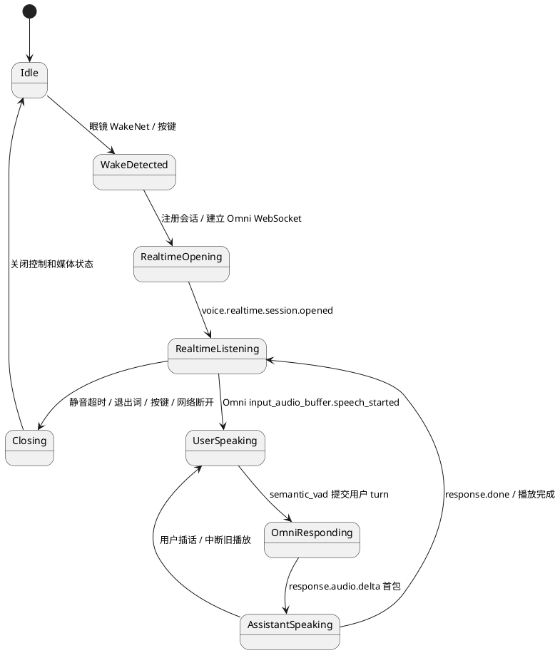
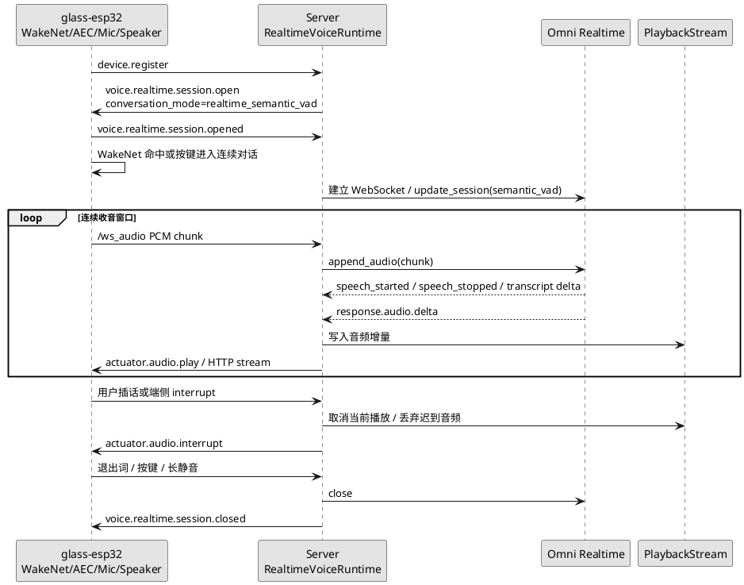

# Omni 语义实时连续对话设计

更新时间：2026-04-30

## 1. 目标

本文描述“方案二”：以真实 `glass-esp32` 眼镜为目标终端，使用 Qwen Omni Realtime 的 `semantic_vad` 承担连续对话的 turn detection，让用户在一次唤醒后可以自然追问、插话和等待，不必每轮都重复唤醒词。

`glass-playback` 只作为协议回放、延迟观测和回归验收工具，不作为真实声学能力的判断依据。真实体验仍以 ESP32 眼镜的麦克风、扬声器、WakeNet、AEC/VAD 和网络条件为准。

## 2. 官方能力依据

阿里云百炼 Qwen Omni Realtime 文档提供以下能力，适合作为 SDK 方案二的基础：

1. 通过 WebSocket 建立实时会话，客户端可以持续追加音频输入。
2. 模型可返回 `response.audio.delta`，服务端可把音频增量直接下发眼镜播放。
3. 会话可配置 turn detection，类型包括 `server_vad` 和 `semantic_vad`。
4. turn detection 支持阈值、前缀保留音频和静音时长等参数。
5. 语义 VAD 可以比纯能量 VAD 更适合判断用户是否真的说完一句话。

官方文档地址：

https://help.aliyun.com/zh/model-studio/realtime

## 3. 设计原则

1. 唤醒仍由眼镜端负责。服务端不尝试在远端原始音频里做 WakeNet。
2. 一次唤醒后进入连续会话窗口，后续 turn 由 Omni `semantic_vad` 判断。
3. 眼镜侧必须提供本地退出条件，例如按键退出、长静音超时、用户明确说“退出对话”。
4. 服务端不做声纹识别。嘈杂环境和旁人说话先通过端侧近场拾音、AEC、VAD 阈值、方向性麦克风和交互策略降低误触发。
5. SDK 保留现有 `agent_tts` 和 `segment_turn` 链路。业务需要 Tool、Task、Skill、MCP 编排时仍可回退。

## 4. 状态机

## 5. 端到端流程

## 6. 配置

本轮 SDK 新增以下配置，全部可写入 `local_server.env`：

| 配置项 | 默认值 | 说明 |
| --- | --- | --- |
| `VOICE_REPLY_MODE` | `omni_realtime` | 默认使用 Omni 全模态语音直出。 |
| `VOICE_INPUT_MODE` | `auto` | `omni_realtime` 下等价于 `raw_audio`，不走独立 ASR。 |
| `VOICE_CONVERSATION_MODE` | `realtime_semantic_vad` | SDK 默认连续对话模式。设为 `segment_turn` 可回退到旧的单段提交模式。 |
| `VOICE_REALTIME_TURN_DETECTION` | `semantic_vad` | Omni turn detection 类型，可选 `semantic_vad` 或 `server_vad`。 |
| `VOICE_REALTIME_SEMANTIC_VAD_THRESHOLD` | `0.65` | 语义 VAD 阈值，嘈杂环境可适当调高。 |
| `VOICE_REALTIME_SILENCE_DURATION_MS` | `800` | 判定用户说完的静音时长。 |
| `VOICE_REALTIME_PREFIX_PADDING_MS` | `300` | 句首保留音频，避免切掉开头。 |

`VOICE_CONVERSATION_MODE=realtime_semantic_vad` 必须配合 `VOICE_REPLY_MODE=omni_realtime`。如果使用 `agent_tts` 分支，SDK 会拒绝该配置，避免开发者误以为文本 Agent 能自动承担全实时语音 turn detection。

## 7. 当前实现范围

当前 `sdk-v56` 已把方案二作为默认链路，并在 ESP32-S3 上补齐播放中自然插话的第一版端侧入口：

1. `ServerSettings` 增加语音对话模式和 Omni turn detection 参数。
2. `local_server.env.example` 暴露所有新增配置。
3. `voice.realtime.session.open` 的 `input.turn_detection` 描述服务端期望的 turn detection 策略。
4. Omni Realtime 会话创建时，把 `enable_turn_detection`、`turn_detection_type`、`threshold`、`silence_duration_ms` 和 `prefix_padding_ms` 传入官方 SDK。
5. 服务端在 `sensor.audio.segment.started` 时前置自动抓拍，照片就绪后在已有上行音频的前提下追加到 Omni，避免先传图片触发官方接口的顺序错误。
6. `realtime_semantic_vad` 下服务端不再手动 `commit()` 和 `create_response(...)`，而是等待 Omni `semantic_vad` 自动提交和自动响应。
7. 真实 `glass-esp32` 在一次 WakeNet 命中后打开 30 秒连续对话窗口，播放结束后继续保持窗口，下一轮语音可由本地 VAD 直接触发。
8. ESP32-S3 固件默认 `CONFIG_GLASS_ENABLE_AEC=y`，使用 ESP-SR AFE `MR` 输入格式，把麦克风音频和扬声器播放参考音频交错送入 AEC。
9. 播放期间如果连续对话窗口仍有效，端侧保持监听；检测到用户插话时先发送 `user.voice.interrupt`，本地中断当前播放，然后开启新的语音段。
10. 服务端收到插话后会清理当前和排队播放流，并丢弃旧 Omni/TTS 回复迟到的音频分片，避免被打断的旧回答重新入队。
11. 增加单元测试，保证配置校验、协议 payload、Omni 会话参数、semantic_vad 自动响应等待和打断后迟到音频丢弃不会回退。

当前仍不是完整全双工生产形态。`sdk-v56` 已具备播放中自然插话的代码链路，但 AEC 质量依赖真实板子的扬声器参考信号、麦克风位置、音量、佩戴结构和环境噪声；`glass-playback` 不能验证这项声学能力。当前服务端先保证旧播放可被中断且迟到音频被丢弃，上游 Omni response 主动取消仍需要结合官方 SDK 能力继续补齐。

## 8. 后续开发计划

### Phase 1：AEC 和播放中插话

状态：`sdk-v56` 已完成第一版。

1. 在 ESP32-S3 端接入 ESP-SR AFE AEC，输入格式从 `M` 扩展为 `MR`。
2. 播放期间保持麦克风采集，并在检测到近场用户语音时向服务端发送 interrupt。
3. 服务端收到插话后通过播放仲裁下发 `actuator.audio.interrupt`，并丢弃旧回复迟到音频。
4. 后续需要继续补齐上游 Omni response 主动取消，并增加真机声学调参日志。

### Phase 2：更完整的连续会话状态

1. 在 `VoiceRuntime` 中收敛独立的连续对话会话管理器，减少每段语音重新创建上下文的开销。
2. 支持按键退出、长静音退出、退出词、网络异常退出和运行态清理。
3. 增加“保持会话但不响应”的等待状态，避免环境噪声频繁触发模型响应。
4. 对真实眼镜增加日志：开始连续收音、首个上行 chunk、收到首段下行音频、首段写入扬声器、退出原因。

### Phase 3：glass-playback 验收工具

1. 增加连续对话时间线回放，支持多段用户语音和插话。
2. 支持模拟旁人说话、背景噪声、长静音和退出词。
3. 输出设备级断言：是否进入连续对话、是否只唤醒一次、是否收到音频首包、是否正确打断。

### Phase 4：嘈杂环境策略

1. 为真实眼镜增加可调 VAD/semantic_vad profile：室内、街边、商场。
2. 对旁人说话误触发增加保护：短时间忽略远场低置信度语音、播放期间提高阈值、需要近场能量或方向性特征。
3. 增加“保持会话但不响应”的等待状态，避免环境噪声频繁触发模型响应。

## 9. 验收标准

1. `VOICE_CONVERSATION_MODE=realtime_semantic_vad` 下，服务端配置摘要、`voice.realtime.session.open` payload 和 Omni `update_session` 参数一致。
2. 真机进入连续对话后，一次唤醒至少支持两轮追问，不要求重复唤醒词。
3. `VOICE_CONVERSATION_MODE=segment_turn` 下，现有 Omni 语音直出回归不退化。
4. 长静音、退出词、按键和网络断开都能关闭会话并清理运行态。
5. 播放中插话需要 ESP32-S3 真机验证：助手播放时说新问题，旧播放应立即停止，新语音段应进入下一轮 Omni 回复。

## 10. 风险

1. Omni `semantic_vad` 不能替代端侧近场语音判断，嘈杂环境仍需要硬件和端侧算法配合。
2. AEC 配置打开不等于声学效果稳定，播放参考信号延迟、音量、外放结构或室外噪声都会影响插话识别。
3. Omni Realtime 直出模式暂不执行 SDK Tool、Task、Skill、MCP；需要业务编排时应使用 `agent_tts`。
4. 连续对话会增加麦克风常开时间，必须在产品上明确唤醒、监听、等待和退出状态。
