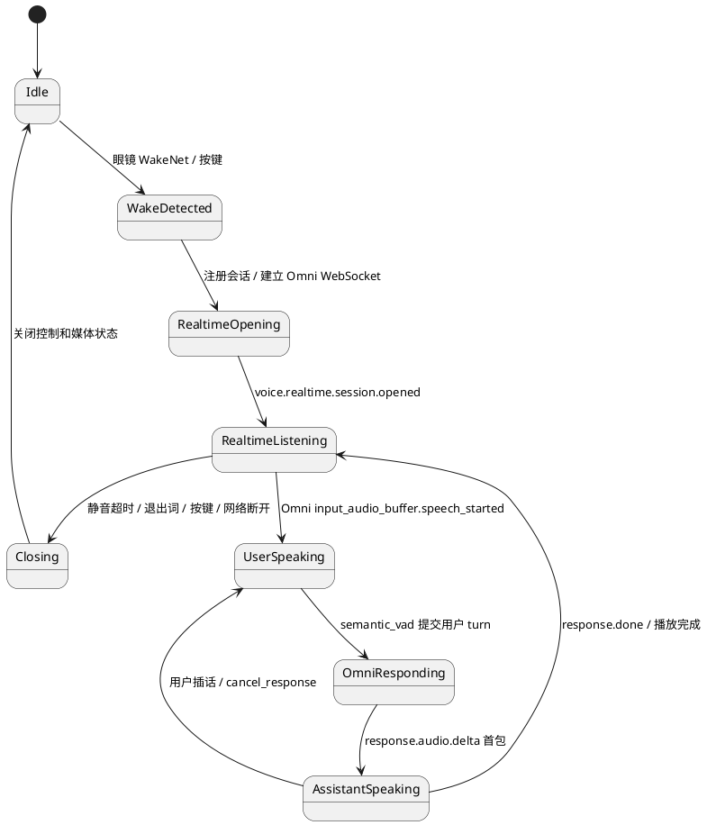
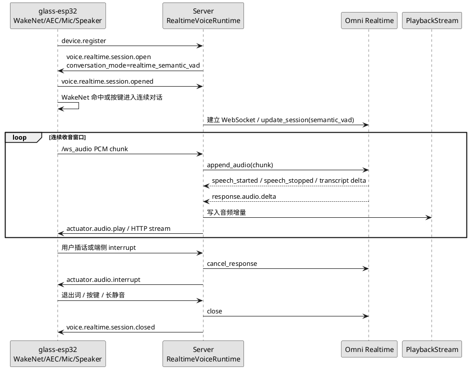

# Omni 语义实时连续对话设计

更新时间：2026-04-29

## 1. 目标

本文描述“方案二”：以真实 `glass-esp32` 眼镜为目标终端，使用 Qwen Omni Realtime 的 `semantic_vad` 承担连续对话的 turn detection，让用户在一次唤醒后可以自然追问、插话和等待，不必每轮都重复唤醒词。

`glass-playback` 只作为协议回放、延迟观测和回归验收工具，不作为真实声学能力的判断依据。真实体验仍以 ESP32 眼镜的麦克风、扬声器、WakeNet、AEC/VAD 和网络条件为准。

## 2. 官方能力依据

阿里云百炼 Qwen Omni Realtime 文档提供以下能力，适合作为 SDK 方案二的基础：

1. 通过 WebSocket 建立实时会话，客户端可以持续追加音频输入。
2. 模型可返回 `response.audio.delta`，服务端可把音频增量直接下发眼镜播放。
3. 会话可配置 turn detection，类型包括 `server_vad` 和 `semantic_vad`。
4. turn detection 支持阈值、前缀保留音频和静音时长等参数。
5. 语义 VAD 可以比纯能量 VAD 更适合判断用户是否真的说完一句话。

官方文档地址：

https://help.aliyun.com/zh/model-studio/realtime

## 3. 设计原则

1. 唤醒仍由眼镜端负责。服务端不尝试在远端原始音频里做 WakeNet。
2. 一次唤醒后进入连续会话窗口，后续 turn 由 Omni `semantic_vad` 判断。
3. 眼镜侧必须提供本地退出条件，例如按键退出、长静音超时、用户明确说“退出对话”。
4. 服务端不做声纹识别。嘈杂环境和旁人说话先通过端侧近场拾音、AEC、VAD 阈值、方向性麦克风和交互策略降低误触发。
5. SDK 保留现有 `agent_tts` 和 `segment_turn` 链路。业务需要 Tool、Task、Skill、MCP 编排时仍可回退。

## 4. 状态机

## 5. 端到端流程

## 6. 配置

本轮 SDK 新增以下配置，全部可写入 `local_server.env`：

| 配置项 | 默认值 | 说明 |
| --- | --- | --- |
| `VOICE_REPLY_MODE` | `omni_realtime` | 默认使用 Omni 全模态语音直出。 |
| `VOICE_INPUT_MODE` | `auto` | `omni_realtime` 下等价于 `raw_audio`，不走独立 ASR。 |
| `VOICE_CONVERSATION_MODE` | `segment_turn` | 当前稳定值。设为 `realtime_semantic_vad` 后启用方案二实验接线。 |
| `VOICE_REALTIME_TURN_DETECTION` | `semantic_vad` | Omni turn detection 类型，可选 `semantic_vad` 或 `server_vad`。 |
| `VOICE_REALTIME_SEMANTIC_VAD_THRESHOLD` | `0.65` | 语义 VAD 阈值，嘈杂环境可适当调高。 |
| `VOICE_REALTIME_SILENCE_DURATION_MS` | `800` | 判定用户说完的静音时长。 |
| `VOICE_REALTIME_PREFIX_PADDING_MS` | `300` | 句首保留音频，避免切掉开头。 |

`VOICE_CONVERSATION_MODE=realtime_semantic_vad` 必须配合 `VOICE_REPLY_MODE=omni_realtime`。如果使用 `agent_tts` 分支，SDK 会拒绝该配置，避免开发者误以为文本 Agent 能自动承担全实时语音 turn detection。

## 7. 本轮实现范围

本轮作为方案二第一阶段，先完成不破坏现有链路的基础接线：

1. `ServerSettings` 增加语音对话模式和 Omni turn detection 参数。
2. `local_server.env.example` 暴露所有新增配置。
3. `voice.realtime.session.open` 的 `input.turn_detection` 描述服务端期望的 turn detection 策略。
4. Omni Realtime 会话创建时，把 `enable_turn_detection`、`turn_detection_type`、`threshold`、`silence_duration_ms` 和 `prefix_padding_ms` 传入官方 SDK。
5. 增加单元测试，保证配置校验、协议 payload 和 Omni 会话参数不会回退。

本轮还不是完整的生产级连续对话。当前稳定默认仍是 `segment_turn`：眼镜按一次用户语音段上传，服务端在语音段结束后提交 Omni 响应。

## 8. 后续开发计划

### Phase 1：服务端 Omni 事件桥

1. 在 `VoiceRuntime` 中增加独立的连续对话会话管理器。
2. 在 `sensor.audio.segment.started` 之外支持长连接持续上行音频。
3. 将 Omni 的 `speech_started`、`speech_stopped`、`response.audio.delta`、`response.done` 转换为 SDK 内部事件。
4. 用户插话时调用 `cancel_response`，并通过播放仲裁下发 `actuator.audio.interrupt`。
5. 增加 turn 级日志：首音频上行、Omni speech_started、semantic commit、首段下行音频、打断取消、会话关闭。

### Phase 2：glass-esp32 全实时终端

1. WakeNet 命中后进入连续对话窗口，而不是每轮都要求唤醒词。
2. 播放期间保持麦克风采集，并尽可能启用 AEC 或回声抑制。
3. 收到下行音频首包后立即写入 I2S，不等待完整 WAV。
4. 支持按键退出、长静音退出、网络异常退出和播放打断。
5. 对真实眼镜增加日志：唤醒命中、开始连续收音、首个上行 chunk、收到首段下行音频、首段写入扬声器、退出原因。

### Phase 3：glass-playback 验收工具

1. 增加连续对话时间线回放，支持多段用户语音和插话。
2. 支持模拟旁人说话、背景噪声、长静音和退出词。
3. 输出设备级断言：是否进入连续对话、是否只唤醒一次、是否收到音频首包、是否正确打断。

### Phase 4：嘈杂环境策略

1. 为真实眼镜增加可调 VAD/semantic_vad profile：室内、街边、商场。
2. 对旁人说话误触发增加保护：短时间忽略远场低置信度语音、播放期间提高阈值、需要近场能量或方向性特征。
3. 增加“保持会话但不响应”的等待状态，避免环境噪声频繁触发模型响应。

## 9. 验收标准

1. `VOICE_CONVERSATION_MODE=segment_turn` 下，现有 Omni 语音直出回归不退化。
2. `VOICE_CONVERSATION_MODE=realtime_semantic_vad` 下，服务端配置摘要、`voice.realtime.session.open` payload 和 Omni `update_session` 参数一致。
3. 真机进入连续对话后，一次唤醒至少支持两轮追问，不要求重复唤醒词。
4. 用户在助手播放中插话时，当前播放应被取消或压低，新 turn 能进入 Omni。
5. 长静音、退出词、按键和网络断开都能关闭会话并清理运行态。

## 10. 风险

1. Omni `semantic_vad` 不能替代端侧近场语音判断，嘈杂环境仍需要硬件和端侧算法配合。
2. 真实眼镜如果没有 AEC，播放期间持续收音会把助手自己的声音送回模型。
3. Omni Realtime 直出模式暂不执行 SDK Tool、Task、Skill、MCP；需要业务编排时应使用 `agent_tts`。
4. 连续对话会增加麦克风常开时间，必须在产品上明确唤醒、监听、等待和退出状态。
