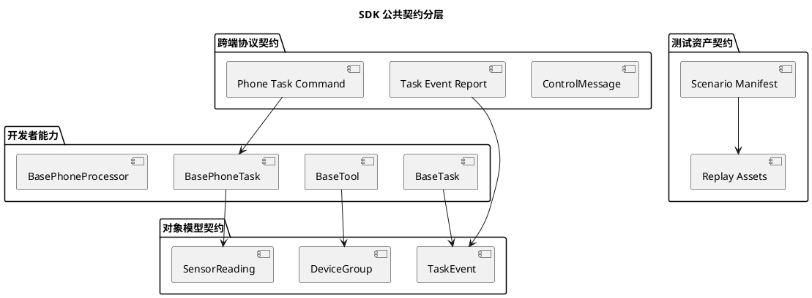

# SDK 公共契约设计

## 1. 文档定位

本文档用于支撑第二期下半程的公共契约收口工作。

它服务于以下计划：

1. [第二期-SDK核心运行时与开发者扩展面产品化开发计划.md](/Users/elio/dev/llm-project/OpenAIglassesDemo_2/doc/stage2/plan/第二期-SDK核心运行时与开发者扩展面产品化开发计划.md)
2. [第二期下半程-SDK公共契约与SDK运行时产品化收口计划.md](/Users/elio/dev/llm-project/OpenAIglassesDemo_2/doc/stage2/plan/第二期下半程-SDK公共契约与SDK运行时产品化收口计划.md)

本文档不定义完整长期版本治理体系，也不要求第二期完成正式多语言 SDK 发布。

本文档只回答第二期结束前必须回答清楚的问题：

1. 哪些对象、消息、事件和文件格式已经属于 SDK 公共面。
2. 哪些内容只是当前内部实现细节，不应被开发者依赖。
3. 第二期结束前应如何用测试保护这些公共契约。

## 2. 核心结论

第二期公共契约只冻结“开发者直接依赖或跨端共同依赖”的最小集合。

首批公共契约包括：

1. 设备组对象模型
2. 控制消息信封
3. SDK 任务模型
4. 手机任务控制消息
5. 手机任务事件上报
6. 传感器读数模型
7. 能力注册标识
8. 场景 manifest 最小格式

第二期暂不冻结：

1. 内部线程模型
2. WebSocket 连接对象
3. 服务端私有连接表
4. 具体 HTTP 路由实现类
5. Agent 内部 prompt 与消息组装细节
6. 手机端具体 UI 结构
7. 眼镜端具体固件目录结构

判断标准很简单：

1. 开发者写 `Tool / Task / PhoneTask / PhoneProcessor` 时会直接接触的，属于公共契约。
2. phone / glass / server 三端必须共同理解的，属于公共契约。
3. 只为当前 Python 或 Swift 内部实现服务的，不属于公共契约。

## 3. 契约分层

第二期公共契约按三层理解：

1. **对象模型契约**
   - 例如 `DeviceEndpoint`、`DeviceGroup`、`TaskEvent`、`SensorReading`。
   - 主要用于 SDK 代码、测试代码和 openaiglass-for-blind 能力实现。
2. **跨端协议契约**
   - 例如 `ControlMessage`、`sdk.phone.task.start`、`/api/tasks/report-event` 请求体。
   - 主要用于 phone / glass / server 之间协作。
3. **测试资产契约**
   - 例如 `testdata/scenario/*.json`。
   - 主要用于离线回放、样例验证和后续兼容性回归。



## 4. 公共契约清单

### 4.1 设备组对象模型

当前代码落点：

1. `openaiglass-sdk/server-python/openaiglasses/models.py`
2. `openaiglass-sdk/server-python/openaiglasses/runtime/device_group.py`

公共对象：

1. `DeviceRole`
2. `DeviceEndpoint`
3. `DeviceGroup`
4. `DeviceGroupContext`

公共字段：

| 对象 | 字段或方法 | 公共性 | 说明 |
| --- | --- | --- | --- |
| `DeviceEndpoint` | `device_id` | 稳定 | 设备唯一编号。 |
| `DeviceEndpoint` | `role` | 稳定 | `glass / phone / server`。 |
| `DeviceEndpoint` | `online` | 稳定 | 当前是否在线。 |
| `DeviceEndpoint` | `capabilities` | 可扩展 | 设备声明能力集合。 |
| `DeviceEndpoint` | `metadata` | 可扩展 | 调试和 SDK运行时 补充字段，不应写业务强依赖。 |
| `DeviceGroup` | `group_id` | 稳定 | 设备组编号。 |
| `DeviceGroup` | `devices` | 稳定 | 组内设备表。 |
| `DeviceGroupContext` | `require_glass()` | 稳定 | 读取当前组眼镜设备。 |
| `DeviceGroupContext` | `require_phone()` | 稳定 | 读取当前组手机设备。 |
| `DeviceGroupContext` | `capture_photo()` | 稳定 | 通过 SDK 请求抓拍。 |
| `DeviceGroupContext` | `start_phone_video_link()` | 稳定 | 启动眼镜到手机视频链路。 |
| `DeviceGroupContext` | `start_phone_task()` | 稳定 | 启动手机侧业务任务。 |
| `DeviceGroupContext` | `submit_notification()` | 稳定 | 提交面向用户的通知。 |
| `DeviceGroupContext` | `mcp(method_name, arguments)` | 稳定 | 通过 SDK 统一 MCP 网关调用外部能力。 |

非公共内容：

1. `DeviceGroupRuntime` 内部字典结构。
2. `ControlRuntime` 中的连接表。
3. `glass_to_phone / phone_to_glass` 这类内部绑定缓存。

兼容规则：

1. 不删除上述稳定字段和方法。
2. 可以新增可选字段和可选方法。
3. `metadata` 可以扩展，但不能要求业务开发者解析某个私有字段才能完成基础功能。
4. 业务调用地图、导航、搜索等外部能力时，应通过 `DeviceGroupContext.mcp(...)`，不直接构造 `McpRegistry` 或 `McpGateway`。

边界保护：

1. `script/run_sdk_preflight.py` 已加入 `sdk_boundary` 检查。
2. 该检查会扫描根目录 `openaiglass-sdk/server-python`、`openaiglass-for-blind/host/phone/src`、`openaiglass-sdk/phone-ios/GlassesVideoReceiver`、`openaiglass-sdk/phone-ios/GlassesVideoReceiverTests`、`openaiglass-sdk/phone-ios/GlassesVideoReceiver.xcodeproj/project.pbxproj` 和 `openaiglass-sdk/glass-esp32`。
3. 若这些根运行时目录重新出现 `find_object`、`YoloFindObject`、`start_find_object`、`timer_manage`、`map_manage`、`Amap`、`navigation_task` 等业务词汇，预检会失败。
4. SDK 自测夹具也应使用 `demo_phone_task` / `mock_phone_task` 这类通用名称，避免边界扫描规则与 SDK 自测互相冲突。
5. 同一检查还会拦截 `openaiglass-sdk/server-python`、`openaiglass-sdk/server-python`、`openaiglass-for-blind/host/phone/src`、根 iOS 运行时和 `openaiglass-sdk/glass-esp32` 对 `openaiglass-for-blind` 的反向依赖。

### 4.2 控制消息信封

当前代码落点：

1. `openaiglass-sdk/server-python/protocol/messages/control_message.py`
2. [统一通信协议信封设计.md](/Users/elio/dev/llm-project/OpenAIglassesDemo_2/doc/structure-design/统一通信协议信封设计.md)

公共对象：

1. `Endpoint`
2. `ControlMessage`

公共字段：

| 字段 | 公共性 | 说明 |
| --- | --- | --- |
| `version` | 稳定 | 当前默认为 `v1`。 |
| `message_id` | 稳定 | 消息唯一编号。 |
| `channel` | 稳定 | 第二期固定为 `control`。 |
| `semantic` | 稳定 | `request / notify`。 |
| `name` | 稳定 | 点分层消息名。 |
| `source` | 稳定 | 发送端点。 |
| `target` | 稳定 | 接收端点。 |
| `ts` | 稳定 | 毫秒时间戳。 |
| `payload` | 稳定 | 消息业务载荷。 |
| `trace_id` | 可选 | 链路追踪。 |
| `session_id` | 可选 | 会话编号。 |
| `task_id` | 可选 | 任务编号。 |
| `stream_id` | 可选 | 媒体流编号。 |
| `priority` | 可选 | 优先级。 |
| `reply_to` | 可选 | 响应关联。 |
| `meta` | 可扩展 | 调试和补充字段。 |

第二期公共消息名：

1. `device.register`
2. `device.registered`
3. `device.register.failed`
4. `device.binded`
5. `device.heartbeat`
6. `sdk.phone.task.start`
7. `sdk.phone.task.stop`
8. `sensor.camera.stream.start`
9. `sensor.camera.stream.stop`

说明：

1. `device.binded` 是当前实现中的既有消息名，第二期公共契约先按现状保留。
2. 后续若要修正为 `device.bound`，必须提供兼容期，不能直接破坏现有手机端和眼镜端。

兼容规则：

1. 不改变 `message_id / channel / semantic / name / source / target / ts / payload` 的基本语义。
2. 新增消息名必须使用点分层命名。
3. 新增可选字段必须允许旧端忽略。
4. 不允许把同一个消息名的语义改成另一种业务含义。

### 4.3 SDK 任务模型

当前代码落点：

1. `openaiglass-sdk/server-python/openaiglasses/capabilities/base_task.py`
2. `openaiglass-sdk/server-python/openaiglasses/runtime/tasks.py`

公共对象：

1. `TaskEvent`
2. `TaskContext`
3. `TaskRuntimeSnapshot`
4. `BaseTask`

公共字段：

| 对象 | 字段或方法 | 公共性 | 说明 |
| --- | --- | --- | --- |
| `TaskEvent` | `name` | 稳定 | 事件名。 |
| `TaskEvent` | `payload` | 稳定 | 事件载荷。 |
| `TaskEvent` | `source` | 稳定 | 事件来源。 |
| `TaskContext` | `task_id` | 稳定 | 当前任务实例编号。 |
| `TaskContext` | `input` | 稳定 | 任务输入。 |
| `TaskContext` | `device_group` | 稳定 | 当前设备组上下文。 |
| `TaskContext` | `emit_state()` | 稳定 | 更新任务状态。 |
| `TaskContext` | `complete()` | 稳定 | 完成任务。 |
| `TaskRuntimeSnapshot` | `state` | 稳定 | 任务状态。 |
| `TaskRuntimeSnapshot` | `input_data / data / result / error` | 稳定 | 任务运行视图。 |

第二期推荐状态值：

1. `created`
2. `running`
3. `completed`
4. `cancelled`
5. `failed`

兼容规则：

1. 任务状态可以新增，但已有状态语义不能改变。
2. `TaskEvent.payload` 允许新增字段。
3. `BaseTask` 的 `on_start / on_event / on_cancel` 回调签名不能在第二期内破坏。

### 4.4 手机任务控制消息

当前代码落点：

1. `openaiglass-sdk/server-python/openaiglasses/runtime/device_group.py`
2. `openaiglass-sdk/phone-ios/GlassesVideoReceiver/Networking/CameraSinkServer.swift`

公共消息：

1. `sdk.phone.task.start`
2. `sdk.phone.task.stop`

`sdk.phone.task.start` 推荐 payload：

```json
{
  "task_id": "task_xxx",
  "task_type": "find_object_phone_task",
  "stream_id": "stream_xxx",
  "glass_device_id": "glass-001",
  "params": {
    "target_object": "水杯",
    "processor_type": "yolo_find_object"
  }
}
```

`sdk.phone.task.stop` 推荐 payload：

```json
{
  "task_id": "task_xxx",
  "task_type": "find_object_phone_task",
  "reason": "task.completed"
}
```

公共字段：

| 字段 | 公共性 | 说明 |
| --- | --- | --- |
| `task_id` | 稳定 | 服务端 SDK 任务编号。 |
| `task_type` | 稳定 | 手机任务类型。 |
| `stream_id` | 可选 | 与任务关联的视频流编号。 |
| `glass_device_id` | 可选 | 当前任务关联的眼镜设备编号。 |
| `params` | 稳定 | 手机任务启动参数。 |
| `reason` | 稳定 | 停止原因。 |

兼容规则：

1. 手机 SDK运行时 必须忽略 `params` 中不认识的可选字段。
2. `task_type` 只能表示能力类型，不能承载路由或连接细节。
3. `task_id` 必须贯穿后续事件上报。

### 4.5 手机任务事件上报

当前代码落点：

1. `openaiglass-sdk/phone-ios/GlassesVideoReceiver/Networking/PhoneTaskEventReportAPI.swift`
2. `openaiglass-sdk/server-python/api/http_server.py`
3. `openaiglass-sdk/server-python/api/ws/control_runtime.py`

当前 HTTP 入口：

1. `POST /api/tasks/report-event`

请求体公共格式：

```json
{
  "task_id": "task_xxx",
  "phone_device_id": "phone-001",
  "event_name": "phone.vision.find_object.result",
  "payload": {
    "found": true,
    "summary": "找到水杯，在画面左侧"
  }
}
```

公共字段：

| 字段 | 公共性 | 说明 |
| --- | --- | --- |
| `task_id` | 稳定 | 服务端 SDK 任务编号。 |
| `phone_device_id` | 稳定 | 上报事件的手机设备编号。 |
| `event_name` | 稳定 | 点分层事件名。 |
| `payload` | 稳定 | 事件载荷。 |

兼容规则：

1. `payload` 允许新增字段。
2. `event_name` 不能复用旧名字表达全新含义。
3. 服务端必须对缺失必填字段返回结构化错误。
4. 手机端不应自行决定任务完成，只上报事实事件；任务状态由服务端 `BaseTask` 推进。

### 4.6 传感器读数模型

当前代码落点：

1. `openaiglass-sdk/server-python/openaiglasses/phone/sensor_provider.py`

公共对象：

1. `SensorReading`
2. `BaseSensorProvider`

公共字段：

| 字段 | 公共性 | 说明 |
| --- | --- | --- |
| `sensor_type` | 稳定 | 传感器类型，例如 `heading`。 |
| `payload` | 稳定 | 传感器结构化数据。 |
| `timestamp_ms` | 可选 | 毫秒时间戳。 |

兼容规则：

1. `payload` 允许新增字段。
2. `sensor_type` 应保持稳定命名。
3. 第二期不冻结每类传感器的全部业务字段，只冻结通用外壳。

### 4.7 能力注册标识

当前代码落点：

1. `openaiglass-sdk/server-python/openaiglasses/capabilities/registry.py`
2. `openaiglass-sdk/server-python/openaiglasses/sdk.py`

公共标识：

1. `BaseTool.name`
2. `BaseTask.task_type`
3. `BasePhoneProcessor.processor_type`
4. `BasePhoneTask.task_type`
5. `BaseSensorProvider.sensor_type`

兼容规则：

1. 同一个 SDK 实例内不允许重复注册同名能力。
2. 能力标识应使用小写、下划线或点分层风格。
3. 能力标识一旦被官方 openaiglass-for-blind 使用，不应在第二期内重命名。

### 4.8 场景 manifest 最小格式

当前代码落点：

1. `openaiglass-sdk/server-python/openaiglasses/testing/scenario_runner.py`
2. `testdata/scenario/*.json`
3. `testdata/scenario/*.json`

第二期最小公共字段：

| 字段 | 公共性 | 说明 |
| --- | --- | --- |
| `scenario_id` | 稳定 | 场景编号。 |
| `title` | 稳定 | 场景标题。 |
| `description` | 稳定 | 场景说明。 |
| `capability` | 稳定 | 场景对应能力类型。 |
| `device_group` | 稳定 | 模拟设备组。 |
| `inputs` | 稳定 | 回放输入。 |
| `expected` | 稳定 | 断言约定。 |

兼容规则：

1. `inputs` 可以按能力扩展。
2. `expected` 可以新增断言字段。
3. 旧场景文件在新增可选字段后仍应可以通过校验。

## 5. 公共面与内部实现边界

### 5.1 公共面

以下内容可以被开发者和官方 openaiglass-for-blind 依赖：

1. `OpenAIGlassesSDK` 注册入口。
2. `BaseTool / BaseTask / BasePhoneTask / BasePhoneProcessor / BaseSensorProvider`。
3. `DeviceGroupContext` 高层方法。
4. `TaskEvent / TaskContext / SensorReading`。
5. 手机任务控制消息名和事件上报请求体。
6. 场景 manifest 最小格式。

### 5.2 内部实现面

以下内容不应被开发者依赖：

1. `ControlRuntime` 私有字段。
2. 具体 WebSocket 连接对象。
3. 心跳清理线程实现。
4. `AgentFacade` 内部装配细节。
5. `ScenarioRunner` 内部执行顺序。
6. 手机端具体 Swift UI 页面结构。
7. 眼镜端具体目录和编译脚本内部细节。

## 6. 第二期兼容规则

第二期只要求最小兼容规则，不引入完整语义化版本治理。

必须遵守：

1. 公共字段不能无说明删除。
2. 公共字段不能随意改名。
3. 公共消息名不能复用为全新语义。
4. 公共回调签名不能破坏。
5. 新增字段必须允许旧端忽略。
6. `payload / metadata / meta` 只允许做扩展，不允许把核心必填语义藏进去。

允许调整：

1. 内部实现类名。
2. 内部缓存结构。
3. 内部日志字段。
4. 预检脚本内部实现。
5. mock runtime 内部编排方式。

## 7. 第二期测试要求

公共契约收口后，至少需要补三类测试。

### 7.1 金样测试

目标：

1. 固定公共对象和消息序列化结果。
2. 防止无意中改坏跨端协议。

建议覆盖：

1. `DeviceEndpoint`
2. `ControlMessage`
3. `TaskEvent`
4. `TaskRuntimeSnapshot`
5. `SensorReading`
6. `sdk.phone.task.start`
7. `/api/tasks/report-event` 请求体

### 7.2 manifest 校验测试

目标：

1. 确认 `testdata/scenario` 中的场景文件仍符合第二期最小格式。
2. 确认缺失资产、缺失必填字段和非法能力类型能被明确报错。

建议继续复用：

1. `ScenarioRunner.validate(...)`
2. `script/run_sdk_scenario.py`

### 7.3 兼容性回归

目标：

1. 确认第二期已有 `find_object` 样例和回放资产在公共契约收口后仍可运行。

建议覆盖：

1. `testdata/scenario/find_object_basic.json`
2. `testdata/scenario/find_object_with_testdata.json`
3. `testdata/scenario/find_object_cancelled.json`
4. `testdata/scenario/find_object_missing_phone.json`
5. `testdata/scenario/find_object_video_link_start_failed.json`
6. `testdata/scenario/find_object_with_heading_sensor.json`

## 8. 推荐落地顺序

第二期下半程建议按以下顺序执行公共契约收口：

1. 先补金样测试目录和最小样例。
2. 再把公共对象、消息和事件在文档中逐项确认。
3. 然后检查 phone / glass / server 是否仍有重复拼装公共结构的代码。
4. 最后把新增契约测试纳入 `run_sdk_preflight`。

不建议先做大规模目录重构。当前阶段的重点是把事实契约写清楚、测住，再逐步整理代码落点。

## 9. 验收标准

第二期公共契约收口完成时，应满足：

1. 本文档列出的公共对象和消息都有明确代码落点。
2. 开发者能从文档中判断哪些字段可以依赖。
3. 开发者能从文档中判断哪些内部实现不能依赖。
4. `find_object` 官方样例仍可通过离线回放。
5. 公共契约修改能够被测试发现。
6. 主计划中的第二期下半程收口目标不再需要借用新一期概念解释。
7. `sdk_boundary` 预检通过，证明公共契约之外的系统运行时没有反向依赖官方样例，也没有重新内建具体业务能力。
