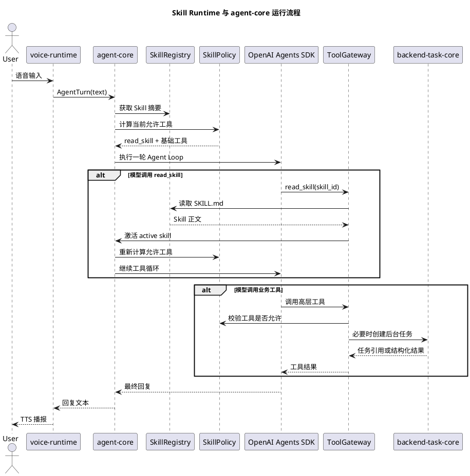

# Skill Runtime 设计

当前实现版本：sdk-v10

## 0. sdk-v10 实现状态

sdk-v10 已完成最小 Skill Runtime：

1. `SkillManifest` 支持 `allowed_tools` 和 `allowed_mcp_methods`。
2. `SkillRuntime` 维护 Skill 注册表、会话 active Skill 和运行态快照。
3. `read_skill` 作为内置 Tool 暴露给模型，读取正文后会激活当前会话 Skill。
4. `OpenAIAgentLoopRunner` 会把可用 Skill 摘要或 active Skill 正文注入 system prompt。
5. active Skill 存在时，模型可见工具会收敛到 `read_skill` 和 Skill 白名单。
6. `ToolGateway` 会在执行前校验当前 Skill 工具白名单。

尚未实现：

1. 目录扫描和 `SKILL.md` frontmatter 自动解析。
2. 远程 Skill Registry、审批、风险等级和权限后台。
3. active Skill 的生产级持久化恢复。
4. 复杂多 Skill 冲突解决和自动退场策略。

## 1. 文档定位

本文档定义本项目后续引入 `Skill` 的设计方案。

本文档参考了 [openai-skills-demo](/Users/elio/dev/llm-project/OpenAIglassesDemo_2/doc/experimental/openai-skills-demo) 中的实现思路，尤其是：

1. Skill 以目录形式存在，核心入口是 `SKILL.md`。
2. 模型先看到 Skill 摘要，只在需要时读取完整 Skill 内容。
3. Skill 被激活后，会影响本轮或当前会话允许调用的工具集合。
4. 工具限制必须由运行时强制执行，不能只依赖提示词。

本文档面向当前项目的新架构，不直接照搬 demo 中基于 Responses API 的自循环实现。当前项目已经使用 OpenAI Agents SDK 承担 `agent loop`，因此本项目的 Skill Runtime 应嵌入现有 `agent-core`，作为“工具选择前的任务工作流说明层”和“模型可见工具策略层”。

相关文档：

- [agent-core设计.md](/Users/elio/dev/llm-project/OpenAIglassesDemo_2/doc/structure-design/agent-core设计.md)
- [backend-task-core设计.md](/Users/elio/dev/llm-project/OpenAIglassesDemo_2/doc/structure-design/backend-task-core设计.md)
- [大模型外接能力概念的介绍.md](/Users/elio/dev/llm-project/OpenAIglassesDemo_2/doc/experimental/大模型外接能力概念的介绍.md)
- [基于 OpenAI SDK 自实现 Skills Runtime 设计文档](/Users/elio/dev/llm-project/OpenAIglassesDemo_2/doc/experimental/openai-skills-demo/DESIGN.md)

---

## 2. 设计目标

本项目引入 Skill 的目标如下：

1. 为“寻物、视觉导航、过马路、盲道导航、阅读说明书、定时画面检查”等复合能力提供稳定的任务说明包。
2. 让模型在面对复杂意图时，先按需读取对应 Skill，再决定调用哪些高层工具。
3. 避免把所有复杂工作流长期塞进 system prompt，减少上下文污染。
4. 让 Skill 声明它允许使用的高层工具、后台任务类型和 MCP 能力。
5. 保持当前架构边界：Skill 不直接操作设备连接、不直接维护任务状态、不替代 `backend-task-core`。
6. 为后续开发者新增能力提供标准交付格式。

---

## 3. 非目标

第一版不做以下事情：

1. 不允许终端用户上传任意 Skill 并立即生效。
2. 不把 Skill 做成独立运行时，不另起一套 agent loop。
3. 不让模型直接看到 `ControlMessage`、`TaskRuntime`、`MCP 方法名` 等内部概念。
4. 不把底层工具全部暴露给模型。
5. 不在第一版实现复杂审批、多用户隔离和远程 Skill Registry。
6. 不要求所有旧项目视觉逻辑一次性改写成 Skill。

---

## 4. 核心结论

### 4.1 Skill 的定位

本项目中的 Skill 是：

1. 面向模型的“任务工作流说明包”。
2. 面向框架的“工具暴露策略声明”。
3. 面向开发者的“复合能力交付单位”。

Skill 不是：

1. Tool 本身。
2. MCP 本身。
3. 后台任务实例。
4. 设备端控制协议。
5. 独立的自然语言决策中心。

### 4.2 与 Tool、MCP、Task 的关系

| 概念  | 本项目定位               | 典型例子                                                                    |
| ----- | ------------------------ | --------------------------------------------------------------------------- |
| Tool  | 模型可调用的高层函数入口 | `capture_photo`、`timer_manage`、`map_manage`、`vision_task_manage` |
| MCP   | 外部服务接入层           | 高德地图、天气、搜索服务                                                    |
| Task  | 长生命周期后台任务模板   | `timer_task`、`phone_video_link_task`、`object_finding_task`          |
| Skill | 复合场景说明与工具策略   | `find-object`、`navigation-guide`、`read-document`                    |

Skill 负责告诉模型“这个场景应该怎么做”，但真正执行仍通过 Tool、MCP 和 Task 完成。

### 4.3 第一版集成方式

第一版建议采用应用层 Skill Runtime，并嵌入 `agent-core`：

1. `SkillRegistry` 扫描本地 Skills 目录。
2. `read_skill` 作为模型可见的内置 Tool。
3. 模型初始只看到 Skill 摘要和少量总是可见的基础工具。
4. 模型调用 `read_skill(skill_id)` 后，Skill Runtime 记录当前会话的 active skill。
5. Tool Registry 根据 active skill 动态决定本轮允许暴露给模型的工具集合。
6. ToolGateway 在执行前再次校验工具是否被当前 Skill 允许。

---

## 5. 目录结构

建议新增服务端 Skill 目录：

```text
server/
  skills/
    find-object/
      SKILL.md
    read-document/
      SKILL.md
    navigation-guide/
      SKILL.md
    timed-visual-check/
      SKILL.md
```

未来如果 Skill 需要脚本或资源，可放在同一目录下：

```text
server/skills/find-object/
  SKILL.md
  prompts/
    target-normalization.md
  examples/
    simple-object-search.json
```

第一版只读取 `SKILL.md`，不执行 Skill 目录中的任意脚本。

---

## 6. `SKILL.md` 格式

### 6.1 最小字段

```yaml
---
name: find-object
description: 当用户希望寻找眼前或附近某个物体时使用，例如“帮我找水杯”“找一下门口”。
version: 0.1.0
tools: vision_task_manage, capture_photo
risk_level: medium
---
```

字段说明：

1. `name`：Skill 稳定标识，应与目录名一致。
2. `description`：给模型看的轻量摘要，用于判断是否读取 Skill。
3. `version`：Skill 版本。
4. `tools`：该 Skill 激活后允许调用的高层工具。
5. `risk_level`：风险等级，第一版只记录，后续可接审批策略。

### 6.2 推荐字段

```yaml
---
name: navigation-guide
description: 当用户需要路线规划、步行导航、盲道引导或过马路辅助时使用。
version: 0.1.0
tools: map_manage, navigation_task_manage, query_device_state
tasks: navigation_task, phone_video_link_task
mcp: amap
risk_level: high
requires_confirmation: true
---
```

推荐字段说明：

1. `tasks`：Skill 可能创建的后台任务类型，仅给框架和审计使用。
2. `mcp`：Skill 可能间接使用的外部能力类别。
3. `requires_confirmation`：是否建议在启动长期任务前向用户确认。

### 6.3 正文内容规范

`SKILL.md` 正文应只写模型需要理解的工作规则，不写底层架构。

可以写：

1. 何时使用这个 Skill。
2. 需要向用户确认哪些关键信息。
3. 何时调用哪个高层工具。
4. 工具结果回来后如何生成自然语言回复。
5. 任务失败时如何追问或降级。

不应写：

1. `ControlMessage` 字段。
2. WebSocket 路径。
3. 设备连接细节。
4. `TaskRuntime` 内部状态机。
5. 媒体文件落盘路径。

---

## 7. 运行时模块

建议在 `openaiglass-sdk/server-python/agent_core/skills/` 下新增以下模块。`openaiglass-sdk/server-python` 仅保留兼容旧导入路径的薄壳，不再承载 Skill Runtime 主体实现。

### 7.1 `SkillManifest`

职责：

1. 保存从 `SKILL.md` frontmatter 解析出的元数据。
2. 作为 Skill Registry、Skill Policy 和审计日志的统一对象。

建议字段：

```python
@dataclass(slots=True)
class SkillManifest:
    skill_id: str
    name: str
    description: str
    version: str | None
    tools: list[str]
    tasks: list[str]
    mcp: list[str]
    risk_level: str
    requires_confirmation: bool
    path: str
    content_hash: str
```

### 7.2 `SkillRegistry`

职责：

1. 扫描固定本地目录，例如 `server/skills/*/SKILL.md`。
2. 解析 frontmatter。
3. 暴露 Skill 摘要列表。
4. 按 `skill_id` 读取完整 Skill 内容。

安全规则：

1. 只能读取已注册 Skill 的 `SKILL.md`。
2. 不能接收任意文件路径。
3. 不能读取 Skill 目录外的文件。
4. 读取结果应带上 `skill_id/version/content_hash`。

### 7.3 `SkillSessionState`

职责：

1. 保存当前会话激活的 Skill。
2. 保存 Skill 版本和内容 hash。
3. 支持后续审计和会话恢复。

建议字段：

```python
@dataclass(slots=True)
class SkillSessionState:
    session_id: str
    active_skill_id: str | None = None
    active_skill_version: str | None = None
    active_skill_hash: str | None = None
    activated_at_ms: int | None = None
```

第一版可复用现有 `AgentSession.dialog_state.meta` 存储，后续再独立持久化。

### 7.4 `SkillPolicy`

职责：

1. 决定当前轮模型可见工具集合。
2. 在工具执行前做二次校验。
3. 处理 Skill 的风险等级和确认策略。

第一版策略：

1. 未激活 Skill 时，模型可见工具为：
   - `read_skill`
   - 少量始终安全的基础工具，例如 `capture_photo` 可选是否保留。
2. 激活 Skill 后，模型可见工具为：
   - `read_skill`
   - Skill 声明的 `tools`
   - 项目配置中允许始终可见的基础工具。
3. 若模型调用未被允许的工具，ToolGateway 直接返回结构化错误。

### 7.5 `ReadSkillTool`

职责：

1. 作为模型可见内置工具。
2. 根据 `skill_id` 读取完整 `SKILL.md`。
3. 激活当前会话 Skill。
4. 返回 Skill 正文和元信息。

输入：

```json
{
  "skill_id": "find-object"
}
```

输出：

```json
{
  "skill_id": "find-object",
  "version": "0.1.0",
  "content_hash": "sha256:...",
  "markdown": "..."
}
```

---

## 8. 与现有 `agent-core` 的集成

### 8.1 当前实现现状

当前 `ToolRegistry` 已区分“内部 Tool”和“模型可见 Tool”。

当前模型可见工具主要是：

1. `capture_photo`
2. `timer_manage`
3. `map_manage`

内部存在但默认不暴露的能力包括：

1. `create_timer`
2. `query_task_status`
3. `cancel_task`
4. `start_phone_video_link`
5. `amap.*`

这与 Skill Runtime 的工具策略天然兼容。

### 8.2 改造点

建议改造如下：

1. `AgentFacade.build_default()` 初始化 `SkillRegistry` 和 `SkillPolicy`。
2. `ToolRegistry.discover_tools()` 注册 `read_skill`。
3. `ToolRegistry.list_sdk_tools()` 不再返回固定模型工具列表，而是根据 `session_id` 和 active skill 计算。
4. `ToolGateway.invoke()` 在执行前调用 `SkillPolicy.validate_tool_allowed()`。
5. `AgentSessionStore` 保存 active skill 元数据和 Skill 调用轨迹。
6. `OpenAIAgentLoopRunner._build_instructions()` 注入 Skill 摘要和 active skill 状态。

### 8.3 对 Agents SDK 的适配

demo 使用 Responses API 的 `allowed_tools` 机制做工具限制。本项目当前使用 OpenAI Agents SDK，因此第一版建议采用更直接的方式：

1. 每轮构建 `Agent` 时，只把当前允许的 SDK Tool 传给 `Agent(tools=...)`。
2. 即使某个工具未传给模型，ToolGateway 仍要保留执行前校验。
3. 后续如果 SDK 支持更细的 allowed tools 策略，再迁移到 SDK 原生能力。

---

## 9. 运行流程



---

## 10. Skill 选择 Prompt

建议在 `agent-core` 的 instructions 中增加一小段 Skill 选择规则。

示例：

```text
你可以按需使用 Skills。Skill 是某类任务的工作说明，不是用户可见概念。

处理用户请求前：
1. 先查看 <available_skills> 中的摘要。
2. 如果有且只有一个 Skill 明确适用，调用 read_skill 读取它。
3. 如果多个 Skill 可能适用，选择最具体的一个。
4. 如果没有 Skill 明确适用，直接使用普通工具或正常回答。
5. 在同一轮开始阶段最多读取一个 Skill。
6. 读取 Skill 后，遵循 Skill 中的任务规则。

<available_skills>
- id="find-object" name="find-object" description="当用户希望寻找眼前或附近某个物体时使用。"
- id="navigation-guide" name="navigation-guide" description="当用户需要路线规划、步行导航、盲道引导或过马路辅助时使用。"
</available_skills>
```

注意：

1. 这段 prompt 不应提及 `backend-task-core`、`ControlMessage` 等内部概念。
2. Skill 是模型内部工作方式，不应在回复用户时解释成系统架构。

---

## 11. 第一批建议 Skill

### 11.1 `find-object`

用途：

1. 用户要求寻找某个物体。
2. 用户问“我的水杯在哪”“帮我找门口”等。

允许工具：

1. `capture_photo`
2. `vision_task_manage`
3. `query_device_state`

后续关联任务：

1. `object_finding_task`
2. `phone_video_link_task`

### 11.2 `read-document`

用途：

1. 用户要求阅读纸质材料、药品说明书、包装文字。
2. 用户说“帮我看看这张纸写了什么”。

允许工具：

1. `capture_photo`

第一版可不创建后台任务，直接抓拍后走多模态解读。

### 11.3 `navigation-guide`

用途：

1. 用户要求导航到某地。
2. 用户要求盲道、过马路、最后十米引导。

允许工具：

1. `map_manage`
2. `navigation_task_manage`
3. `query_device_state`

后续关联任务：

1. `navigation_task`
2. `phone_video_link_task`

### 11.4 `timed-visual-check`

用途：

1. 用户要求定时观察画面。
2. 用户说“每隔几秒看一下门有没有打开”。

允许工具：

1. `visual_check_task_manage`
2. `capture_photo`
3. `timer_manage`

后续关联任务：

1. `timed_visual_check_task`

---

## 12. 与旧项目迁移的关系

旧项目中大量逻辑混在 `app_main.py`、导航状态机和视觉工作流里。迁移到新架构后，不建议把这些逻辑直接塞进一个超大 prompt。

建议拆分如下：

1. 旧项目的“用户意图触发规则”迁入对应 Skill。
2. 旧项目的“视觉状态机”迁入手机端或服务端任务模板。
3. 旧项目的“设备控制动作”迁入 `sensor-hub / actuator-hub` 和控制消息。
4. 旧项目的“固定播报策略”迁入任务事件和通知策略。
5. 旧项目的“模型如何追问、确认、总结”迁入 Skill 正文。

这样迁移后：

1. Skill 负责开放式语言判断。
2. Task 负责持续运行。
3. Tool 负责受控入口。
4. MCP 负责外部平台接入。
5. 设备协议负责端侧协作。

---

## 13. 安全与审计

### 13.1 安全规则

第一版必须满足：

1. Skill 来源固定为仓库内受控目录。
2. `read_skill` 只能按 `skill_id` 读取注册表内 Skill。
3. Tool 执行前必须检查 active skill 的 allowlist。
4. 高风险 Skill 不直接启动长期任务，必须通过工具返回确认需求或让模型先向用户确认。
5. Skill 正文不允许包含要求模型绕过工具策略的指令。

### 13.2 审计字段

建议记录：

1. `session_id`
2. `turn_id`
3. `skill_id`
4. `skill_version`
5. `skill_hash`
6. `tool_name`
7. `tool_arguments_summary`
8. `tool_result_summary`
9. `created_at_ms`

第一版可写入现有 `CapabilityTrace` 或会话调试快照，后续再独立 JSONL 或数据库。

---

## 14. 分阶段落地计划

### Phase S1：最小 Skill Runtime

交付物：

1. `openaiglass-sdk/server-python/agent_core/skills/` 基础模块。
2. `server/skills/*/SKILL.md` 本地目录。
3. `read_skill` Tool。
4. active skill 会话状态。
5. 基于 active skill 的工具暴露策略。

验收标准：

1. 模型可看到 Skill 摘要。
2. 模型可调用 `read_skill` 读取一个 Skill。
3. 读取后当前会话记录 active skill。
4. 只有 active skill 允许的工具会暴露给模型。
5. 未被允许的工具即使被内部调用入口请求，也会被 ToolGateway 拒绝。

### Phase S2：第一批业务 Skill

交付物：

1. `find-object`
2. `read-document`
3. `navigation-guide`
4. `timed-visual-check`

验收标准：

1. 每个 Skill 有明确触发场景。
2. 每个 Skill 只声明高层工具。
3. 每个 Skill 有对应单元测试验证选择和工具策略。

### Phase S3：视觉任务接入

交付物：

1. `vision_task_manage` 高层工具。
2. `object_finding_task` 后台任务模板。
3. 手机端 YOLO 结果回流协议。
4. `find-object` Skill 接入真实任务。

验收标准：

1. 用户说“帮我找水杯”时，模型读取 `find-object`。
2. 模型通过高层工具创建视觉任务。
3. 视觉任务进入后台任务中心。
4. 手机检测结果能触发端侧播报或任务事件回流。

### Phase S4：导航 Skill 接入

交付物：

1. `navigation_task_manage` 高层工具。
2. `navigation_task` 后台任务模板。
3. `navigation-guide` Skill 接入真实路线和执行期任务。

验收标准：

1. 用户提出导航请求时，模型先确认关键参数。
2. 路线规划走 `map_manage`。
3. 执行期导航走 `navigation_task`。
4. 任务状态可查询、可取消、可通知。

---

## 15. 示例 Skill 草稿

### 15.1 `find-object/SKILL.md`

```markdown
---
name: find-object
description: 当用户希望寻找眼前或附近某个物体时使用，例如“帮我找水杯”“找一下门口”。
version: 0.1.0
tools: capture_photo, vision_task_manage, query_device_state
tasks: object_finding_task, phone_video_link_task
risk_level: medium
requires_confirmation: false
---

# 寻物 Skill

## 使用场景

当用户希望找到某个物体、入口、出口、座位或类似目标时使用。

## 处理规则

1. 如果用户没有说明目标物体，先用一句话追问目标。
2. 如果目标清晰，优先创建持续视觉任务，而不是只做单张图片解读。
3. 如果手机未绑定或视频能力不可用，可以退化为单次抓拍并解释当前只能看一张图。
4. 工具返回任务已启动后，简短告诉用户正在寻找，不要编造已经找到。
5. 当任务事件回流表示找到目标时，再根据任务结果生成具体引导。
```

### 15.2 `read-document/SKILL.md`

```markdown
---
name: read-document
description: 当用户要求阅读纸质文字、药品说明书、包装文字或屏幕文字时使用。
version: 0.1.0
tools: capture_photo
risk_level: low
requires_confirmation: false
---

# 文档阅读 Skill

## 使用场景

当用户要求阅读、总结或解释眼前文字材料时使用。

## 处理规则

1. 先调用抓拍工具获取当前画面。
2. 如果图片不清晰，直接说明需要重新对准或靠近。
3. 对药品、警示、金额、地址、日期等信息要谨慎表达。
4. 不要编造图片中没有的文字。
```

---

## 16. 当前决策

当前项目应先实现应用层 Skill Runtime，而不是接入 OpenAI 原生 Skills。

原因：

1. 当前核心能力依赖自定义 Tool、MCP 网关、设备协议和后台任务中心。
2. Skill 需要控制模型可见工具集合，并与当前 `ToolRegistry`、`ToolGateway` 深度结合。
3. 旧项目迁移需要的是“复合任务工作流说明”，不是 shell 自动化能力。
4. 未来如果出现文件处理、代码执行、文档生成等 shell 型任务，可以再对这类任务单独接入 OpenAI 原生 Skills。
