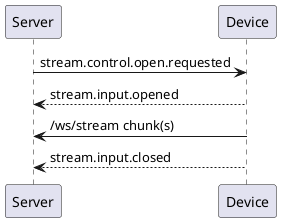

# realtime-agent 通讯协议

本文档是 `realtime-agent` 标准通讯协议的正式入口。协议用于连接 Server SDK 和 Device SDK；普通应用开发者不需要把事件作为主要编程模型，但 SDK 维护者、端侧 SDK 实现者和回归测试必须以本文档、schema 和 golden fixtures 为准。

## 目标和非目标

协议目标：

1. 定义 server 与 device 之间的控制事件信封。
2. 定义设备注册、能力声明、命令回执、stream 生命周期和错误码。
3. 定义大字节数据的 stream chunk 格式。
4. 为 Server SDK、Device SDK、多语言实现和自动化测试提供共同契约。
5. 让协议变更可阅读、可追踪、可测试、可回滚。

协议非目标：

1. 不定义业务 Tool / Task 的具体语义。
2. 不定义端侧摄像头、麦克风、喇叭、蓝牙或硬件驱动实现。
3. 不把事件作为社区应用开发者的主路径 API。
4. 不替代 Server SDK 的 Context API 或 Device SDK 的能力 handler API。

## 协议版本

当前协议版本固定为：

```text
realtime-agent.v1
```

所有控制事件和 stream header 都必须携带该版本。新增不兼容字段、删除字段、修改事件语义或改变二进制帧格式时，必须先走本文档的协议变更流程。

## 通道

协议包含两个主要通道：

| 通道 | 路径 | 用途 |
| --- | --- | --- |
| Control WebSocket | `/ws/control` | 设备注册、心跳、命令、stream 生命周期、输出播放状态。 |
| Stream WebSocket | `/ws/stream` | 音频、图片、视频、传感器数据和 speaker 输出等二进制数据。 |

控制通道只传 JSON 事件，不传媒体大字节。音频、图片、视频、深度图等大字节数据必须走 stream 通道。

## 控制事件信封

所有控制事件使用统一信封：

```json
{
  "version": "realtime-agent.v1",
  "event_id": "evt_xxx",
  "event_name": "command.completed",
  "timestamp_ms": 1760000000000,
  "user_id": "user-001",
  "producer_id": "dev-python-001",
  "session_id": "dev-python-001",
  "stream_id": "stream-001",
  "stream_type": "sensor.rgb",
  "payload": {}
}
```

字段约束：

| 字段 | 必填 | 说明 |
| --- | --- | --- |
| `version` | 是 | 协议版本，当前为 `realtime-agent.v1`。 |
| `event_id` | 是 | 事件唯一 ID。 |
| `event_name` | 是 | 事件名，必须在公共事件名清单中。 |
| `timestamp_ms` | 是 | 事件产生时间，毫秒时间戳。 |
| `user_id` | 是 | 用户标识。 |
| `producer_id` | 是 | 事件生产者，端侧通常是 `device_id`。 |
| `session_id` | 否 | 会话或设备会话标识。 |
| `stream_id` | 否 | stream 标识。 |
| `stream_type` | 否 | stream 类型，例如 `sensor.rgb`。 |
| `payload` | 是 | 事件业务数据，必须是 JSON object。 |

控制事件禁止出现 `target_device_id`、`source_device_id` 等点对点路由字段。路由应由 server 根据设备注册、能力声明、selector 和订阅关系计算。

## 设备注册

设备连接 control channel 后，发送：

```text
control.device.register.requested
```

注册 payload 示例：

```json
{
  "device_id": "dev-python-001",
  "name": "Python device",
  "client_type": "python",
  "sdk_version": "0.1.0",
  "runtime": {
    "platform": "python",
    "language": "python"
  },
  "properties": {},
  "supports": {
    "sensors": [],
    "actuators": []
  }
}
```

注册约束：

1. `producer_id` 必须等于 `payload.device_id`。
2. `payload.supports` 必须使用结构化 `sensors` / `actuators`。
3. 注册 payload 不能包含旧 `routes` 字段。
4. 注册 payload 不能包含旧 `capabilities` 字段。
5. server 成功后返回 `control.device.registered`。
6. server 失败后返回 `control.device.register.failed`。

## 能力声明

公开结构化能力：

```yaml
supports:
  sensors:
    - type: rgb
      modes: [single, continuous]
      default:
        format: jpeg
        frequency_hz: 1
        sample_count: 1
        ttl_seconds: 5
        direction: front
  actuators:
    - type: vibrator
      commands: [vibrate]
```

能力映射：

| supports 写法 | 内部能力 ID | 说明 |
| --- | --- | --- |
| `sensors[].type=rgb` | `sensor.rgb` | RGB 图片或视频帧。 |
| `sensors[].type=imu` | `sensor.imu` | IMU 数据。 |
| `sensors[].type=tof` | `sensor.tof` | 深度或 ToF 数据。 |
| `actuators[].type=vibrator` | `actuator.haptic` | 震动或触觉反馈。 |
| `actuators[].type=haptic` | `actuator.haptic` | 触觉反馈。 |

系统音频不作为普通 `supports` 暴露：

1. `sensor.mic` 通过系统音频输入链路进入 server。
2. `actuator.speaker` 通过输出播放链路进入端侧。

## 命令生命周期

server 请求端侧执行一次命令：

```text
command.requested
```

端侧根据执行过程回报：

```text
command.accepted
command.progress
command.completed
command.failed
```

生命周期约束：

1. 端侧收到 `command.requested` 后，应尽快发送 `command.accepted` 或 `command.failed`。
2. 长动作可以发送多次 `command.progress`。
3. 成功结束发送 `command.completed`。
4. 失败结束发送 `command.failed`，并包含 `error_code` 或可诊断 message。
5. 同一命令应通过 `command_id` 或 payload 中的关联字段串联。

## 输入 stream 生命周期

server 请求端侧打开输入 stream：

```text
stream.control.open.requested
```

端侧响应：

```text
stream.input.opened
stream.input.closed
stream.input.failed
```

典型流程：



`sensor.rgb` 采集请求 payload 可以携带照片资产策略字段，但不能携带图片 bytes：

```json
{
  "stream_type": "sensor.rgb",
  "mode": "single",
  "format": "jpeg",
  "request_id": "asset_req_xxx",
  "correlation_id": "turn_or_task_id",
  "turn_id": "turn_xxx",
  "ttl_seconds": 5,
  "capture_reason": "capture_photo",
  "frequency_hz": 1,
  "sample_count": 1,
  "direction": "front"
}
```

字段约束：

1. `ttl_seconds` 只表示服务端 turn buffer 内的最长自动可消费时间，不表示磁盘 runs 产物保留时间。
2. `direction` 第一阶段默认 `front`；未来可以由端侧 IMU / 姿态融合解析后写入。
3. `correlation_id` 可关联连续采样或 Task 运行实例。
4. 新字段均为可选字段，旧端侧忽略未知字段时不应失败。

## 输出 stream 生命周期

server 请求端侧打开输出 stream：

```text
stream.output.open.requested
```

端侧响应：

```text
stream.output.started
stream.output.finished
stream.output.closed
stream.output.failed
stream.output.cancelled
```

server 可以发送：

```text
stream.output.close.requested
stream.output.finish.requested
stream.output.cancel.requested
```

输出 stream 用于 speaker 播放、显示输出或其他端侧执行器输出。播放仲裁由 Server SDK 的 Output Service 管理，Device SDK 负责消费事件和回报状态。

## Stream 二进制帧

stream 通道二进制帧格式：

```text
4 bytes big-endian header length
header JSON bytes
payload bytes
```

header 字段：

| 字段 | 必填 | 说明 |
| --- | --- | --- |
| `version` | 是 | `realtime-agent.v1`。 |
| `user_id` | 是 | 用户 ID。 |
| `session_id` | 是 | 会话或设备会话 ID。 |
| `stream_id` | 是 | stream ID。 |
| `stream_type` | 是 | `sensor.rgb`、`sensor.mic`、`actuator.speaker` 等。 |
| `seq` | 是 | chunk 顺序号。 |
| `timestamp_ms` | 是 | 端侧发送时间。 |
| `codec` | 是 | `pcm16le`、`jpeg`、`png` 等。 |
| `sample_rate` | 条件 | 音频必填；图片可为 `1`。 |
| `channels` | 条件 | 音频必填；图片可为 `1`。 |
| `duration_ms` | 条件 | 音频 chunk 时长；图片可为 `0`。 |
| `payload_size` | 是 | payload 字节数，必须与实际 payload 长度一致。 |
| `final` | 是 | 是否最后一帧。 |
| `metadata` | 否 | `request_id`、`turn_id`、`ttl_seconds`、`capture_reason`、`captured_at_ms`、`sequence_index`、`direction` 等诊断和照片资产字段。 |

解码器必须拒绝 `payload_size` 与实际 payload 长度不一致的帧。

`sensor.rgb` chunk metadata 建议字段：

| 字段 | 必填 | 说明 |
| --- | --- | --- |
| `request_id` | 条件 | server 请求采集时必填，用于匹配 pending 请求。 |
| `correlation_id` | 否 | 连续采样或 Task 关联 ID。 |
| `turn_id` | 否 | 当前用户 turn ID；端侧不知道时由 server 写入或补齐。 |
| `ttl_seconds` | 否 | 上传方请求的 turn buffer 有效期，单位秒。 |
| `capture_reason` | 否 | `capture_photo`、`realtime_video`、`task_sampling`、`device_push` 等。 |
| `captured_at_ms` | 否 | 端侧实际拍摄时间。 |
| `sequence_index` | 否 | 同一 turn / correlation 下的图片序号。 |
| `direction` | 否 | 用户语义方向，默认 `front`。 |

## 错误码

标准错误码位于：

```text
audio-server/realtime_agent/spec/realtime-agent-error-codes.yaml
```

当前错误类型包括：

- `registration_failed`
- `auth_failed`
- `unsupported_capability`
- `permission_denied`
- `hardware_unavailable`
- `stream_busy`
- `stream_codec_error`
- `network_disconnected`
- `protocol_violation`
- `timeout`

错误 payload 应尽量包含：

1. `error_code`
2. `message`
3. `retryable`
4. `metadata`

## 协议在代码中的映射

| 协议对象 | 代码位置 | 说明 |
| --- | --- | --- |
| 事件信封 | `audio-server/realtime_agent/protocol.py` | server runtime 的事件对象和校验入口。 |
| 设备能力 schema | `audio-server/realtime_agent/spec/realtime-agent-device.schema.json` | 设备注册和能力声明约束。 |
| 事件 schema | `audio-server/realtime_agent/spec/realtime-agent-event.schema.json` | 公共事件名和事件信封约束。 |
| stream schema | `audio-server/realtime_agent/spec/realtime-agent-stream.schema.json` | stream header 字段约束。 |
| AsyncAPI | `audio-server/realtime_agent/spec/realtime-agent-asyncapi.yaml` | WebSocket 通道和事件说明。 |
| 错误码 | `audio-server/realtime_agent/spec/realtime-agent-error-codes.yaml` | 标准错误码和建议处理。 |
| Server control | `audio-server/realtime_agent/control/service.py` | 设备注册、连接状态、事件路由。 |
| Server stream | `audio-server/realtime_agent/stream/service.py` | stream 生命周期和 chunk 处理。 |
| Server output | `audio-server/realtime_agent/output/service.py` | 输出播放仲裁和 speaker stream。 |
| Context API | `audio-server/realtime_agent/context.py` | Tool / Task 调用设备能力的入口。 |
| Python Device SDK | `audio-device/python/src/realtime_agent_device/` | 端侧事件、builder、client、stream codec。 |
| TypeScript Device SDK | `audio-device/typescript/src/` | 浏览器 / Node 侧协议模型。 |
| Swift Device SDK | `audio-device/swift/` | Swift 协议模型和 stream codec。 |
| Kotlin Device SDK | `audio-device/kotlin/` | Kotlin / JVM 协议模型和 stream codec。 |
| C Device SDK | `audio-device/c/` | C / ESP32 最小协议核心。 |
| golden fixtures | `protocol/data/fixtures/` | 跨语言测试输入。 |

## 协议资产

协议资产包括：

```text
protocol/docs/protocol.md
audio-server/realtime_agent/spec/realtime-agent-device.schema.json
audio-server/realtime_agent/spec/realtime-agent-event.schema.json
audio-server/realtime_agent/spec/realtime-agent-stream.schema.json
audio-server/realtime_agent/spec/realtime-agent-asyncapi.yaml
audio-server/realtime_agent/spec/realtime-agent-error-codes.yaml
protocol/data/version.json
protocol/behavior/version.json
protocol/data/fixtures/
```

这些资产必须保持一致。协议测试应从这些资产派生，而不是从口头约定派生。

## 协议变更流程

任何协议变更都必须按以下 checklist 执行：

1. 先更新本文档的协议语义。
2. 同步更新 schema、AsyncAPI 和 error codes。
3. 更新 `protocol/data/fixtures` 正例和反例 fixtures。
4. 更新 Server SDK 解析、校验和运行时响应。
5. 更新 Device SDK 对应语言实现。
6. 更新 L0 协议测试。
7. 更新 L1 Server / Device SDK contract。
8. 如涉及真实 provider 或应用场景，再更新 L2 / L3 测试。
9. 在测试报告中记录协议版本、变更点和影响范围。

## 兼容性策略

兼容性原则：

1. 新增可选字段优先保持向后兼容。
2. 删除字段、修改字段语义、修改事件生命周期或修改二进制帧格式，都视为潜在不兼容变更。
3. Device SDK 不应自行发明协议字段。
4. Server SDK 不应接受旧 `routes` / `capabilities` 字段作为新协议主路径。
5. 所有不兼容变更必须先更新协议文档和 fixtures，再进入代码实现。
